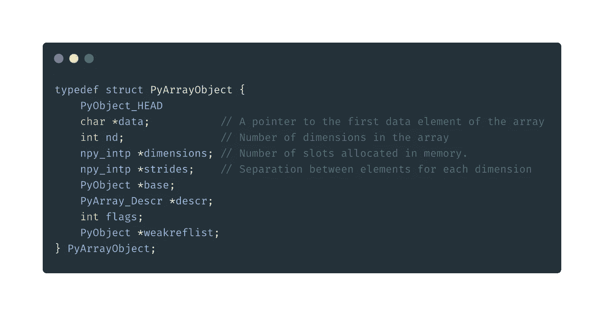

# Numpy 数组和 Python 列表下

> 原文：<https://medium.datadriveninvestor.com/underneath-numpy-array-python-list-42a30e62f693?source=collection_archive---------2----------------------->

我已经使用 Numpy 很长时间了，我总是注意到 Numpy 数组在执行任务的速度和空间方面比 python 列表更快。我想分享我对这两种数据结构的深入编译和执行过程的发现。让我们开始吧！

外面有很多[教程](https://towardsdatascience.com/how-fast-numpy-really-is-e9111df44347)/博客比较 Python list 和 Numpy array，你可以参考那些。在本教程中，我们将探索它们的内部工作方式，它们是如何工作的，它们的优点和缺点，以及一些基准测试来获得更好的想法。

在我们深入研究这两种数据结构的性能之前，首先，我们需要理解它们的内部工作方式(编译成 C 的时间),因为它们的库和数据结构都是用 C 实现的。

当 python 软件安装在您的机器上时，它至少有一个解释器和支持库。解释器只不过是运行我们的 Python 脚本的软件。有趣的是，它可以用任何编程语言实现！ [CPython](https://en.wikipedia.org/wiki/CPython) 是用 C 编程语言编写的 Python 的默认解释器。

CPython、 [Cython](https://en.wikipedia.org/wiki/Cython) 、 [Jython](https://www.jython.org/) 、 [IronPython](https://ironpython.net/) 这些大惊小怪的是什么？我会解答你所有的疑惑。请坚持到最后，并准备好 python 中使用的一些高级术语。让我们首先详细了解所有这些。

**CPython**

*   CPython 是 Python 编程语言的参考实现。用 C 和 Python 写的。由 python 的同一作者吉多·范·罗苏姆于 1994 年开发
*   CPython 将您的 Python 代码编译成字节码(透明地),并解释该字节码，随后执行它。Python 使用 CPython 作为基础

**Cython**

*   CPython 本身不会将您的 Python 代码翻译成 C。相反，它运行一个解释器循环，所以，这里 Cython 开始将 Python 代码翻译成 c。
*   Cython 为 python 语言添加了一些扩展，并允许您将代码编译成 C 扩展，即插入到 CPython 解释器中的代码。

**Jython** 、 **IronPython** 、 **PyPy** 是目前 Python 编程语言的“其他”实现；这些分别用 Java、C#和 RPython(Python 的一个子集)实现。Jython 将您的 Python 代码编译成 Java 字节码，因此您的 Python 代码可以在 JVM 上运行。IronPython 允许您在 Microsoft CLR 上运行 Python。PyPy 是用 Python(的一个子集)实现的，它可以让你比 CPython 更快地运行 Python 代码

现在让我们深入 python 列表和 Numpy 数组的内部实现

# 目录

列表是 python 中最通用的数据类型，每个人都知道列表能做什么以及我们为什么使用列表。因此，举例来说，一个列表可以作为一个堆栈，作为一个容器来存储不同数据类型的值，列表有一些基本的功能，如追加，扩展，弹出，删除等。

但问题是如何实施？

CPython 的列表是可变长度的数组，而不是 [Lisp 风格的](http://www.gigamonkeys.com/book/they-called-it-lisp-for-a-reason-list-processing.html)列表(使用链表)。CPython 对列表的实现使用了一个引用其他对象的连续数组，并在列表头结构中保存了一个指向该数组和数组长度的指针。这使得索引列表成为一种[i]操作，其成本与列表的大小或索引的值无关。

当追加或插入项时，引用数组的大小将被调整。一些小技巧被用来提高重复添加项目的性能；当数组必须增长时，会分配一些额外的空间，因此接下来的几次不需要实际调整大小。

下面显示了一个用 C 实现的列表结构。不要担心这个 C 代码，这只是为了你的知识，所以如果有人问列表是如何在幕后工作的，那么你至少可以说一些关于 C 中列表对象结构的事情，而且，我相信知道细节总是更好的。

现在我们来看看 numpy 是如何工作的。

# Numpy

在这一节中，我们将看到在使用 NumPy 数组时会发生什么。

NumPy 数组是同一类型对象的多维数组，基本上由元数据(特别是维数、形状和数据类型)和实际数据来描述。

数据存储在系统内存(随机存取内存，或 RAM)中特定地址的同构连续内存块中。这个内存块被称为**数据缓冲器**。

这是数组和纯 python 结构(如列表)的主要区别，列表中的项目分散在系统内存中。这是使 NumPy 数组如此高效的关键特性。

下面快速看一下 C 语言中 numpy 数组对象的样子。结构`PyArrayObject`有四个元素(`*data`、`nd`、`*dimensions`、`*strides`，它们是从 C 代码中访问数组数据所必需的，为了简洁起见，请忽略其他字段:

Numpy arrays structure in C

# 为什么 NumPy 高效？

*   用 C 之类的低级语言编写的数组计算非常有效(NumPy 的大部分实际上是用 C 编写的)。例如，知道了内存块的地址和数据类型，只需简单的运算就可以遍历所有项。在 python 中用列表做这件事会有很大的开销。
*   内存访问模式中的空间局部性会显著提高性能，这主要归功于 CPU 缓存。事实上，缓存将字节从 RAM 成批地加载到 CPU 寄存器中。然后，非常有效地加载相邻的项目([参考位置](https://en.wikipedia.org/wiki/Locality_of_reference))
*   最后，项目连续存储在内存中的事实使 NumPy 能够利用现代 CPU 的矢量化指令，如英特尔的 SSE 和 AVX，AMD 的 XOP，等等。例如，可以将多个连续的浮点数加载到 128、256 或 512 位寄存器中，用于作为 CPU 指令实现的矢量化算术计算。
*   此外，NumPy 可以通过 [ATLAS](http://math-atlas.sourceforge.net/faq.html#doc) 或英特尔数学内核库(MKL)链接到高度优化的线性代数库，如 [BLAS](http://www.netlib.org/blas/) 和 [LAPACK](http://www.netlib.org/lapack/) 。一些特定的矩阵计算也可能是多线程的，利用现代多核处理器的能力。

然而，numpy 也有一些缺点。它必须要求连续的内存分配。当数据存储在连续的存储位置时，插入和删除操作变得昂贵

总之，将数据存储在一个连续的内存块中，可以确保现代 CPU 的架构得到最佳利用，在内存访问模式、CPU 缓存和矢量化指令方面，这在 python 列表中是不可能的。

Python 列表支持高效的插入、删除、追加和连接，Python 的列表理解使它们更容易构建和操作。

然而，python 的列表有一定的局限性:

*   Python 的列表不支持“向量化”操作，比如基于元素的加法和乘法
*   Python 的列表可以包含不同类型的对象，这意味着 python 必须存储每个元素的类型信息，并且在操作每个元素时必须执行类型调度代码。这导致在每次迭代中检查类型。

所以，我们知道了为什么 numpy 比 python 的 list 更快更高效。现在，让我们在一个非常高的水平上比较它的性能。

# 性能比较

在这一节中，我们将从内存消耗和执行时间方面对 python 的 list 和 Numpy 数组进行基准测试。先导入，必要的模块，比较不同大小的数组/链表的性能。在本例中，我们将计算 python list 和 numpy array 的时间/内存结果之间的比率，看看哪一个性能更好。此外，该比率将被视为一个 *python 列表:numpy_array* ，因此结果显示 numpy 比 python 列表好多少倍。

**内存消耗**

下面是一个简单的例子，展示了存储不同大小的数组的内存消耗。

让我们把它绘制成一个图表，通过取两者之间的比率来更好地形象化。

上图显示 numpy 优于所有不同大小的产品。这是因为 python 为每个元素存储了类型信息，这当然需要更多的空间，而 numpy 则不同，它拥有相同类型的所有元素。

**时间对比**

下面的例子是关于计算列表/数组中每个元素的平方并测量时间。

在上图中，对于`size=1`, python 列表的性能更好，而在所有其他情况下，numpy 的性能更好。原因是，尽管 python list 速度很快(两者都使用 C 作为后端)，但它只是检查每个元素的`dtype`的开销。在 numpy 中，通过类型检查，它还必须检查我们在 C 结构中看到的其他头信息，即维度、跨度等。而在 python 中只有`dtype`就足够了。

第二个例子，一个**向量化操作**，这个例子把两个数组的元素相加。

在上图中，对于所有大小，numpy 都表现出色，因为它能够按元素进行操作，并且由于高度优化的线性代数库，它还可以利用多线程中的计算。但是这里有很多因素在起作用，包括使用的底层库([BLAS](http://www.netlib.org/blas/)/[LAPACK](http://www.netlib.org/lapack/)/[Atlas](http://math-atlas.sourceforge.net/faq.html#doc))

最后，我希望我对 python 的动态分配列表和 NumPy 的数组的内部工作有所了解。

感谢阅读。和平。

# 参考

*   [https://ipython-books.github.io/](https://ipython-books.github.io/)
*   https://www.scipy.org/
*   [https://stack overflow . com/questions/3917574/how-is-python-list-implemented](https://stackoverflow.com/questions/3917574/how-is-pythons-list-implemented)
*   [http://folk . uio . no/INF 3330/scripting/doc/python/NumPy/Numeric/NumPy-13 . html](http://folk.uio.no/inf3330/scripting/doc/python/NumPy/Numeric/numpy-13.html)
*   [https://stack overflow . com/questions/17130975/python-vs-cpython](https://stackoverflow.com/questions/17130975/python-vs-cpython)