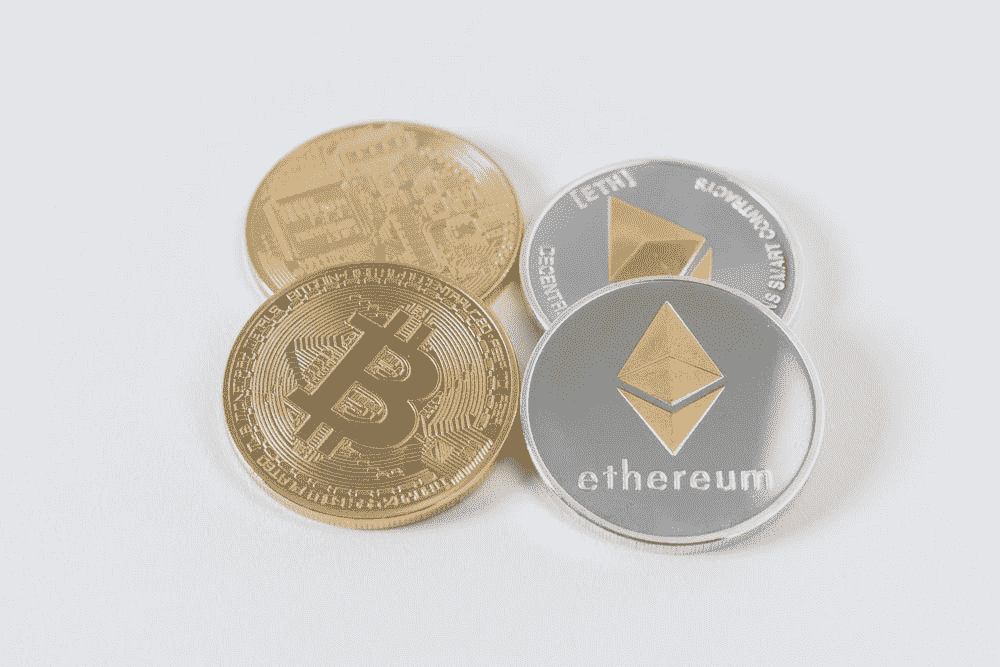
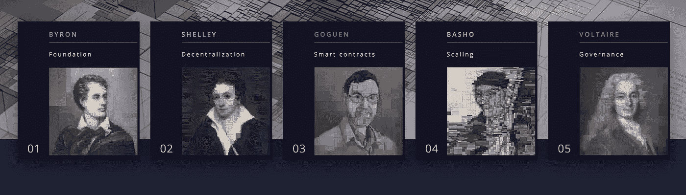
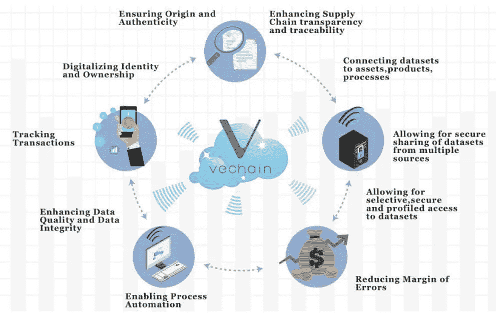
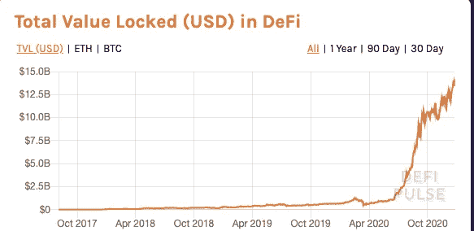

# 了解加密货币的类型:简单指南

> 原文：<https://medium.datadriveninvestor.com/understand-the-types-of-cryptocurrency-a-simple-guide-4dc125b5b7dd?source=collection_archive---------4----------------------->

毫无疑问，比特币是占主导地位的名字。然而，还有其他类型的加密货币，其许多使用案例正在颠覆多个行业。

加密货币主要分为硬币和代币。

硬币有自己的区块链，通常只用于支付。一个令牌在另一个区块链上运行，有各种不同的用例。

[点击此处](https://ashainperera.medium.com/how-to-value-crypto-understanding-tokenomics-df35bda712c4)更深入地了解记号组学。

加密资产可以根据其用途进一步细分。

1.  支付货币
2.  区块链经济
3.  隐私币
4.  实用硬币
5.  安全硬币
6.  NFT(不可替代的代币)
7.  分散财务

Photo by [Thought Catalog](https://unsplash.com/@thoughtcatalog?utm_source=unsplash&utm_medium=referral&utm_content=creditCopyText) on [Unsplash](https://unsplash.com/s/photos/bitcoin?utm_source=unsplash&utm_medium=referral&utm_content=creditCopyText)

# 支付货币

*   用于支付商品、服务和账单。
*   价值因对项目或协议的集体信任而异
*   去中心化、匿名、透明、基于互联网、不可逆转和可替代。

***莱特币(LTC):*** 开源、去中心化、数学化的 P2P 互联网货币，可以实现对任何人的即时、接近零的支付。莱特币每秒交易 56 次，比比特币快，但比 ripple 和 Visa 慢得多。比特币和莱特币的另一个关键区别是使用的算法。比特币使用 SHA-256 算法，而莱特币使用一种名为 Scrypt 的更新算法。

***比特币现金(BCH):*** BCH 创建于 2017 年 8 月，来源于一个比特币分叉。BCH 通过将块的大小从 1MB 增加到 8MB 来允许更多的事务。分叉只是区块链网络协议的一种变化。主要目标是减少比特币的可扩展性问题。

***比特币(BTC):*** 没有中央权威机构运行的开源和 P2P 技术。新硬币的发行和交易的管理由网络统一进行。由 Satoshi Nakomoto 于 2009 年 1 月在全球金融危机之后创建，是过去十年中表现最好的资产，年化收益超过 360%。2020 年，随着机构收养、印钞、无现金社会和互联网的出现，它将继续发展。在 2140 年之前，比特币的开采速度将会一直保持在 2100 万个。

*阅读更多关于比特币:* [*一场危机造就的资产类别，为了一场危机*](https://medium.com/datadriveninvestor/an-asset-class-made-by-a-crisis-for-a-crisis-a3f72b860c20)

> “区块链是一项技术。比特币仅仅是其潜力的第一个主流表现”——马克·肯尼兹伯格

# 区块链经济

*   将区块链技术的功能扩展到支付之外的平台
*   允许在各自的平台上创建数字资产(令牌)、分散式应用程序(Dapps)。
*   建立他们自己的生态系统

***以太坊(ETH):*** 开源、去中心化的平台，使智能合约和分布式应用(Daaps)的构建和执行不受第三方的任何控制或干扰。以太坊建立在比特币的创新基础上，增加了可编程性的关键功能，可以解锁多种用例。投票系统、银行系统、物流、游戏、市场和协议可以受益于以太坊智能合约的使用。ETH 使用利益证明(PoS)共识协议。

***以太坊经典(ETC):*** ETC 是来自区块链以太坊的拆分版本，是 2016 年 6 月在以太坊上被黑客花了 5000 万美元后创作的。黑客攻击后，一个硬分叉被同意并保留名称以太坊，而以前的版本被重新命名为以太坊经典。ETH 之间的主要差异包括工作证明(PoW)共识协议和 2.1 亿英镑的供应硬上限

**它是第三代加密货币，旨在解决前几代(即比特币和以太坊)的问题。Cardano 想要解决的 3 个主要问题是可伸缩性、可持续性和互操作性(每个区块链可以与另一个区块链和外部遗留金融系统通信)。**

[Cardano Roadmap](https://roadmap.cardano.org/en/)

# 隐私币

*   专注于隐私(因此得名)
*   所有者和金额是匿名的
*   额外的加密层
*   比特币是伪匿名的，因为它保护一些信息，但不是全部。交易仍然可以通过连接节点、KYC 验证和公共分类账进行追踪

***Monero(XMR):*** 最受欢迎和信任的隐私币，使交易无法追踪。交易隐藏了发送者和接收者的身份。目前市值为 23 亿美元

***破折号(Dash):****A*f*ork*原比特币代码。Dash 代表数字现金，是自 2014 年推出以来的第一款隐私硬币。Dash 旨在使用一种称为“PrivateSend”的策略来保护发送方和接收方之间的连接。目前市值 9 亿美元。

***Zcash(ZEC):***Zcash 通过所谓的“零知识证明”的概念实现隐私保护，这种概念允许在不暴露发送者、接收者或交易金额的情况下验证交易。目前市值 7.5 亿美元。

# 实用令牌

*   用于区块链产品或服务的数字代币
*   可用于授予用户访问特定服务或投票权的权限
*   由最高法院创立的豪威测试决定一项交易是否代表一项投资合同。如果一个加密令牌不符合 Howey 测试，它就被认为是一个实用令牌。
*   区块链平台的一部分。大多数硬币是在以太坊区块链运行的 ERC20 代币。

***基础注意力令牌(BAT):*** 通过勇者浏览器奖励创作者，提升数字广告

***SIAcoin(SIA):*** 分散的点对点云存储解决方案，在 Siacoin 中奖励那些在 Sia 网络上出租其计算机上额外空间的人。

***0x(ZRX):*** 0x 是一个去中心化的交换协议，开发者可以使用它来构建自己的加密货币交换。它支持以太坊区块链上的点对点资产交换。在未来，整个股票市场将是区块链，以达到最佳效率，剔除不必要的中间人和费用。

***VeChain(VET):***VeChain 通过 RFID、QR 码或 NFC 赋予实体产品一个独特的身份，其中传感器在供应链的每个阶段读取产品信息。与比特币使用工作证明(POW)作为共识不同，VeChain 使用授权证明(POA ),验证者就区块达成一致。这一共识旨在实现分权和集权之间的平衡。

VeChain real-world uses

*阅读更多关于 VeChain:* [*区块链促进供应链弹性*](https://medium.com/datadriveninvestor/blockchain-for-supply-chain-resilience-fa2e67904201)

# 安全令牌

*   用于新加密货币或区块链项目的众筹流程
*   通过豪威测试的加密令牌被视为安全令牌
*   它们的价值来自外部的可交易资产。
*   代表项目的一部分。利益相关者期待未来的利润，并持有其他利益，如投票权、利润分成和奖励。
*   受制于某些联邦安全条例
*   对于加密货币来说，重要的是安全令牌在 2017 年的 ICO 领域重获信誉，并通过消除过高的成本和中间商来改善传统金融。

***SPiCE VC*** :专做风险投资(VC)的原始安全令牌之一。它为投资者提供了区块链未来几年巨大增长潜力的机会。由于流动性问题和早期商业风险的高风险性质，风险投资迄今为止只对特定的投资者开放。SPiCE VC 旨在通过提供足够的流动性来吸引新的投资者，从而解决这一问题。它不仅帮助新投资者，还在最关键的阶段为企业提供资本。

 [## 面向开发者的区块链；API 提供商的重要性|数据驱动的投资者

### 在过去的几年里，区块链突然成为这个领域最热门的新技术。每一个…

www.datadriveninvestor.com](https://www.datadriveninvestor.com/2020/11/25/blockchain-for-developers-the-importance-of-api-providers/) 

# 稳定的硬币

*   在交易者中很受欢迎，因为它保护他们免受波动性的影响，并使交易配对成为可能。
*   顾名思义，价格保持稳定，不像其他加密资产。

有两种类型的稳定抵押债券，法定抵押债券和加密抵押债券。法定抵押由美元和欧元等法定货币支持，而加密抵押硬币由加密货币支持。

尽管价格稳定，但稳定的硬币也有一些内在的风险，因为它们不会总是保持固定的价格。此外，硬币的持有者必须相信，有稳定硬币支持的资产有足够的储备，这就是所谓的交易对手风险。

然而，stablecoins 面临的最大风险是监管风险和政府支持的数字资产风险，这些风险可能会首先将 stablecoins 的必要性降至最低。

***Paxos (PAX):*** 在区块链以太坊发行的 ERC20 代币，以美元为抵押，带来区块链技术效率和法定货币稳定性的双重好处。

***Tether (USDT):*** 旨在为人们提供一个简单的界面来访问一种总部位于区块链的加密货币，这种货币的价值始终与美元保持 1 比 1 的比例。它旨在通过储备资产支持 USDT 的流通供应来维持这一比率。

***【戴】*** 由创立的分散稳定币，在以太网上运行，旨在保持与美元的软挂钩。与其他稳定的硬币不同，戴是由加密抵押品支持的，而不是美元。它通过一个被称为[抵押债务头寸(CDP)的概念来提供稳定性。](https://medium.com/mycrypto/what-is-dai-and-how-does-it-work-742d09ba25d6)

# NFT/收藏品

*   不可替换令牌(NFT)是一种加密令牌，它代表某种独特的东西，并且不可互换
*   可替代性是货币的基本特征。这是一种可以与类似装置互换的能力。比特币和美元是可以互换的。
*   不可分，稀有，不可膨胀，不可伪造。
*   用于创建可验证的数字稀缺性，信息存储在智能合同中。
*   用于需要独特数字项目的应用程序，如游戏内购买、收藏品、虚拟土地和数字艺术
*   VR、AR 和游戏的巨大潜力。

***金恩(ENJ):*** 金恩在 ERC-20 和 ERC-721 代币的基础上改进创造了 ERC-1155 代币。ERC-1155 除了安全和可交易之外，还具有可替代性和不可替代性。金恩简化了虚拟资产的创建和管理，同时允许游戏开发者使用该平台将加密资产集成到具有有限编码知识的游戏和应用中

***【分散之地(法力)*** :这是一个由以太坊区块链提供动力的分散化虚拟世界，让用户创建和货币化他们的内容和应用。平台上的数字土地被称为“土地”，而且供应量有限。用户可以定制自己的头像，建立自己的社区，购买稀有的数字资产。如果你想知道它的真正潜力，请观看史蒂文·斯皮尔伯格的《一号玩家》。

Ownership of virtual land on Decentraland

# 挑战

*   使用智能合约的分散式金融服务
*   允许在分散的交易所进行加密货币交易，押注、借入和借出加密货币以赚取利息，交换衍生品并参与集资彩票。
*   被动收入可以通过贷款(赌注)和收益农业获得，在收益农业中，资产被集中在一起以产生最大的回报。
*   DeFi 的主要目标是创造一个未来，打开你今天使用的所有金融服务，只需一部智能手机和互联网连接即可使用。
*   [DeFi 合同锁定的总价值](https://defipulse.com/)已经从 2017 年的区区 200 万美元激增至 2020 年 12 月的逾 140 亿美元。

Total value locked(USD) in DeFi

***Chainlink(链接):***Oracle 是一个连接区块链和现实世界数据的程序。Chainlink 创建了一个节点网络，向区块链提供往来信息。这使得 chainlink oracles 能够提供事件结果、价格反馈数据和统计数据等信息。简单地说，chainlink 是区块链与外部世界之间的安全桥梁。Chainlink 与谷歌云和甲骨文有合作关系。

***复合金融(COMP):*** 平台借入借出加密货币资产。Compound finance 发布了他们自己的定制硬币红利，这使得锁定的总资金呈指数增长，因为用户可以从平台本币红利中获得更多利息。

***Nexus mutual(NXM):***为以太坊用户提供保险，会员可以购买保险来保护自己免受黑客攻击和智能合约代码中的错误。该项目旨在通过集体分担风险来消除对保险公司的需求。虽然目前仅限于智能合同失败，但这种模式有潜力进入汽车保险、残疾保险和地震保险。

> 当华尔街发现 crypto 建造了一个更好的赌场——海军拉维坎特赌场时，DeFi 的下一个大浪潮就开始了

## 参考

不同类型的加密资产(2019)。可从以下网址获得:[https://medium . com/coincontrolblog/the-different-types-of-crypto-assets-3d fa 2947 f1 bb](https://medium.com/coincontrolblog/the-different-types-of-crypto-assets-3dfa2947f1bb)

掘金新闻—比特币、加密货币和金融(2020)。地点:【https://nuggetsnews.com.au/ 

不可伪造的代币(NFT)-快速指南-硬币电报杂志(2020)。地点:【https://cointelegraph.com/magazine/nonfungible-tokens/ 

实用令牌与安全令牌:了解差异-最终指南(2019)。可从以下网址获得:[https://block geeks . com/guides/utility-tokens-vs-security-tokens/](https://blockgeeks.com/guides/utility-tokens-vs-security-tokens/)

什么是 DeFi？— CoinDesk (2020)。可在:[https://www.coindesk.com/what-is-defi](https://www.coindesk.com/what-is-defi)

## 访问专家视图— [订阅 DDI 英特尔](https://datadriveninvestor.com/ddi-intel)