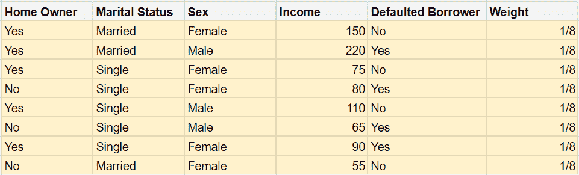
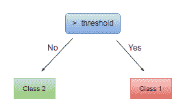
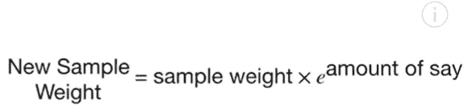
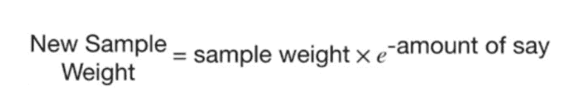
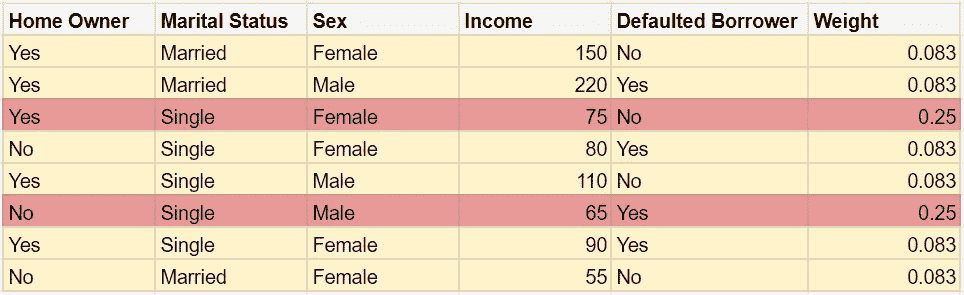
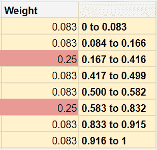
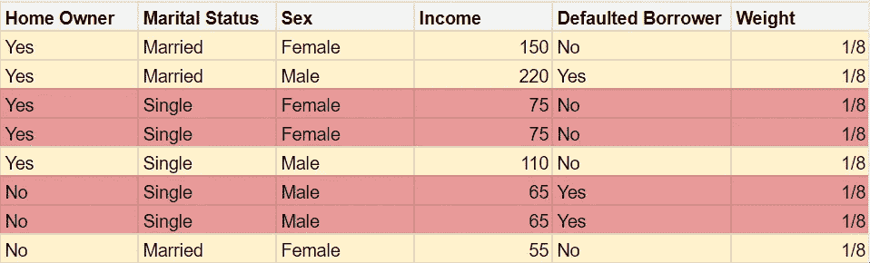
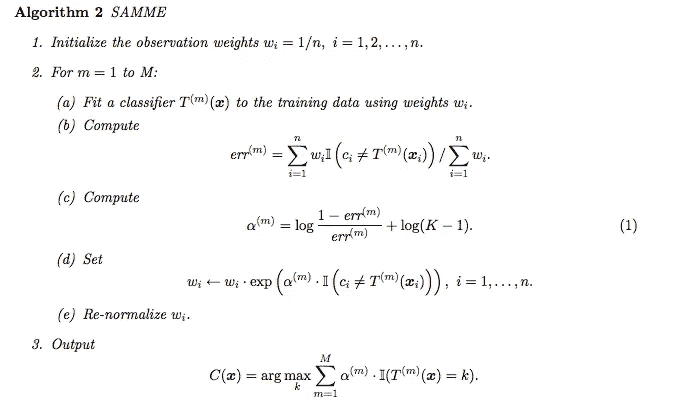
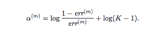
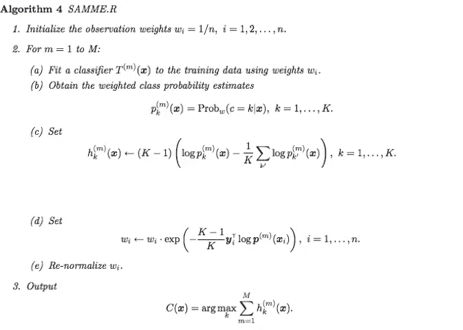

# 了解 Adaboost 和 Scikit-learn 的算法:

> 原文：<https://medium.datadriveninvestor.com/understanding-adaboost-and-scikit-learns-algorithm-c8d8af5ace10?source=collection_archive---------0----------------------->


集成模型，尤其是助推算法，在 Kaggle 等在线数据科学竞赛论坛上变得非常流行。集成学习是使用一组模型进行预测的方法。今天我们将讨论一种叫做 AdaBoost 的集成提升算法。如果你不熟悉系综的意思，你可以参考我以前写的关于 [**系综模型**](https://medium.com/analytics-vidhya/ensemble-learning-methods-in-machine-learning-5d2f849192f8) 的文章，在那里我将简要介绍系综的思想和系综模型使用的 4 种主要技术。本文还假设您熟悉决策树，因为我们将在决策树中使用 Adaboost。

[](https://www.datadriveninvestor.com/2020/02/19/five-data-science-and-machine-learning-trends-that-will-define-job-prospects-in-2020/) [## 将定义 2020 年就业前景的五大数据科学和机器学习趋势|数据驱动…

### 数据科学和 ML 是 2019 年最受关注的趋势之一，毫无疑问，它们将继续发展…

www.datadriveninvestor.com](https://www.datadriveninvestor.com/2020/02/19/five-data-science-and-machine-learning-trends-that-will-define-job-prospects-in-2020/) 

Adaboost 代表**自适应增强。**模型在集合中按顺序排列。这个意味着在每一步，我们都试图在我们之前模型的错误的基础上提升我们的**弱学习者**(基础模型)，因此它们合在一起就是一个**强集成模型。**每个模型都有他们擅长的问题的一部分，所以它们一起涵盖了问题的所有部分。


假设您有一个数据集，您想使用 AdaBoost 根据天气预测一个人是否会在户外玩耍。这是 Adaboost 如何完成工作的概述:

## 步骤 1:为数据集中的所有样本分配相等的权重



如果您注意到重量，我们的数据集中有 8 个样本，它们被分配了相同的重量**1/样本数。**这意味着对以往样本的正确分类与**同等重要**。

## 步骤 2:使用基尼系数最低的特征创建一个决策树桩

决策树树桩只是一棵有**根和两片叶子的决策树。**有 1 级的树。这个树桩就是我们的**弱学习者**(基模)**。**首先对我们的数据进行分类的特征是使用基尼指数确定的。



如果你愿意，你可以把你的等级提高到二级，但是去找树桩是很常见的。

## 第三步:评估你的残肢的性能并分配它的重量

在 Adaboost 中，我们有一个树桩集合，在决定最终预测之前，会考虑它们的所有预测。但是一些树桩在分类我们的数据方面比我们集合中的其他树桩做得更好。对这些树桩给予更多的重视是有意义的。Adaboost 通过为集合中的每个树桩分配权重来实现这一点。权重越高，树桩在最终预测中的发言权就越多**。因此，假设我们的残肢在我们的数据中错误地分类了两个样本，则该残肢的权重计算如下**


其中 ***总误差=错误分类样本的权重之和。*** 因此，如果我们的树桩得到两个错误分类的样本，使用这些样本的权重，我们得到 0.5 * log(1—(1/8+1/8)/(1/8+1/8))= 0.54(使用自然对数)。

这是我们第一个模特的体重。

> 请记住，这与样品的重量不同。样本权重强调对样本进行正确分类的重要性，而模型权重用于确定模型在最终预测中获得的数量。

## 步骤 4:重新分配样品的重量

还记得我们之前为所有样品设定了相同的重量吗？在使用我们的第一个模型分类后，我们得到了两个错误分类的样本。然后，Adaboost 试图通过给这两个样本分配更高的样本权重来强调下次正确获取这两个样本的重要性。这将有助于下一个模型更加关注这两个样本的正确性。错误分类样品的新重量公式为:



所以两个样本的权重都是 1/8(因为这是我们第一次改变)，他们的新权重是 1/8*e^amount，比如说= 0.21。这比最初的 1/8 要大。

接下来，它减少了其他样品的重量。这是通过使用以下公式完成的:



## 步骤 5:标准化样本的权重

现在我们有了新的重量，将重量加在一起**用重量之和除以每个重量。**这将使新权重的总和等于 1。归一化**、****后新的权重会是什么样子。请注意，两个错误样本的权重增加了。**

****

## **步骤 6:创建一个与原始数据集大小相同的新数据集，并根据权重选取样本**

**这一步是关键的，因为这是下一个模型学习对前一个模型出错的样本进行分类的重要性的方法。**

*   **首先，创建一个与原始数据集大小相同的空数据集。**
*   **那么样本权重就像一个分布，像这样:**

********

*   **从 0 到 1 中选取一个随机数，并选择在其极限内具有该值的样本。例如，如果选择 0.3，则选取第三个样本，因为 0.3 的值在 0.167 和 0.416 之间。将这个新样本复制到新数据集中。**
*   **重复上面的三个步骤，直到新的数据集被填充。填充新数据集后， ***将样本权重重新分配为 1/样本数的相等值。*****

**这是新数据集的样子。**

****

*****注意到我们之前弄错的样本是如何被更多地包含进来的吗？这将会给下一个模型一个更好的机会把它做好。有点像为错误分类创造一个大的惩罚。*****

****

## **第六步:重复第二步到第五步，直到我们有足够数量的模型**

## **步骤 7:通过多数票分配最终预测**

**终于！我们已经建立了足够的模型来决定预测的最终值。还记得我们是如何给每个模型分配权重的吗？我们现在要用它了。**

*   **根据模型的分类拆分模型。将样本分类为“是”的模型和将同一样本分类为“否”的模型**
*   **现在一些被归类为“是”的模型和被归类为“否”的模型的权重**
*   **特定样本的最终预测 Adaboost 将是具有最高权重的模型的预测。因此，如果归类为“是”的模型的权重之和大于归类为“否”的模型的权重之和，则最终预测为“是”，反之亦然。**

**这就对了。现在你已经知道 AdaBoost 是如何工作的了。现在我们来看一个代码解释，了解 scikit-learn 针对 Adaboost 的两个变异算法。**

# **Scikit-learn 的 SAMME 和 SAMME。r 实现 Adaboost 的算法:**

**让我们看看 scikit-learns Adaboost 分类器:**

```
***class*** **sklearn.ensemble**.**AdaBoostClassifier**(***base_estimator****=None*, ***, ***n_estimators****=50*, ***learning_rate****=1.0*, ***algorithm****='SAMME.R'*, ***random_state****=None*)
```

**base_estimator 是你的基础模型或者弱学习者。在这里，因为我们要使用决策树的树桩，我将通过**

****base _ estimator = decision tree classifier(max _ depth = 1)****

**而`n_estimators`是你的服装需要的模特数量。学习率将每个分类器的贡献缩小了`learning_rate`。在`learning_rate`和`n_estimators`之间有一个权衡。如果你看 scikit-learn 的 AdaBoost 文档，它给出了算法的两个选项:**

> ****算法** *{'SAMME '，' SAMME。R'}，默认='SAMME。R'***
> 
> **如果是萨姆。那就用 SAMME。r 实升压算法。`base_estimator`必须支持类别概率的计算。如果是“SAMME ”,则使用 SAMME 离散增强算法。萨姆号。r 算法通常比 SAMME 收敛得更快，以更少的提升迭代实现更低的测试误差。**

**萨姆和萨姆。r 算法是多类 Adaboost 函数，由朱记、萨哈伦·罗塞特、邹慧、特雷弗·哈斯蒂在一篇论文中提出。这些算法是 Ababoost 的主要思想的改编，用多类能力扩展它们的功能。**

## **SAMME:**

**这是 SAMME 算法的伪代码(分阶段加法建模，因为我们更新了样本的权重)，其中 wᵢ是样本权重，α是模型权重。这类似于我们谈论的方法，除了一个关键的区别。看公式估算模型权重α**

****

**这使用模型权重的加权公式。其中(K -1)中的“K”代表我们的多类问题中的类的数量，err 是总误差。**

****

> **注意:当 K = 2 时，SAMME 算法的工作方式与我们之前看到的完全一样。**

## **萨姆。稀有**

**现在来看 SAMME.R 的伪代码，这是 SAMME 算法的变种。**

****

**请注意，模型权重α不在伪代码中。这是因为 SAMME。r 算法给所有的模型一个相等的权重。这是如何工作的？这里是 SAMME 和 SAMME 的主要区别。r，而 SAMME 是离散值算法，这意味着它输出 0 或 1。r 使用类别概率。这意味着它输出样本属于一个类别的概率。报纸上的描述:**

> **一种替代方法是使用实值置信度预测(如加权概率估计)来更新加法模型，而不是更新分类本身。**

**因此得名 SAMME。其中 R 代表“实数”,因为它输出一个实数值。假设我们有一个当前估计值 f(m1)(x)(前一个模型的估计值)，并通过最小化损失来寻求一个改进的估计值 f(m1)(x)+h(x)(加上下一个模型的估计值)。在这里，弱学习者从加权类概率估计中学习，并且新样本根据它们被分类。正如 scikit-learn 的文档中提到的。r 算法通常比 SAMME 收敛得更快，以更少的提升迭代实现更低的测试误差。**

**对于这个代码示例，我使用了[森林树数据](https://www.kaggle.com/c/forest-cover-type-prediction/data)。该数据集包含对科罗拉多州罗斯福国家森林四个区域的树木特征的观察。他的数据集包括树木类型、阴影覆盖范围、到附近地标(道路等)的距离、土壤类型和当地地形等信息。我们的工作是根据信息预测树的覆盖类型。我用 SAMME 和 SAMME 训练了两个模特。稀有**

**[https://gist . github . com/AnahVeronica/da 7134 ffbb 3 b 7 f 5109128857 fa 3c b 79 a](https://gist.github.com/AnahVeronica/da7134ffbb3b7f5109128857fa3cb79a)**

```
**Accuracy of SAMME:** **0.618**
**Accuracy of SAMME.R: 0.778**
```

**Scikit-learn 的 Adaboost 有两个属性 **estimator_weights_ 和 estimator_errors_** ，可以用来查看集合中每个模型的误差和权重。如果你在 SAMME 上调用 estimator_weights_ 的话。你会看到所有的估计值的权重都是 1。**

**完成了。现在你知道 AdaBoost 是如何工作的了！太棒了。**

> **注意:Adaboost 也可以用于回归问题。**

**嗨伙计们！我叫安娜·维罗妮卡。希望你觉得我的文章有用。最近，我决定使用数据科学来探索数学在现实中是如何工作的。每天我都学习新的东西并分享我的发现。如果你想看更多，请跟我来！再见！**