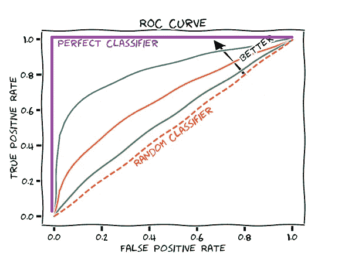
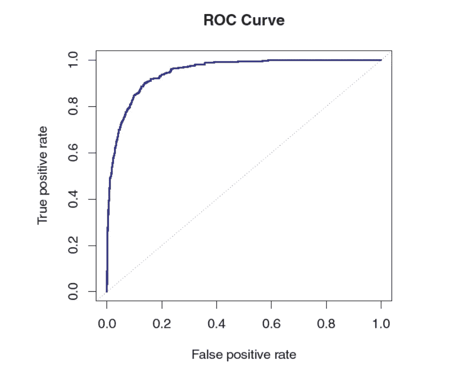
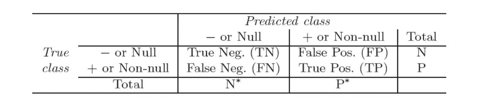
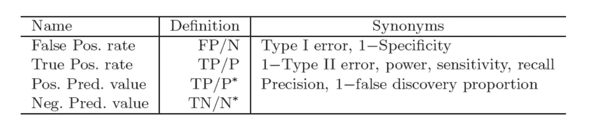

# 了解 AUC-ROC:解释清楚

> 原文：<https://medium.datadriveninvestor.com/understanding-auc-roc-clearly-explained-74c53d292a02?source=collection_archive---------0----------------------->

在数据科学/机器学习领域，我们可以看到，与回归相比，我们有更多的分类问题要解决。AUC-ROC 是对分类问题的良好性的度量。在这篇博客中，我们将看到这个值意味着什么，以及为什么它对正确预测很重要。

R OC 曲线是一种流行的图形，用于同时显示所有可能阈值的两种误差的 ROC 曲线。“ROC”这个名字是历史性的，来自通信理论。它是**接收机工作特性**的缩写。下图显示了训练数据上分类器的 ROC 曲线。阈值是我们为划分两个类别而设置的概率。通常，阈值设置为 0.5，但当我们有一个不平衡的数据集时，我们应该尝试不同的阈值。

在所有可能的阈值上总结的分类器的整体性能由(ROC)曲线下的面积(AUC)给出。理想的 ROC 曲线将靠近左上角，因此(ROC)曲线下的面积越大，AUC 越好，分类器越好。对于该数据，AUC 为 0.95，接近最大值 1，因此认为非常好。ROC 曲线对于比较不同的分类器是有用的，因为它们考虑了所有可能的阈值。

 [## 将定义 2020 年就业前景的五大数据科学和机器学习趋势|数据驱动…

### 数据科学和 ML 是 2019 年最受关注的趋势之一，毫无疑问，它们将继续发展…

www.datadriveninvestor.com](https://www.datadriveninvestor.com/2020/02/19/five-data-science-and-machine-learning-trends-that-will-define-job-prospects-in-2020/) 

正如我们在上面看到的，改变分类器阈值会改变它的真阳性和假阳性率。这些也被称为敏感度和 1——我们的分类器的特异性。

又来了一个术语**【困惑矩阵】**。它让我们对我们的分类器所做的预测有一个大致的了解。

Confusion Matrix

真阴性。和真实位置。是被我们的分类器正确分类为负类或正类的记录数。假阳性或假阴性是被我们的模型错误分类的记录的数量。N 和 P 是实际的负值或正值，或者 N*和 P*分别是预测的负值和预测的正值。使用来自混淆矩阵的这些值，我们可以为我们的模型导出各种矩阵。

真实肯定率或回忆定义了从实际肯定中有多少预测被正确分类为肯定。

假阳性率定义了从总的实际阴性中有多少预测被错误地分类为阴性。

从曲线中我们可以看出，我们希望提高模型的真阳性率，降低假阳性率。如果我们举一个贷款违约分类的例子，我们想预测一个人是否会违约。在这种情况下，我们希望我们的分类器最大化真正的肯定率或回忆，因为这将增加我们找到实际违约者的机会。尽管当召回值增加时，也会带来一些损失。随着回忆越来越多，我们的假阳性也可能会增加，因为模型会将一些人归类为违约者，但实际上他们不是。因此，我们将尝试在模型中平衡精确度和召回率。

我希望这篇文章已经澄清了你对 ROC - AUC 和混淆矩阵的理解。