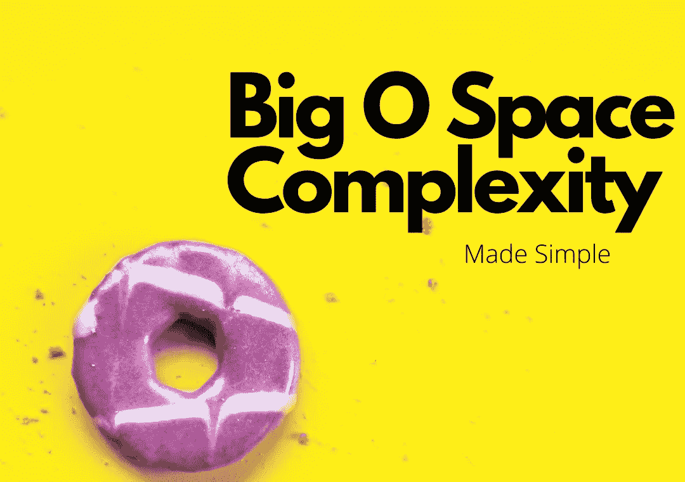

# 理解大 O 空间的复杂性

> 原文：<https://medium.datadriveninvestor.com/understanding-big-o-space-complexity-6826478e5a9f?source=collection_archive---------1----------------------->

理解大 O 空间复杂性(不要与大 O 时间复杂性混淆，尽管两者都有不必要的可怕名称)需要至少基本理解最常见的大 O 符号类型及其含义。

这里有一个非常简短(因此也非常简单)的大 O 符号的常见类型及其含义的回顾。(如果您觉得不需要复习，可以跳过这一部分)

如果你想更深入地了解每一个问题，[柯尔特·斯蒂尔大学有一门关于算法和数据结构的很棒的课程](https://www.udemy.com/course/js-algorithms-and-data-structures-masterclass/)(我想对这篇文章中的许多例子给予一点赞扬)。

**快速警告:**这里涉及到一些数学问题，但是不要担心！我们会挺过去的。

# **最常见的大 o 类型**

## O(n)

**如果 n =某个整数，算法内的运算次数(解决给定问题的方式)大致与 n 成正比增加**这类算法并不理想！具有 O(n)的算法的一个例子可以是一个函数，它将整数“n”作为一个参数，并使用“for”循环来计算直到并包括“n”的所有数字的总和。在这种情况下，运算次数与 n 成比例增加，因为 n 越大，在“for”循环中需要完成的求和次数就越多。

## O(1)

**在具有 O(1)的算法的情况下，无论‘n’的值如何，完成该问题所需的运算数量保持一致。**这是最可取的大 O 类型，可产生最佳性能。例如:一个函数，它接受一个整数“n”，并简单地对 n 执行一些操作，而没有任何形式的“for”循环、搜索等。这是 O(1)的原因是因为不管 n 的大小，函数内的数字运算将保持完全相同。

## O(n)

在这种情况下，**函数内的运算量会随着‘n’**呈指数增长。这方面的一个例子是一个包含嵌套循环的函数，它也调用 n。这导致完成该问题所需的运算量呈指数级增长。O(n)是最慢和最不可取的算法类型！

## o(登录号)

**具有 O(log n)的算法开始时与‘n’成比例增加，但最终趋于平稳**。这是一个高性能的算法，是仅次于 O(1)的最好算法！这方面的一个例子可能涉及一个搜索算法，其中答案空间不断分裂，一遍又一遍，直到找到答案。

 [## 软件开发过程:如何选择正确的过程？数据驱动的投资者

### 软件是任何企业组织成功的生命线。没有软件的帮助，一个…

www.datadriveninvestor.com](https://www.datadriveninvestor.com/2020/01/16/software-development-process-how-to-pick-the-right-process/) 

下面是与时间复杂性相关的常见大 O 符号类型的有用图表:

Fig. 1: Big O Time Complexity Graph. Credit: Huang, D. (2018, January 1). Javascript — Algorithm

# 好吧，我们去空间复杂性！

[**维基百科的**](https://en.wikipedia.org/wiki/Space_complexity) **对空间复杂度的定义如下:**“算法或计算机程序的**空间复杂度**是解决一个计算问题实例所需的内存空间量，作为输入特征的函数。它是算法执行程序并产生输出所需的内存。”

更简单的说，**空间复杂度就是一个算法需要的内存(空间)量。而我们的工作就是分析输入(‘n’)是否以及在多大程度上影响这个**。

> 空间复杂度是算法所需的内存(空间)量。

为了简要阐述这一点，出于我们的目的我们将谈论**辅助**空间复杂性。所有这些意味着**我们正在严格地谈论算法内部发生的事情(换句话说，算法本身)。**这是因为，以我们对大 O 记法的理解，我们可以假设随着‘n’的增长，n 的输入也在增长。所以我们不需要考虑 n 本身占据了多少空间。我们只关心它如何影响执行问题所需的空间。

# **为什么空间复杂性很重要？**

像时间复杂度一样，**空间复杂度给了我们一个具体的、一致的方法来分析我们代码的效率和性能。**理解**空间复杂性也为我们提供了一种简单有效地将这种性能传达给其他开发人员的方法。**

> 空间复杂性为我们提供了一种一致的方法来分析我们的代码，并将其性能传达给与我们合作的其他开发人员。

## **原语与字符串、引用类型的空间复杂度:**

*   **原语—大多数原语(布尔、数字、空、未定义等。)是常数(O(1))空间。这是因为，不管是真还是假，是 1 还是 1，000，所消耗的空间量都保持不变。**
*   **字符串——另一方面，字符串需要 O(n)个空间(n 是字符串的长度)。这意味着如果我们有两个字符串，一个有 1 个字符，一个有 50 个字符，后者需要的空间是前者的 50 倍。**
*   **引用类型(数组和对象)——引用类型也需要 O(n)空间。“n”是数组的长度，或者在对象的情况下，“n”是键的数量。**引用类型是 O(n ),因为数组中的元素越多，或者对象中的键越多，它们消耗的空间就越多。

> 大多数原语是常量(O(1))空间，其中字符串和引用类型需要 O(n)空间。

# **一些例子的时间**

## **O(1)空间复杂度**

**让我们创建一个名为** `**sum**` **的简单函数，它接收一个整数数组，对数组中的所有元素求和，然后返回总和。**这个函数的空间复杂度是多少？(记住，我们关注的是*空间复杂度*，而不是时间复杂度！)

得到你的答案了吗？太好了。

**我们的** `**sum**` **函数的空间复杂度是 O(1)** 。让我们思考一下这个问题。在我们的函数中，我们只有两个变量，“总”和“我”。不管‘arr’等于什么，我们总是只有这两个相同的变量，并且它们总是只包含一个数字。当我们*在*增加“总”变量时，我们*没有*创造或增加任何新的变量。记住，现在我们不关心数字的大小，也不关心函数中发生的运算量(在这种情况下时间复杂度为 O(n))。

## **O(n)空间复杂度**

**接下来，我们将创建一个名为** `**double**` **的函数，该函数接收一个整数数组，并返回一个新数组，该数组由原始数组中的每个数字组成，但会加倍**。我们在处理什么类型的空间复杂性？(提示:考虑一下创建一个长度取决于函数输入的*新*数组的空间影响)。

**我们的** `**double**` **函数的空间复杂度是 O(n)。**让我们在这里再次进行批判性思考。**传入的数组越长，返回的新数组也就越长。这意味着我们的算法所需的空间将基于这个数组的长度而增加。如果`arr`有 10 个数字，我们的返回数组将有 10 个数字，如果`arr`有 50 个数字，我们的返回数组现在将有 50 个数字。这与我们之前的 O(1)示例形成对比，在该示例中，无论传递给函数的是什么，都将返回相同数量的数字(在我们的示例中是两个)。记住，这个例子与新数组的数字大小无关！这与我们正在创建一个新数组的事实有关，这个新数组所需的空间随着‘n’(我们传入的数组`arr`)成比例增加。**

现在你知道了！**你现在理解了大 O 空间复杂性的基础。给自己一个鼓励。现在，您拥有了一种能力，可以看到代码性能的主要方面，并有效地将这种性能传达给其他开发人员。**