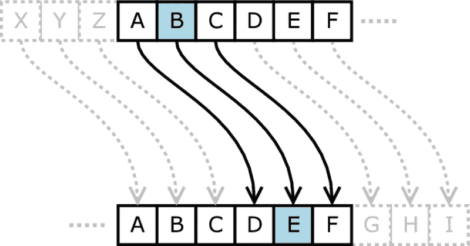
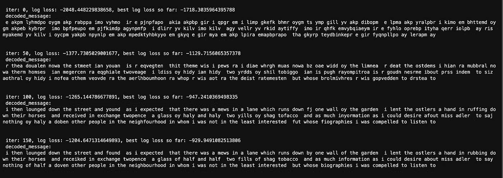

# 理解二元模型:用语言建模和遗传算法进行密码解密

> 原文：<https://medium.datadriveninvestor.com/understanding-bigrams-cipher-decryption-with-language-modeling-and-genetic-algorithm-1283ee0b3b80?source=collection_archive---------2----------------------->

## 自然语言处理

## 这个项目如何帮助我理解那些传说中的单词二元模型


Photo by [Philipp Katzenberger](https://unsplash.com/@fantasyflip?utm_source=unsplash&utm_medium=referral&utm_content=creditCopyText) on [Unsplash](https://unsplash.com/?utm_source=unsplash&utm_medium=referral&utm_content=creditCopyText)

是时候开始一些自然语言处理的新的学习冒险了。

什么？这难道不是由垃圾邮件检测项目启动的吗？正如你可能会想到的，密码解密可能是一个奇怪的地方开始一个 NLP 系列。这个起点与我从更深层次理解嵌入这个词的愿望有着密切的联系。在 SpaCy 和 NLTK 等开源 NLP 包的帮助下，我们能够从一个巨大的训练文本语料库中生成一个功能齐全的单词嵌入，只需一行代码——对我来说就像魔术一样。虽然当我们希望在相对较短的时间内完成一些复杂的任务，而不必太担心第一步的细节时，利用这些工具的力量绝对是非常好的，但对于那些仍然试图掌握自然语言处理这一迷人领域的本质的人来说，这肯定不是理想的。在[懒惰的程序员](https://medium.com/u/5eeae1d5b388?source=post_page-----1283ee0b3b80--------------------------------)开发的一门令人惊叹的课程的帮助下(链接到课程[这里](https://www.udemy.com/course/data-science-natural-language-processing-in-python/)，我能够实现这个有趣的项目，使我能够完全理解构建大多数单词嵌入的底层算法——二元模型。

这怎么可能呢？先简单说一下什么是密码解密，以及它的应用。

## 什么是密码解密？

密码解密，简单来说就是一个代入的过程。英语中有 26 个字母——这些字母组成单词，而单词组成表达意思的序列。如果我们随意打乱这些句子中字母的顺序，这些序列的意思就会变得模糊不清。然而，如果我们知道这些随机洗牌的精确顺序，我们将能够逆转这些字母的洗牌，使句子再次有说服力。这个混洗过程的字母映射是密码解密映射。下面是一个说明性的例子。



Source: Matt Crypto from [Wikipedia](https://en.wikipedia.org/wiki/File:Caesar_substition_cipher.png)

我们用 ***替换***a***d******b***用 ***e*** ，…单词 ***苹果*** 就会变成 ***dssoh*** 。由于我们记住了这种一对一的关系，我们将能够通过反向映射回到苹果。

## 与自然语言处理的关系

这和 NLP 有什么关系？好吧，假设你不知道上面的映射，我们怎么猜映射是什么？事实证明，我们可以采用迭代方法来解决这个问题——从随机初始化的映射开始，迭代地最小化从真实映射生成的解密结果和从估计映射生成的结果之间的差异。这个差异度量就是这个解密单词在英语中出现的“可能性”的对数可能性。构建这个评估指标需要我们生成所有 26 个字母的所有字母组合的所有可能性—***【aa】***， ***ab*** ，***AC***…***yz***， ***zz*** 。一些组合比其他组合更有可能，这种可能性将从一些巨大的文本语料库中推断出来。哦，等等，那就是我们所说的**二元模型**。

## 该项目的总体结构

现在我们理解了这些关系，我们可以谈谈这个项目是如何构建的。我们首先从一些包含真实语言单词的巨大文本语料库中构建这个语言模型，并生成这些二元模型的所有频率。这个模型会被保存到一个名为`LanguageModel`的 python 模块中，以便经常访问，评估加密过程的正确性。然后我们将构建真正的加密映射、加密和解密方法，存储在一个名为`Encoder`的 python 模块中。最后，我们还将构建一个模块`GeneticAlgorithm`，它处理这个加密映射的迭代猜测，并选择更好、更正确的加密映射，直到选择出最佳映射。

您可能对这个项目的面向对象方法有疑问——因为可读性和构建难度会比函数方法显著增加。然而，使用 OOP 可以让我们拥有一个只包含几行代码的用户界面。

文件的总体项目结构如下

```
/cipher_decryption |--/model
      |--language_model.py
      |--encoder.py
      |--genetic_algorithm.py |--/notebooks
      |--Cipher Decryption.ipynb |--cipher.py
```

通过设置上面的文件夹层次结构，我们将能够像下面这样导入模块——我们都非常熟悉的方式。

`Cipher Decryption.ipynb`包含勘探和评价结果，在这里可以找到[。](https://nbviewer.jupyter.org/github/chen-bowen/Natrual_Language_Processing_Projects/blob/master/cipher/notebook/Cipher%20Decryption.ipynb)

想想我们刚刚完成了什么——我们基本上重新创建了我们习惯使用的 NLP 包，只是这次我们自己构建了这些包。事实上，这通常是软件项目在真实行业中的构建方式——下游用户应该能够拥有一个简单的用户界面，而不必太担心他/她试图使用的组件的细节。在下一节中，让我们深入研究上面提到的这 3 个模块的一些实现细节。

## 语言模型

语言模型模块包含可用一行代码访问的二元模型概率

```
LanguageModel().log_M
```

这个`log_M`属性包含英语中任何两个字母组合出现的对数概率。由于有 26 个字母，`log_M`的维数为 26 × 26。一个说明性的例子`M`如下所示(所有假设值)，

参考上面的例子，我们得到看到“aa”组合的概率是 0.04，而看到“be”组合的概率是 0.07。但是我们如何产生这些价值呢？

这些值是通过计数生成的。对于我们的文本语料库中任何单词的每个双字符组，我们只需计算出现的次数，并将该次数除以文本语料库中的总单词数—这将产生一个介于 0 和 1 之间的数字，它满足概率的定义。

下面的代码片段生成这个组合矩阵，并将其保存为`LanguageModel`对象的属性。

为什么这两个字母的组合能正确地建立起典型的英语句子？它是基于一个叫做 ***马尔可夫性质*** 的假设——它声明字母的下一次出现只依赖于前一个字母，而不是之前的任何字母。用数学术语来说，

```
P(letter n | letter n-1, letter n-2, ...) = P(letter n | letter n-1)
```

这一特性实质上表明，我们可以通过单词中两个字母组合的概率来恰当地模拟整个单词的概率。

`LanguageModel`也有两种方法可以很容易地获得单词和句子的对数属性，这是简单的迭代循环，计算单词中所有字母组合的对数概率，并将它们相加以获得总的对数概率。

为了得到句子的对数概率，我们可以简单地多次调用上面的`get_log_word_probability`，并对结果求和。

正如您可能已经看到的，我们已经使用计算训练文本语料库中出现的二元模型的比例的方法构建了自己的二元模型概率矩阵。尽管有其他变化，大多数二元模型——不考虑字符或单词水平——都是以类似的方式构建的。此外，我们将在实例化`LanguageModel`类时调用`build`方法(如上所示),这允许`LanugageModel`自动计算属性`log_M`,并使其可供下游使用。此模块的完整实现在此处链接。

## 编码器

编码器模块将通过随机打乱 26 个字母来生成加密的真实映射，并保持一对一的关系。这个功能是由私有方法`build_cipher_mapping`完成的

我们还将构建执行输入句子编码/解码任务的方法

`Encoder`的完整实现如这里的[链接所示。](https://github.com/chen-bowen/Language_Modeling_in_Cipher_Decryption/blob/master/cipher_decryption/model/encoder.py)

## 遗传算法

在`LanguageModel`和`Encoder`模块的实用方法的帮助下，`GeneticAlgorithm`模块包含猜测和改进估计加密图的迭代过程。一般过程如下，

1.  多次随机猜测加密映射并将其保存到一个集合中
2.  使用`Encoder`模块中的`decode`方法，根据步骤 1 中生成的加密映射对编码的输入消息进行解密
3.  通过使用`LanguageModel`模块的`get_sentence_log_probability`方法计算信息的对数似然来评估每个解码信息。从最高到最低排列解密消息的所有对数似然值
4.  选择具有最高对数似然值的前 5 个加密映射。随机交换这 5 个加密映射中的 1 对映射，并将结果保存到集合中。从步骤 2 开始重复该过程

经过几次迭代，更“正确”的加密图将被保留下来——这将使我们越来越接近真正的加密图。这个迭代过程在名为`train`的类方法中实现

`GeneticAlgorithm`模块的完整实现见[这里](https://github.com/chen-bowen/Language_Modeling_in_Cipher_Decryption/blob/master/cipher_decryption/model/genetic_algorithm.py)的链接。

## 结果

迭代过程中的解密进度会是怎样的？提醒一下，下面是我们输入的来自小说 ***福尔摩斯*** 的消息，

然后我在街上闲逛，不出我所料，在花园的一堵墙边的一条小巷里有一个马厩。我帮助马夫夫妇给他们的马擦身，作为交换，我得到了两便士，一杯对半牌香烟，两包粗毛烟草，以及我所能得到的关于阿德勒小姐的尽可能多的信息，更不用说附近的六个人了，我对他们一点也不感兴趣，但我不得不听他们的传记。”



decryption evolution over 150 iterations

如上所示，解密后的信息从完全不可读变成非常非常接近真实的信息。我们算法唯一弄错的两个字符是 ***k*** 和 ***z —*** 作为单词 ***打*** 解密为 ***doken*** *。*由于算法偏向于更常见的二元模型，二元模型 ***ok*** 确实比***oz****更常见，从而产生更高的对数似然。*

## *万岁！结论*

*是啊，我们刚刚经历了很多有趣的事情。随着密码加密的应用，我们已经创建了自己的语言模型，它包含了所有 26 × 26 可能二元模型的所有概率——具有真正直观的用户界面。我们自己构建二元模型矩阵将允许我们获得对最经典的 NLP 技术之一的更多见解，这对于我们学习更复杂的技术(如 Word2Vec 和 Glove)将是巨大的。*

*我希望你能和我一样享受这个过程。下次见！*