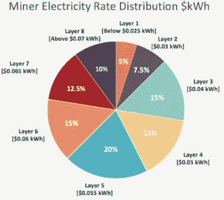
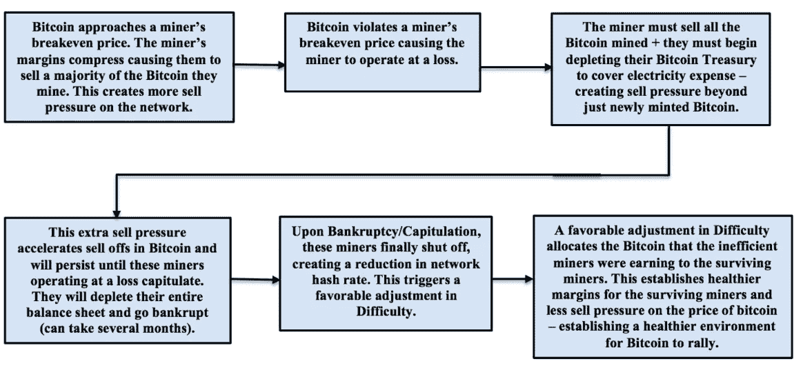
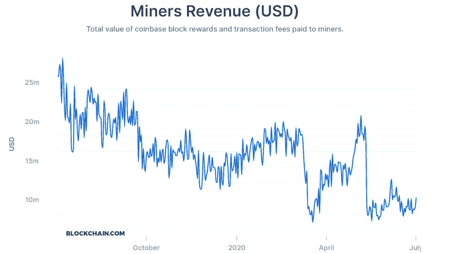
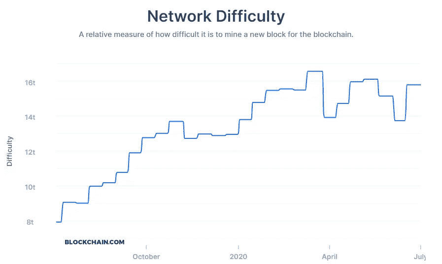
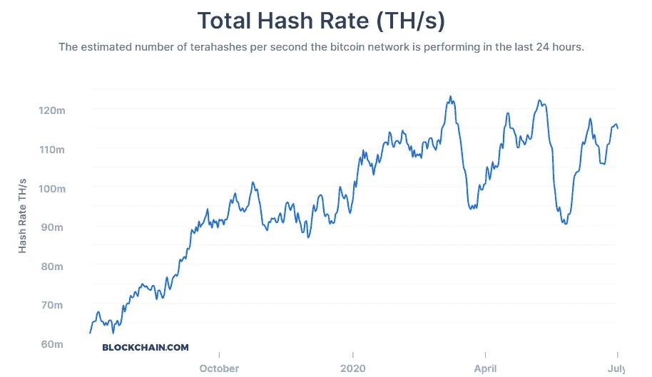
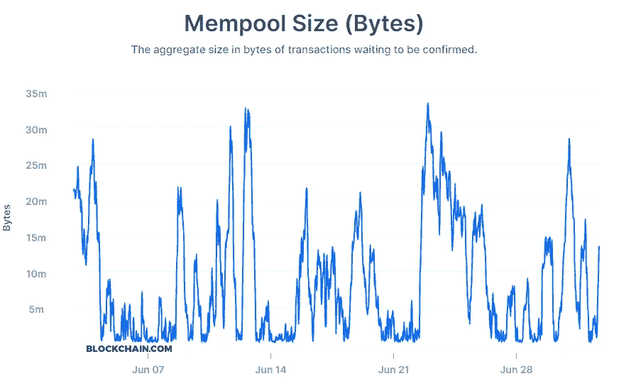
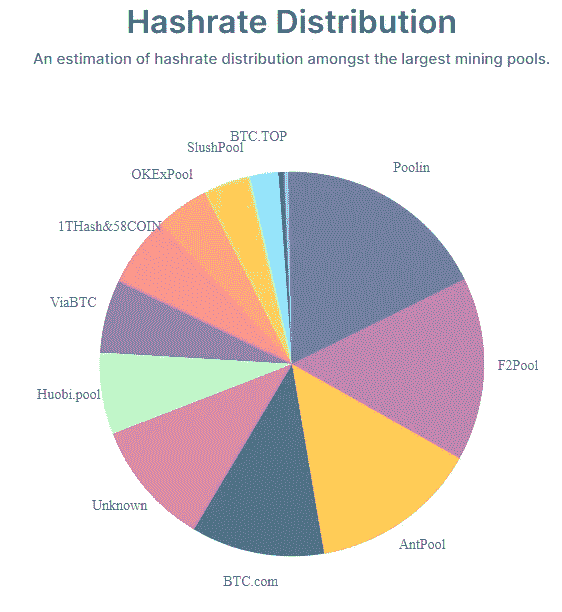
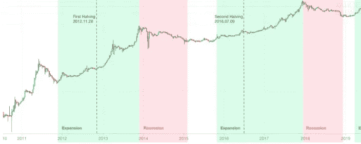
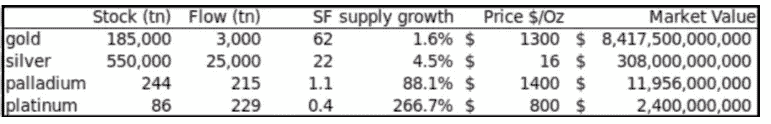
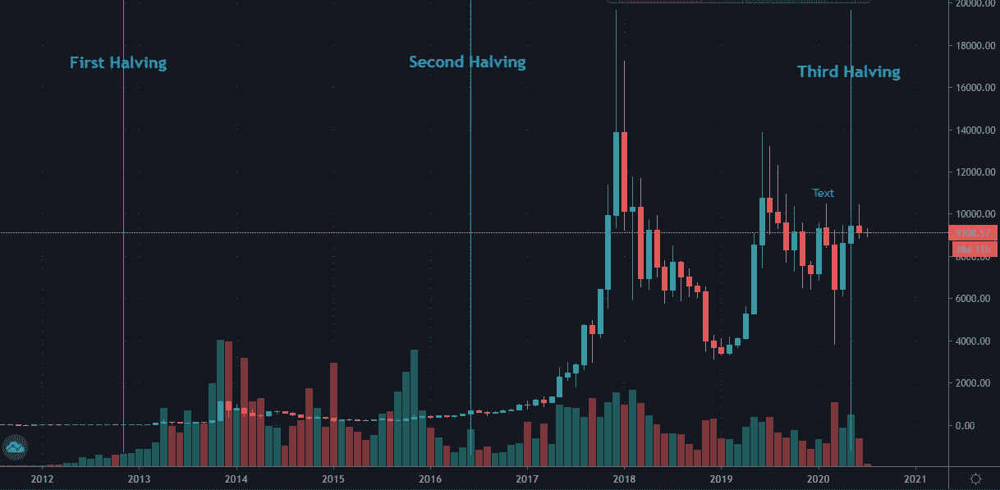

# 比特币和你需要知道的一切

> 原文：<https://medium.datadriveninvestor.com/understanding-bitcoin-how-the-network-works-the-halving-impact-difficulty-adjustments-price-52162fb2ca8b?source=collection_archive---------12----------------------->

## 这是我在比特币爆炸前的价格预测！

你们中的一些人现在可能已经对比特币有所了解，但即使你没有，这里也有一个开头的简要总结。比特币是一种数字或虚拟货币，由一系列数字签名交易定义，这些交易始于比特币的诞生。

它的设计是为了在一段时间内保持价值，并在经济危机期间保护你，就像现在世界面临的经济危机一样。它在 T2 有 2100 万比特币的限量供应。这就造成了比特币的稀缺，要知道，稀缺的东西通常都很贵。

Photo by [André François McKenzie](https://unsplash.com/@silverhousehd?utm_source=medium&utm_medium=referral) on [Unsplash](https://unsplash.com?utm_source=medium&utm_medium=referral)

# 网络是如何工作的？

比特币网络非常复杂，要完全理解它，你必须一步一步来，了解它的每一个细节。整个比特币网络依赖于区块链，这是一个巨大的互联数据库，它本身就是按时间顺序排列的比特币交易的公开记录。

区块链由所有比特币用户共享。它用于验证比特币交易的持久性，以及 ***防止重复消费*** 。此外，它允许比特币钱包计算其可消费余额，以便新的交易可以得到验证，从而确保它们实际上属于消费者。

整个网络运行在一个确保用户安全的加密协议上。点对点是一个绝妙的主意，因为这需要最小的结构来共享事务。

 [## 比特币 2025 年路线图|数据驱动的投资者

### 在这篇文章中，我将准确地描绘出我对未来几周、几个月和几个月比特币价格走势的看法

www.datadriveninvestor.com](https://www.datadriveninvestor.com/2020/05/26/bitcoin-roadmap-to-2025/) 

# 比特币宁敏。

为了确保这个复杂的想法，并使其在现实世界中可行和可用，比特币使用了一种叫做工作证明的系统。该系统通过要求服务的一些工作，即计算机的处理时间，来阻止网络上的 DDOS 攻击和其他滥用服务。

它在比特币社区被称为宁敏。挖掘过程包括识别一个块，当用 SHA-256 散列两次时，产生一个小于给定难度目标的数字。虽然所需的平均工作量与难度目标成反比，但哈希总是可以通过执行一轮双 SHA-256 来验证。

这是 Satoshi 最伟大的创新之一。对于想要修改计算能力的攻击者来说，它必须重做该块和每隔一个块的工作证明，直到激活为止。这几乎是不可能的，因为每十分钟就有一个新的区块加入区块链。每发现一个矿块，矿工就能得到 6.25 BTC，比几个月前的 12.5 有所下降。

**挖掘比特币的过程大致包括**

1.  **新事务被广播到所有节点。**
2.  每个挖掘器节点将新事务收集到一个块中。
3.  **每个 miner 节点致力于为它的块寻找一个工作证明代码。**
4.  **当一个节点发现一个工作证明时，它将该块广播给所有节点。**
5.  接收节点验证其持有的交易，并且仅当所有交易都有效时才接受。
6.  **节点通过移动到下一个块来表达它们的接受，合并所接受的块的散列。**

# 采矿网络的层次

采矿网络由不同的层组成，在这些层中有不同的规格，如千瓦时、采矿设备的类型等。通过看这个图表，我们可以看到设备盈利的下限。

下图说明了矿工电价分布和各层控制的哈希功率百分比。杂凑力的百分比来源于每一层赚取的比特币挖矿奖励的百分比。

第 1 层—低于 0.025 美元千瓦时:网络的 5%

第 2 层—低于 0.03 美元千瓦时:网络的 7.5%

第 3 层—低于 0.04 美元千瓦时:网络的 15%

第 4 层—低于 0.05 美元千瓦时:网络的 15%

第 5 层—低于 0.055 美元千瓦时:网络的 20%

第 6 层—低于 0.06 美元千瓦时:网络的 15%

第 7 层—低于 0.065 美元千瓦时:网络的 12.5%

第 8 层—超过 0.07 美元千瓦时:网络的 10%

正如你所看到的采矿费用和哪一层必须支付，你可以作出有根据的猜测，一些设备将永远关闭。特别是看下面的图表，我们可以清楚地看到，随着时间的推移，矿工变得越来越不值钱。

对于一些设备来说，比特币价格必须达到 9000 美元才能盈利，否则它们就会亏损。这可以通过查看它们是哪一层以及价格是多少来计算，但是当然您也可以使用通用工具来完成这项工作。

# 挖掘一个比特币的难度

比特币挖矿是一项竞争努力，也是一场军备竞赛，自其诞生以来一直在进行。我们已经看到了各种挖掘比特币的哈希技术，从基本的 CPU、高端 GPU、FPGAs，到最近的 asic。

每一代新技术都会降低非专业技术的盈利能力。比特币专用 ASICs 现在是挖掘比特币的主要方法，已经超过 GPU 速度 300 倍。

挖掘过程中的困难包括根据网络的累积挖掘能力进行自我调整。计算能力通常被捆绑在一起或“集中在一起”，以减少矿工收入的差异。单个采矿钻机往往需要等待很长时间才能确认一批交易并收到付款。在一个池中，每当一个参与的服务器解决一个区块时，所有参与的矿工都得到报酬。

这一报酬取决于每个矿工帮助找到该区块的工作量。mempool 是所有有效交易等待比特币网络确认的地方。内存池越大，表示网络流量越大，这将导致平均确认时间越长，优先级费用越高。

# 哈希拉特分布

整个网络的哈希速率是区块链的计算能力和主干。它通常被收集在池中，每个通过它连接的设备都付出努力，他们根据你所做的工作量相互分配奖励。

这恰好调节了你的采矿设备的收益，否则，就只能靠运气了，回报也不会一致。如果你只有一个设备在运行，你想让它独自工作，为自己赢得全部 6.5BTC 的机会，这种情况发生的可能性微乎其微。

因此，如果你打算定期获利，那就选择一个矿池，从理论上讲，它们的收益是一样的。唯一的区别因素是池运气百分比，这并没有造成很大的差异。

# 比特币减半以及一段时间后的影响。

比特币减半是许多人关注的事件，并倾向于对此有所关注。这在加密领域很重要，因为这是一个对使用该系统的每个人都有巨大影响的监管机构。比特币减半事件是指挖掘一块比特币的奖励减半。

这是由它的创造者中本聪编码的，这样做是为了防止高通货膨胀率。这也使得添加到链中的新比特币慢了很多。

布洛克的酬劳从 12.5 BTC 到现在的 6.25 BTC。据预测，该制度的变化将使通货膨胀率从 3.7%降至 1.8%。低于每年 3.9%的全球通胀率。你可以清楚地看到，这是对比特币代码的出色补充，而且考虑得非常周到。

减半对比特币的货币供应有着非常重要的作用。如果我们用简单的术语来看，价格是 T2 供给和 T4 需求的函数。

这意味着比特币的供应减少了一半，而我们可以说需求保持不变，这将从逻辑上引发价格上涨。看看库存到流量(SF)模型，你就能很好地理解价格是如何暴涨的。

这是一个衡量比特币现有供应量与每年新增供应量的比率。现在，在减半发生后，SF 为 50，相比之下，白银的 SF 为 22，黄金的 SF 为 62。

How the Bitcoin Halving has impacted the price and if you can see the price correlation after 1year of the halving for each time it has happened.

# 价格预测

在回顾了大量信息并回顾了让比特币走到今天这一步的历史之后，我们可以有把握地说，比特币不会很快消失。如果你看看上面的图表，你可以指出，在减半近一年后，比特币价格的反应非常激烈。

第一次减半让我们看到了从 **10 美元到 1180 美元**的 90 倍，第二次减半从 **600 美元到峰值近 20000 美元**。历史以不同的方式重复着自己，但却有着相同的意义，隐藏在每一种情况中，但我们发现时已经太晚了。

> 我相信，这里的历史确实会再次重演，写这篇文章一年左右后，比特币将继续牛市。

如果我们假设价格至少会上涨**5 倍**，对我来说这是**最低价格**，价格看起来会是这样的:
9108 美元(减半发生时的价格* 5 = 45540 美元。这一计算也得到股票流量模型的支持，在股票流量模型中，一个比特币的实际价值接近 55，000 美元。

比特币市场参与者的三种主要类型:

1.  ***投资基金*** —对冲基金、风险投资基金、家族理财室和其他机构投资者。他们几乎完全采用“只做多”策略，很少做空。他们通常有长期看涨的倾向，但如果信念受到考验，他们有能力在任何时候退出头寸并离开。
2.  ***霍德勒* —** 寻求最大化其比特币持有量的长期累积者。霍德勒有长期看涨倾向，对价格波动的敏感度低于投资基金。然而，像投资基金一样，霍德勒可以随时退出他们的全部头寸，然后离开。
3.  ***矿工****——比特币网络的中坚力量。矿工比投资基金和霍德勒更相信比特币。他们有长远的眼光。他们投资于生命周期长的资产，这些资产既不能改变用途，也不能以公平的市场价值迅速变现。ASIC 采矿钻机有 3 年以上的生命周期，只能用于开采 Sha-256 协议(几乎完全是比特币)。比特币采矿设施的生命周期超过 5 年，通常是经过改造的仓库，专门为冷却采矿设备而设计。平均而言，在将资本投入采矿钻机、设施建设和电力支出后，一家矿商需要 18 个月才能实现收支平衡。矿工是比特币网络抛售压力的主要驱动力。他们收到所有新发行的比特币，他们必须出售比特币，以便为采矿业务的资本支出和运营支出提供资金。*

# *结束语*

*如果你对这篇文章有任何问题或建议，请不要犹豫，在评论区回复。喜欢你读的东西吗？为什么不关注我的媒体简讯，这样你就不会错过我未来的任何文章了？很简单，点击[这里](https://kgabeci.medium.com/subscribe)输入你的邮箱地址，然后按订阅。*

*你喜欢阅读媒体上的文章吗？考虑成为会员，有很多功能，你将获得所有创作者的内容，每月只需 5 美元。使用[这个链接](https://kgabeci.medium.com/membership)，你也帮我赚一小笔佣金，点击成为会员，输入你的信息。*

***访问专家视图—** [**订阅 DDI 英特尔**](https://datadriveninvestor.com/ddi-intel)*