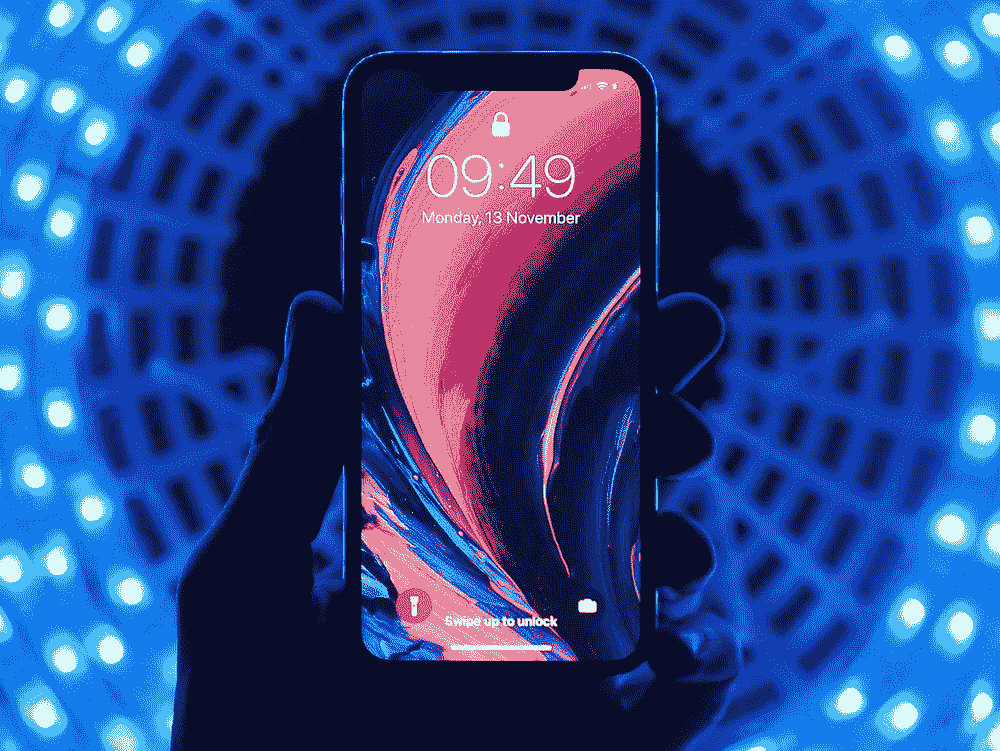

# 理解区块链:以 Android 和 IOS 为参考

> 原文：<https://medium.datadriveninvestor.com/understanding-blockchain-using-andriod-and-ios-as-a-reference-7946ef04b846?source=collection_archive---------5----------------------->

Smartphones and Blockchains

我见过很多关于区块链的解释，但很少有人能帮助向这个行业的新手解释它到底是什么。

以下是我的尝试；

# 什么是区块链？

根据数据显示，每天有 87%的人使用安卓手机，13%的人使用苹果 IOS 设备。

全世界数百万人已经采用了智能手机，我们毫不费力地使用它们。在开始的时候，这确实花了一点时间，但是，甚至我年长的父母也能或多或少地做我能做的一切。我在这里会更多地谈论它们和使用比特币等加密货币。

 [## 人工智能、区块链和智能合约:为什么我们都需要拥抱创新|数据驱动的投资者

### 区块链是一个抓住了我的想象力的行业，有助于为更大的利益改造社会。我开始…

www.datadriveninvestor.com](https://www.datadriveninvestor.com/2020/08/03/ai-blockchain-and-smart-contracts-why-we-all-need-to-embrace-innovation/) 

## 但是，区块链和苹果或者 Andriod 怎么一样？

把区块链想象成你的安卓或苹果操作系统。你在智能手机上做的一切都是在操作系统上运行的。如果你想使用你的手机，你首先需要有一个正常工作的操作系统。

目前最流行的 OS 是 Andriod 和苹果 IOS。最流行的区块链，是的，不止一个，是比特币和以太坊。

*比特币区块链就像苹果 IOS*

*以太坊区块链就像 Andriod*

所有这些都可以在你的智能手机或个人电脑上轻松运行。取决于你想做什么。

区块链和 OS(操作系统，IOS/Andriod)允许一切运行，并为上面的应用程序提供动力。也许你想用你的智能手机玩游戏，检查你的银行余额或给你的朋友发消息，首先，你有一个工作的操作系统，然后你下载你的应用程序，然后你喜欢使用你手机的所有功能。

> 应用=加密货币

每天都有数以百万计的应用程序添加到苹果和 Andriod 商店。所有这些都提供了不同的解决问题的方法，或者来自公众的需求。比特币、以太坊之类的加密货币就是这样。比特币被认为是一种自己进行银行业务和储存价值的方式。它基本上是一个银行应用程序，但最好的是，你可以完全控制。想了解更多关于控制和去中心化的信息或者比特币的初学者指南，我建议看一下这里的[。](https://medium.com/@GeoffreyGardiner/bitcoin-for-dummies-2019-c6344a8ad451)

全球已经有 1000 多种应用和加密货币在使用，你只需要选择一个操作系统，或者使用多个，下载到你的智能手机上，然后用于各种用途。

# 比特币区块链和比特币，以及，以太坊区块链和以太坊

正如我们在上面简要讨论的那样，这些是不同的。

我们在比特币区块链上使用比特币应用，我们使用比特币货币来支付这些系统内的东西。

## 以太坊也是一样

我们在 ether um 区块链上运行基于以太坊的应用程序，在这些应用程序中，我们使用以太坊货币来支付和使用多种功能。例如，你可以在这里看到关于玩家做上述事情的信息[。一个快速的总结是；](https://medium.com/the-capital/blockchain-gaming-finally-allows-players-to-earn-ethereum-1e318aa47cf9)

> 人们使用以太坊区块链
> 
> 他们在系统内部下载游戏(比如使用 Play Store 或 App store)
> 
> 他们购买以太币
> 
> 他们购买游戏中的产品，如新车、特殊的足球运动员或其他物品，以改善游戏体验

# 你可能会问，谁控制这一切，并保证它的安全？

> 答案就是你！

区块链和加密货币被用来把权力还给人们。你和其他人一起对你的系统内发生的事情进行投票。多数人赢了。

这意味着如果一个坏的应用程序出现，系统内的人应该将其标记为坏的，然后阻止其他人落入陷阱。控制的唯一问题是你需要意识到安全和潜在的问题。没有人帮你，你只能帮你自己！

对于像美元和日元这样的货币与拥有加密货币有什么不同，你可以在这里找到信息[。](https://medium.com/@GeoffreyGardiner/cryptocurrency-and-currency-c12fe65dfe2)

**访问专家视图—** [**订阅 DDI 英特尔**](https://datadriveninvestor.com/ddi-intel)