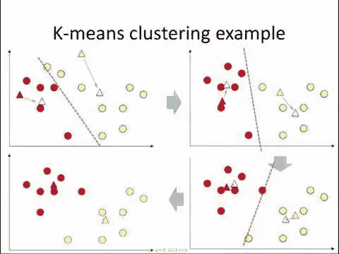

# 了解核心数据科学算法:k-means 和 k-medoids 聚类

> 原文：<https://medium.datadriveninvestor.com/understanding-core-data-science-algorithms-k-means-and-k-medoids-clustering-12c4df80964b?source=collection_archive---------10----------------------->

*数据科学算法在数据科学家的生活中扮演着重要的角色。获取算法方面的知识和技能被认为是解决手边任何一种任务的核心技能。*

C 聚类是统计数据分析的主要技术之一。

顾名思义，“聚类”被定义为将相似的对象聚集到不同的组中或将数据集分布到具有定义的距离度量的子集的过程。

*k-means* 聚类被吹捧为每个数据科学家工具箱中应该有的基础算法。由于其非凡的特性，该算法在 [**数据科学行业**](https://www.dasca.org/) 中的受欢迎程度扩大。

*   简单的
*   快的
*   高效的

# **如何运作？**

*k-means 和 k-medoids 是在分区聚类算法中使用的*方法，其功能基于指定组的初始数量，或者更准确地说，通过在组之间重新分配对象来迭代工作。

该算法首先将所有点分成已经选定数量的聚类。该过程通过测量点和每个聚类中心之间的距离来进行。并且因为 k-means 只能在欧几里得空间中起作用，所以算法的功能是有限的。尽管该算法存在缺陷或不足，但 k-means 仍然被证明是用于聚类的最强有力的工具之一。这些应用广泛应用于多维领域——物理科学、自然语言处理(NLP)和医疗保健。

k-means 算法的扩展包括其 k-中心的更智能的起始位置，这进一步允许更多可变的聚类大小。当这种情况发生时，产生的距离将大于欧几里德距离。

接下来，我们将讨论不同的其他方法，如 CLARANS、CLARA 和 PAM，这些方法有助于整合超过欧几里德距离的测量距离。

然而，在讨论其他方法之前，让我们先解决 k-means 聚类的缺点。

最常见的情况是，异常值是由欺诈行为、人为错误和机械故障引起的。也可以在 k-means 聚类中看到。首先，需要在数据集中应用 k-means 聚类算法，然后您可以从每个聚类开始 [**识别离群值**](https://www.dasca.org/world-of-big-data/article/identifying-and-removing-outliers-using-python-packages) 。用于识别或检测数据集中异常值和异常值的基于距离的方法和基于聚类的方法。

主要目的是首先检测异常值，然后将其移除，使聚类更加可靠。

# 下面是预测 k 均值聚类失败的几点:

*   当群集的大小和密度不同时，无法正常工作。
*   预测精确的质心数量来划分数据变得困难。
*   k 形心的初始位置会影响结果。
*   质心是数据集中的一个假想点，因此可能价值较小。
*   对维度的比例敏感，因此重新调整数据可能会变得困难。
*   分割点时利用欧几里得距离。然而，它在高维设置中可能变得无效，因为所有点彼此之间的距离变得相等。
*   即使分区毫无意义，该算法也会对空间进行分区。

# 【medoids 周围划分(PAM)算法

除了聚类的平均值，您还可以使用 medoid 进行分区，或者使用位于聚类中心点的数据点。据说 medoid 与一个簇中的所有点的相异度最小。Medoid 对数据集中的异常值不太敏感。

在[机器学习(ML)](https://medium.com/swlh/top-five-methods-to-identify-outliers-in-data-2777a87dd7fe) 中的无监督学习下，聚类算法证明了自己。k-means 背后的一个主要思想是，我们希望向我们已经拥有的数据添加新的点(k)——这些点中的每一个都被称为质心。k-means 算法是最简单的**数据科学算法**之一，每个数据科学家的工具箱中都必须有。

现在，这些分区可以使用任意距离，而不总是依赖欧几里德距离。这是《帕姆，克拉拉和克拉拉》中最关键的一点。

# 以下是 PAM 中涉及的步骤:

*   给定 k
*   现在选择随机的 k 作为初始的 medoid
*   这些实例中的每一个都需要分配给最近的 medoid (x)
*   然后计算目标函数，即每个实例与最接近的 medoids 的相异度之和
*   选择任意随机实例(y)
*   当发生这种情况并且交换或替换降低了功能时，用 y 替换 x
*   然后重复(3–6 ),直到没有进一步的变化

CLARA(大型应用程序群集)是 PAM 的一个更快版本，有助于在算法中启用循环的嵌套顺序。我们需要一个更快的 PAM 版本，以防 PAM 算法的时间复杂度比 k-means 算法慢。

***尽管 k-means 聚类算法存在诸多缺点，如易受离群值影响、依赖欧几里德距离以及收集的质心不能代表真实数据点，但 PAM、CLARA 和 CLARANS 在解决这个问题上发挥了重要作用。***