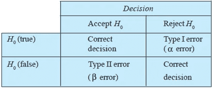

# 了解数据科学的假设检验

> 原文：<https://medium.datadriveninvestor.com/understanding-hypothesis-testing-for-data-science-df952bbc1ef9?source=collection_archive---------1----------------------->

Graphical Representation of Hypothesis and their Errors

假设检验是数据科学访谈中经常被问到的重要统计概念之一。所以，时刻保持警惕很重要，让我们开始吧。

# 假设检验到底是什么？

在一般方法中，我们试图使用数据样本来评估关于人口的两个相互排斥的陈述(两个假设 H0 和 H1)。H0 被称为零假设，因为它是我们的初始假设，而 H1 被称为替代假设。

为了检验假设，我们进行以下步骤:

1.  对总体做一个初始假设，称为原假设(H0)。
2.  收集数据以证明假设。
3.  在收集证据和分析数据之后，我们决定是接受零假设还是拒绝零假设。

通过假设检验，我们可以做出四种不同的决定:

1.  拒绝 H0(接受 H1 的替代假说)和 H0 不成立(没有错误)。
2.  不排斥 H0 和 H0 是真的(没有错误)。
3.  拒绝 H0 和 H0 是正确的(第 1 类错误)。
4.  不排斥 H0 和 H0 是不正确的(第二类错误)。

在数据科学中，这将取决于你的问题陈述 I 型错误更有害还是 II 型错误更有害，以及你对零假设的选择。

 [## 数据科学和软件工程哪个更有前途？数据驱动的投资者

### 大约一个月前，当我坐在咖啡馆里为一个客户开发网站时，我发现了这个女人…

www.datadriveninvestor.com](https://www.datadriveninvestor.com/2019/01/23/which-is-more-promising-data-science-or-software-engineering/) 

在我的下一篇博客中，我将展示不同的统计测试是如何进行假设检验的。

快乐学习！！