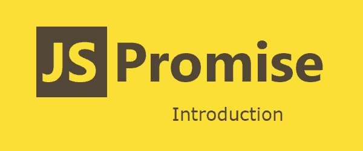
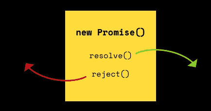
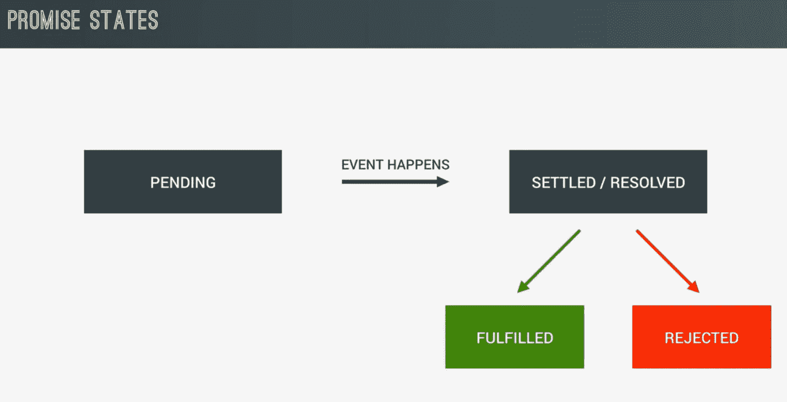

# 理解 JavaScript 承诺

> 原文：<https://medium.datadriveninvestor.com/understanding-javascript-promises-87c4d3c349c2?source=collection_archive---------25----------------------->


Photo by [Pankaj Patel](https://unsplash.com/@pankajpatel?utm_source=unsplash&utm_medium=referral&utm_content=creditCopyText) on [Unsplash](https://unsplash.com/?utm_source=unsplash&utm_medium=referral&utm_content=creditCopyText)

## 带示例..！！！

**JavaScript Promise** 是一个特殊的 JavaScript 对象，它将“**生产代码**和“**消费代码**联系在一起。

承诺只能成功或失败一次。它不能成功或失败两次或更多次，也不能从成功切换到失败，反之亦然。



如果**承诺**已经成功或失败，并且如果我们后来添加了成功/失败回调，那么将基于输出调用正确的回调，即使事件发生得更早。

JavaScript 是单线程脚本语言。一切都是按顺序发生的，它是一行一行写出来的。但是，在**中，异步操作**按照它们完成的顺序发生。

[](https://www.datadriveninvestor.com/2018/08/06/ai-forecast-disruption-then-productivity/) [## 艾预测:“颠覆，然后是生产力”|数据驱动的投资者

### 人们越来越担心，随着机器学习和互联网的普及，所有白领工作都将消失

www.datadriveninvestor.com](https://www.datadriveninvestor.com/2018/08/06/ai-forecast-disruption-then-productivity/) 

**事件**非常适合于在同一个对象上可能发生多次的事情，如 **keyup** 、 **touchstart** 、 **mouseover** 等。对于那些事件，我们不必关心发生了什么，直到我们附加了一个侦听器。但是当涉及到成功/失败的异步行为时，**回调函数**没有**承诺**那么有用。

promise **构造函数**接受一个参数:一个带有两个参数的**回调**函数，称为 **resolve** 和 **reject** 。我们可以用**承诺**作为两种不同的方法。



# 承诺创造

```
const promiseObject = new Promise(function(resolve, reject) {
  setTimeout(() => {
    resolve('Promise Created....!!!');
  }, 200);
});
```

所以，在这里，我们创建了一个**JavaScript****Promise****对象**，并向 **Promise** 构造函数传递了两个参数: **resolve** 和 **reject。**

在消费时，如果**承诺解决了**，那么我们可以使用 **then()** 函数消费该值，如果承诺被拒绝，那么我们将获得 **catch()** 块中的错误值。

# 承诺消费

所以，如果我们解析这个函数，那么我们会得到 ***then()*** 块中的值。

```
const promObject = new Promise(function(resolve, reject) {
  setTimeout(() => {
    resolve('Promise is created...!!!');
  }, 200);
});promObject.then(value => {
  console.log(value);
});
```

**承诺**也被拒绝，在这种情况下，我们的代码如下所示。

```
*// server.js*const prom = new Promise((resolve, reject) => {
  setTimeout(() => {
    reject('Promise is rejected...!!!');
  }, 200);
});prom.catch(error => {
  console.log(error);
});
```

执行者通常会启动一些异步工作，然后，一旦完成，要么调用 **resolve** 函数来解析一个承诺，要么如果出现错误，**拒绝**它。

如果在 executor 函数中抛出错误，则意味着拒绝承诺。执行器的返回值被忽略。

# JavaScript 中的承诺状态

**承诺**是一个价值的代理，当一个承诺被创建时，这个价值不一定是已知的。promise 允许我们将处理程序与异步操作的最终成功或失败原因联系起来。

这使得异步方法像同步方法一样返回值:异步方法不是立即返回最终值，而是返回一个**承诺**在未来某个时间提供值。



**承诺**处于以下状态之一:

*   **未决**:初始状态或未决状态，既不满足也不拒绝。
*   **完成**:表示操作成功完成。
*   **拒绝**:表示操作失败。

# 承诺方法

**JavaScript Promise** 有以下方法。

## Promise.all()

它返回的承诺要么在 iterable 参数中的所有承诺都实现时实现，要么在 iterable 参数中的一个承诺拒绝承诺时立即拒绝。如果返回的承诺履行了，那么它将按照 iterable 中定义的顺序，用一个已履行承诺的值数组来履行。如果返回的承诺被拒绝，则拒绝的原因来自 iterable 中第一个拒绝的承诺。

## Promise.race(可重复)

它返回满足或拒绝的承诺。iterable 中的一个承诺满足或拒绝，并带有该承诺的值或原因。

## 承诺.拒绝(原因)

返回由于给定原因而被拒绝的承诺对象。

## 承诺.解决(价值)

它返回用给定值解析的 Promise 对象。

# 异步等待承诺示例

让我们举一个例子，看看如何在 ***异步等待*** 中使用 Promise。

```
function calculateSquare(length) {
  return **new Promise**(resolve => {
    setTimeout(() => {
      resolve(Math.pow(length, 2));
    }, 2000);
  });
}async function getSquareArea(length)
{
  const value = await calculateSquare(length);
  console.log(value);
}getSquareArea(2); *// 4*
```

所以，在输出中，我们会得到 4。首先，它将调用**异步功能**层，然后等待承诺被履行或拒绝。之后它会给我们输出。

这里我们要用 ***setTimeout*** 函数来造成手动延迟执行来模拟 AJAX 请求。如果我们拒绝，那么我们将得到**错误对象**。

承诺中的错误处理非常容易，因为不管是履行还是拒绝，它都会给出一次。所以它是回调函数的最佳替代品，在回调函数中会产生回调地狱。