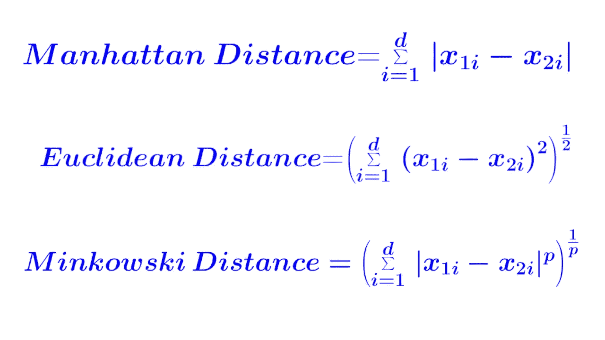
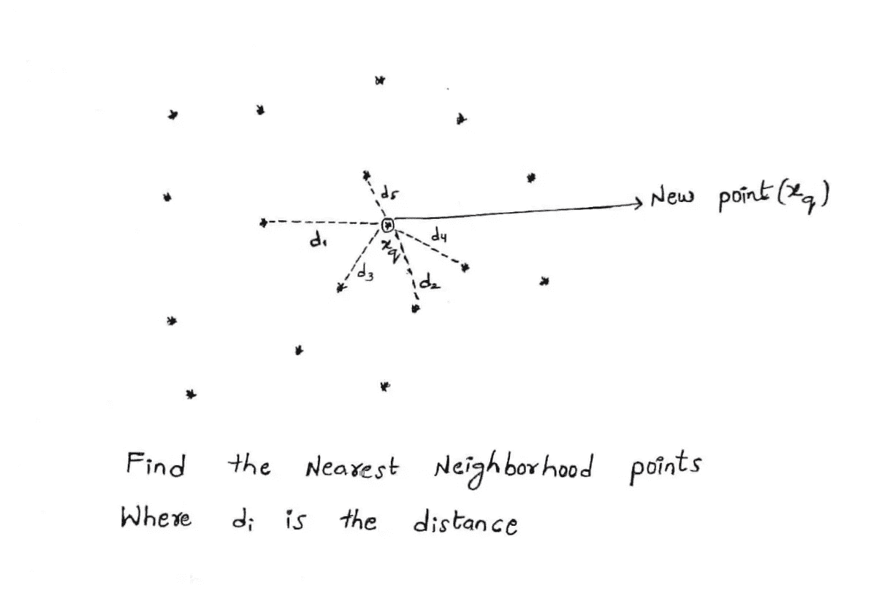
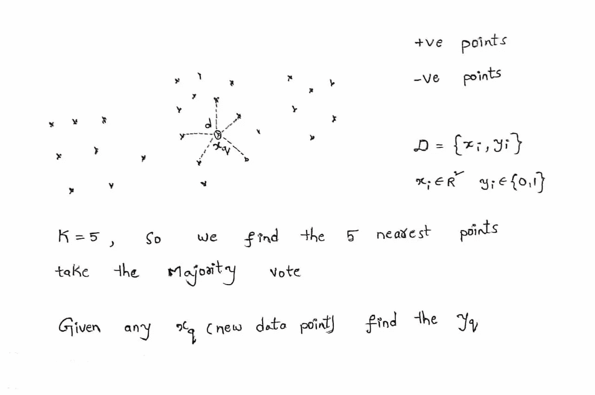
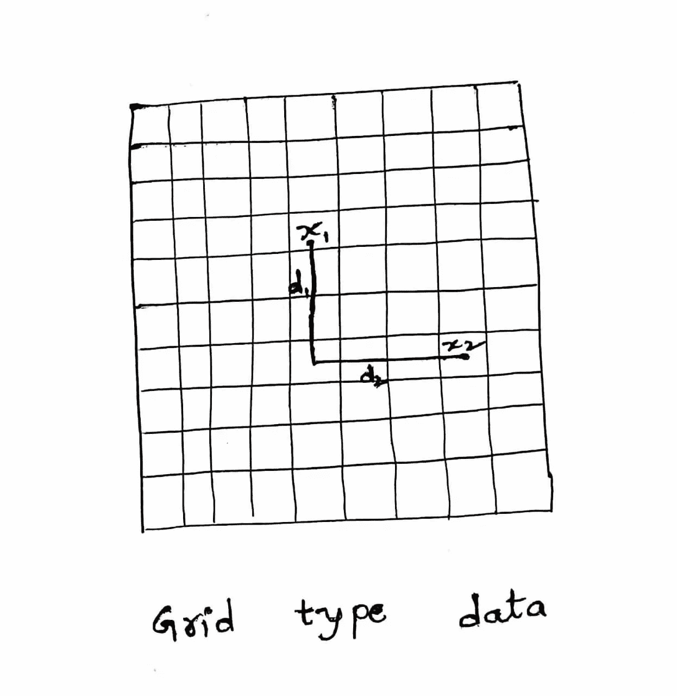
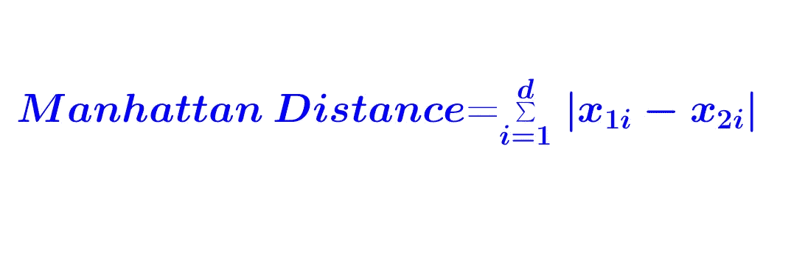
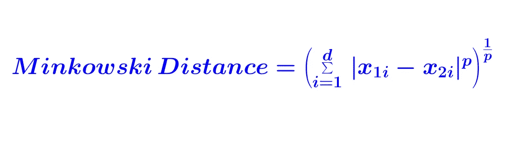

# 理解机器学习算法——KNN

> 原文：<https://medium.datadriveninvestor.com/understanding-machine-learning-algorithms-knn-812840e3e284?source=collection_archive---------6----------------------->

KNN(K-最近邻)可用于回归和分类

# 你会学到什么？

1.  **几何直觉**
2.  **KNN 如何工作和数学**
3.  **KNN 回归**
4.  **KNN 失败案例**
5.  **时间和空间复杂度**

# 1.**几何直觉**

> **假设:- KNN 假设我们所有的数据点在几何上彼此接近，或者换句话说邻域点应该彼此接近。**

作为数据集的一个例子，我在这里举了一些评论(产品评论)，我们都知道有正面评论和负面评论，它们都是混淆的。我们必须对积极点或消极点进行分类，让我们看看 2D 的评论

> **任务:——顾名思义，KNN 的思想是，任何给定的新点(查看)找到给定新点的最近邻域点，然后计算多数投票，然后对其进行分类**

# 2.**KNN 如何工作和数学**

**多数投票:-** 如果是分类或回归问题，我们取 K(在上述情况下 K=5)个点作为属于多数类的这 K 个点中任何给定点的最近点或周围点值，我们将给定点分类为该类。给定数据集{Xi，Yi}，我们对 K 个数据点取相应的 Yi 值。当我们选择 K 值时，如果 K 是偶数，大多数情况下 K 应该是奇数。即使我们得到 2 个正点数和 2 个负点数，当 K 是偶数时，我们也不能获得多数票。

**数据点的距离测量？**

我们用距离来寻找最近的或邻近的点，在数学中有很多可用的距离，我们会看到一些距离什么时候用什么？

**我)。欧几里德距离**

欧几里德距离找到两点之间的最短距离，当我们有高维数据时，它不是优选的。

**ii)。曼哈顿距离**

> **曼哈顿距离测量垂直或水平方向的距离，当我们有网格类型的数据时使用，例如现代城市道路是垂直或水平的，在这种情况下，我们必须沿着道路走，不能跳过建筑物。**

当我们有高维数据时，曼哈顿距离优于欧几里德距离。

**iii)。闵可夫斯基距离**

> 在闵可夫斯基距离中，如果 p=1，它就是曼哈顿距离，如果 p=2，它就是欧几里得距离。

**iv)。汉明距离**

它的应用有限，尤其是在测量两个位置不同的字符串时。

**寻找合适的 K**

在 KNN，K 直观上是超参数，当 K 小时，我们的模型会过拟合，因为当 K 小时，它只考虑几个点，而 K 大时，它考虑非常大的点，并且它不知道给定点属于哪个类，所以当 K 大时，它会过拟合。

> 当 K 是一个过拟合的小模型时，当 K 是一个过拟合的大模型时，我们必须选择中间的 K 值。如果图交叉验证误差，我们将知道正确的 K

# 3.KNN 回归

KNN 很容易扩展到分类中的回归我们在**回归中采用多数票我们易不再是类易是真实世界的值所以我们根据我们的要求和数据采用平均值或中值**

对应的数据点 Yi 的(Y1，Y2，Y3，Y4…..)这些都是实值，求平均值或中值

# **4。KNN 的失败案例？**

> **1。当给定的数据点离这些数据点非常远时，它找不到任何周围的数据点，所以我们不能说给定的数据点属于正的或负的。**
> 
> **2。当我们的数据集随机扩散，或者换句话说，把所有的类混在一起，我们就找不到它属于哪个类，所以它失败了。**

# 5.时间和空间复杂性

> **时间复杂度:-对于每个点，我们必须找到 n 个数据点的距离，即 O(nd)。我们应该保持最小的距离。如果 d(维数)小于 n(数据点),我们可以说它是 O(n)**

**=O(nd)**

> **空间复杂度:-当我们计算点之间的距离时，所有数据点都应该存储在存储器中，因此，我们需要空间 O(nd)**

**=O(nd)**

感谢阅读！