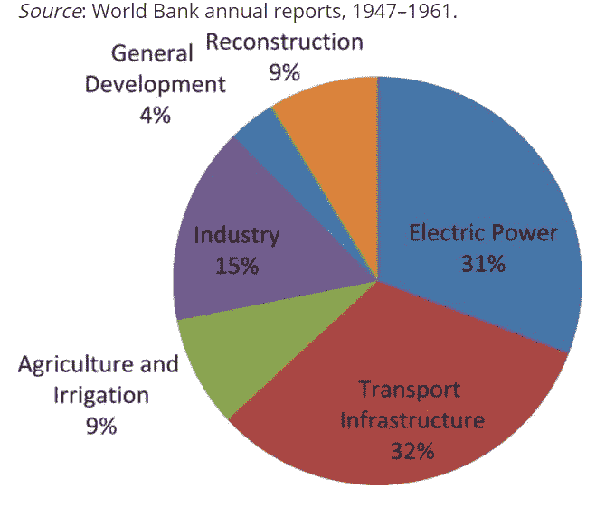

# 了解多边开发银行

> 原文：<https://medium.datadriveninvestor.com/understanding-multilateral-development-banks-f9207fd90b90?source=collection_archive---------30----------------------->

## 以及他们承受的经济压力

Photo by [Melchior Damu](https://unsplash.com/@alienking2000?utm_source=unsplash&utm_medium=referral&utm_content=creditCopyText) on [Unsplash](https://unsplash.com/s/photos/hand?utm_source=unsplash&utm_medium=referral&utm_content=creditCopyText)

我最初对世界银行了解不多，我现在也不是专家，但在华盛顿住了几年后，我对这个组织更加熟悉了。我认同他们的使命，这也是我重返校园的动力:

> “通过促进可持续增长和对人的投资来减少贫困和提高生活水平”[*【1】*](https://doi.org/10.1136/bmj.318.7187.822)

过去的这个季度，我上了一堂关于水资源开发的可持续性和弹性的课。我们被要求挑选一篇论文向全班同学展示。我很高兴多边开发银行(MDB)是可用的主题之一，因为它让我有机会更深入地了解世界银行的内部工作。

我选择的论文是克里斯·汉弗莱(Chris Humphrey)的*看不见的手:多边开发银行的金融压力和组织趋同*(2016)[【2】](https://www.tandfonline.com/doi/full/10.1080/00220388.2015.1075978)。本文解释了金融压力如何影响多边开发银行的组织发展。

我在下面的纸上浓缩了我的报告中的信息，请欣赏！

H umphrey 论文的目标是:

> 审查多边开发银行因需要从资本市场获得融资而在发展实践中发生的变化

要理解这一点，了解 MDB 到底是什么是有帮助的。Investopedia 提供了一个很好的定义:

> 多边开发银行(MDB)是由两个或两个以上国家特许成立的国际金融机构，目的是鼓励较贫穷国家的经济发展。[【3】](https://www.investopedia.com/terms/m/multilateral_development_bank.asp)

有许多这样的机构，如世界银行、亚洲开发银行和非洲开发银行。

在我的演讲中，我明确地把重点放在了汉弗莱论文中关于世界银行的部分，而世界银行恰好是第一个多边开发银行。它于 1944 年在布雷顿森林会议上以国际复兴开发银行(IBRD)的名义成立。它最初是出于二战后重建国家对资金的需求而创立的。会议的设想是，世界银行将为政府从私人来源借款提供担保，而不是提供直接贷款。然而，世界银行的投资者和管理层不喜欢这个想法，更愿意提供贷款。直接贷款的主要问题是，与二战所需的重建努力相比，从成员国筹集的资金不足。筹集了 7.27 亿美元，仅法国和荷兰就需要 10.35 亿美元。

Caen, Normandy in ruins after bombings of July 8th and 9th, 1944 [[5]](https://commons.wikimedia.org/wiki/File:Caen_in_ruins.jpg)

接下来发生了什么？

出于必要，他们转向美国资本市场筹集资金。随着这一转变而来的是新领导层的招聘和战略的改变。

世界银行指望华尔街来填补行政级别的职位。这导致约翰·J·麦克罗伊成为总裁，罗伯特·加纳成为副总裁，尤金·布莱克成为美国执行董事。

随着新团队的就位，他们于 1947 年 7 月 15 日发行了两张价值 2 . 5 亿美元的债券。他们的努力成功地筹集了更多的资金，但他们知道，如果他们要长期继续这一战略，他们需要证明自己的财务信誉。

结果是开发了新的主体。麦克洛伊有金融背景，他知道让世界银行在投资者看来是一项可靠投资的重要性。这导致了 **(1)** 关注那些**会产生收入的项目**和 **(2)** 更关注**借款国的信用风险**而不是需求问题。

Humphrey 提供了 1947 年至 1961 年间由此引起的变化的统计数据。在世界银行提供的 57 亿美元贷款中，70%流向了欧洲、澳大利亚和先进的发展中国家，而只有 30%流向了贫穷的发展中国家。下图显示了按项目类型划分的支出明细，从中可以清楚地看到，像电力这样的财务上有利可图的项目得到了优先考虑。

IBRD Lending by Sector, 1947–1961 [[2]](https://www.tandfonline.com/doi/full/10.1080/00220388.2015.1075978)

这一战略起到了预期的作用，1959 年，世界银行获得了梦寐以求的 AAA 评级，这标志着最高级别的信誉。随着在美国资本市场的成功，他们决定开始进入美国以外的市场。世界银行的净收入从 1948 年的 400 万美元增加到 1964 年的 2 . 88 亿美元(T2)。

20 世纪 50 年代，一些组织开始注意到并担心世界银行偏离了他们的主要使命。《经济学人》称，他们开始变得更像商业银行。甚至联合国也表示他们没有完成使命，建议在联合国内部建立一个国际发展机构来解决这个问题。

最终，美国提出了自己的解决方案，成立了国际开发署(IDA)。想法是将这个新组织作为世界银行下的一个独立分支，拥有独立的金融账户和更宽松的贷款做法，以回应批评者关于没有实现其最初使命的说法。这种结构将允许世界银行仍然参与和否决 IDA 的项目。

IDA 成立后，它被证明是世界银行投资组合的宝贵资产。世界银行最具风险的贷款被转移给了国际开发协会。1963 年，世界银行 27.3%的贷款被认为是高风险的。到 1975 年，这个数字下降到 15%。

这也减轻了世界银行净收入的压力。到 1964 年，他们的收入变得如此之大，以至于有人担心美国国会会介入并重新分配这些资金。随着国际开发协会的成立，世界银行能够将资金转移到这个新的投资组合中，这个投资组合与最初的使命更加一致，并且仍然拥有对资金的控制权。

T4 指出，当组织被迫在坚持最初的使命和获取生存资源之间做出选择时，他们通常会选择后者。

世界银行进入资本市场是出于需要和缺乏政府捐助资金。这导致了多年来组织文化的转变，有时更注重信誉而不是需求。除了本组织需要满足的成员国政府之外，它还创造了第二组利益相关者，即投资者。

尽管如此，这仍然是最好的选择。这为多边开发银行提供了一种自主感，减少了股东国的影响，因为它们正在筹集自己的资金。从 1945 年到 2013 年，世界银行贷款 5860 亿美元，其中只有 134 亿美元来自股东国。这是一笔令人难以置信的投资，此外还有员工花费的无数时间，以改善世界各地人民的生活。

点击下面的链接，看看世界银行的一些令人惊叹的项目！

 [## 项目

### 世界银行集团拥有 189 个成员国，员工来自 170 多个国家，在 130 多个地方设有办事处

projects.worldbank.org](https://projects.worldbank.org/en/projects-operations/projects-list) 

Jack Seagrist 目前是斯坦福大学的一名学生，正在攻读环境工程硕士学位。他热衷于使用最新的数据驱动流程来解决气候挑战。通过 [twitter](https://twitter.com/JackSeagrist) 、 [linkedin](https://www.linkedin.com/in/jackson-seagrist/) 联系，或者查看他的[网站](https://www.jackseagrist.com/)来了解更多关于他的工作。

 [## 我在斯坦福大学读研的旅程

### 怎么了！感谢你加入我的博客之旅…

jackseagrist.medium.com](https://jackseagrist.medium.com/my-path-to-grad-school-at-stanford-36567378951b) 

参考资料:

[1] —斯托特·r .(1999 年)。世界银行。 *BMJ(临床研究版。)*， *318* (7187)，822–823。[https://doi.org/10.1136/bmj.318.7187.822](https://doi.org/10.1136/bmj.318.7187.822)

[2] *— Chris Humphrey (2016)看不见的手:多边开发银行中的金融压力和组织趋同，《发展研究杂志》，52:1，92–112，DOI:10.1080/00220388 . 2015 . 1075978*

[3]—[https://www . investopedia . com/terms/m/multilateral _ development _ bank . ASP](https://www.investopedia.com/terms/m/multilateral_development_bank.asp)

[4]—[https://www . world bank . org/en/about/archives/history/exhibites/Brett on-Woods-monetary-conference](https://www.worldbank.org/en/about/archives/history/exhibits/bretton-woods-monetary-conference)

https://commons.wikimedia.org/wiki/File:Caen_in_ruins.jpg