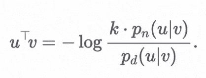
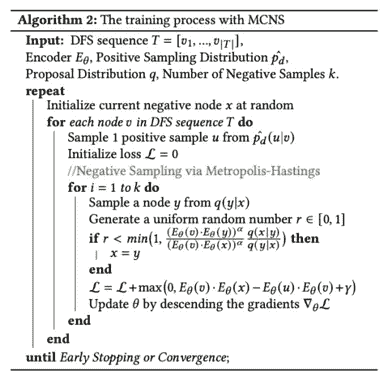
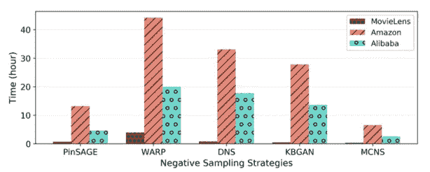
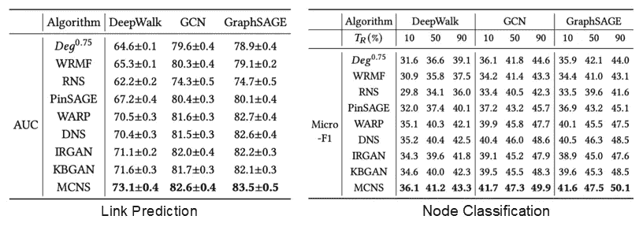
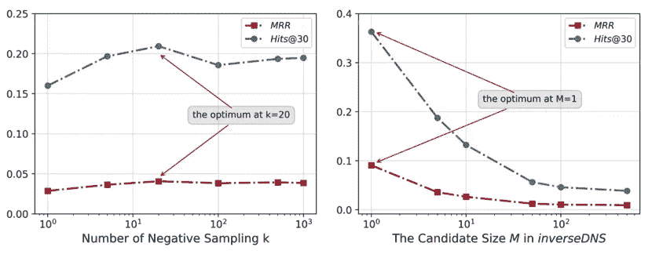

# 理解图形表示学习中的负采样

> 原文：<https://medium.datadriveninvestor.com/understanding-negative-sampling-in-graph-representation-learning-2f8803d52964?source=collection_archive---------10----------------------->

*下载“*[*【KDD 论文云知识发现】*](https://resource.alibabacloud.com/whitepaper/cloud-knowledge-discovery-on-kdd-papers_2592) *”白皮书，探索 12 篇 KDD 论文和 12 位阿里巴巴专家的知识发现。*

*作者:杨振、、周畅、、、*

近年来，图形表示学习得到了广泛的研究。图形表示学习可用于为所有类型的网络生成连续的矢量表示。然而，将高质量的矢量表示有效且高效地应用于大型节点仍然是具有挑战性的。大多数图表示学习可以统一在采样噪声对比估计(SampledNCE)框架内，该框架包括用于生成节点嵌入的可训练编码器，以及用于对任何给定节点分别采样正节点和负节点的正采样器和负采样器。下图显示了详细信息。现有技术通常集中于对正节点对进行采样，而对负采样的策略没有充分研究。

为了弥补这一差距，我们从目标和方差两个角度系统地分析了负抽样的作用，从理论上证明了负抽样在确定优化目标和最终方差方面与正抽样一样重要。首先，我们从以下用于图形表示学习的目标函数开始，并讨论更一般的图形表示学习形式:

其中 p_d 表示估计的数据分布。p_n 表示负抽样分布。u→和 v→表示节点的矢量表示。σ(⋅)是 sigmoid 函数。我们可以使用以下公式计算理想情况下的最佳矢量内积:

前面的公式表明，正抽样分布和负抽样分布对目标函数的优化具有相同程度的影响。

我们还从方差的角度分析了负抽样的影响。为了最小化经验误差，我们从正抽样分布中抽取 t 个正样本对，从负抽样分布中抽取 kT 个负样本对。最后，我们根据我们证明的定理计算均方误差:一个随机变量√T(θT-θ∞)T(θT-θ∞)逐渐收敛于一个包含零均值向量和协方差矩阵的分布:

*e[|(|θ_t-θ^* |)|]= 1/t(1/(p _ d(u│v))-1+1/(KP _ n(u│v))-1/k)*

根据前面的公式，均方误差与正抽样分布 p_d 和负抽样分布 p_n 都有关。我们还定义了正负抽样分布之间的关系，这也是负抽样的准则。据此，我们提出负抽样分布应该与正抽样分布存在正的但次线性的相关性，即*p _ n(u│v)∝p _ d(u│v)^α,0<α<1*。

在理论指导下，我们提出了一种有效的、可扩展的负抽样策略，即马尔可夫链蒙特卡罗负抽样(MCNS)。该策略使用自对比逼近估计正样本分布，使用 Metropolis-Hastings 算法降低负样本的时间复杂度。

具体来说，我们通过使用当前编码器的内积来估计正采样分布。这种方法类似于 RotatE [1]中的技术，非常耗时。每个采样操作需要 O(n)时间复杂度，这使得很难将这种方法应用于大量的图。我们的 MCNS 采样方法使用 Metropolis-Hastings 算法来解决这个问题。

下图显示了我们提出的 MCNS 框架。该框架通过深度优先遍历(DFS)来遍历图，以获得最后一个节点的马尔可夫链。然后使用 Metropolis-Hastings 算法降低负采样过程的时间复杂度，并将正负样本导入编码器以获得节点的矢量表示。为了训练模型参数，我们用铰链损失代替了二元交叉熵损失函数。基本思想是最大化正样本对的内积，保证负样本对的内积比正样本对小一定的阈值。铰链损耗计算如下:

*L = max(0，e _θ(v)⋅e _θ(x)-e _θ(u)⋅e _θ(v)+γ)*

其中(u，v)表示正样本对，(x，v)表示负样本对，γ表示阈值，它是一个超参数。

在 MCNS，我们将 Metropolis-Hastings 算法应用于每个节点，以降低负采样过程的时间复杂度。q(y|x)分布影响收敛速度。q(y|x)是均匀采样和在 K 个最近的相邻节点上采样的 1:1 混合。MCNS 的负采样过程如下:

为了证明 MCNS 的有效性，我们在五个数据集上进行了实验。在这些实验中，我们将三种典型的图形表示学习算法应用于三个常用的图形表示学习任务。这些数据集涵盖了 19 个实验设置，其中包括从信息检索[2]、推荐[3，4]和知识图嵌入[5，6]中收集的 8 个否定抽样策略。下表列出了从个性化建议任务中收集的性能统计信息。在使用网络嵌入和图形神经网络(GNN)作为编码器的两种情况下，MCNS 总是比其他八种负采样策略表现得更好。与最佳基线模型相比，MCNS 将性能提高了 2%到 13%。此外，我们还比较了不同负采样策略在个性化推荐任务上的效率。如下图所示，MCNS 比其他启发式负采样策略更有效。

基于 Arxiv 数据集，我们评估了不同负采样策略在链接预测任务上的性能。实验结果表明，MCNS 实现了不同程度的性能提升。此外，基于 BlogCatalog 数据集，我们评估了不同模型在节点分类任务上的性能。实验结果表明，在使用网络嵌入和 GNN 作为编码器的两种情况下，MCNS 都优于所有基线。

最后，我们进行了额外的实验来更深入地了解 MCNS。在前面的理论部分，我们从目标函数和方差的角度分析了负抽样策略。但是可能会产生以下问题:(1)多采样一些阴性样本是否总是有帮助的？(2)为什么我们的结论与“近节点正采样，远节点负采样”的直观思想相矛盾？

为了深入了解负采样，我们设计了两个扩展实验来验证我们的理论。如下图的左部所示，如果我们收集更多的负样本，性能最初会随着负样本数量的增加而提高，但随后会降低。根据均方误差计算公式，在开始时，更多的负样本可以减少方差，这反过来有助于提高性能。然而，在达到最佳性能后，添加更多的负样本会由于额外偏差的出现而降低性能。如下图右半部分所示，远处节点负采样导致灾难性后果。我们设计了一个叫做 inverseDNS 的策略。它从候选负样本中选择得分最低的样本，并将其用作负样本。换句话说，它选择更远的节点进行负采样。实验结果表明，MRR 和 Hits@30 随着 M 值的增大而减小。这证明了我们的理论。

# 参考

[1]孙志清，智，建，和。2019.旋转:通过复杂空间中的关系旋转嵌入知识边图。arXiv 预印本 arXiv:1902.10197 (2019)。
[2]，蓝涛宇，张渭南，，，徐，，王本友，，张戴尔。2017.Irgan:一个统一生成式和判别式信息检索模型的极大极小游戏。在 SIGIR 17 年。ACM，515–524。
[3]胡一帆、耶胡达·科伦和克里斯·沃林斯基。2008.隐式反馈数据集的协同过滤。08 年在 ICDM。IEEE，263–272。
[4]张渭南，陈天琪，，于勇。2013.通过动态负项抽样优化 Top-N 协同过滤。在 13 年的 SIGIR。美国计算机学会，785-788。
[5]蔡力伟和威廉·王洋。2018.KBGAN:知识图嵌入的对抗学习。在 NAACL-HLT'18。1470–1480.
[6]、姚、邵、雷震。2019.NSCaching:用于知识图嵌入的简单有效的负采样。(2019), 614–625.

*本文观点仅供参考，不一定代表阿里云官方观点。*

# 原始来源:

 [## 理解图形表示学习中的负采样

### Alibaba Clouder 年 10 月 15 日 163 下载《KDD 论文云知识发现》白皮书，探索 12…

www.alibabacloud.com](https://www.alibabacloud.com/blog/understanding-negative-sampling-in-graph-representation-learning_596748)