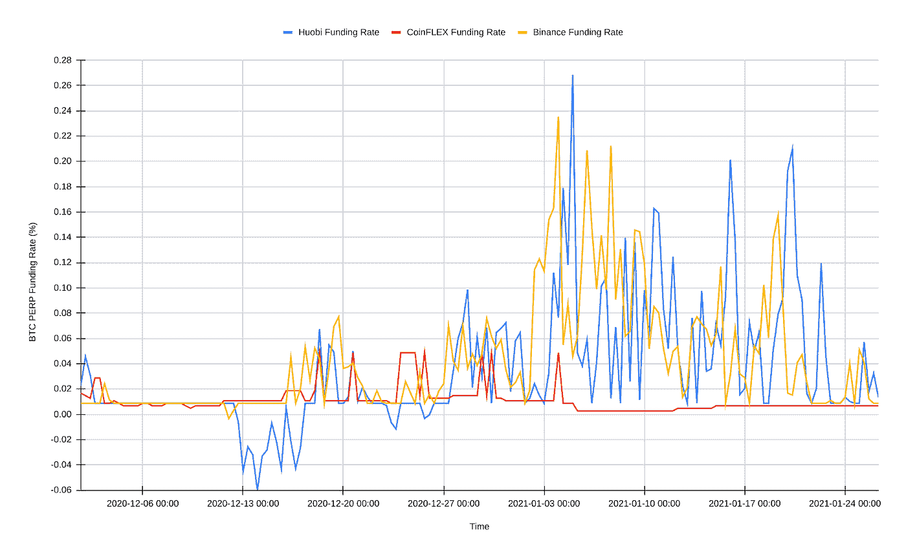
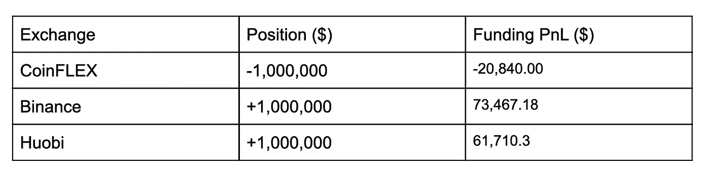
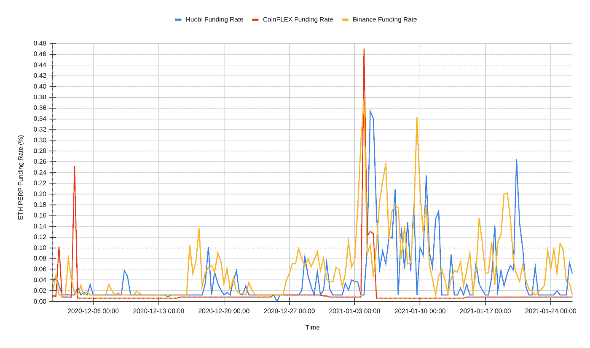
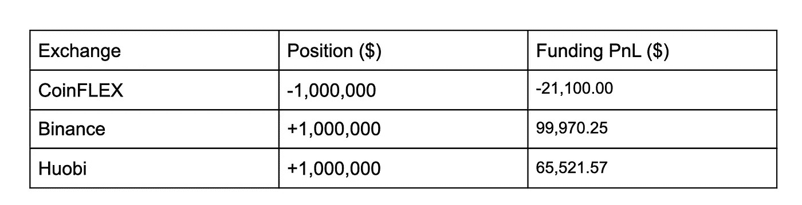

# 了解永久掉期融资套利

> 原文：<https://medium.datadriveninvestor.com/understanding-perpetual-swap-funding-arbitrage-7d07e31a7e13?source=collection_archive---------0----------------------->

本指南是一个阿尔法蜜罐，供希望在加密市场获得优势的做市商和算法交易员使用。

绝大多数加密衍生品交易所都有某种形式的 BitMEX 永久掉期合约，也就是人们所知的“perp”或“swap”。Perps 旨在模仿现货交易，同时还提供高杠杆(高达 100 倍)，他们通过实施 8 小时利率(融资利率)来实现这一点。融资利率通过奖励那些将罪犯拉向现货的人，惩罚那些将罪犯推离现货的人，来保持罪犯交易接近现货指数；一般来说，如果 perp > spot，那么多头将支付空头，如果 perp < spot then shorts will pay longs. Cash settled exchanges typically use some variation of the formula shown below to get the funding rate:

Funding Rate = Premium index + clamp (0.01% — Premium index, 0.05%, -0.05%)

To quote Binance, “the function clamp(x, min, max) means:

if (x < min), then x = min;
if (x > max)，那么 x = max
如果 max ≥ a ≥ min，则返回 x。

换句话说，只要溢价指数在-0.04%到 0.06%之间，资金利率就等于 0.01%(利率)。“这种回到 0.01%(多头支付空头)的趋势在整个现金结算加密衍生品领域都可以看到。

CoinFLEX 采取了不同的方法，因为 CoinFLEX 的 perps 是可交割的，交割的多头和空头数量可能会出现不平衡。这些不平衡在 CoinFLEX 的回购协议或“回购”市场中得到解决，在这些市场中，未偿多头/空头在荷兰拍卖中出售/购买，以满足交割。拍卖的清算价格成为融资利率，该利率适用于所有未交付的未结头寸。通过这种方式，CoinFLEX 的融资利率真实地反映了市场上加密和美元(USDC)之间的实际供需不平衡。

现在，我们对现金结算交易所和 CoinFLEX 的融资机制的差异有了一些了解，这就更容易理解为什么这些市场之间会出现融资利率的大幅变动。下图显示了 CoinFLEX 和两个流行的现金结算交易所上 BTC 和 ETH perps 的最近两个月的融资利率数据。

首先要注意的是，CoinFLEX 的融资利率远低于现金结算交易所。这是因为 BTC 回购市场的流动性和 USDC 银行愿意以更低的利率(4 %- 10% APY)放贷，这更能反映真实的供求动态。

现在，在融资利率 arb 上，通过这些数据点，我们可以计算出持有 CoinFLEX 上 100 万美元的 BTC 多头的成本，并将其与霍比和币安上 100 万美元的 BTC 空头的收益进行比较。

进入 200 万美元的名义对冲 BTC 交易(2 倍杠杆；1，000，000 美元的抵押品)将为您赢得 52，627.18 美元。在不承担任何方向性风险的情况下，APY 的回报率为 39.7%。同样的交易在火币上可以赚 40，870.3 美元，无杠杆的 APY 回报率为 29.8%。重要的是，这种交易可以根据你的需要上下浮动。

同样的分析也适用于以太坊罪犯。

进入 200 万美元的名义对冲 BTC 交易(2 倍杠杆；1，000，000 美元的抵押品)将为您赢得 78，870.25 美元。在不承担任何方向性风险的情况下，APY 回报率为 64 %。在 Huobi 上对冲的相同交易将为你带来 44，421.65 美元的净收益，APY 为 32.7%。

最后，CoinFLEX 的-0.02/0.03%的做市商/收市商费用表让这种交易变得异常多样化。它允许交易者以大约 0.00–0.02%的净费用进出头寸，同时从膨胀的现金结算融资利率中获利，并在 CoinFLEX 上支付较低的实物供应和需求驱动的融资利率。

免责声明:这不是财务建议。本文不提升/降级任何公司/项目。本信息或其他媒体中的观点、陈述、估计和预测仅属于作者个人。