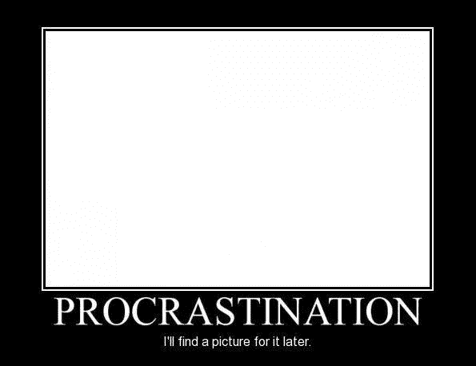

# 理解拖延症！！

> 原文：<https://medium.datadriveninvestor.com/understanding-procrastination-66f73d5eea74?source=collection_archive---------11----------------------->

# **成为拖延症的专家？你到底为什么要这么做？**

> 是不是有一种**似曾相识的感觉**萦绕着我们所有人？我们大脑中一个非常长的待办事项清单困扰着我们的感官，以至于我们似乎被一个高重力漩涡所控制，迫使我们想象一个逃离这场灾难的计划，甚至最简单的任务也变得难以应对。似乎很熟悉，对吗？即使在我撰写这篇文章的时候，我也对要提出和表达的观点感到困惑，这使我不得不推迟这篇文章，以后再处理它。当你与杂事和想法斗争的时候，完成事情会让人疲惫和虚弱。

## 拖延是不好的，这一点已经深入我们的灵魂**为什么还要接受它呢？**

历史上，它被认为是人类最大的生存本能。伟大的哲学家非常重视拖延。最聪明的领导人会一直思考，只有当他们有非凡的理由支持时，他们才会坐下来做一些事情。虽然拖延在许多人看来像是一种缺陷，但它在自然选择中进化是有原因的。

沉思的基因和冲动的基因是紧密相连的。我们那些拖延的祖先有更好的存活率，因为他们避免冲突，花更多的时间完善他们的工具，并在绝对必要的时候用它们做一些事情。因此，这些生存本能被传递给后代，并通过自然选择而高度进化。

也许拖延根本不是坏事，但正是这种压倒性的感觉助长了他们与之斗争的一种常见模式:完美主义-拖延-瘫痪循环。是我们的大脑不相信我们的计划。对许多人来说，以不完美的方式完成一项任务的想法可能足以成为说“算了吧！”这可能是一个精心设计的计划，有一个可能危及任务的小缺陷，所以我们的大脑进一步拖延它，直到完美。有些人可能会认为这是一种精神上的逃避，逃避生活中的艰难现实，这往往是不可避免的，会破坏一个人的自我价值，导致无休止的螺旋式下降。许多人把拖延和过度思考混为一谈，之前的一篇文章可能会有所帮助。那解决办法是什么？与其哀叹它，不如留心它。

 [## 过度思考者！！

medium.com](https://medium.com/datadriveninvestor/the-overthinker-b2f8badf7cb3) 

不管这种强迫感是来自对判断的恐惧还是你对自己的决定，这种紧张倾向于说服你，你不能做所有的事情，而且做得太完美了，那么这是否意味着无论如何你都不应该做任何事情呢？研究人员目前将其分为两个独立的类别:主动拖延和被动拖延。主动拖延意味着你意识到你在不恰当地拖延交项目或完成截止日期，但你却在做更有价值的事情。消极拖延就是无所事事，不做任何有成效的事情，这是一种担忧的迹象。虽然主动拖延可能有一些好处，比如它可以提高你的创造力，有时甚至可以导致 T2 优先化。消极拖延没有任何好处。

那么，如何阻止消极拖延战胜我们呢？打破这种循环的第一步是认识到，通常情况下，执行任务是一个缓慢的过程，而且是一个有缺陷的过程——这是正常的，绝对没问题的。这不会一蹴而就。慢慢来，慢慢来。需要一些时间和精力投入是可以的。犯错误是正常的(你总是可以在以后修复它们！).总而言之，做人还是可以的。

其次，试着让你的任务保持在一个小范围内。任务越小，产出越快，因此能源投入越少，完成任务的回报越高。当世界被智能设备所吸引时，成为制定智能目标的人，即(具体的、可衡量的、可实现的、相关的和有时限的)

第三，记录你的时间。**“一针及时省九针”。不要让磨磨蹭蹭影响了你。记录时间有助于理解任务要求，有助于建立现实的目标。它还可以防止过度劳累造成的疲劳。时间管理是所有锁的钥匙。**

最后，给自己积极的支持。超人有路易斯·莱恩，铁人有佩珀·波茨。所以，如果漫画界最强最富的人需要一个，你为什么不需要呢？呆在积极的公司有助于培养自信和自我价值。虽然生活中的消极因素会让你沮丧，但积极因素总是会让你朝着生活的光明面前进。

通常，当我们想要实现某些目标时，我们会将我们的期望和愿景与最终目标联系在一起，而不是与必须要走的旅程联系在一起。我们认为的成功只是冰山一角，重要的是少走的那条路，它仍然淹没在失败尝试的深不可测的海洋之下。这个旅程塑造了我们，释放了我们内心的兽性，在那时“我们成长为我们生活在其中的样子。”