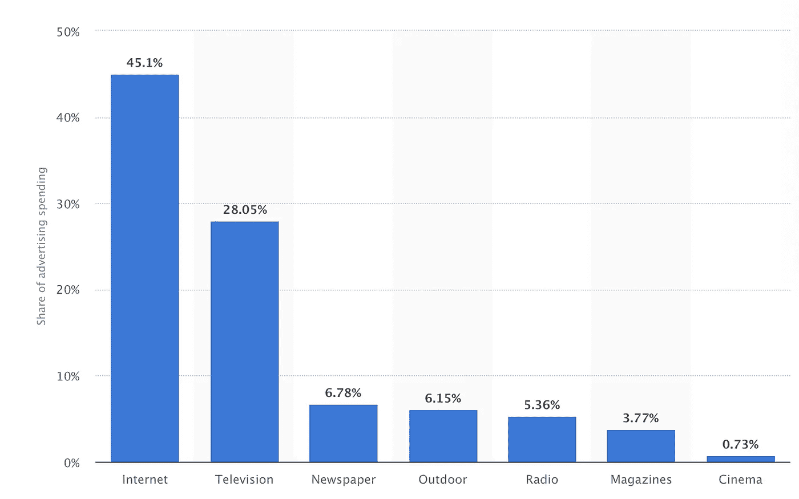
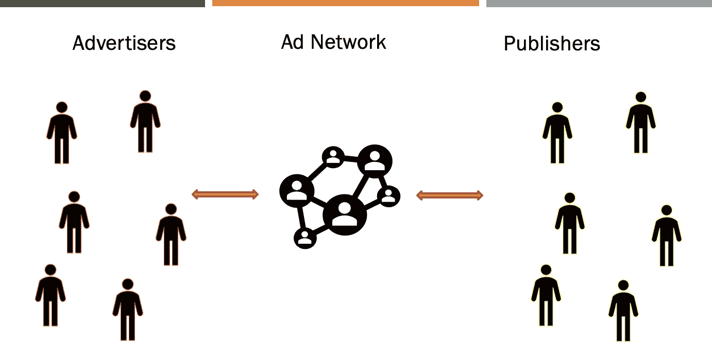
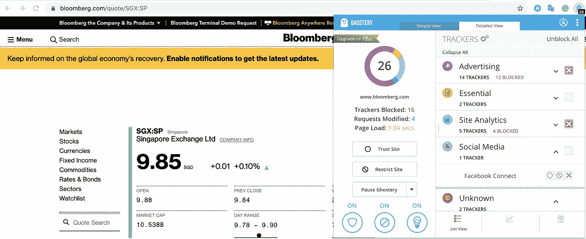
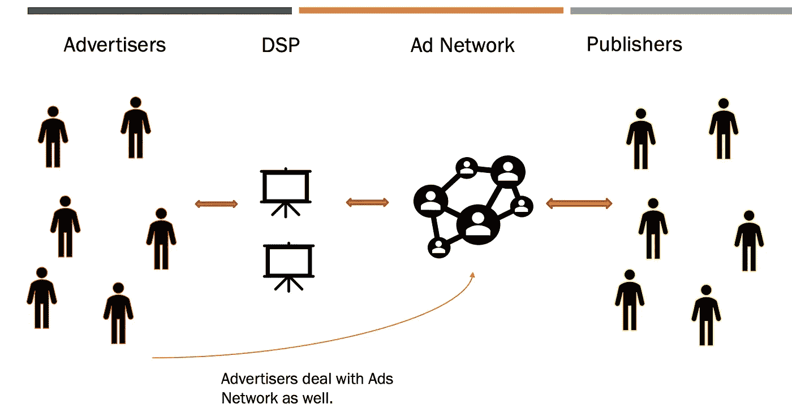
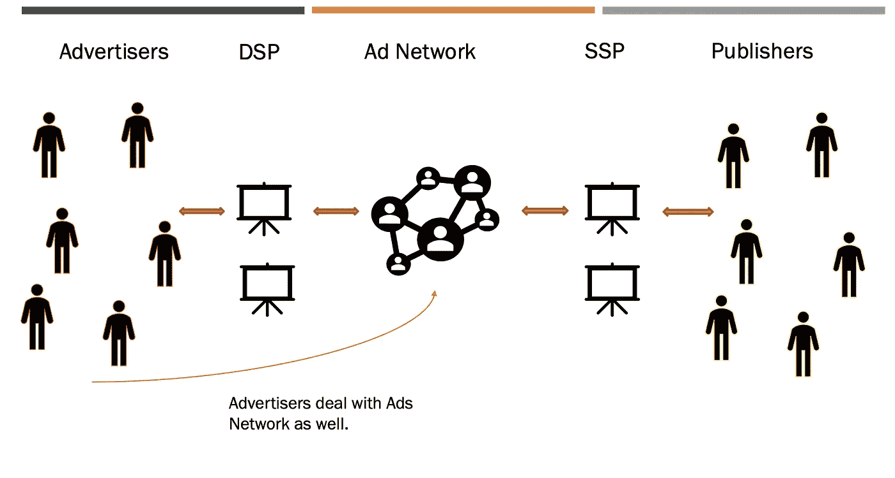

# 数十亿美元的广告业为免费互联网提供了动力

> 原文：<https://medium.datadriveninvestor.com/understanding-the-business-of-internet-e6c3f28b5f40?source=collection_archive---------4----------------------->

世界上最大的互联网公司(谷歌、脸书、Youtube、Twitter 等)是如何？)赚钱而不向最终用户收取任何费用？

你可能已经猜到了，这是**广告**。整个互联网广告行业超过 5000 亿美元。谷歌的市值约为 9000 亿美元，脸书约为 6000 亿美元。

> 据估计，大多数美国人每天接触大约 4000 到 10000 个广告！

以下是不同媒体渠道(互联网、电视等)展示的广告分类。).

© Statista 2020

> **脸书如何显示你添加到亚马逊购物车的商品或类似商品的广告？**
> 
> **为什么是脸书、谷歌、推特等。大广告是市场上的玩家吗？**

**广告网络:**

要回答以上问题，我们先来了解一下什么是广告联盟。

假设你有一个小游戏应用程序，想通过在你的应用程序上显示广告来赚钱。没有广告主会直接娱乐你这样的小游戏 app，那你怎么赚？对于像亚马逊、推特这样的大平台，他们可以**直接与广告商**交易。想要展示广告的平台被称为**发行商**(比如你的游戏应用)。一般来说，像亚马逊这样的大出版商有自己的销售团队，直接与广告商打交道。

现在，有数百万的发布者(大多是你访问的每一个网站/应用)想通过他们的平台赚钱。广告商直接从这么多出版商那里购买是不可行的。出版商接触这么多广告客户并与之打交道也是不可行的。出现了一个**广告网络**，它聚集了出版商。现在，出版商不再直接与广告商打交道，而是要求广告网络在他们的平台上展示广告。

Ad Network

像任何其他行业一样，广告也是关于需求和供给的:

1.  **需求** —广告主/购买方简称需求。他们是买方，因为他们从出版商那里购买库存(广告空间)。
2.  **供应** —发行商/卖方被称为供应。

是什么让脸书、谷歌、亚马逊、推特等成为市场上的广告巨头？

答案是**“数据”。他们了解你，并允许广告商锁定你。例如，**亚马逊允许广告商向所有男性展示广告，这些人居住在伦敦，年龄在 25 至 35 岁之间，在过去 6 个月中点击过李维斯牛仔裤，但尚未购买过它**。不仅仅是数据。你在这些平台上花费的时间，每日活跃用户的数量等等也很重要。**

这些公司还使广告商不仅可以在自己的广告空间展示个性化广告，还可以向与他们整合的其他出版商展示。他们都有自己的广告网络，由多家出版商订阅。使用谷歌关于用户的数据，谷歌可以有效地选择在特定时间向特定用户显示哪个广告。**所以，你在游戏应用中看到的广告毕竟不是随机的。**

> **为了让你知道它能有多大，目前有超过 100 万个应用和 200 万个网站在谷歌的广告网络上运行。它覆盖了互联网上大约 90%的人。谷歌保留了在出版商平台上展示广告所得收入的 30%左右。**

为什么你在谷歌搜索或在亚马逊添加到购物车的商品会在脸书或 Youtube 上显示为广告？

让我们假设这样一个场景，一个男性，住在新加坡，在亚马逊应用程序中添加了一个商品。当他打开脸书时，一则来自亚马逊或者 ***或者沃尔玛*** 的显示该商品或类似商品的广告出现了。这是一个非常常见的场景。

为了让脸书知道你在亚马逊的购物车中添加了一件商品，亚马逊必须与脸书共享这些数据。这是通过网站上的广告跟踪器和手机上的 SDK 实现的。亚马逊把你唯一的手机号码和你的购物车信息发送到脸书。现在，亚马逊在脸书上配置广告，向所有已经向购物车添加商品但尚未购买的用户显示广告(这被称为动态用户定位)。现在，当你来到脸书，使用你唯一的移动 ID，脸书搜索所有符合你行为的广告活动(男性，新加坡，在亚马逊购物车中添加一个商品 X)。亚马逊的广告活动符合标准。所以，它向你展示了亚马逊的广告。 ***有时候，你可能会看到不同电子商务公司(易贝、沃尔玛等)的广告。)当你在亚魔卓加入购物车时* n** 。在这里，事情变得非常有趣。通俗地说，这涉及更复杂的系统。

**奖励:**

如果你正在使用谷歌浏览器，并想知道在一个给定的网站中哪些追踪器是启用的，试试这个 [**浏览器扩展**](https://chrome.google.com/webstore/detail/ghostery-%E2%80%93-privacy-ad-blo/mlomiejdfkolichcflejclcbmpeaniij?hl=en) 。下面是在 bloomberg.com 启用的追踪器的截图。这仅仅意味着 bloomberg.com 集成了这些追踪器并发送你的数据。

祝贺你，如果你一直走到今天！看起来你想知道更多关于广告行业的事情。所以，给你！

## 实时竞价:

为广告支付固定价格对广告商来说没有意义。一个广告客户应该能够实时决定这个时候在这个平台上有一定行为的这个用户要付多少钱。这是为了使花在广告上的钱的价值最大化。实时竞价开始发挥作用，多个广告商基于不同的因素对广告空间进行实时竞价。例如，用户 X 来玩我的游戏应用程序，我想向该用户显示广告。我将为我的广告空间发出出售请求，任何想在我的平台上展示广告的广告商都可以参与进来，并提出一个投标价格。这就是所谓的实时竞价。注意，实时竞价必须在几毫秒内完成。它需要良好的技术来实现智能实时投标。

## DSP(需求侧平台) :

需求是指广告主端平台。这些平台帮助广告商管理多个平台上的多个活动，并获得更好的广告活动投资回报。这些平台支持的许多事情之一是实时竞价、频率上限(一天向特定用户显示多少广告)等。例如，脸书广告管理公司、DoubleClick(谷歌)、MediaMath 等。

为了更好地理解，想象一下像可口可乐这样的公司，它不是一家技术公司，它有一个很大的市场部，负责公司的市场营销。现在，为了实现实时竞价、与广告网络的整合等功能。它需要建立一个技术平台。DSP 提供了这方面的专业知识。因此，可口可乐转而与 DSP 打交道来处理其营销。【免责声明:我不知道可口可乐到底是怎么做的，只是举例而已】。可口可乐指定了它的活动目标、目标用户、最大预算、最高投标价和许多其他参数。现在，DSP 处理剩下的事情。

## SSP(供应侧平台) :

类似于 DSP，但适用于发行商。这些平台能够通过引入更高付费的广告或更相关的广告等来优化发行商的收益。例子包括 Pubmatic、double click for Publishers(Google)、InMobi、Media.Net 等。

我认为这已经是一个相当大的帖子了，但是还有很多其他的东西我还没有添加，我会在以后的帖子中尝试覆盖。感谢阅读！

**参考文献:**

1.  [https://www . Forbes . com/sites/forbesagencycouncil/2017/08/25/finding-brand-success-in-the-digital-world/# 5f 27 f 826626 e](https://www.forbes.com/sites/forbesagencycouncil/2017/08/25/finding-brand-success-in-the-digital-world/#5f27f826626e)
2.  【https://www.monetizemore.com/blog/best-app-ad-networks/ 
3.  [https://support.google.com/google-ads/answer/2404191?hl=en](https://support.google.com/google-ads/answer/2404191?hl=en)
4.  [https://www . statista . com/outlook/216/100/digital-advertising/world wide # market-revenue programmable](https://www.statista.com/outlook/216/100/digital-advertising/worldwide#market-revenueProgrammatic)