# 了解地面机器人和其他智能系统在新冠肺炎病毒爆发时对人类的帮助

> 原文：<https://medium.datadriveninvestor.com/understanding-the-ground-robots-and-other-intelligent-systems-that-come-to-humanitys-aid-during-a-7475bcf4ead5?source=collection_archive---------10----------------------->

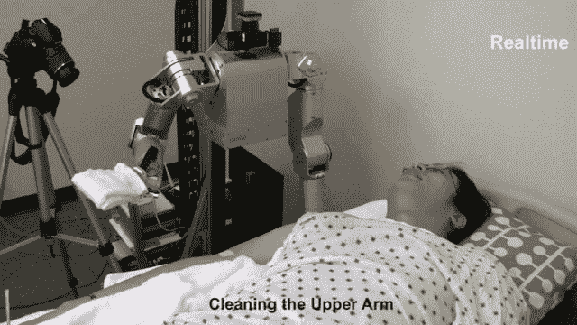

src: Georgia Institute of Technology

目前，随着新冠肺炎病毒的爆发，世界各地医院中的大多数患者都面临着感染该病毒患重病的高风险。建议免疫系统*弱、已有病症、年老*的患者尽量避免与其他人接触，做好预防措施。

护士、医生和其他医院行政人员是新冠肺炎的潜在携带者，因为他们接触到各种不同疾病的患者，在某些情况下还直接接触到新冠肺炎患者。

但是，医院里的病人仍然需要在没有暴露于病毒风险的情况下得到照顾和服务。

# 这就是机器人的用武之地。

> ***智能机器人特别有帮助，因为它们减少了病毒从一个人传播到另一个人的机会，特别是在像医院这样的高感染风险设施中。***
> 
> 他们限制病人与潜在的新冠肺炎病毒携带者接触。

智能机器人也很有帮助，因为它们让基本的医院服务得以继续。比如说-

*   运送药品
*   检查体温(最多 10 人同时进行)
*   净化房间
*   倒垃圾
*   在医院清除有害生物废物
*   送餐
*   运送医院的衣服和配件

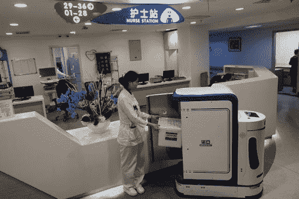

A robot in china delivering medicines imgsrc: Shanghai Children’s Hospital

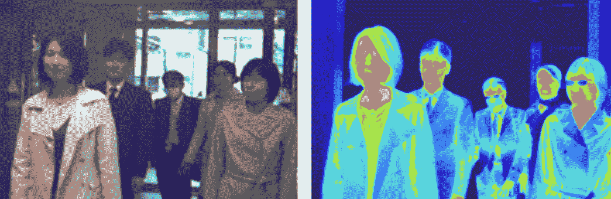

Infrared thermal cameras for body temperature and flu detection: These cameras are mounted on intelligent ground robots who are present in strategic points across the hospital and patrol around high traffic areas. imgsrc: avio infrared

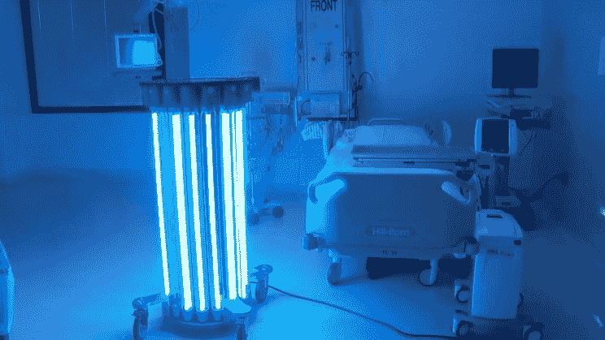

Robots equipped with Germicidal UV lights are also used to exterminate germs and sterilize ICUs. imgsrc: Infectionpreventiontechnologies

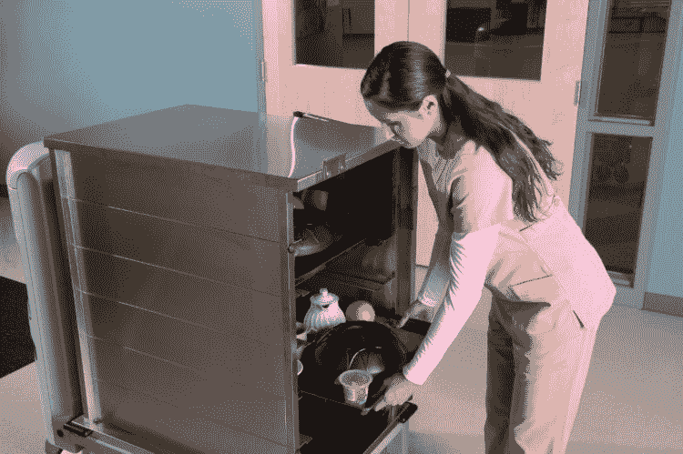

Mobile robot delivering meals to patients imgsrc: Aethon

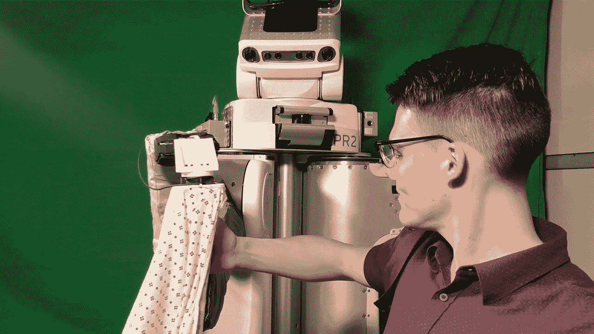

A mobile robot delivering clothes and helping out a patient with the hospital clothes/accessories Src: georgiatech

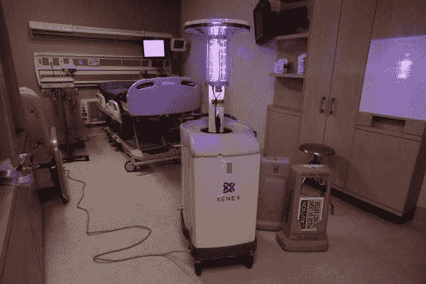

Mobile robot disinfecting hospitals imgsrc: stanford hospital

这种移动机器人的典型序列和高级系统架构:

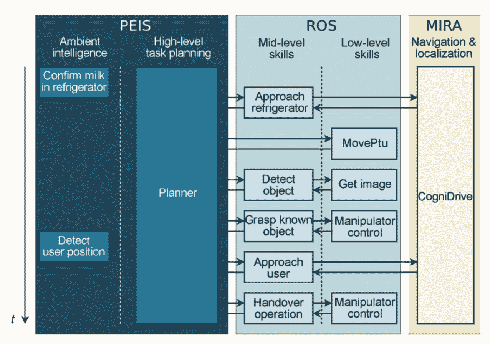

Src: Norman H et al, ‘Architecture and Software Design for a Service Robot..’

以上是医院使用的一些智能机器人的序列图示例。

这个序列的例子。当患者/医生提出请求(带牛奶)时，PEIS 的规划者调用 ROS 的接近冰箱功能，然后使用 MIRA 中的导航和定位模块，然后是检测物体功能，然后是抓取物体功能。在抓取对象(在本例中为患者提供牛奶)后，规划人员使用 MIRA 中的导航和定位模块接近用户。

对于上下文:

ROS:机器人操作系统是世界各地机器人使用的工具和库的汇编。它不是一个实际的操作系统。

PEIS:物理嵌入式智能系统(如传感器、执行器、摄像头等)。)

MIRA:用于机器人应用的中间件:它是一个用 C++编写的跨平台框架，为构建软件模块提供中间件和工具(src: Mira 官方网站)

中间件:作为操作系统/数据库及其应用程序之间桥梁的软件。

CogniDrive:由 MetraLabs 构建的软件，具有用于绘制环境地图、定位、路径规划和避免碰撞的组件。这个软件帮助移动机器人到达目的地。

# 在这种机器人上看到的不同类型的移动基座

三大常用移动平台底座:

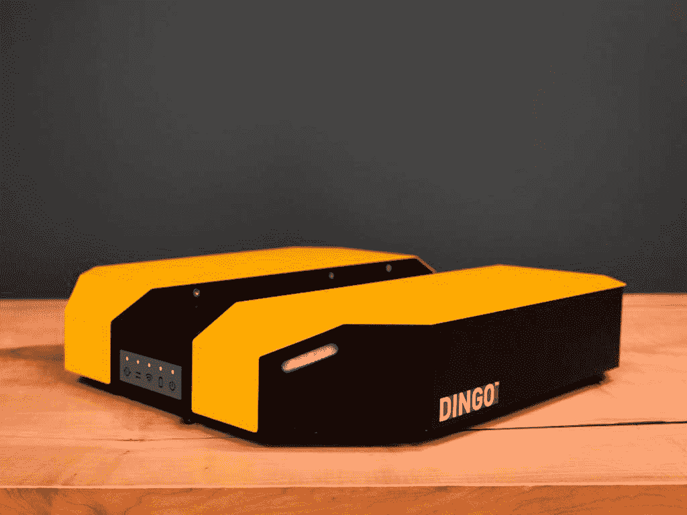

*   Clearpath 机器人公司的丁戈 D。

它很轻(仅重 9 千克),配有差速器。ROS 安装了 Dingo。它配有有效载荷安装系统，最大有效载荷可达 20 公斤！鉴于安装选项，它是战略性地设计为一个基地。

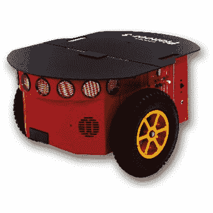

*   先锋 P3-DX 移动机器人-

鉴于其底盘由涂漆铝制成，它是一种较轻的移动平台机器人。它有一个差动驱动器，非常可靠。它的旋转速度为每秒 300 度，最高速度为 1.2 米/秒，是医院等高流量设施的理想选择！

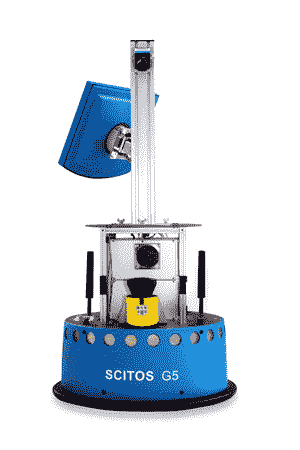

*   西托斯

Scitos 由德国 MetraLabs 公司建造，是最受欢迎的带差速器的移动底座之一。从图片中你可以看到底座覆盖着超声波传感器。这款机器人底座长时间运行 18 小时，充电时间 6 小时。考虑到长时间轮班的患者和医生的要求，更长的运行时间对医院来说是理想的。

# 在这种机器人上看到的不同类型的机械臂

机械臂用于拾取试管/样本、食物、毯子等。并把它们从仓库运送给医院里不同的病人。

*   **强力球轻量级手臂 LWA·4P**

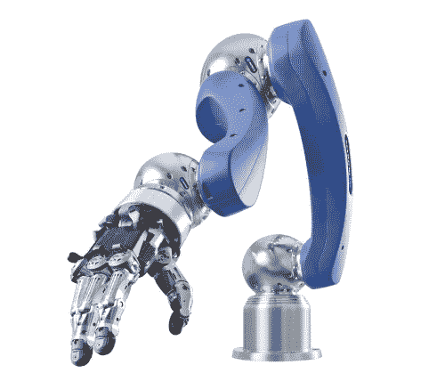

来自 Schunk 的这款轻型机械臂可以在不充电的情况下工作 8 小时。它具有高扭矩，也非常适合需要速度和精度的任务。

*   **LBR iiwa(智能工业工作助理)**

库卡机器人公司的这款机器人手臂是一款高性能的机器人手臂，带有对任何接触都很敏感的传感器。当它与人类互动时，这是一个伟大的机器人手臂，因为当与这个机器人接触时没有潜在的危险。这种手臂的有效载荷为 7 公斤，可以处理医院配件、膳食等。

*   **CR-7iA-L**

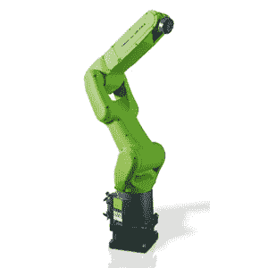

这是一个来自 FANUC 的六轴机器人。它通常与人类工作区一起使用，可以承载 7 公斤的有效载荷，非常适合用来拾取食物、长袍、药品、样品等。

*   **JACO**

这个机器人手臂是由 Kinova 制造的。虽然这个不能携带太多的有效载荷(只有 1.5 公斤)，但它是人类身边最安全的手臂之一。你在末端看到的 3 指末端效应器非常适合在医院里捡起苹果和管子之类的小物品。

# 这种机器人上不同类型的传感器

***红外热探测系统/体温探测器:***

这种探测器可以检测多人的体温。它们应该是灵敏的，可以检测到标准体温 96.8 华氏度(36 摄氏度)和发烧(38-39 摄氏度)100.4 华氏度及以上的人之间的差异。

此外，检测器考虑了皮肤偏移。皮肤偏移是皮肤温度与内部体温之间的偏移。这种抵消是由于皮肤的绝缘作用！

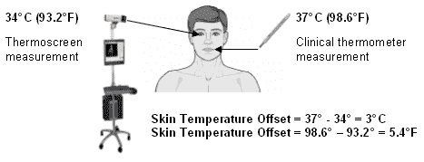

Img src : optotherm

TVS-200IS/TVS-500IS

它的精确度为 1.0°C，可以检测-10 到 60°C 之间的体温。

*   瓦尔热警报成像仪 HSI2000S

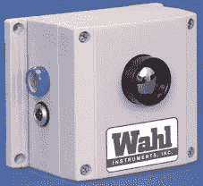

该器件在+20°C 至+50°C 范围内的精度为±2°C，在-10°C 至+150°C 范围内的精度为±5°C。

*   前视红外热像仪 A20M

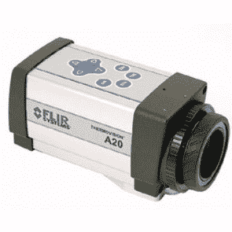

FLIR 的精度为 2，工作温度范围为-4 至+482°F(-20°C 至+250°C)。这种设备是即插即用的，它有一个智能警报装置，一旦检测到有人发高烧，就会响起来。

*   OptoTherm Infrasight IS640

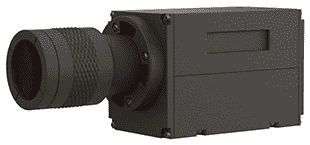

Optotherm 提供灵敏度为 0.05°C 的交钥匙解决方案；0.3°C 精度。这是市场上最可靠的产品之一！

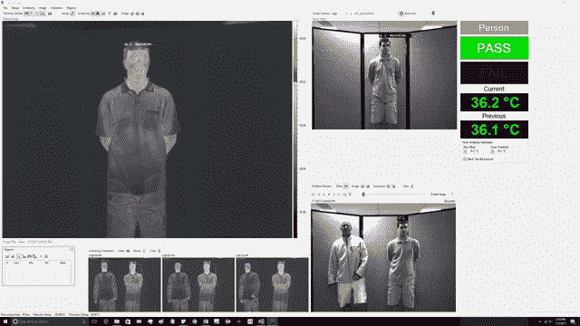

发热检测软件截图 src: OptoThermw

***用于物体检测的摄像机***

最常见的物体探测摄像机是-

*   小精灵

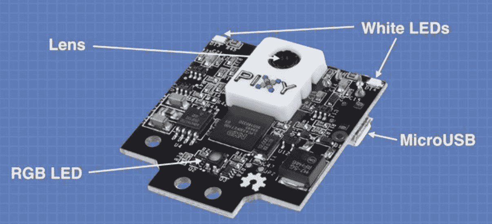

Pixy 是市场上最实惠的相机之一，内置了物体跟踪和识别算法

*   Presenceplus Proii 摄像机

这款相机由 BANNER ENGINEERING CORP .制造，是一款紧凑型相机，即使机器人上的可用空间较小，也可以安装。这种相机通常用于物体检测、模式识别等。

*   PixeLINK

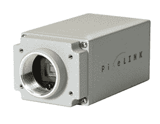

这是用于物体探测的高端摄像机之一。这有 660 万像素的分辨率。

***RGB-D 传感器和手势感应***

*   Xtion Pro

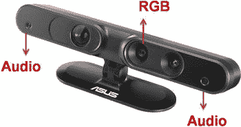

这种即插即用传感器用于检测医院中的人。使用这个生成 3D 点云。该传感器还用于人体手势检测和语音控制。

*   微软 Azure Kinect DK

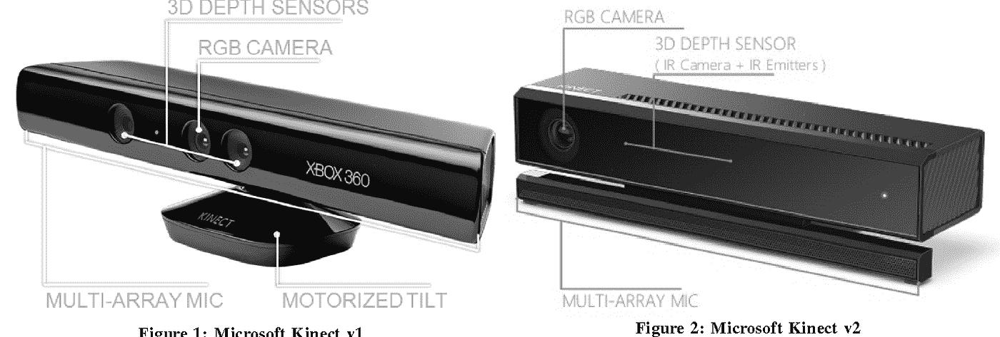

微软 Kinect 是许多机器人研究人员的热门选择。这用于人体检测(身体骨骼检测)、语音识别和手势识别。

***激光扫描仪***

*   W1005N(I)防撞激光雷达

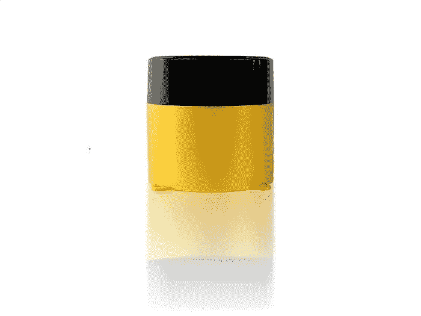

你可能会在很多机器人上安装这样的激光雷达。这个特别的是自动化地面机器人的流行选择。它允许在 270 度内有 5 米的探测范围。

*   HPS-3D160 固态激光雷达

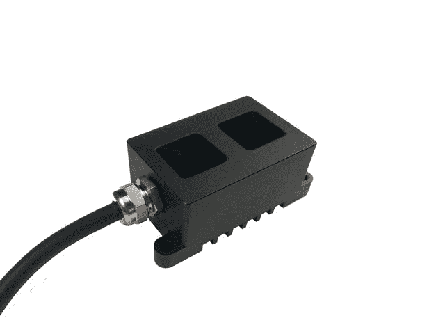

这台激光雷达的测量范围可达 15 米，视场为 76 x 32。

***杀菌紫外线灯:***

*   科尔帕默紫外线灯

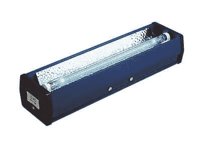

这种紫外线灯通常安装在机器人上的 6 个包装中，用于净化充满细菌的房间。这个过程大约需要 20-30 分钟。这种光甚至会在墙壁上反弹，到达房间内任何医疗设备的背面。

# 这种地面服务机器人经常使用的主要算法

*   SIFT 算法

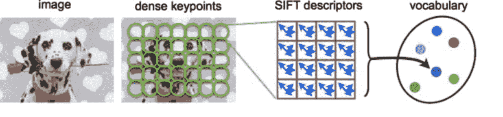

OpenCV 中的 SIFT 算法用于大多数地面机器人的目标检测。这些算法检测医院中机器人可能需要抓住的大量物体——饭菜、毯子、管子等。

*   猛击

SLAM 或同步定位和绘图(SLAM)由机器人用来创建它们周围的地图，并知道它们在该地图中的位置。有几种 SLAM 算法:kf-slam，rbpf-slam，icp-slam

最常用的 SLAM 算法

-Rbpf-slam: Rao-Blackwellized 粒子滤波(Rbpf)是 slam 现在做的主要方式之一。

*   迭代最近点(ICP)。该 SLAM 算法仅适用于 3D 和 2D 激光扫描仪，不适用于 1D 或声纳

# 所以在一天结束的时候，

如果你看到自己在追求机器人技术，这篇文章会让你了解在医院看到的智能服务机器人。

服务机器人行业目前正在起飞，未来几年对具有机器人背景的人将有更高的需求。服务机器人在病毒爆发时拯救生命，所以这样的职业将是有回报和有意义的！

正是像这样的智能服务机器人将站在人类抗击新冠肺炎病毒和任何其他未来病毒爆发的前线！