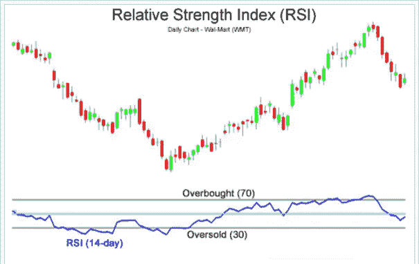

# 了解相对强弱指数(RSI)

> 原文：<https://medium.datadriveninvestor.com/understanding-the-relative-strength-index-rsi-a22f84a52ab8?source=collection_archive---------12----------------------->

这个指数能帮你分析股价走势吗？

Picture via Wikipedia.org

## **动量振荡器**

相对强度指数(RSI)被归类为动量振荡器。一个词中的动量意味着速度，因为飞机在停机坪上滑行时聚集了动量。但这还不是故事的全部。势头也意味着力量。所以比较一下一辆时速 95 英里的汽车和一个时速 95 英里的快球。这辆车比棒球更有动力。所以我们不仅有速度，还有速度背后的推动力。

在股票市场分析中，振荡指标在两个设定值之间波动。当振荡指标上升，触及或突破上限时，这向技术人员表明股票超买——买家太多，卖家太少。当振荡指标接近、触及并穿过下限时，情况正好相反——卖家超过买家，股票超卖。

## **相对实力指数**

RSI 作为一个动量振荡器，测量价格运动的速度和力量。它通过测量较高收盘价与较低收盘价的比率来实现这一点。随着这一比率的跟踪，比率较高的股票比比率较低的股票更强。通常 RSI 是以 14 天为单位，用 0 到 100 来衡量。指标水平通常为 70 和 30。这些价值由个人投资者自行分配。

## **RSI 的开发和使用**

J. Wells Wilder 在他的书《技术交易系统的新概念》中概述了 RSI。意识到当价格快速上涨时，迟早会回落，怀尔德试图找到一种方法，在转折点即将发生时发出信号。当然，反过来也可能是一件有利可图的事情。下跌的股票价格可能最终会回升。

怀尔德开发了 RSI 来衡量股票价格最近的交易强度。RSI 的斜率可以显示趋势变化的速度。此外，他认为 RSI 和价格运动之间的不一致(他称之为背离)是市场转折点的一个强有力的指标。因此，如果价格创出新高，但 RSI 没有，则出现背离，怀尔德认为这是一个转折点即将到来的强烈迹象。他称之为看跌背离。相反，当股价创出新低，但 RSI 没有，他称之为看涨背离。

## **RSI 的修改**

安德鲁·卡德韦尔对怀尔德的原著进行了几处修改。他注意到持续的上升趋势通常停留在 RSI 40 到 80 之间。下跌趋势通常保持在 20 到 60 之间。

在评论看跌背离时，Cardwell 发现这只是一个短暂修正的信号，而不是趋势的真正逆转。他得出结论，看跌背离证实了持续的上涨趋势。这与怀尔德的理论直接冲突。同样，Cardwell 从理论上认为，看涨收敛证实了下跌趋势的持续，而不是指向一个转折点。

## **RSI 的局限性**

技术人员在分析 RSI 时会看到其他信号，例如反转和交叉，从业者使用 RSI 的方式也各不相同。大多数人认为 RSI 不应该是一个独立的指标，最好与其他技术指标结合使用。

真正的趋势反转信号很少，很难与假警报区分开来。例如，一个假阳性将是一个看涨交叉，随后是股票的突然下跌。假阴性是指出现熊市交叉，但股价突然加速上涨。

由于 RSI 指标显示动量，当一只股票在两个方向都有显著动量时，它可以长时间保持超买或超卖。因此，RSI 在股价在看涨和看跌之间交替的振荡市场中最有用。

重复一遍:RSI 最好与其他指标结合使用。单独使用它会提供太多错误信号。