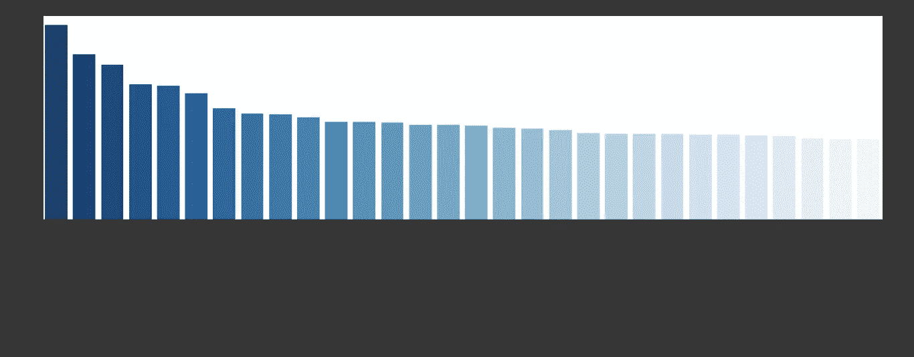
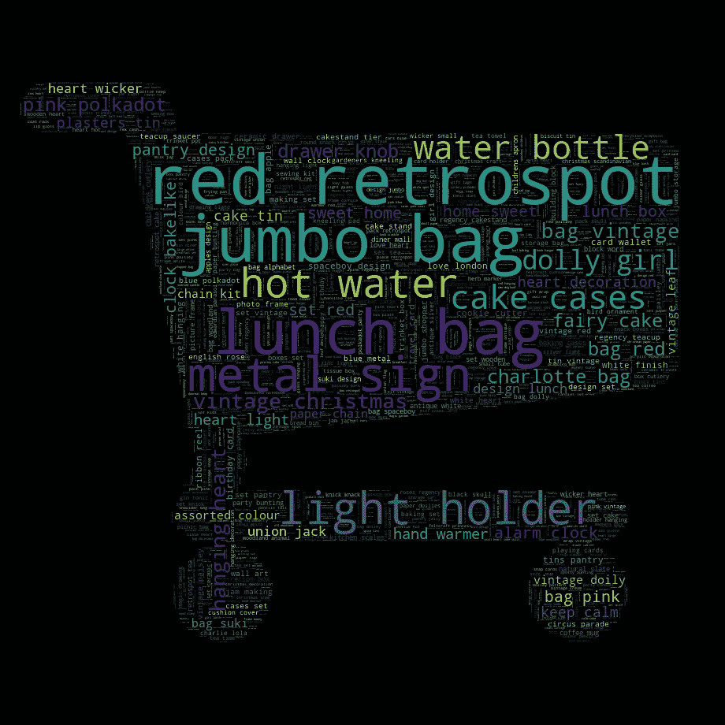
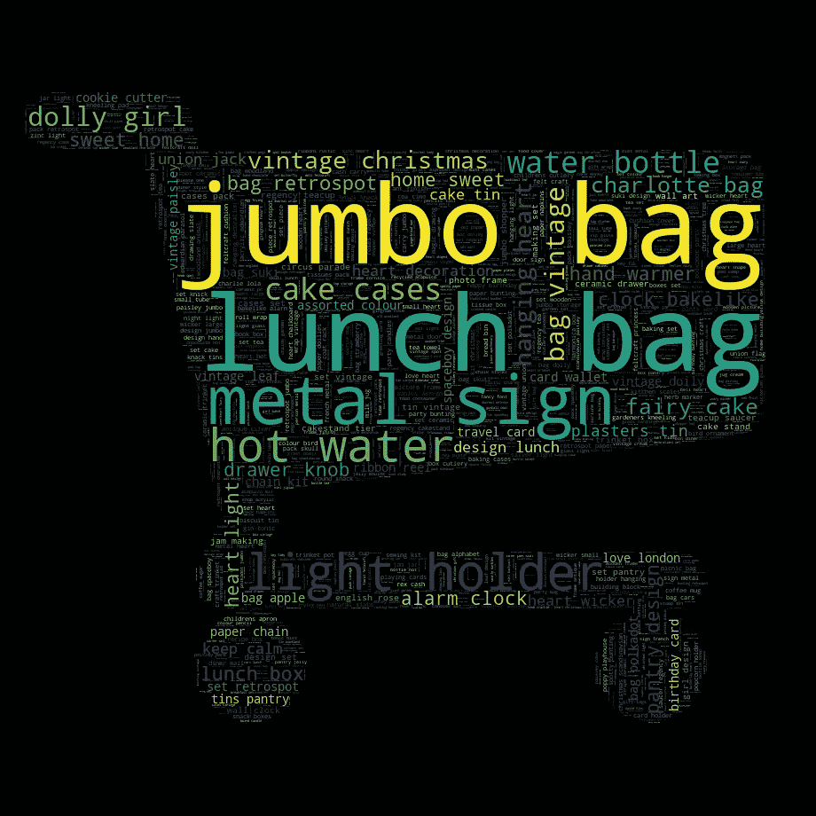
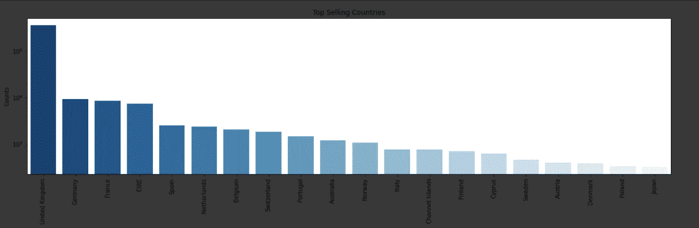
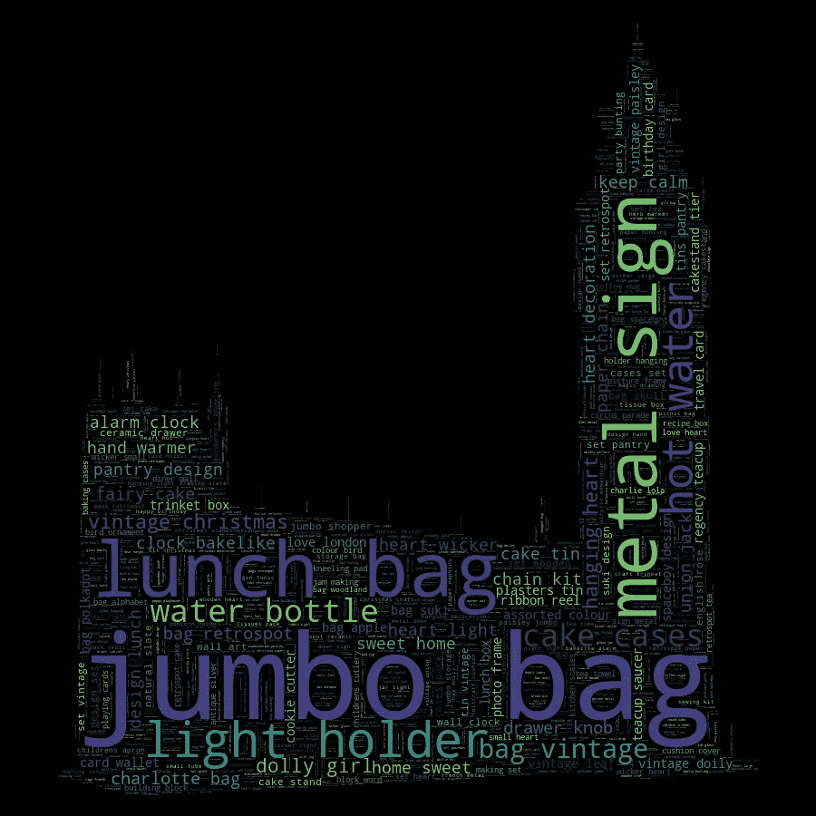
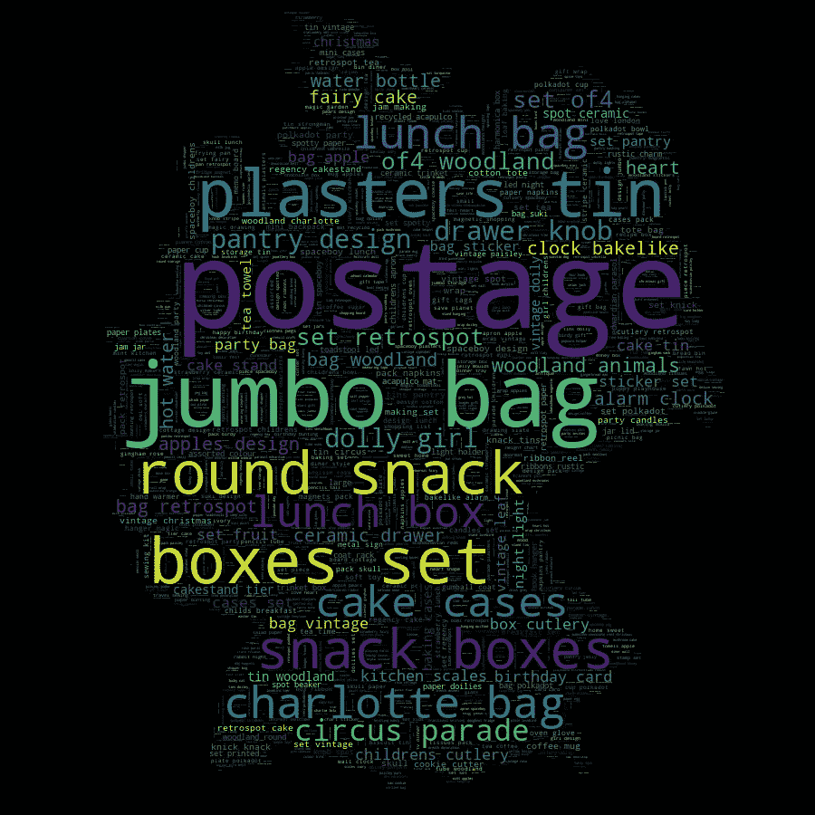
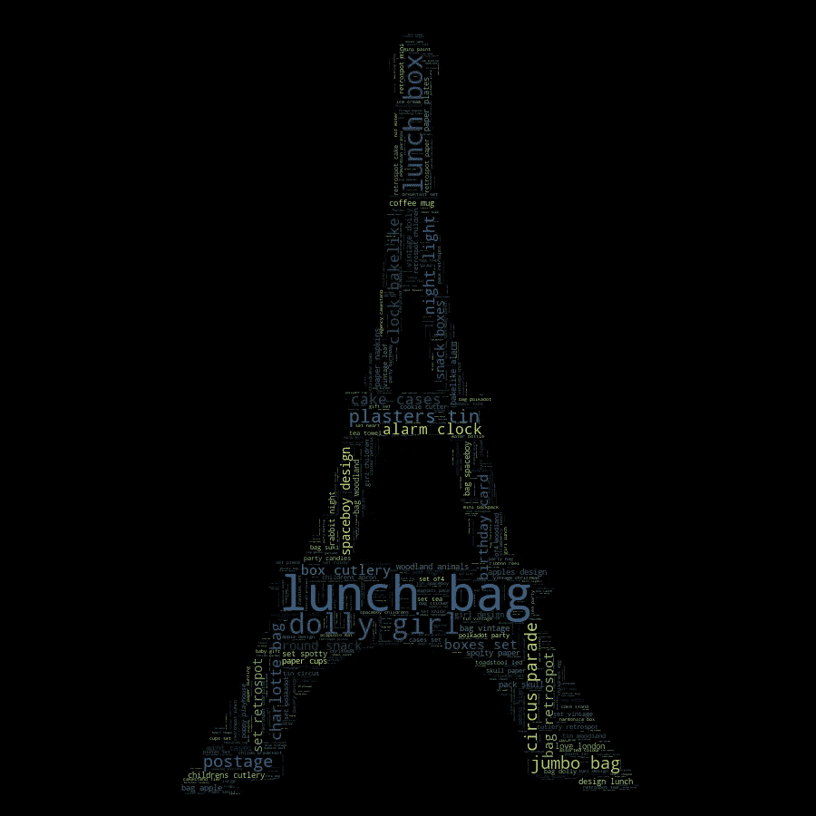

# 使用 NLP 了解您的客户

> 原文：<https://medium.datadriveninvestor.com/understanding-your-customers-with-nlp-929771ae2d0b?source=collection_archive---------7----------------------->

如何使用基本的 NLP 技术来更好地了解你的客户？


本文是**客户细分**项目的一部分。我将项目分为 3 个部分:

*   [**时间序列预测与预言家**](https://medium.com/@rafaelnduarte/sales-forecast-using-prophet-99bf9ad93fbc)
*   [**用 K-Means 进行 RFM 客户细分**](https://medium.com/@rafaelnduarte/rfm-customer-segmentation-using-k-means-6fa5f72604c)
*   [**用 NLP 了解你的客户**](https://medium.com/@rafaelnduarte/understanding-your-customers-with-nlp-929771ae2d0b)

确保你检查了项目的所有其他部分！在这里 可以找到 **NLP** 部分代码的链接 [**。**](https://colab.research.google.com/drive/1CHPEvQ7h43YBMiScttRjEXQV3WbZeB_t)

# 自然语言处理

在现实生活中，我们一直在和自然语言打交道，也就是我们的共同语言。

但是我们如何从商业角度利用这些数据呢？

我们可以用这个做很多事情:

*   **营销策略**
*   **产品选择**
*   **客户细分**
*   **市场识别**

和许多其他可能性。这里就不深究 **NLP** 了。我们的数据仅限于产品描述，它们的书写方式没有给情感分析、前缀、后缀等留下太多空间。

因此，我们可以在频率上努力，更好地了解我们最畅销的产品和我们最大的市场。

# 数据

我们在这里使用的数据，在 [**Kaggle**](https://kaggle.com/) 上提供，来自一家英国零售商，包括购买日期和时间、数量、单价、购买目的地国家和产品描述。我们将重点讨论后者。

# 入门指南


首先，让我们采取一种更正统的方法，绘制一些条形图，看看在寻找我们的**畅销产品**时，我们会得到什么。

```
# checking top selling products
description_counts = df_clean.Description.value_counts().sort_values(ascending=**False**).iloc[0:30]
plt.figure(figsize=(20,5))
sns.barplot(description_counts.index, description_counts.values, palette='Blues_r')
plt.ylabel("Counts")
plt.title("Top Sellers");
plt.xticks(rotation=90);
```



Top-Selling Products

# 我们能让这个更有趣吗？

当然可以！为此，让我们使用**字云**。单词云的概念基本上是将单词收集在一个列表中，然后将它们绘制在一个图上，最常用的单词比最不常用的单词绘制的比例更大。

然而，我要在这里加一点酱，对云这个词使用遮罩，让它们看起来更有趣。让我们看看进展如何。

首先，我们必须收集单词并设置停用词。停用词是像介词、冠词之类的词，它们非常频繁，但并没有给我们任何有价值的信息。

在这里，我还将为停用词添加颜色，因为我们感兴趣的是项目本身，而不是颜色。不过，我会给你看一个有颜色的单词云，这样你就可以看到它是如何变化的。

```
*# importing necessary packages*
**from** **PIL** **import** Image
**from** **wordcloud** **import** WordCloud, STOPWORDS, ImageColorGenerator*# preparing words for wordcloud*
all_descriptions = " ".join(d **for** d **in** df_nlp['Description'])

*# stopwords*
stopwords = set(STOPWORDS)
stopwords.update(["red","blue", "green", "white", "black","pink"])
```

现在我们准备好出发了。让我们开始吧。

```
*# creating a mask*
ecommerce_mask = np.array(Image.open("/content/cart_inverted.png"))

*# creating a new wordcloud*
wordcloud=WordCloud(stopwords=stopwords,
                    background_color="black",
                    width=1000, height=1000, max_words=2000,
                    mask=ecommerce_mask, max_font_size=200,
                    min_font_size=1).generate(all_descriptions)

*# plotting the wordcloud*
fig, ax = plt.subplots(figsize=(10,10));
ax.imshow(wordcloud, interpolation='bilinear');
ax.set_axis_off();

plt.imshow(wordcloud);
wordcloud.to_file('cart_wordcloud.png')
```

以下是我们公司最畅销产品的“云”一词，包括描述中的颜色:



Word Cloud with Colors.

这是没有颜色的云这个词。你会看到一些项目发生了变化，在第一个项目中，我们有许多与颜色相关的项目。例如，第一张图片中最大的那个甚至不在我们的条形图中。让我们把重点放在物品上，放松颜色。



Word Cloud without Colors.

# 了解市场

太好了！记住这一点，让我们也检查一下我们的客户在哪里。在我们的数据探索中，我们发现这家公司销售到 37 个不同的国家。但是什么是最好的市场呢？让我们找出答案。

```
*# top selling countries*
country_counts = df_clean.Country.value_counts().sort_values(ascending=**False**).iloc[0:20]
plt.figure(figsize=(20,5))
sns.barplot(country_counts.index, country_counts.values, palette="Blues_r")
plt.ylabel("Counts")
plt.title("Top Selling Countries");
plt.xticks(rotation=90);
plt.yscale("log")
```



Top-Selling Countries

毫不奇怪，该公司所在的国家英国排在第一位。

为了使数据更容易理解，这张图是对数标度的。在非常远的第二名，我们有**德**，其次是**法**。

让我们来看看这三个国家。

```
*# preparing the data*
countries = df_nlp.groupby('Country')

*# separating the data by country*
uk = countries.get_group('United Kingdom')
ger = countries.get_group('Germany')
fra = countries.get_group('France')

*# preparing words for wordcloud*
uk_descriptions = " ".join(d **for** d **in** uk['Description'])
ger_descriptions = " ".join(d **for** d **in** ger['Description'])
fra_descriptions = " ".join(d **for** d **in** fra['Description'])
```

# 英国

先说最大的市场，他们的祖国，英国。

```
*# UK wordcloud*
*# creating a mask*
uk_mask = np.array(Image.open("/content/london_bg.png"))

*# creating a new wordcloud*
wordcloud=WordCloud(stopwords=stopwords,
                    background_color="black",
                    width=1000, height=1000, max_words=2000,
                    mask=uk_mask, max_font_size=200,
                    min_font_size=1).generate(uk_descriptions)

*# plotting the wordcloud*
fig, ax = plt.subplots(figsize=(10,10));
ax.imshow(wordcloud, interpolation='bilinear');
ax.set_axis_off();

plt.imshow(wordcloud);
wordcloud.to_file('uk_wordcloud.png')
```



UK Word Cloud.

我们可以看到**大本钟**向我们展示一些我们的老朋友，比如**巨型包、午餐包、灯座、水瓶、蛋糕盒**等等。

既然我们谈论的是我们公司最大的消费市场，他们引领潮流也就不足为奇了。

# 德国

作为我们的第二大市场，看看德国人从我们这里买什么东西应该很有趣。

```
*# Germany wordcloud*
*# creating a mask*
ger_mask = np.array(Image.open("/content/berlin_bg.png"))

*# creating a new wordcloud*
wordcloud=WordCloud(stopwords=stopwords,
                    background_color="black",
                    width=1000, height=1000, max_words=2000,
                    mask=ger_mask, max_font_size=200,
                    min_font_size=1).generate(ger_descriptions)

*# plotting the wordcloud*
fig, ax = plt.subplots(figsize=(10,10));
ax.imshow(wordcloud, interpolation='bilinear');
ax.set_axis_off();

plt.imshow(wordcloud);
wordcloud.to_file('ger_wordcloud.png')
```



Germany Word Cloud.

太好了！我们可以在这张德国地图上看到一些我们以前见过的单词，以及一些新单词。我想强调一下**邮资、橡皮膏罐、抽屉把手、夏洛特包、马戏团游行、快餐盒**，以及一些有趣的**林地**。

继续前进。

# 法国

作为第三大市场，这将是我们现在要分析的最后一个市场。

让我们看看他们在做什么。

```
*# France wordcloud*
*# creating a mask*
fra_mask = np.array(Image.open("/content/eiffel_bg.png"))

*# creating a new wordcloud*
wordcloud=WordCloud(stopwords=stopwords,
                    background_color="black",
                    width=1000, height=1000, max_words=2000,
                    mask=fra_mask, max_font_size=200,
                    min_font_size=1).generate(fra_descriptions)

*# plotting the wordcloud*
fig, ax = plt.subplots(figsize=(10,10));
ax.imshow(wordcloud, interpolation='bilinear');
ax.set_axis_off();

plt.imshow(wordcloud);
wordcloud.to_file('france_wordcloud.png')
```



France Word Cloud.

漂亮！埃菲尔铁塔向我们展示的是，法国消费者更像德国人，而不是英国人，他们有很多共同语言。

# 结论

**自然语言处理**比我们在这里做的要多得多。这只是冰山一角。

即使有我们现有的数据，还可以做更多的事情。

请记住，单词云很有趣，也很漂亮，但也很棘手。有了一个字云，并不能让其他探索变得没有必要。你必须能够理解和解释你的词云。

但是，我们的目标是对我们的数据有一个简单、快速而全面的概述，这样我们就可以致力于我们的两个最重要的目标:

*   [**RFM 客户细分**](https://colab.research.google.com/drive/1NEpuPYEtRo2rV80NU-DhgQ4OBbP4aAic)
*   [**销售预测**](https://colab.research.google.com/drive/1jHJ0T7nWFHE1tH9Xh2xMNbjoL8vhls9q)

请务必检查这个项目的其他部分！

# 谢谢大家！

感谢您的时间和关注。我希望这是一个信息丰富和有趣的项目。如果您有任何问题或任何类型的反馈，请随时在 [**LinkedIn**](https://www.linkedin.com/in/rafael-n-duarte/) 上联系我，并在 [**GitHub**](https://github.com/rafaelnduarte/portfolio) 上查看我的其他项目。

