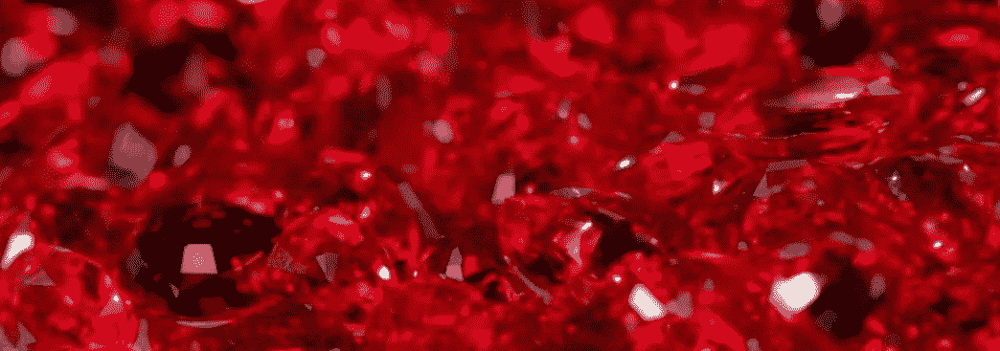
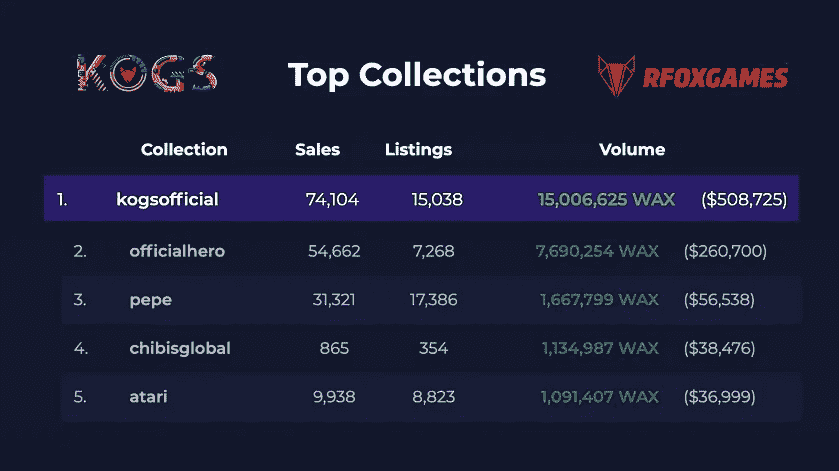
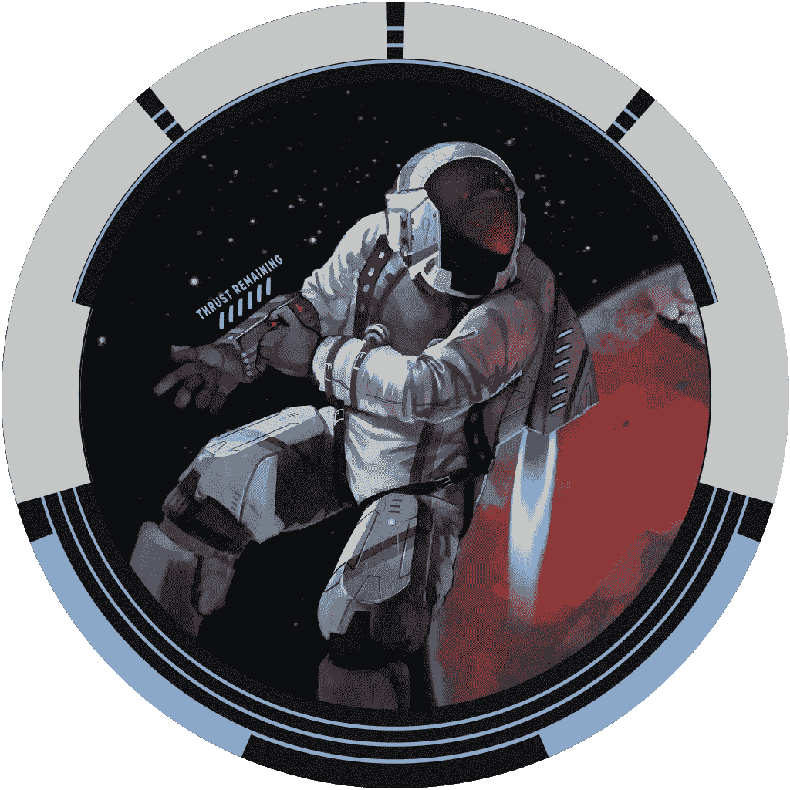
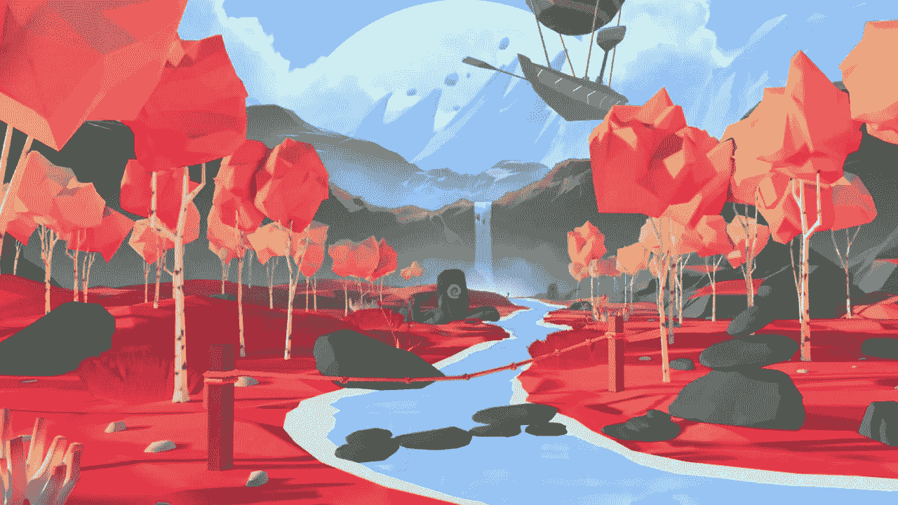
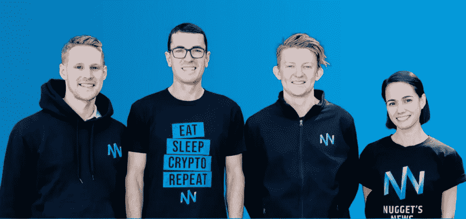

# 出土的隐密宝石准备东山再起

> 原文：<https://medium.datadriveninvestor.com/unearthed-crypto-gem-poised-for-resurgence-6e27924048b3?source=collection_archive---------13----------------------->

## 另一个“提前”进入的机会

你并不总是有第二次早期发现的机会。无论是股票、加密货币还是不可替代代币(NFT)的集合，我们许多人在游戏中很晚才知道某些资产。

但幸运的是，一种特殊的加密资产在飙升至历史高点之前大幅下跌，最终又跌回了地面。但是这种自由落体是有意的——稍后会详细说明。

现在，在我解释为什么我如此看好一个鲜为人知的项目之前，你要知道:

我的研究并不妨碍你进行自己的研究。我只是翻译网上免费提供的信息，没有资格提供投资建议。我持有里面提到的令牌，这篇文章仅用于教育和信息目的。快乐的宝石狩猎！

B ack 今年 7 月，我透露了为什么我认为 [**RedFOX Labs**](https://www.coingecko.com/en/coins/redfox-labs) 将成为区块链和区块链游戏行业领导者的细节。只是不要叫他们区块链公司！

RedFOX Labs 是一个创业工作室，而不仅仅是一个无人问津的区块链网络运营商。这个项目不仅仅是分布式分类账:

 [## 一便士之下隐藏的加密宝石—第 1 部分:红狐实验室

### 超越价格，展望未来

blog.goodaudience.com](https://blog.goodaudience.com/hidden-crypto-gems-under-a-penny-part-1-redfox-labs-15da5a908cb9) 

该项目的原生加密资产——RFOX 币(现在是 ERC20 代币)——当时以 0.01 美元的价格交易*。然而，我们在这里谈论的是加密。如果你已经生活了一段时间，你就会知道行业发展的速度比光还快。*

换句话说，随着时间向前跨越几个月，很多事情都发生了变化。RFOX 硬币在 10 月份从不到 1 美分攀升至超过 0.20 美元，这只是等式的一部分。

但这还不足以描述还发生了什么。我们有很多要讨论的——非常成功的产品发布会，以 10:1 空投为特色的代币互换，新的 [**Blackpaper**](https://docsend.com/view/a2kfkrmgcmwvs2rq) 和 gaming[**litepoaper**](https://docsend.com/view/kei5r6jgb6i9si93)，新的交易所上市，等等。

或许最能说明问题的是最近对比特币传奇人物本尼的采访。在这个让一家初创公司成功的坦诚一瞥中，你会发现大量关于*为什么* RedFOX 做出具体商业决策的信息:

[https://youtu.be/Z-lk1QpFhZc](https://youtu.be/Z-lk1QpFhZc)

# 排行榜首位

RedFOX Labs 的突出特点之一是它的使命是制造真实世界的产品。作为一名风险建设者，复制创收业务是项目的 DNA。

而该项目的游戏工作室， [**RFOX Games**](https://www.rfoxgames.com/) ，最近刚刚按下开始键。该工作室首次涉足视频游戏——[**其他游戏的钥匙**](https://www.kogs.gg/)——凭借其自身的实力成为一鸣惊人。

有趣的是，甚至还没有一款*游戏可以玩。就目前而言，所有的一切都是关于购买、出售和交易 NFT，以预期未来会发生什么。*

但是这个月的目标是改变这一切。根据 [**KOGs 路线图**](https://www.kogs.gg/roadmap) ，十二月将带来游戏的测试版，一个赌注程序，加上王朝的第二版 NFTs。

在 8 月份推出后，该游戏的可收集代币在 WAX 区块链最丰富的二级市场 AtomicHub 上迅速蹿升至 [**【第一】的位置**](https://www.kogs.gg/keys-to-other-games-rocket-up-the-nftcharts) 。

AtomicHub sales figures as of November 21, 2020

在撰写本文时，KOGs 的销售额几乎是其最接近的竞争对手的两倍。很容易理解为什么收藏家们对第一版如此狂热。

首先，有一款游戏即将推出——备受争议的校园经典游戏 POGs 的数字翻拍版。虽然大多数其他 NFT 只是用来盯着看，但 kog——地理法律允许——让玩家在赢家通吃的在线比赛中挑战敌人。

有赌博。还有锦标赛。最重要的是，顾名思义，kog 是解锁游戏内物品(如皮肤)的令牌，还可以进入特殊级别和比赛。

更不用说，这些 NFT 都很华丽。尽情欣赏这款极其罕见的尤物:

KOGs — Keys to Other Games —NFTs trade on AtomicHub

一旦游戏推出，新的观众意识到有一个 [**第一版来收集**](https://kogs.atomichub.io/market) ，我们很可能会看到对第一版的需求大幅增加。KOGs。

> NFTs 完美地概括了在区块链网络上运行视频游戏的主要好处。

区块链游戏项目是不可变的，易于认证，并且所有者可以在支持的游戏之间转移。加上阻止欺诈者的能力，区块链游戏是未来主流游戏还不知道它需要的。

不，分散式游戏不像游戏机或电脑上的集中式游戏那样完美和耀眼。但是，用双关语来说，游戏中物品的所有者是游戏规则的改变者。

但 RedFOX 肯定不是只会一招的小马。区块链游戏只是一个超大拼图的一部分…

# 返现和直播应用

KOGs NFTs 的迅速成功加上对推出视频游戏的不懈关注，迫使 RedFOX 的 [**返现和奖励应用**](https://www.redfoxlabs.io/livestreaming-into-the-future-of-ecommerce) 退居其次。

Launching in 2021 — Rewards-based livestreaming

好消息是它已经完成了。商家到位，，app 功能齐全。现在的问题是分配资源给它插上翅膀。

由于这款应用成功通过了团队的 9 点漏斗——这决定了一项风险投资是否值得——这款应用*应该*从一开始就能盈利。

该团队的最终目标是创建一个装载了可互操作的产品和服务的超级 dApp，用 RFOX 令牌支撑整个生态系统。

 [## 出土加密宝石蓄势待发|数据驱动的投资者

### 你并不总是有第二次早期发现的机会。无论是股票，加密货币，还是收藏…

www.datadriveninvestor.com](https://www.datadriveninvestor.com/2020/12/17/unearthed-crypto-gem-poised-for-resurgence/) 

# 大互换

尽管 RedFOX 并不认为自己是一家区块链公司——这太局限了——但它有一个投资者群体需要照顾。

[Image Credit](https://unsplash.com/@firmbee)

10 月下旬，该团队暂时停止了集中交易所交易。流动性和 p2pb2b 交易所的所有硬币——当时交易价格约为 0.22 美元——因预期会有代币互换而被冻结。

为什么突然拉地毯？以防止任何人在以 10:1 的比率将硬币换成代币时获得优势。RFOX 币持有者可以(并且 [**仍然可以**](https://www.redfoxlabs.io/rfox-token-swap-currently-underway) )获得 **10 个 RFOX 代币用于每枚 RFOX 币的交易**。从百分比来看，这一事件对持有者非常有利。

> 由于 RFOX 代币最大供应量的调整，那些持有硬币的人现在拥有相当于 2.5 倍的代币。

这枚硬币的市值为 5 亿英镑。代币的上限是 2B——增长了 4 倍。因为硬币持有者现在有 10 倍的数量，所以 10 除以 4 得到 2.5。

例如，如果一个硬币账户曾经持有最大供应量的 1%，那么相应的代币账户现在持有 2.5%。

这种高水平的深谋远虑完美地展示了团队对支持其令牌长期价值主张的奉献精神。

现在，由于 RFOX 令牌运行在最常用的区块链网络之一以太坊之上，令牌可以在**(加上 [**液体**](https://www.redfoxlabs.io/the-fastest-method-for-trading-rfox-coin) 和澳大利亚的 [**硬币点**](https://www.coinspot.com.au/buy/rfox) )上自由交易，更多的交易正在进行中。**

# ****虚拟未来****

**2021 年，大块的红狐狸馅饼将会出现在虚拟世界中。**

****

**RedFOX is replicating its headquarters and building a virtual marketplace inside [**Decentraland**](https://redfoxlabs.io/redfox-labs-to-mirror-its-vietnam-hq-in-decentralands-crypto-valley/)**

**2020 年的疫情加速了我们数字生活的多个方面。我们现在知道在家工作的经济能取得多大的成就。此外，随着我们在家的时间越来越多(也越来越多)，我们会积极寻求新的体验。**

**今年视频游戏时间绝对爆炸式增长——这并不奇怪。在数字世界里进进出出，哪怕只是一次几分钟，都是很平常的事情。**

**像**这样的虚拟虚拟世界是那些寻求暂时逃离现实世界的人的理想环境。不仅如此，疫情还迫使某些行业隐藏起来——比如音乐会行业——但虚拟空间可以帮助它们获得自由。****

****除了其越南总部的复制品，RedFOX Labs 目前正在分散地的 Crypto Valley 地区建立一个市场。****

****想象一下，看到你最喜欢的音乐家在虚拟空间里现场演奏，周围都是你的粉丝。现在想象一下，在一个虚拟的购物区里订餐，送货上门。****

****DCL 内部一切皆有可能，定制总部目前正在建设中。此外，按照 RedFOX 的商业方法，*货币化*严重影响了虚拟布局的设计选择。****

# ******澳大利亚的人脉******

****很难找到一个成功的项目不是由一个积极和支持的社区推动的。RedFOX 也不例外，他们的大部分观众来自 AU。****

****拥有澳大利亚联合创始人当然也没有坏处，但最新一波的 RedFOX faithful 是由 Alex Saunders 和来自 [**Nugget's News**](https://nuggetsnews.com.au/) 的研究团队带来的。****

********

****The researchers at Nugget’s News are bullish on RedFOX Labs****

****在过去的两年中，RedFOX Labs 的首席执行官多次做客 Alex 的加密和金融播客，包括三个月前的这个 [**区块链游戏采访**](https://youtu.be/3bB39Gtftvs) 。****

****但是真正吸引 Alex 进入 RedFOX 生态系统的是最近与 Coinsilium 和 IOV 实验室的 的 [**合作。**](https://www.redfoxlabs.io/redfox-labs-signs-mou-with-coinsilium-iov-labs-jv)****

****你知道，RedFOX 团队选择在越南开店有很多原因。东南亚拥有年轻、懂技术的人口，是世界上增长最快的移动经济的所在地——去年数字支出超过 1000 亿美元。****

****然而，SEA 的大多数公民无法获得基本的货币服务，包括信贷、保险和投资产品。数百万人现在坐在飞速发展的数字经济的边缘——高达 74%的 SEA 人口。****

****RedFOX 与 Coinsilium 和 IOV 实验室合作，打算通过为东南亚市场创造**数字包容性**产品和服务来改善这一高得吓人的统计数据。简而言之，你可能不需要传统的银行账户或信用评分来使用 RedFOX dApp。****

# ****总结****

****对于错过了 RFOX 过去几个月强劲上涨势头的人来说，10 月份的代币互换就像一个巨大的重置按钮。过去是 20 多美分，现在在 2 到 3 美分之间。****

****随着区块链视频游戏即将推出，再加上非常成功的 NFT 系列的新版本，12 月对这个项目来说是一个巨大的月份。****

****但是这些激动人心的事件与明年的事情相比可能会黯然失色。不要睡在 RedFOX Labs 上(*又是*)——它的未来正在迅速展开。****

## ****访问专家视图— [订阅 DDI 英特尔](https://datadriveninvestor.com/ddi-intel)****