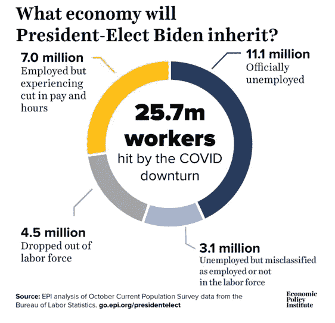

# 失业数字继续令人困惑

> 原文：<https://medium.datadriveninvestor.com/unemployment-numbers-continue-to-confound-371a76ce2043?source=collection_archive---------16----------------------->

Edwin Hooper — Unsplash

## 劳工部报告称有 1100 万人失业，但 10 月份有 2100 万人申请失业救济

去年春天开始的疫情对经济的巨大冲击也对政府机构准确处理数据的能力产生了巨大影响。官方的失业数字来自一项询问人们就业状况的调查。在疫情早期,“休假”员工的模糊性以及政府对企业援助的参数要求企业保留员工以获得资金，这导致了错误分类，很快被认定为 310 万英镑的分配错误，但从未进行调整。然而，这 310 万人与头条新闻报道的 1100 万失业救济人数相差甚远。上周，政府问责局(GAO)承认失业数据存在问题，称:

*“劳工部(DOL)发布的每周新闻稿没有提供实际申请失业保险(UI)的个人总数的准确估计，因为他们可能高估或低估了实际申请失业保险的个人总数。”(**链接到高* *)*

该报告解释了不准确的一些过程原因，但它没有提供对真实失业人数的任何估计，也没有提供如何纠正未来的计算。这为阴谋论者提供了肥沃的土壤，他们可以将这些问题描述为要么完全是由数十亿美元的保险欺诈造成的，要么是出于政治原因故意操纵就业报告。然而，这很可能是因为在一个由旧技术组成的复杂系统中解决数据问题是一件非常困难的事情。此外，当解决方案暴露了经济中一个深层次的系统性问题时，解决数据问题几乎是不可能的，在选举年的政治氛围中，没有人愿意听到这个问题。

经济政策研究所(EPI)上周发布了一份分析报告，估计受疫情不利影响的工人总数超过 2500 万，这揭示了整体失业率和失业救济金之间的差异。尽管他们的估计甚至超过了 2100 万的失业保险索赔，但这两个最大的团体在帮助理解报告中的差异方面大有帮助。这也暴露了经济中的痛苦和政府补救措施的不足。报告中的细目如下:

 [## 利用区块链构建可持续循环经济|数据驱动投资者

### 自从工业革命开始以来，全世界都关注产品的生产和消费。很少或…

www.datadriveninvestor.com](https://www.datadriveninvestor.com/2020/11/17/building-sustainable-circular-economy-with-blockchain/) 

o**1150 万——官方失业数字—** 这是标题失业数字，每个月都在增加，似乎实际上回到了“正常”…除了就业市场非常**没有**回到正常。

o **3.1 百万** — **由于“休假”或其他不符合就业或失业调查定义的模糊状态而被归类为就业的未领工资**员工

o**700 万** — **减少工作时间或降低工资**——这些人中的许多人符合部分失业的条件，可能占 1000 万失业人口的很大一部分。这也可能是政府对企业援助计划参数的副产品，该计划要求企业在目标日期前维持最低工资。在许多情况下,“休假”员工的工资可能足以使企业有资格获得贷款豁免，在一些城市，员工还可能有资格获得部分失业。

o **4.5 米——退出劳动力**。人们完全退出劳动力市场的速度令人难以置信，这是我们从未见过的衰退。通常失业数月后，我们才会看到退出劳动力市场的人数激增，但由于疫情的性质，这是立竿见影的。对于不熟悉失业率计算的人来说，这可能看起来很奇怪，当人们完全离开劳动力时，这实际上使失业率看起来更好。他们不被认为是“想要”工作的人，所以他们没有被计算在内。当然，在当前的 Covid 世界中，对“上周你积极找工作了吗？”这个问题的回答是否定的意味着与疫情之前不同的东西。许多人，尤其是从事服务业的人，都很清楚没有工作可做，因为他们的雇主关门了，或者缩减了运营规模，而且随着美国许多地区的学校关闭，“在家工作”根本不是数百万人的选择，尤其是那些处于经济阶梯最底层的人。

随着国会就下一代财政方案展开辩论，我们有必要务实地审视之前的方案取得了哪些成果。要做到这一点，最可靠的方法是用无偏见、无党派的事实。事实是，之前的行动在稳定资本市场方面做得非常出色，为大型企业提供了进入这些市场的最佳途径，为金融体系注入了流动性，推高了资本资产价格，并为失业者提供了临时支持。另一方面，它在遏制公共卫生危机、支持小企业和拯救就业市场免遭就业不足和失业(尽管毫无意义的失业率表明了什么)方面做得非常糟糕。1000 万美国人的失业生命线将在 12 月底结束，尽管购买力平价对许多企业都有好处，但我们现在知道它对遏制失业几乎没有作用。随着疫苗即将问世和选举的结束，也许我们可以专注于一个解决方案，跳过政治和意识形态的姿态，转而资助一个解决我们公共卫生危机的方案，以便所有企业可以可持续地重新开业，人们可以安全地重返工作岗位。

## 获得专家视图— [订阅 DDI 英特尔](https://datadriveninvestor.com/ddi-intel)