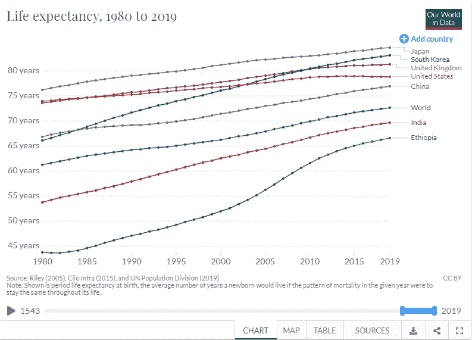
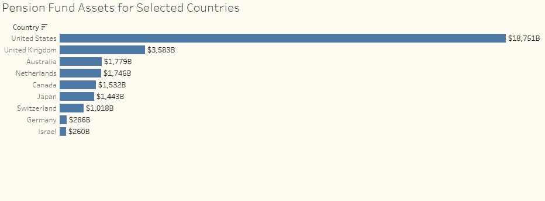

# 无准备金的养老金负债

> 原文：<https://medium.datadriveninvestor.com/unfunded-pension-liabilities-ee5acd5c6f91?source=collection_archive---------3----------------------->

在冠状病毒引发的衰退之外，还有一个较小的危机正在逼近。无准备金的养老金负债正在失控膨胀，威胁着金融体系未来的稳定。

**总结**

本文的目的是透视公共和私人养老基金的状况，说明资金缺口有多深，考察未来的风险，并探索如何解决这一混乱局面。这种方法是全球性的，因为危机在许多国家普遍存在，但大多数例子都是基于美国，因为数据容易获得。

# **设定受益计划与设定提存计划**

固定福利(DB)计划规定了员工在退休时或退休期间有权享受的福利。这个计划是根据工人应得的利益来制定的。这些都是有问题的，因为该计划承担投资风险。固定缴款(DC)计划没有规定福利，而是规定了退休前的缴款。工人承担投资风险，必须明智地选择计划。

大多数私募基金已经从 DB 基金转移到 DC。然而，大多数公共基金仍然是 DB 基金，尚未转换为 DC 基金，因为由此产生的公众压力和缺乏政治意愿，即使大多数承诺的收益高得离谱，基金在未来将无法支付。

 [## 如果资本主义失败了，那么还有什么选择呢？数据驱动的投资者

### 在当前政治领域的修辞之旅中，我们都可以面对面地接触到流行词汇，如…

www.datadriveninvestor.com](https://www.datadriveninvestor.com/2020/03/16/if-capitalism-is-a-failure-then-what-is-the-alternative/) 

当 DC 基金转换为 DB 基金时，在新成员作为 DC 参与者加入时，通常会遵守对早期员工的承诺。因此，许多基金仍然对过去承诺的固定收益心存疑虑。

虽然 DC 基金将投资风险从基金转移到工人身上，但它们不一定能确保满足退休需求，而退休需求是设立退休基金的唯一目的。无论如何，他们确保退休需求不会被完全覆盖，因为从本质上讲，他们会遭遇缴款不足以及风险回报年龄分布不匹配的问题。公司根据其感知的长期盈利水平捐款，个人根据其薪酬水平和当前生活费用捐款。缴款与个人退休后的期望预算无关。个人退休后的基本退休生活方式以及关于寿命的精算假设可以使用适当的贴现率贴现到当前日期，以获得负债的现值。如果对 DC 计划的所有参与者都这样做，我们可能会观察到负债现值和资产现值(包括未来设定缴款)之间的巨大差距

很多时候，无论是什么贡献都不足以满足基本的退休生活方式。因此，我们仍然有一个无基金养老金的问题，尽管是在个人层面而不是基金层面。这个问题不会消失。它只是被转移了。它隐藏在大众看不见的个人资产负债表中。

另一个群体也加入了进来。数百万人没有任何退休计划，也没有私人资产来保障他们的退休生活。这些群体的退休生活方式将不得不由某人以某种方式资助。

# **公共养老基金的状况**

这些主要是 DB 计划。公共养老基金是政府确保所有雇员为退休储蓄的一种尝试。这是一项崇高的努力。然而，政府一如既往，不太擅长处理事务，任何这方面的事务，包括政府活动，如发放身份证、边境管制、税收和维持治安。

对于大多数公共养老基金来说，其负债的现值远远超过其资产的现值。这一缺口代表无准备金负债。以下因素导致了资金无着落的状况:

*   **糟糕的投资选择** —这是新兴市场公共养老基金的经典案例。公共养老基金充当了政府事实上的储蓄账户。这些养老基金在道德上被说服投资于国有企业，并支持政府成为美国国债发行时的最后买家。除了低质量资产的问题之外，这些基金的投资组合也不够多样化。例如，管理南非政府雇员养老基金(GEPF)的南非公共投资公司(PIC)被劝说投资于南非国家电力公司和 SAA，这两个实体几乎无法在私人债务市场融资。如果没人愿意借给南非国家电力公司和 SAA，PIC 为什么要这么做？理由是它是一个公有实体，应该为公众利益服务。这有待讨论，但养老基金本身的结果很糟糕；低质量资产的低回报。
*   **过于丰厚的福利**——一些人选择在政府部门工作只是为了养老金福利。承诺的养老金福利或承诺的供款过于慷慨。慷慨是一件好事，但政府没有能力兑现这些承诺。最近捐款一直很低，而支出却在不断增加，这扩大了资金缺口。
*   **寿命延长**——人们的寿命比以往任何时候都要长，也比计划的要长。人们正在耗尽他们的积蓄。精算师使用的预期寿命比我们目睹的 2000 年后人类的预期寿命要短。此外，随着新技术延长寿命，目前对寿命的假设也可能被证明是错误的。

让我们看看 3 个国家关于公共养老基金状况的轶事证据。

这篇来自彭博的文章称，一些州的资金比率低至 38%，这意味着资产只能覆盖 38%的养老金负债。

**南非** — [这篇来自 News24 的文章](https://www.news24.com/citypress/business/bad-investments-leave-pension-fund-with-shortfall-of-r583bn-20190325)称，GEPF 目前达到了最低资金水平，但面临着 5830 亿兰特的长期资金缺口，部分原因是糟糕的投资决策。

中国——[这篇来自 SMCP 的文章](https://www.scmp.com/economy/china-economy/article/3005759/chinas-state-pension-fund-run-dry-2035-workforce-shrinks-due)声称，随着劳动力的减少，中国的国家养老基金可能会在 2035 年枯竭。由于独生子女政策的影响，中国的问题有点特殊。中国的人口控制实验导致了现在一代人只有一个孙儿，而他们现在不得不赡养 4 个祖父母。当前生产性劳动力的规模越来越小，而退休和即将退休的人口规模越来越大。

可悲的无资金支持的状态在许多国家都很普遍。电晕病毒加剧了这种情况。

# **私人养老基金**

这些基金主要是 DC 基金。其中大部分是公司赞助的计划。它们通常比公共养老基金管理得更好。然而，供资水平低于免疫未来养恤金负债所需的水平。

*   低贡献度——公司在资助员工退休计划方面不够慷慨。大多数小企业的财务状况不允许他们这样做。
*   **薪酬下降** —从 80 年代至今，生产率的提高很大程度上已经转移到了股东和高管身上。工资停滞不前，而生活费用却飞涨。全世界的员工都在努力使收支平衡，并依靠债务生存。当目前的基本需求都没有得到满足时，一个人如何为退休储蓄？为退休储蓄成为一种奢侈品。这才是真正的问题。教育、食品、住房和交通占据了很大一部分收入。进入新千年以来，食品价格一直在上涨。对于买不起普通房子的普通工人来说，房价高得离谱。学生贷款和汽车贷款的偿还时间越来越长，因此大多数新加入劳动力大军的人无法更早开始为退休储蓄。

# **打破投资和精算假设**

先前对几个变量的假设是非常错误的。全球化、医学进步和资本市场环境的变化粉碎了所有关于养老金资产和负债的假设。

*   **年回报率下降** —养老基金认为资本市场将继续提供较高的回报率(7%至 10%)，主要投资于债券。债券不再提供这种回报，例如美国 10 年期国债的收益率低于 0.69%。大多数基金现在都在追逐高收益信贷市场 7.5%的回报率，这显然会让资金面临风险。
*   **保守的风险指令** —大多数风险指令与低回报的现实和资金严重不足的可能性并不同步。60/40 法则、滑动法则、核心卫星法等。都被打破了。
*   **寿命增加**——如前所述，由于技术进步，对寿命的精算估计一直是错误的。在 80 年代，人们预计在 55 岁或 60 岁退休，然后活到 75 岁左右。

Life Expectancies have migrated northwards for almost all countries. Source: Our World in data.

以日本为例，1980 年人均寿命为 76 岁。2019 年的预期寿命是 84 岁。增加了 8 年。这些年是没有计划的，必须有人来资助。如果一个养老金领取者超出了他的储蓄，作为一个充满爱心和人道的世界，我们不能让他们死去，因为他们不再能够为他们的生存提供资金。我们集体挑起重担。

# **负债驱动型投资、利率敏感性和久期匹配挑战**

80 年代，银行开始将资产(贷款组合)与负债(存款和长期融资)结合起来管理，以最大限度地降低错配风险。他们成立了 ALCO 委员会。养老基金在 90 年代采用了这种方法。退休后期望的或预算的生活方式基本上被视为一种负债。

负债驱动型投资是最大限度降低资金不足风险的关键。在负债驱动投资下，负债是给定的，资产是管理的。

大多数退休或接近退休的人的投资组合主要是债券组合。这种选择是出于对流动性、票息收入和低风险的偏好。债券投资组合对利率非常敏感。基金经理“对冲”投资组合以保值。要做到这一点，资产必须和负债放在一起看。资产价值必须与负债价值同步变动。

对冲问题的本质是负债(预算退休生活方式)不像资产(债券投资组合)那样对利率敏感。免疫策略试图确保资产在任何时候都与负债大致相等。

负债的现值取决于贴现率，贴现率通常是一个利率，资产的现值取决于收益率或回报率，收益率或回报率在很大程度上受资产(债券组合)利率的影响。持续期匹配是一种确保资产持续期与负债持续期相等的技术。久期基本上是从债券中获得现金流的加权平均时间。久期对于衡量投资组合对利率变化的敏感度至关重要。当期限匹配时，由于利率变化导致的资产下降会被负债下降抵消，反之亦然。

当利率接近于零甚至为负时，免疫策略很难实施。当利率为零时，匹配久期和凸度是几乎无用的工具。按名义价值计算，你的资产必须等于或超过你的负债，鉴于投资时间跨度大于零，这是不可取的，也是荒谬的。

当经济疲软时，中央银行会降低利率。2008 年全球金融危机后，全球利率一直保持在低位。在中国武汉有人吃了一只蝙蝠之前，它们正要逐渐上升。输入冠状病毒。利率现在可能会保持低水平五年。一些人甚至在谈论负利率。谈论未来十年利率将保持低位并不疯狂。除非中央银行愿意通过金融危机来重置系统，否则利率实际上可能永远不会上升。全球债务水平如此之高，以至于任何加息周期都会引发集体违约。

如果在可预见的未来，利率极有可能长期处于低位，养老基金应该如何应对负债驱动的投资模式？哪些资产和工具最适合模拟负债的行为？

总结本节内容:

*   责任驱动投资应该是每个养老基金的必备条件，因为它总是直接考虑“资金不足”的问题
*   利率敏感性是一个正受到负利率威胁的领域。当利率为零或为负时，投资组合的行为是一个未知领域。
*   如果久期和凸度匹配仅仅是为了管理风险，就要求衍生品市场有非常大的活动，那么它们可能会成为无用的工具。央行对利率的调整如此之大，以至于资产的有效期限和货币期限可能会大大偏离养老金投资模型的假设。此外，通胀可能即将来临。

# **债券市场危机=养老基金危机**

债务水平已经上升到需要调整的水平。量化宽松和央行支持可以推迟这一过程，但回调是不可避免的。

修正或重置将抹去养老基金资产负债表上的大量价值。养老基金是金融市场的重要参与者。他们持有大部分债务市场证券和相当一部分股票。减值早就应该发生了。养老基金最终将遭受重大资本损失。

债券市场的任何危机都很容易演变成养老基金危机，因为养老基金在债券市场发挥着越来越大的作用。

# **金融脱媒风险**

如果养老基金破产会发生什么？目前的状况是，无准备金的养老金负债不断增加。未来不会描绘出一幅美好的画面，因为债务和股票市场将迎来一次调整。

Size of Pension Funds for Select Countries. Data obtained from oecd.org

养老基金管理的资产规模表明了其重要性和对经济的影响。

如果养老金到期时无法偿还债务，就存在严重的去中介化风险。人们将不再参加养老金计划。新的缴款将会枯竭，而养老基金将清算投资，为到期债务提供资金。养老基金的规模将会缩小。

资本市场的大投资者将被淘汰，取而代之的是个人投资者，他们自行管理自己的退休投资组合。个人投资者不像机构投资者那样自律。如此多的潜在资本可能永远无法进入资本市场。

去中介化是一个长期风险。养老基金可能会在 10 到 15 年后开始感到压力，并在 20 到 30 年后才会经历真正的撤资危机。中国国家养老基金是个例外，它可能会在早些时候遭遇这些不幸事件。

# **大图**

没有资金准备的养老金负债只是一个庞大的基于债务的货币体系中的一个因素，这个体系正慢慢走向重置。

请认真考虑下面显示的美国无准备金负债数字。这个数字是 152 万亿美元。

US Unfunded liabilities snipped from usdebtclock.org

美国的 GDP 大约是 20 万亿。这个无准备金负债的数字意味着美国必须拿出 7 年的全部 GDP 来为这些负债提供资金。

债务本质上是向未来借款。无准备金的负债本质上是债务。对于养老金负债，本质上是你欠我们未来自己的债务。这是 30 岁的本欠 85 岁的本的债。该还的时候就得还。

# **解决方案:全球产量和生产率提高**

债务问题只有通过偿还债务才能得到有意义的解决，这可以通过努力工作来实现。

欧洲、北美和其他发达经济体必须增加本国生产的商品总量，同时增加每个工人的产出。财富分配问题必须得到解决，这样生产率提高带来的好处才能惠及员工。

数百万非洲人必须融入全球供应链。亚洲、非洲和南美洲的数百万妇女必须参与有意义的生产性工作。

全球 GDP 必须以更快的速度增长，才能在不引发根深蒂固的全球萧条的情况下降低债务水平。现在所有的经济体都是相互联系的。只有解决问题的全球性方法才能为所有人带来可持续和有意义的长期利益。

边境必须开放，允许有控制的移民。年轻的移徙工人可以支撑人口老龄化和养老金成本负担沉重的经济体。在移民的帮助下，美国可以赶上中国疯狂的单位成本。开放边界为所有人创造繁荣，关闭边界则保护了不断下降的福利和困扰社会的问题。拥有多个生产中心比依赖中国和少数东南亚国家作为全球生产中心对世界更有利。

全球 GDP 每年增长 10%是有可能的。只有实施了正确的解决方案。

在遥远的外国发生的事情总是看起来好像对你没有影响，直到它发生了。你现在戴口罩是因为武汉有人吃了蝙蝠。

再见。

**进入专家视角—** [**订阅 DDI 英特尔**](https://datadriveninvestor.com/ddi-intel)