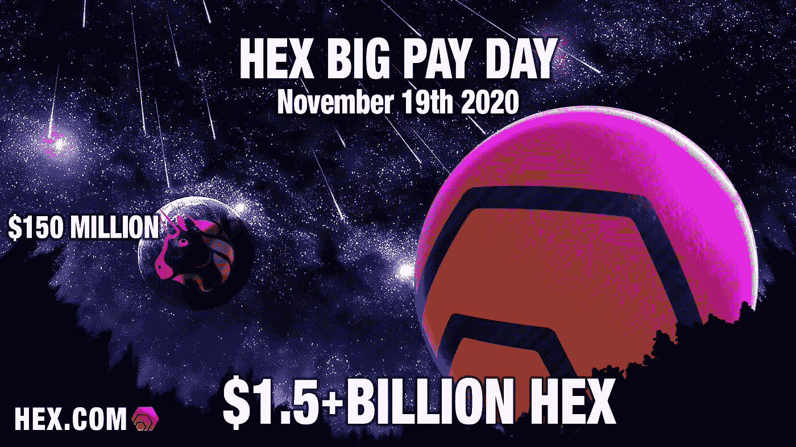
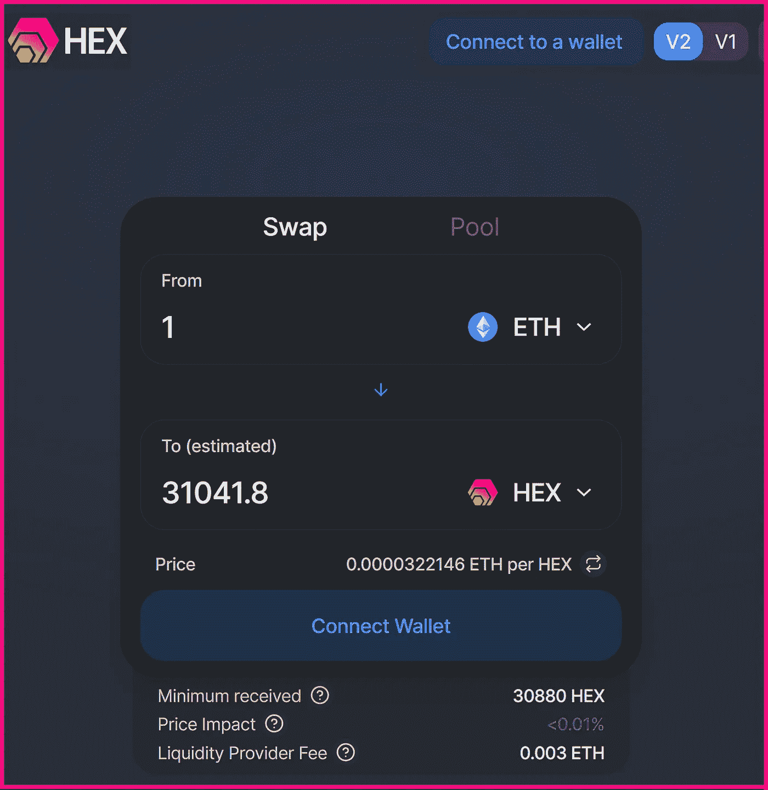
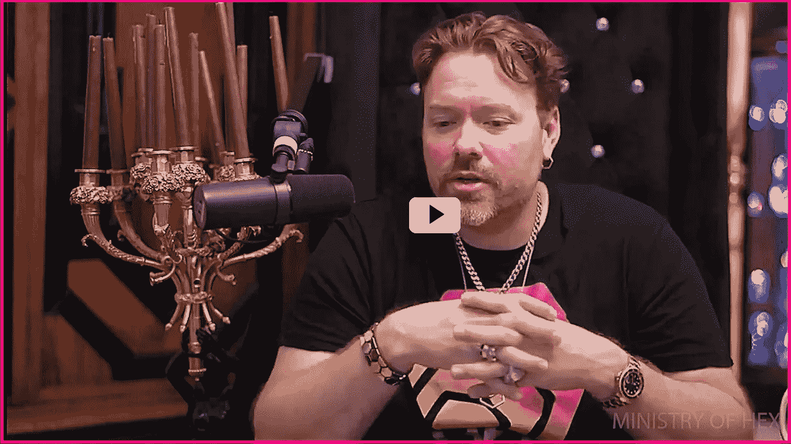
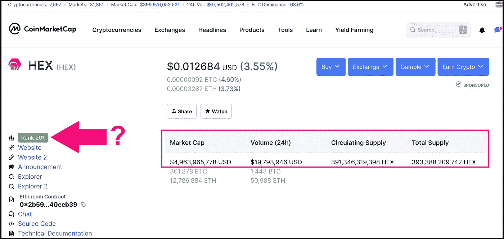
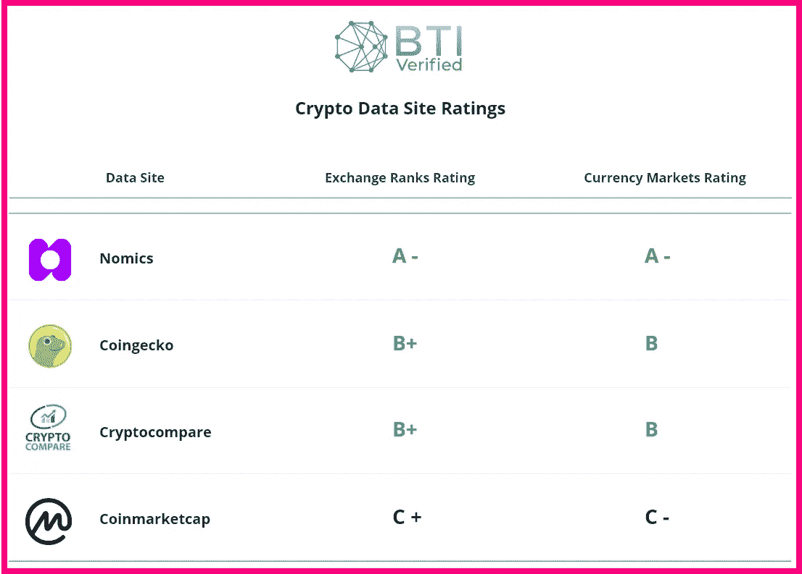
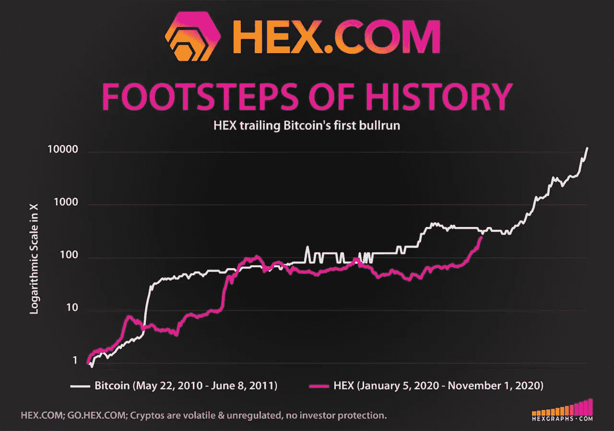
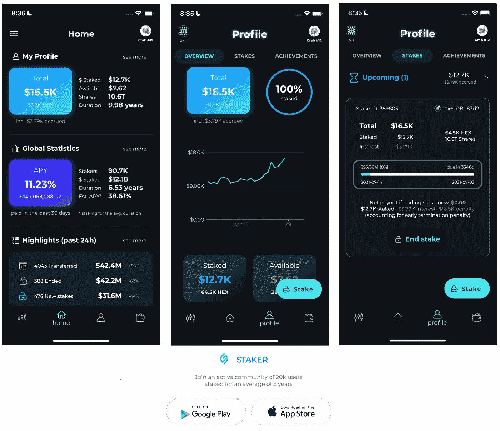
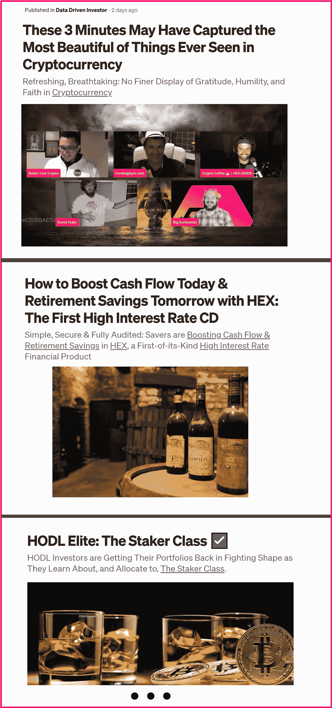

# Uniswap 黯然失色:11 月 19 日向赌注者支付了 15 亿多 HEX

> 原文：<https://medium.datadriveninvestor.com/uniswap-eclipsed-1-5-billion-hex-paid-to-stakers-november-19th-1d202ca938d3?source=collection_archive---------0----------------------->

HEX Big Pay Day $1.5+ Billion HEX Paid to Stakers November 19th, 2020

## 使 Uniswap 令牌下降超过 10 倍的[相形见绌，](https://uniswap.org/blog/uni/) [HEX](https://hex.com/) 在其大获成功的发射阶段&破纪录的性能上加了一个惊叹号

**不到两个月前，当 Uniswap** **向每个与该平台互动过的钱包赠送 400 个 UNI governance 代币，让每个钱包都大吃一惊的时候，人们失去了理智。这是出乎意料的——完全没有宣布——在 9 月 17 日分发了大约 1.5 亿枚 UNI 代币，分发时的交易价格为 1 美元。在接下来的几天里，代币的价格迅速攀升至 8 美元以上。**

> ***想象一下，如果你提前知道了 UNI 令牌分发…***
> 
> 11 月 19 日 HEX 的大发薪日活动将使慷慨的 Uniswap 治理令牌(UNI)分发黯然失色 10 倍以上……你有先见之明。

## 在 UNI swap 1 . 5 亿美元的 UNI airdrop 之后，感激之情如潮水般涌来。成千上万的代币接受者在社交媒体上表达了真诚的感谢和赞赏:

当 HEX 在 11 月 19 日向每个持有 HEX 股份的人派发超过 15 亿美元的 HEX 股份时，会发生什么？让你认识或关心的人有机会参与进来(现在就让他们参与进来)可能很有意义。他们以后会感谢你的。

# 十六进制的设计是为了超越，它的工作

设计意图从来都不是承诺，但是看到 HEX 按设计执行看起来确实很有希望。HEX 已经 [**在 2020 年跑赢了每一个市场**](https://hexgraphs.com/performance) **。通过 Nomics 排名前 5 位(**[**【BTI】经核实市场数据完整性排名第 1**](https://btiverified.com/crypto-market-data-report-2020/) **)，超过**[**【7.2 亿美元十六进制**](https://hex.live/) **正处于活跃股权支付可变 29%的 APY。平均持股时间为 5 年；最长的赌注是 15 年。这种在 HEX** **中看到的** [**可验证的 onchain 承诺在加密货币中是前所未有的。**](https://hex.vision/goto/610cdd1b335c2fbccd70ef56296bf782)

> 美国和中国的定期存款超过 7.2 万亿美元。这是一个比点对点货币市场大 50%的市场，比特币旨在解决印刷现金总额约为 5 万亿美元的问题: **HEX 以卓越的产品适应性解决了比比特币更大的市场。**

11 月 19 日，HEX 的“大付款日”为为期一年的激动人心的发布阶段画上了圆满的句号，为活跃的股份注入了 1830 亿 HEX，价值超过 15 亿美元。在下面阅读更多关于这个意外收获的事件。本文在撰写时引用的所有数字。

⬣ [**通俗地说就是十六进制契约**](https://docs.google.com/document/d/1P0ZDaBQx4ghkdX5IUwZb1n8ThvYf7i22MSt9Gm00JRU/edit)

⬣ [**十六进制可视源代码**](https://etherscan.io/address/0x2b591e99afe9f32eaa6214f7b7629768c40eeb39#code)

# Uniswap 的魔力:流行的共生

在 2019 年 12 月之前，在 Uniswap 上观察到的平均日交易量在 10 万美元左右。然而，HEX 上线几周后，Uniswap 上也有了。在此之后，HEX 直接向 Uniswap V1 公司增加了数百万美元的在线流动性；当时 Uniswap 对分散市场的唯一概念验证。

从那以后，事情发展得很快，伴随着知名度的共生，Uniswap 为 HEX 的投资者提供了一个强大的在线市场，HEX 的知名度越来越大，这反过来又吸引了其投资者加入 Uniswap。**4 月，HEX 凭借 1250 万美元的 onchain 流动性成为 Uniswap 的顶级流动性提供商；今年 5 月，HEX 以近 9000 万美元的交易额成为 Uniswap 最大的交易对手。**

# **购买容易；Uniswap 上 HEX 自己的前端**

HEX Gets its Own Front End on Uniswap, Making Buying Easy: ETHHEX.com

**通过吸引投资者的兴趣来推广 Uniswap，交易所随后于 5 月 19 日在以太坊主网上推出了 V2。Uniswap V2 已成为 2020 年最受欢迎的分散式交易所，拥有未编号的项目。**

**自然，由于将 Uniswap 的分散交易所作为投资 HEX 的主要渠道进行推广和普及，大量的 UNI token 分销直接流向了 HEX 投资者。**

> **事实上，chainalysis 显示，超过 250 万枚 UNI 代币流向了 HEX 钱包；在此事件之后，大多数钱包都将 UNI 换成了 HEX。这是一步好棋。**

**HEX/ETH Price Chart, Noting UNI Token Distribution Date; Over 2.5 Million UNI to HEX Wallets; the majority swapping UNI for HEX**

# 大发薪日

**HEX 的早期采用者将于 2020 年 11 月 19 日庆祝约 1830 亿 HEX 的意外通胀分配，价值超过 15 亿美元，计入 active stakes。这种一次性事件被称为大支付日(BPD)，唯一的资格要求是股份在 BPD 之前活跃，之后结束。到** [**赌注者类**](https://medium.com/datadriveninvestor/hodl-elite-the-staker-class-%EF%B8%8F-f69a5d46a2b9?source=friends_link&sk=392c135374a330f8734955f53b23446d) **这个十六进制会像任何其他每日利息一样记入你的赌注，但实质上更大。**

# 10 年后的 11 月 19 日

**比特币的硬币发行通胀模型在 10 年间从 0 个硬币到 1800 万个；HEX 有效地加速了这一过程，在 11 月 19 日完成了整个高通胀发行。紧随其后，HEX 进入低通胀阶段，最大通胀率为 3.69%。比特币花了 10 年时间跨越多次减半才完成同样的任务。**

# 为什么 HEX 可能会在高薪日之后很长一段时间继续表现出色

想象一下，如果比特币向承诺在他们选择的时间段内不出售的持有者支付更多的比特币:一笔定期存款。现在想象一下，如果承诺更长的时间会得到更好的回报，当其他人违背承诺时，那些遵守承诺的人会得到更多的比特币。整体净买卖活动会是什么样的？HEX 做了所有这些，还做了更多。

HEX 是一款成品，旨在以加密货币从未有过的方式为赌注者提供丰厚回报。利益相关者阶层享受的回报激励净积极的购买和赌注活动，而不是出售。此外，当 HEX 被标桩时，这些硬币就从流通中消失了——这是另一个积极影响供给需求压力的关键设计特征。

# (许多人会忽略的最大回报)

[**——2 分钟难得一见的来自理心的**](https://www.youtube.com/watch?v=mCTFiyl96p0&t=70s)

Richard Heart, HEX Inventor, Speaks about The Big Pay Day

**[**HEX 富有远见的产品设计利用股票**](https://medium.com/datadriveninvestor/fully-audited-earnings-per-share-in-stakings-sweetspot-hex-means-big-payouts-for-shareholders-10972b1f5a3c?source=friends_link&sk=f2c8ad8a846b852ab6a70ad4e7b61584) **和真实的——可量化的和完全审计的——每股收益(EPS)来交付真正的遗留金融成品。****

**拥有更多的 HEX 股份就像是在不拥有矿工或支付电费的情况下，为更多的 hashrate 堆积更多的比特币矿工。你的股份越多，你的造币能力就越强。相似之处是显而易见的:阅读理查德心 **的** [**十六进制的完整主题，了解更多信息。**](https://twitter.com/RichardHeartWin/status/1311277866244505602)**

# **成品的区别**

****HEX 树立了一个新的标准，它与 DeFi pack 的不同之处在于，它在上线之前是一个完整的产品，而不是项目。****

**

[**HEX Economics Audit by CoinFabrik.com**](https://hex.com/docs/HEX%20Economics%20Audit%20by%20CoinFabrik.pdf)** 

**这使 HEX 具备了从他人的未来工作中获得零期望利润的特性:HEX 是一个完整的产品，并按照设计执行。**

****HEX 的合同代码保留所有权利，由全球顶级合同审计员** **进行 3 次独立审计。如此关注细节使得 HEX 精确地按照设计运行，100%正常运行。****

> ****“HEX 被延迟了将近一年才获得安全权限，这就是为什么它有 3 个审核；2 项安全审计，1 项经济审计。十六进制没有管理密钥。没有关闭开关。没有暂停开关。它是完全自主的。****
> 
> **如果 HEX.COM 下线了，我死了，系统会继续正常工作。这是不可阻挡的:代码在区块链。你来经营。你自己创造奖励。就是这样。"**

****

*   **[Richard Heart，HEX Inventor 2020 年 10 月 15 日接受@ hardfarking](https://www.youtube.com/watch?v=O3QUZdx8vjs)
    *采访，由 Chainsecurity.com 和 Coinfabrik.com 两个世界顶级合同审计师进行 3 次独立审计，HEX 的不变合同通过* [*HEX 每股收益*](https://medium.com/datadriveninvestor/fully-audited-earnings-per-share-in-stakings-sweetspot-hex-means-big-payouts-for-shareholders-10972b1f5a3c?source=friends_link&sk=f2c8ad8a846b852ab6a70ad4e7b61584) *设计保证股东分红。***

# **购买和赌注 HEX 很容易**

****

# **多年的酝酿:一个拥有完美代码和好设计的完整产品真的会有回报**

****

*****区块链首款高息跑马圈地产品。如何建立加密应该是:*****

*****100%上链。*****

*****零中间商。*****

*****零交易对手。*****

*****零 Admin 键。*****

**ㅤ**

# **市场领导者有着相似的道路**

****排名前 2 的加密货币在早期经历了最严重的口头谩骂。以前经常看到比特币骗局或以太坊骗局被无知和无知地说出来。历史往往是押韵的，人们不能不注意到** [**HEX 骗局**](https://hackernoon.com/is-hex-is-the-most-notorious-scam-in-the-history-of-cryptocurrencies-r9m53azs) **被许多从未研究过它的大影响者发声。具有讽刺意味的是，就像比特币和以太坊的早期一样，唯一的骗局似乎是虚假标签，阻止许多人在适当的时候投资真正的产品。****

## **当房间里有一头大象时，介绍他们
——兰迪·波许最后一次演讲**

****CoinMarketCap。**
**虽然 HEX 可能是第一个有两个独立安全审计的硬币，但由于不断流行的 CoinMarketCap HEX 的明显把关做法，HEX 尚未在那里正确排名。事实上，CoinMarketCap 可疑地将 HEX 列在第 201 位——似乎被埋没在第 3 页。这不仅让新投资者极难发现 HEX，也让数据报告实践受到质疑。****

**

Gatekeeping HEX on CoinMarketCap, BTI Verified Graded “C” in Data Transparency** 

****全球顶尖的区块链数据监控公司区块链透明研究所(block chain Transparency Institute)给 CoinMarketCap 的评分是全线 C；像 Nomics 这样的网站，HEX 的排名是正确的，得到了 BTI 认证的所有 A 的分数。****

**

Blockchain Transparency Institute; The World’s Top Blockchain Surveillance Firm** 

****同样值得注意的是，尽管 HEX 的设计非常强调安全性和可验证的链上透明性，但加密货币中许多(大多数)最大的人物和社会影响者迄今为止都不愿意公开讨论 HEX。****

****因此，对于那些在这个时候发现 HEX 的投资者来说，这可能意味着参与早期采纳者阶段和后期大多数之间的区别。****

****

# **开始**

****HEX 由连环创业者、早期比特币采纳者发明，** [**理心先生**](https://www.forbesindia.com/article/brand-connect/richard-heart-and-the-influence-of-bitcoin-on-the-hex-blueprint/62095/1#) **。****

**

[HEX Inventor, Richard Heart](https://www.forbesindia.com/article/brand-connect/richard-heart-and-the-influence-of-bitcoin-on-the-hex-blueprint/62095/1#), speaking at Malta AI & BC Summit** 

****如今，Heart 先生是以太坊的精通支持者，也是各种主题领域令人振奋的思想领袖。凭借其鼓舞人心的舞台表现和坦率流畅的采访，哈特先生的观众总是座无虚席。****

****挖掘完整的比特币 blocks 在早期，Heart 先生似乎在他设计的 HEX 中采纳了类似的精神，在经过全面审计的合同中为比特币(BTC)的持有者建立了一个自由索赔选项。如果你在 2019 年 12 月 1 日 HEX 推出快照期间持有任何比特币，那么你可以** [**免费认领你的 HEX，直到 2020 年 11 月 19 日**](https://medium.com/datadriveninvestor/if-you-held-bitcoin-on-december-1st-2019-75d05004c22b?source=friends_link&sk=1e02ff077d3745108e78e82480a2af2f) **。****

# **赌注十六进制&看它倍增**

**[桩工。App](https://staker.app/invite/PQn8) 可以让你安全可靠地在网上积累 100%的财富，并实时观察财富的增长:**

****

****更多资讯**:[**HEX.COM**](https://hex.com/)⬣**新闻及更新:关注推特**[**@ hex crypto**](https://twitter.com/HEXcrypto)⬣**社区:互动、Q & A、玩得开心:**[**https://t.me/HEXcrypto**](https://t.me/HEXcrypto)**

# **相关文章**

****