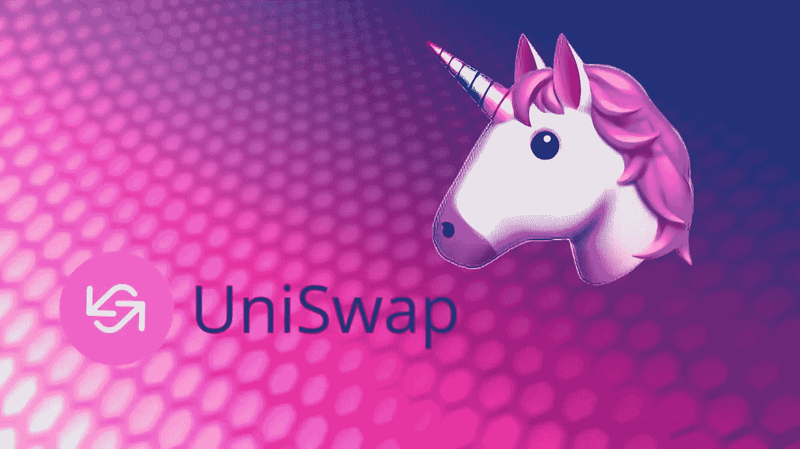

# uni WAP——方便用户的分散交换

> 原文：<https://medium.datadriveninvestor.com/uniswap-user-friendly-decentralized-exchange-daaa8e485529?source=collection_archive---------8----------------------->

# uni swap:100，000 美元的开发成本就足够了

当投资者在“区块链”项目上投入了数百万美元时，Uniswap 的故事读起来令人耳目一新。以太坊基金会支付了第三波赠款。作为近 20 个项目之一，Uniswap 的开发人员在 2018 年 8 月收到了一张 10 万美元的支票，以开发 Uniswap 作为其中的一部分。不到半年后，这个项目就上线了，并且越来越受欢迎。Uniswap 背后是什么？

# Uniswap 如何工作

Uniswap 目前成功的原因主要在于智能合同背后的激励机制。这是因为 Uniswap 有两种互利的使用情形。

# 1.分散交换

用户现在有分散交易所的广泛选择，即没有中间人进行交易的交易所。虽然像 IDEX (ETH)、雷达中继(0x)和以太三角洲(ETH)这样的交换相对来说对用户不友好，但 Uniswap 降低了复杂性。必须设定限价/市价订单并确定交易对手的订单簿不存在。相反，智能合约充当所需交易所的交易对手，并设定价格。

因此，从用户的角度来看，Uniswap 就像货币计算器一样容易使用。人们选择要买卖的货币和数量。这个过程被证实了，例如，MetaMask，几乎所有 dApps 的不可替代的浏览器插件，完成！系统将购买的代币直接添加到出售的以太坊地址。该地址还可用于控制对所有 ERC-20 令牌的访问。
但是智能合约从哪里获得购买的硬币呢？金币会怎么样？这就是 Uniswap 的第二个用例发挥作用的地方。因为令牌也来自用户。他们可以让代币暂时可用，从而增加流动性。

# 2.通过向流动性池缴款获得投资回报

为了给 Uniswap 上的每个交易对(例如，ETH-MKR)准备足够的储备，智能合约为每个交易对保留一个“流动性池”。它由用户的押金组成。但是为什么用户要将令牌存放在 Uniswap 智能合约中呢？每个交易所产生 0.3%的交易费，根据用户在流动性池中的份额分配给所有用户！因此，与将所有交易费用留给自己的集中式交易所不同，来自分散式交易所(DEX)的所有“收入”都回到了那些为流动性做出贡献的人手中。

例如，一个用户拥有 ETH 和 ZRX 令牌，他很可能在接下来的半年内不需要这些令牌。如果他确实需要，可以随时从流动资金池中提取存款。他转到 [https://uniswap.exchange](https://uniswap.exchange) 并在那里存入相同金额的 ETH 和 ZRX 令牌。在本例中，我们假设 10 个 ETH 和 ZRX 个 ETH。如果 ETH-ZRX 的总流动性池为 200 ETH，用户现在有权获得 5%的流动性池。
每个 ETH-ZRX 交易所的交易费也有利于这个流动性池，随着每笔交易的增加而增加。与此同时，5%份额的绝对值也越来越大。
可以说，用户从他的存款中获得了回报，但如果两个代币中只有一个增值，他就放弃了可能的价格收益。这种可能的损失被称为“非永久性损失”

这个回报有多高？这取决于一个交易对有多少流动性，以及这个交易对交换了多少。本页显示不同交易对的每日当前收益率(黄线)。例如，ETH-DAI 的收益率目前(2020 年 6 月中旬)刚刚超过 3%。

**注意:**如果两个存入的代币价格不同，支付额可能会低于存款额。有更多的其他原因。换算成欧元汇率，这可能会产生负回报，尽管流动性池增加了。这里很好地解释了这样做的原因。

# 结论

Uniswap 是 DeFi 的旗舰项目。DEX 不仅没有 ICO，而且每天都有数百万的交易。Uniswap 实际上是分散的。没有人可以阻止交换，因为开发人员没有在智能合同中实现任何管理密钥或后门来定制它。

与此同时，Uniswap 2.0，流行的分散式交易所的下一个版本，已经上线。此外，用户界面也有所改善。
同时，还有 1inch.exchange 使用 Uniswap 来确定所有去中心化交易所中的最低交易所价格。因此，建议不要直接使用 Uniswap，而是通过 1inch.exchange 使用。

我在每月的[时事通讯中分享了更多私密的想法，你可以在这里查看](https://mailchi.mp/bf8f8e8ed697/keep-in-touch-with-lukas)。请在评论中告诉我，并在各种社交媒体平台上加入我:

[推特](https://twitter.com/WiesfleckerL) ● [Instagram](https://www.instagram.com/lukaswiesflecker/) ● [脸书](https://www.facebook.com/lukaswiesfleckerr)●[Snapchat](https://www.snapchat.com/add/luggooo)●[LinkedIn](https://www.linkedin.com/in/lukas-wiesflecker-1b11251a5/)

无论你做什么，都要带着爱和激情去做！