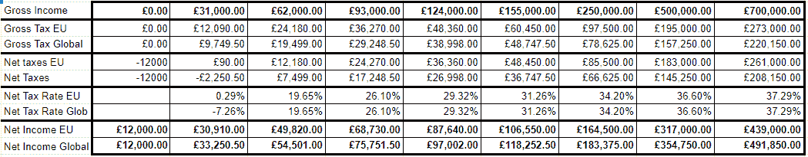
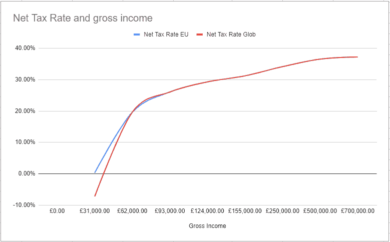
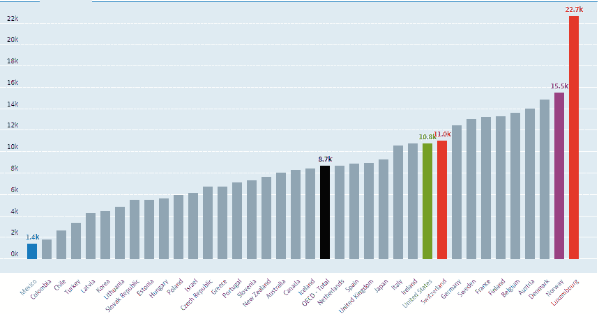
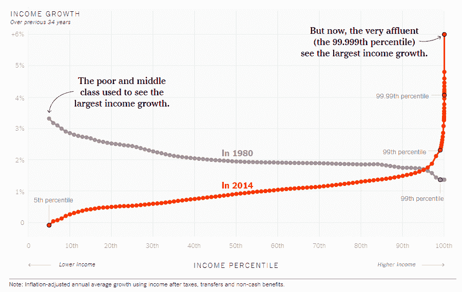

# 全民基本收入可能是答案吗？

> 原文：<https://medium.datadriveninvestor.com/universal-basic-income-could-it-be-the-answer-2ccacfe891dc?source=collection_archive---------23----------------------->

## 还是只是对社会悬殊的一种回答？

Photo by [Uwe Conrad](https://unsplash.com/@uconrad?utm_source=medium&utm_medium=referral) on [Unsplash](https://unsplash.com?utm_source=medium&utm_medium=referral)

如果政府支付你的生活费用呢？你还会去上班吗？什么是普遍基本收入？这行得通吗？

2020 年是我们的社会体系长期以来面临的最大挑战。它迫使各国变得富有创造性，并找到新的解决方案。其中一个解决方案是普遍基本收入或 UBI。虽然这不是一个新概念，但它引起了我们的注意。去年我们看到了不同的例子，从美国的刺激计划到日本的旅游补助。

这项政策面临的第一个障碍是它的定义。一些人呼吁用 UBI 取代福利，另一些人则呼吁增加福利。UBI 历史最悠久的“实验”是阿拉斯加的“石油红利”。任何阿拉斯加的永久居民都可以获得年度津贴。

Photo by [Micheile Henderson](https://unsplash.com/@micheile?utm_source=medium&utm_medium=referral) on [Unsplash](https://unsplash.com?utm_source=medium&utm_medium=referral)

这种货币津贴没有对该地区的就业或财富不平衡产生影响。兼职工作和“夜校”有所增加。我们稍后将对此进行更深入的探讨。

我相信 UBI 可以为许多人打开财务独立的大门，并让他们有更多的时间从事有意义的工作。靠薪水生活的风险更小，做出有价值贡献的机会更大。这与我在“[财务目标:我错了](https://centbycent.co.uk/financial-goals-why-i-was-wrong?swcfpc=1)”中探讨的观点一致。

因此，今天让我们来探讨什么是普遍基本收入，它对经济意味着什么，以及利弊。

# 什么是普遍基本收入？

普遍基本收入很容易定义，即每个成年人都应该得到每月津贴。虽然，听起来很乌托邦，很简单。要落实到位远非易事。从不问问题到受限的特殊用途借记卡，它有许多不同的用途。

这个概念自 16 世纪以来就一直存在，现在又卷土重来。严峻的经济形势提出了一个激进的解决方案。UBI 是选项之一。完美的数量不是经济问题，而是政治问题。这项政策要遵守的一条规则是，不管你是谁，你做什么，或者你认为你有权得到什么。

此外，UBI 并不是要求人们减少工作。重要的是让他们能够胜任工作的能力。这不仅意味着根据你的价值观工作的机会增加了。它赋予处于不太令人羡慕的职位的工人权力，因为他们获得了要求更高工作条件的优势。

实施它可以作为国家提供的福利的补充，这将增加高收入的总体成本和税收。或者部分/全部取代它，成为一种新的、更公平的方法，随着收入的增加，回报逐渐减少。总而言之，这是一种弥合贫富差距的努力。但这能行得通吗？

# UBI 如何工作？

## 负税收？

最终，UBI 从税收改革和实施负所得税(UBI 的另一个名称)开始。为了帮助您形象化表 1 中的情况。你可以看到对你的税收和净收入的影响。数据基于 2019 年欧洲平均税收水平 39%，全球平均水平 31%。以及每月 1000 英镑或每年 12000 英镑的收入。

如果你更喜欢视觉思考，路缘看起来像这样:

正如你所看到的，负所得税作为 UBI 税的基础将很快正常化。它不会造成通胀局面，而是会导致财富的重新分配，同时给所有人一个平等的立足点。

## 区域货币？

韩国京畿道一段时间以来一直为 24 岁以下的人提供基本收入。他们的想法是获得 100，000 韩元或 85 美元的季度津贴，他们必须将其用于收入低于 830，000 美元的当地业务。([文章链接](https://www.ledgerinsights.com/south-korea-local-digital-currencies-basic-income-covid-19-relief-payments/))

自新冠肺炎开始以来，该方案现已扩大到所有成年人。它允许国家补贴小企业，同时授权和保护其人民。支出受到限制并局限于某些地区。

通过引导当地消费者的现金流和增加地区 GDP，人们也能够进行投资。不仅是股票，还有股票本身。它使工人能够专注于他们的教育和新技能的再培训。这在一个自动化程度大幅提高的国家尤为重要。

为什么不看看《华尔街日报》下面的视频，它采访了这种 UBI 变体的接受者。

## 取代福利？

福利常常让人觉得是个陷阱。具有任意设定且很少更新的明确阈值。通过普及援助和消除限制，你给了接受者一个将资金用于支持增长的机会。这一事业的支持者呼吁用现有的福利基金和节省的行政费用来资助这一事业。经济合作与发展组织(T2)称其成员国平均将 20%的 GDP 用于福利。或 2019 年人均 8700 美元，卢森堡将提高到 2.27 万美元。

该数据不包括 2020 年，原因是新冠肺炎的救灾工作，该值肯定会提高。它还不包括此类工作的管理成本。

# 普遍基本收入有哪些风险？

在这一类别中，区分感知风险和风险本身至关重要。在这种情况下，我将探索最大的感知风险，以及研究是否认为它们是有根据的。

## 人们将停止工作

围绕 UBI 最大的社会学担忧是人们将停止工作。这种观点认为，UBI 导致更高的税收和更强的谋生基础，将激励人们停止工作。

有证据表明，当关注童工时，工作率确实显著下降。虽然它只是在 8/19 的研究中消失了，但它确实在所有的研究中显示了工作时间的减少！这反过来又导致了入学率和识字率的提高。

至于成年劳动力，现金转移确实导致老年人和照顾受抚养人的人略有减少。

## 人们会滥用资金

但是人们不会把钱花在酒和烟上吗？2017 年芝加哥大学关于“[现金转移和诱惑商品](https://www.journals.uchicago.edu/doi/abs/10.1086/689575)”的一项研究表明，当提供基本收入或补贴时，支出具有-0.18 标准偏差的显著负面影响。因此，研究表明，对烟草和酒精消费的担忧是不适用的！

事实上，这篇研究论文还指出，诱惑商品受到高度替代效应的影响，当一个人打开资金寻找更有价值的替代品时，他们往往会被吸引。这些替代方案包括接受高等教育，掌握再技能，以及基于健康的替代方案，如营养食品或运动器材。

Photo by [Tim Mossholder](https://unsplash.com/@timmossholder?utm_source=medium&utm_medium=referral) on [Unsplash](https://unsplash.com?utm_source=medium&utm_medium=referral)

## 通货膨胀呢？

对通货膨胀的担忧与工作相对于收入的减少有关。如上所述，UBI 不会导致工作时间的显著减少，因此只会轻微影响通货膨胀。

把它看作一次普遍的加注是正确的。一个很好的例子是阿拉斯加的石油红利。阿拉斯加的房价虽然膨胀，但在全国排名第 41 位，尽管其补充的收入远不及加州、DC 或纽约州。

此外，与京畿道薪酬一致的方法将确保 UBI 在该地区内被重新定向和消费。反过来促进当地经济。在一项由罗斯福研究所进行的关于 UBI 宏观经济效应的[研究](https://rooseveltinstitute.org/wp-content/uploads/2020/07/RI-Macroeconomic-Effects-of-UBI-201708.pdf)中，他们指出在 8 年内 GDP 有 12.56%的潜在提升。

他们还得出结论，截至 2017 年，没有经验数据表明这样的计划会导致通货膨胀的经济。

# 为什么我们需要普遍的基本收入？

经常感觉现状挺好的。因为我们知道它是如何工作的，所以它既舒适又容易。这篇文章的目标是挑战你的理解，并尝试给你一个不同的观点。我们是在社会制度不变的情况下长大的，但回到 70 或 80 年前，带薪休假是不可想象的。

人类的力量在于它的不断进化。随着 2020 年成为过去，2021 年看起来也一样糟糕，问题是我们做得够吗？

## 贫富差距

Graph by David Leonhardt — NY Times Aug 7, 2017

这张图表显示了 1980 年和 2014 年之间收入增长的显著差异。我们似乎认为富人越来越富是真理。然而，在区区 30/40 年前，这一趋势发生了逆转。贫富差距正在缩小。

当然，认为我们可以回到过去的经济增长是痴心妄想。然而，重新分配高端人群的信用卡会带来很大的不同。系统性贫困根深蒂固，不会随着贫富差距的扩大而改变。

一个平等的 UBI 将会给 98%的人一个弥合差距的机会，并开始为一个更加绿色的未来而努力。目前忙于多份工作，并时刻担心失去工作，这给希望和进步留下了空间。

当我们努力实现财务独立的时候，我们常常会忘记我们的优势。当然也有例外，也有励志的故事。然而，认识到我的特权并寻求帮助他人成长同样重要。

## 安全网

如果说新冠肺炎教会了我们什么，那就是我们不能做好一切准备。22 至 29 岁的英国人中有 40%根本没有存款。许多人发现自己处于可怕的境地，因为这个年龄组受到的打击最大。

在英国没有社会安全网或保护的情况下，贫困线以下的跳跃非常快。

危机不仅会发生，而且可以预见，在未来 12 年内，1/4 的美国人会因为自动化而失业。UBI 可以让这些工人安心地接受再培训，寻找新的有利可图的工作。

当然，说提前做好准备很容易，但当靠薪水生活时，这是许多人无法承受的选择。

## 企业家精神的提升

Photo by [SpaceX](https://unsplash.com/@spacex?utm_source=medium&utm_medium=referral) on [Unsplash](https://unsplash.com?utm_source=medium&utm_medium=referral)

随着像 Patreon 这样的平台的兴起，我们看到越来越多的创作者依赖他们的追随者的捐赠来生存。这与自行纳税提供的基本收入没有什么不同。UBI 也不例外，它将允许这些原则扩展到更多的人口中。

通过支付，持续的津贴和提供有效的收入底线。居民被授权承担更多的风险，创造自己的道路。进而创造就业，提振经济。

问问你自己，你多久听到一次人们希望他们能开一家公司。但这太冒险了，他们可能会失去一切。知道一个人可以养活家人对雄心壮志的影响是惊人的。

# 结论

我的目标不是说服你我们需要采用 UBI。这是为了消除对经济衰退的先入之见。当然，就像每一次社会革命一样，会有反响和权衡。

然而，这并不意味着我们将被征税。当然，我们可以预期短期内税收会增加。然而，在我看来，为每个人平等创造机会是值得的。UBI 经过测试后，带来了 GDP、教育和士气的增长。

研究显示，心理健康水平全面提高！

我很想听听你对这个问题的想法和主意！你会如何改革社会救助？

*本文首发于* [*分分*](https://centbycent.co.uk/are-you-successful-7-definitions-of-success) *。你可以在那里找到更多关于我和我的内容！*

*让我们保持联系* [*推特*](https://twitter.com/cent_by_cent) *！*

## 来源

*   [我们破碎的经济，在一个简单的图表中](https://www.nytimes.com/interactive/2017/08/07/opinion/leonhardt-income-inequality.html),《纽约时报》，2017 年
*   [现金转移和诱惑商品](https://www.journals.uchicago.edu/doi/abs/10.1086/689575)，芝加哥大学，2017 年
*   现金转移:证据说明了什么？，ODI，2016 年
*   如果我们只是给人们钱会发生什么
*   [关于普遍基本收入的经济学](https://www.intereconomics.eu/contents/year/2017/number/2/article/on-the-economics-of-a-universal-basic-income.html)，Intereconomics.eu，2017
*   [京畿道向所有韩国居民提供 10 万韩元的紧急基本收入，以应对病毒的影响](https://www.koreatimes.co.kr/www/biz/2020/03/367_286709.html#:~:text=Gyeonggi%20to%20give%20emergency%20basic,to%20cope%20with%20virus%20fallout&text=Gyeonggi%20Province%2C%20which%20surrounds%20Seoul,impact%20of%20the%20coronavirus%20outbreak.),《韩国时报》，2020 年
*   [南韩如何将当地货币用于基本收入，新冠肺炎救济付款](https://www.ledgerinsights.com/south-korea-local-digital-currencies-basic-income-covid-19-relief-payments/)，Ledger Insights，2020 年
*   [韩国在 COVID](https://asia.nikkei.com/Politics/Universal-basic-income-gains-support-in-South-Korea-after-COVID) 之后普遍基本收入获得支持，日经亚洲，2020 年
*   [为普遍基本收入的宏观经济效应建模](https://rooseveltinstitute.org/wp-content/uploads/2020/07/RI-Macroeconomic-Effects-of-UBI-201708.pdf)，罗斯福研究所，2017 年
*   [拆箱普遍基本收入](https://econreview.berkeley.edu/unboxing-universal-basic-income/)，柏克莱经济评论，2020 年