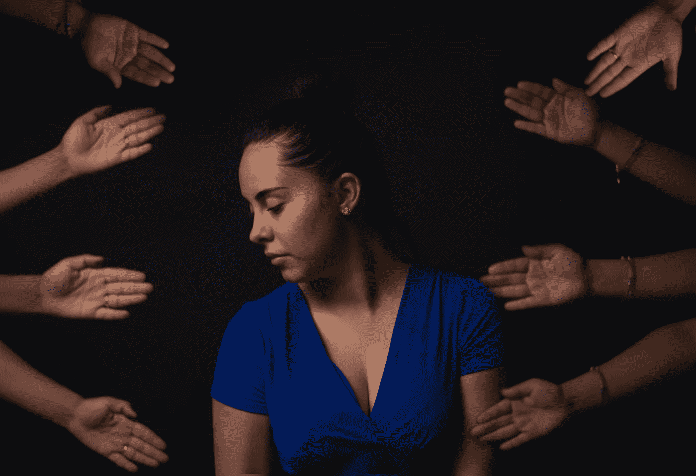

# 2020 年全民基本收入

> 原文：<https://medium.datadriveninvestor.com/universal-basic-income-in-2020-65f6079d3973?source=collection_archive---------14----------------------->

—乌托邦还是失败的实验？

Photo by Karsten Würth on Unsplash

你去工作是因为你热爱它还是因为它能给你带来经济保障？人生苦短；把它浪费在无意义的工作上对我来说没有意义。相反，我会学习、创作艺术或旅行等等。

因此，当我在 2017 年看到通用基本收入(BUI)时，我立即被说服了。三年过去了，第一批结果由世界各国政府公布。这篇博文将详细阐述我们对 BUI 的测试进展如何。

# 不明确的

基本普遍收入(BUI)有两个主要问题。BUI 应该在社会上取得什么成就，BUI 是如何得到资助的？

一些人认为 BUI 应该将人们的生活水平提高到贫困线以上。很少有人希望政府将中产阶级的财务自由交给全体民众。其他人谈论免税收入，因此可以花更多的时间和家人在一起，做志愿者，或者接受教育。

政府从哪里获得 BUI 的资金？我们总是可以重新分配一部分福利或国防预算。但是，也许增加富人的税收会更公平地平衡竞争环境。我支持对股票市场的资本交易征税。

 [## 现金为王，比我们想象的更强大|数据驱动的投资者

### 2020 年 3 月 12 日，在川普总统宣布新冠肺炎进入国家紧急状态的前夕，纽约时报报道…

www.datadriveninvestor.com](https://www.datadriveninvestor.com/2020/03/26/cash-is-king-more-potent-than-we-think/) 

正如你所看到的，学者和政治家们还没有就实施 BUI 的细节和路线达成一致。因此，根据每个国家的情况，可以采取不同的 BUI 道路。

# 芬兰

芬兰是第一个在 2017-2019 年间进行基本最低收入测试的国家。他们随机选择了 2000 名失业参与者，给他们每天 560 英镑的免税收入，以观察失业人数是否会减少。

结果是不确定的，失业率没有上升或下降，但参加电话调查的申请人幸福感增加，抑郁减少，压力减少。此外，一些人能够找到更好的工作，开办公司，或回到学校。

# 福利？

依我看，我们必须回答的真正问题是:福利项目能丰富社会吗？

医疗保健预算允许公民去看心理医生，并支付昂贵的药物。此外，儿童支持有助于父母与他们的婴儿留下愉快的回忆。

Photo by Cristian Newman on Unsplash

但是许多福利项目有很多缺点。例如，许多福利项目需要一个证明贫困的情感和官僚程序。这个过程对政府来说是高成本的，对个人来说是令人沮丧的。如果你被这些福利或失业项目录取，他们会有很多附加条件，比如参加课程，申请一定数量的工作，或者接受任何不合格的兼职。此外，这些福利计划对免税收入设定了限制。当一个人从事额外的工作时，他们赚得更多，但因为税收而失去更多。因此，他们选择保持被动来获取这些好处。

# 万能资本

除了普遍基本收入，我们可以选择普遍基本资本(UBC)。

媒体理论家道格拉斯·拉什科普(Douglas Rushkop)假设，只有公司会受益于 UBI，因为会有更多的钱在经济体系中流动。相反，我们应该创造普遍的基本份额，以便人民在社会中获得生产资料和所有权。随着资本和收入之间的差距越来越大，托马斯·皮凯蒂在他的《21 世纪的资本》一书中表示同意。

欧洲政治家亚尼斯·瓦鲁法基斯(Yanis Varoufakis)提出了普遍的基本红利。政府不应该对 UBI 征税。相反，他们可以利用指数投资的低风险资本收益。

# 将来的

苏格兰首席部长尼古拉·斯特金(Nicola Sturgeon)表示:“苏格兰普及基础教育的时代已经到来。”因此，苏格兰政府已经在不同的行政区推出了四个类似的全民医保试点项目。当英国政府解决了“科罗纳·疫情”号的余波后，他们可能会进行建设性的讨论。

西班牙社会保障部长何塞·路易斯·埃斯科里瓦(Jose Luis Escriva)希望为该国约 100 万最贫困家庭实施基本月收入，以抵御冠状病毒爆发的影响。他们的联盟党在 1 月份同意创建这样一个基本收入，作为他们四年计划的一部分，尽管冠状病毒危机改变了优先事项。

我希望我们到 2100 年在西方建立普遍的基本收入。

> 当你热爱你所做的事情时，你一生中一天都不会工作。”—马克·安东尼

Photo by Fernando Brasil on Unsplash

## 延伸阅读:

[西班牙支付基本收入帮助最贫穷的人抵御冠状病毒。](https://www.reuters.com/article/us-health-coronavirus-spain-economy/spain-to-pay-basic-income-to-help-poorest-weather-coronavirus-idUSKBN21Z18X)

[斯特金说“普及基本收入的时候到了”](https://www.independent.co.uk/news/uk/home-news/universal-basic-income-ubi-scotland-uk-nicola-sturgeon-coronavirus-a9498076.html)

[研究发现，芬兰基本收入试点改善了幸福感](https://www.theguardian.com/society/2020/may/07/finnish-basic-income-pilot-improved-wellbeing-study-finds-coronavirus)

[关于芬兰普遍基本收入试验的最新报告称，这让人们更快乐](https://www.sciencealert.com/latest-report-on-finland-s-universal-basic-income-trial-suggests-we-d-be-happier-with-it)

[基本收入地球网络](https://basicincome.org/)

## 视频:

[普遍基本收入是个好主意。原因如下。| Yanis Varoufakis | Big Think](https://www.youtube.com/watch?v=O8B4U7o9kvg)

[全民基本收入的巨大问题|道格拉斯·拉什科夫|大思考](https://www.youtube.com/watch?v=m25YLByFVRw)

[全民基本收入解释——人人免费？UBI](https://www.youtube.com/watch?v=kl39KHS07Xc&t=184s)

[为什么我们应该给每个人基本收入| rut ger Bregman | TEDxMaastricht](https://www.youtube.com/watch?v=aIL_Y9g7Tg0)

**访问专家视图—** [**订阅 DDI 英特尔**](https://datadriveninvestor.com/ddi-intel)