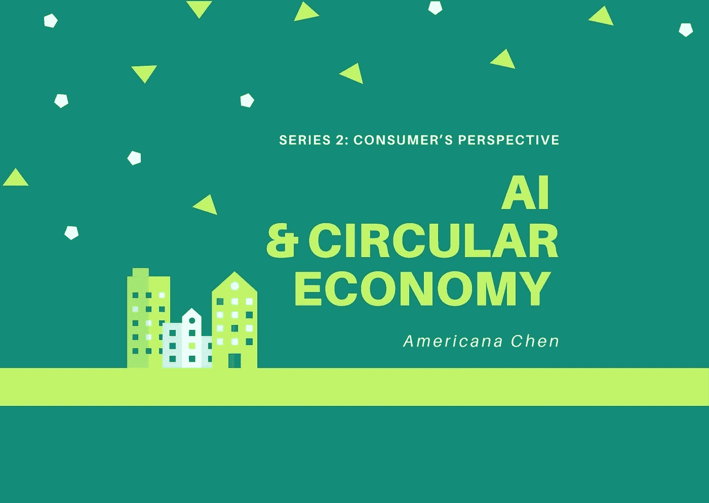
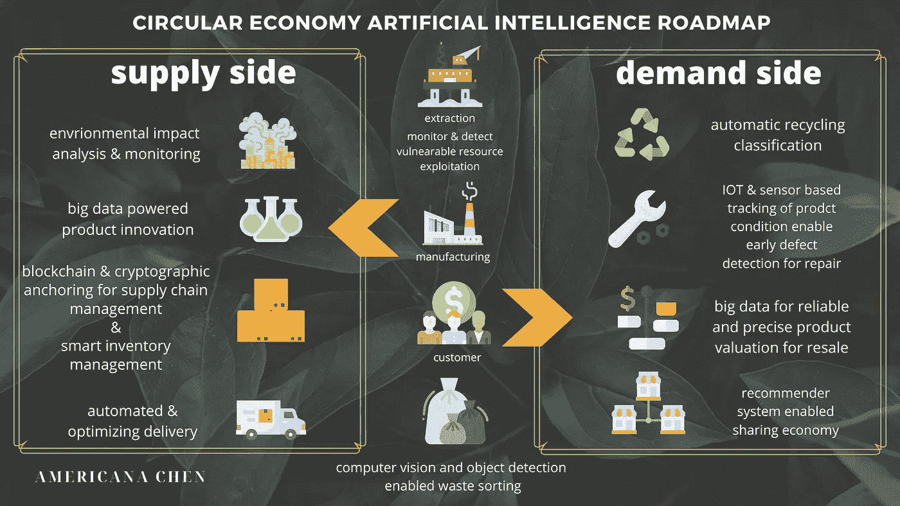
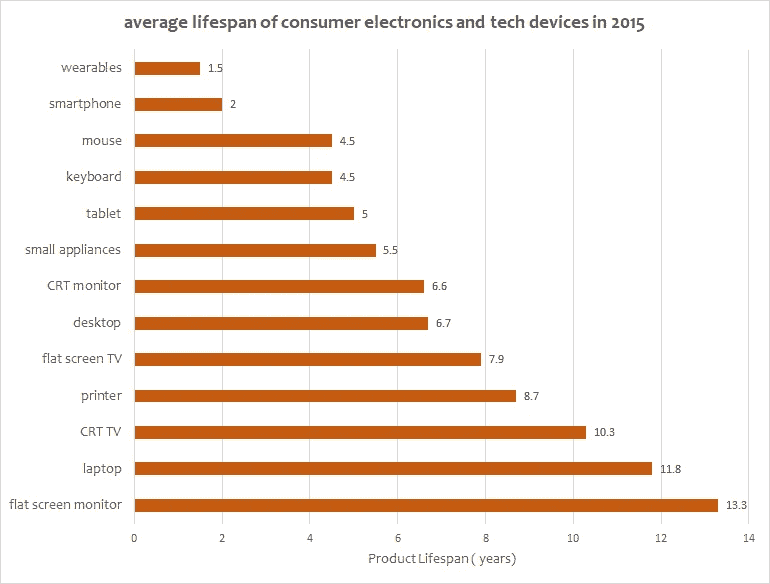

# 释放人工智能在循环经济中的潜力:从消费者的角度

> 原文：<https://medium.datadriveninvestor.com/unleash-the-potential-of-ai-in-circular-economy-from-the-consumers-perspective-acb3ab7decf9?source=collection_archive---------16----------------------->

Image created by Americana using Canva

* * *本文来自我之前的一篇文章 [***“释放人工智能在循环经济中的潜力:企业潜力”***](https://medium.com/swlh/unleash-the-potential-of-ai-in-circular-economy-businesses-potentials-ff3056098699) ，在这篇文章中，我介绍了循环经济的概念，讨论了**为什么需要这种紧急转型**，以及**企业如何利用人工智能来促进这种演变**。如果你还没有看过，我建议你先看看它的商业含义。***

 [## 释放人工智能在循环经济中的潜力:商业潜力

### 通过利用当今快速发展的人工智能技术，向更成熟的循环经济模式的过渡将是一个崭新的时代

medium.com](https://medium.com/swlh/unleash-the-potential-of-ai-in-circular-economy-businesses-potentials-ff3056098699) 

在上一篇文章中，我探讨了人工智能如何成为一种强大的工具，帮助企业从线性运营模式转变为循环运营模式，包括**供应链管理、库存管理、产品创新和环境影响分析**。然而，如果没有每个消费者的努力和贡献，一个雄心勃勃的社会变革将是缓慢的。我要强调的是**经济中的每一方都需要思想开放，适应新技术**，多方利益相关者之间的**合作是实现 AI 在每一个组成部分中的价值的关键因素**。因此，在这篇文章中，我将重点评估人工智能也可以**促进消费者参与这一演变的几种方式，加速我们走向自给自足的经济。**

# 什么是循环经济？

我已经在上一篇文章中定义了循环经济，并详细解释了为什么使用人工智能来实现循环经济与今天的背景高度相关，因此我在这里只简单介绍一下:

根据[艾伦·麦克阿瑟基金会](https://www.ellenmacarthurfoundation.org/explore/the-circular-economy-in-detail)，循环经济的三个基本原则是:

> ***1。设计出浪费和污染***
> 
> **2*2。保持产品和材料在使用中***
> 
> ***3。再生自然系统***

# 人工智能路线图

下面的路线图总结了我关于经济中的每个利益相关者如何应用和利用人工智能来加速向循环经济过渡的想法。

circular economy AI potentials — roadmap ( produced by Americana Chen using Canva)

# 人工智能在促进循环经济中的需求侧潜力

***1。早期缺陷检测&使用基于 IOT 的产品状况跟踪和计算机视觉的预测性维护***

循环经济转型的一个重要组成部分是**延长产品寿命**。企业的产品创新确实是必不可少的，然而，为了取得更有希望的结果，消费者应该更好地管理和照顾他们购买的产品。根据 Statista 的数据，2015 年消费电子和科技设备的平均寿命如下。

Graph produced by Americana, data source : [statista](https://www.statista.com/statistics/688455/consumer-electronics-tech-device-average-lifespan/)

人们更换智能手机设备的频率令人震惊。虽然一个潜在的原因可能是追随最新潮流的文化，例如总是升级到最新发布的 iPhone，但是**没有正确维护移动设备，无法在设备出现故障之前意识到需要维修也是导致电子设备寿命缩短的一个重要因素。**

Image source: Unsplash

目前，大多数物联网支持的预测性维护由制造商实施，以优化机器运行时间。据美国能源部称，预测性维护可以帮助工厂降低 25%-30%的维护成本，减少 70%-75%的故障，减少 35%-45%的停机时间。

同样，预测性维护的巨大优势也可以应用于消费电子、汽车等消费品。例如，一家总部位于新加坡的初创公司 [**Carmen**](http://carmen.sg/) 使用插入车辆的**物联网设备的数据来读取驾驶数据并上传到云上进行分析。**消费者和汽车维修厂将通过手机短信获得汽车潜在问题的提醒，以便在汽车出现故障之前解决问题，有效延长汽车的使用寿命。

预测性维护中使用的另一项创新技术是**计算机视觉，它允许消费者采取自我启动和自助服务的方式来识别所购产品中的问题。**这种解决方案提供商的一个例子是 [Techsee](https://techsee.me/self-service/) ，消费者可以简单地使用他们智能手机的摄像头来访问“技术助理”。它是一个交互式自助服务助手，使用 AR 和计算机视觉人工智能来识别问题，并提供解决方案的建议，指导消费者解决技术难题，而无需联系产品制造商。

> 计算机视觉是从图像中自动提取信息。信息可以是任何东西，从 3D 模型、相机位置、对象检测和识别到分组和搜索图像内容。
> 
> ——第 ix 页，[用 Python 编程计算机视觉](https://amzn.to/2QKTaAL)，2012。

预测性维护会带来哪些变化？根据汽车预测维护人工智能解决方案提供商 [Tvarit](https://tvarit.com/whitepapers/predictive-maintenance-the-next-pioneer-in-automotive-industry#:~:text=Predictive%20maintenance%20intends%20to%20distinguish,with%20current%20vehicle%20sensor%20data.) 的说法，他们的人工智能预测模型已经达到令人印象深刻的 97.2%的准确率，因此，他们报告说**的质量缺陷减少了 25%，能源成本减少了 12%。**

总而言之，物联网和计算机视觉已经使**高效和自主地收集大量实时数据**。借助这些数据池，我们可以进一步**使用机器学习等分析工具来预测潜在缺陷，并在设备出现故障之前向用户发出警报，从而大幅延长产品寿命。**

***2。大数据驱动可靠而精确的转售产品估价***

**二手市场**是实现**产品再利用和延长产品寿命**的最直接方式之一，有效地将资源分配给有需要的人。然而，促进二手转售平台的广泛采用和使用的主要挑战是**缺乏准确可靠的转售价格评估**。

人工神经网络可用于**开发并定期更新评估和预测二手产品**价格的模型，从而为**提供基于证据、数据驱动的转售价格估值**。这提高了客户参与二手交易的信任度和意愿。人工智能在二手交易应用程序中有许多现有的用例，例如***【Stuffstr***:该公司通过移动应用程序促进二手衣服的转售，为卖家提供的产品提供准确的估价，卖家可以兑换优惠券，这些优惠券可以在原服装零售商处消费。

 [## 机器学习和人工智能如何改变电子商务的面貌？|数据驱动…

### 电子商务开发公司，现在，整合先进的客户体验到一个新的水平…

www.datadriveninvestor.com](https://www.datadriveninvestor.com/2020/11/19/how-machine-learning-and-artificial-intelligence-changing-the-face-of-ecommerce/) 

另一个活跃的研究和应用领域是二手车估价。二手车交易平台 ***高速公路*** 利用人工智能模型的力量——true price 来整合历史交易的价格，为每个买家提供独特的调整。随着对这个二手估价空间的更多研究，模型的**复杂性和精确度正在显著提高。**

Image source: Unsplash

***3。共享经济与个性化和推荐系统***

共享经济是指**消费者之间通过‘点对点’交易，最大限度减少产品闲置时间的合作行为。**共享机制允许两个消费者**将未充分利用或闲置的资产投入工作**。这减少了消费者不得不购买全新产品的机会，他们知道自己只会使用一次，并永远闲置在储藏室，减少产品浪费。

在过去几年里，优步和 Airbnb 等平台持续快速增长，消费者积极接受分享和 P2P 交易的理念。**有两个关键因素促成了如此快速的采用:促进陌生交易方之间信任和安全的平台，以及个性化体验的提供。**两者都通过创新技术和人工智能的使用得到增强。

> 预计到 2025 年，共享经济将从 2014 年的 140 亿美元增长到预测的 3350 亿美元。

推荐系统在提供个性化服务方面的作用是至关重要的，以 ***Airbnb*** 为例，它使用 100 多个特征，包括地理因素、用户以前的搜索和预订、点击以及相似用户的预订，来构建一个**混合推荐系统，向用户推荐最符合其行为和偏好的报价。**这个**极大地改善了消费者的体验和他们参与这种 P2P 交易的意愿。**

然而，如果没有安全感和信任感，无论价格吸引力和个性化如何，消费者都不太可能参与 P2P 交易。在大数据和人工智能分析的支持下，P2P 交易平台可以**分析历史数据，以识别与异常和欺诈交易相关的模式**。有了来自用户数字足迹的额外数据，欺诈案件可以被准确识别，平台可以采取相应的行动来阻止交易发生。继续 Airbnb 的案例，它在 2017 年收购了一款机器学习软件——tro oly，该软件根据一个人的数字足迹判断可信度，提高了交易的安全性，这反过来鼓励更多消费者采用“共享经济生活方式”。

***4。智能垃圾管理—计算机视觉和物体检测支持垃圾分类***

对家庭来说，垃圾分类和识别可回收垃圾可能是一个繁琐而困难的过程。尽管大多数国家都对家庭垃圾分类提出了监管要求，但大多数分类工作仍是在工厂以集中、集中的方式进行的。

Image source: Unsplash

目前，**全球回收率只有约 14%** ，一个主要原因是**垃圾分类过程对人工的依赖**。为了克服这种挑战，许多垃圾分类场已经将人工智能解决方案集成到它们分类过程中，以通过计算机视觉自动**识别和分类不同类型的垃圾**。这种服务提供商的一个例子是 [ZenRobotics](https://zenrobotics.com/?gclid=CjwKCAiAxKv_BRBdEiwAyd40N21mKSrtfNbeX4GQWhi-84Xogw3yb-gltk2iru_NvAA5fbkjFXTK5hoCKGUQAvD_BwE) 。利用其独特的 ZenBrain 技术，它有望实现比人类更快、更安全的分拣过程。其他领先的技术提供商，如 [greyparrot](https://greyparrot.ai/) 也提供数据分析功能，以补充自动垃圾分类。

毕竟，如果每个消费者都能更负责任，更积极地分类个人垃圾，集中垃圾分类过程会变得更容易、更快。受计算机视觉在集中废物管理中的使用的启发，同样的技术可以应用于个人废物分类场景。如果消费者可以使用智能手机应用程序，**自动帮助他们识别废物是否可回收，对其进行分类**，他们所需要做的就是遵循分类指令，我相信更多的人会乐意采取这一额外的步骤，帮助加快向更可持续的经济转型。这正是一款 andriod 应用程序 [EcoVision](https://play.google.com/store/apps/details?id=com.greenshadow.visualgseg&hl=en_GB&gl=US) 所做的事情。通过使用 **IBM Watson 的视觉识别服务，**该应用程序可以简单地从废物的图片中识别废物并进行分类，对于不知道如何回收特定物品的人来说，这是一个方便的工具。

# 结束语

**向循环经济的过渡是一个渐进的过程，可能需要很长时间，经济中的每一个关键利益相关者、消费者、生产者和政府都需要发挥积极作用，并履行自己的责任。每个消费者的贡献可能意味着很多。我相信，随着今天人工智能和其他创新技术的快速发展，我们可以加快这一进程，旨在在更短的时间内实现这一目标，而不是需要 50 年，甚至 10 年。我希望这篇文章能让你对人工智能如何改变消费者承诺可持续发展目标的方式有所了解，并帮助推广它。请继续关注更多关于可持续发展和技术的文章！**

# 关注我/连接到:

领英:[美国陈](https://www.linkedin.com/in/americana-chen-94432219a/)

insta gram:[@ africccana](https://www.instagram.com/africcccana/)

陈

# 参考资料:

1.  “影响汽车行业的 4 家顶级预测分析初创公司。” *StartUs Insights* ，2020 年 2 月 5 日，[www . StartUs-Insights . com/innovators-guide/4-top-predictive-analytics-startups-impacting-the-automotive-industry/。](http://www.startus-insights.com/innovators-guide/4-top-predictive-analytics-startups-impacting-the-automotive-industry/.)
2.  “共享经济中的人工智能。”insidebigdata.com/2018/08/02/ai-sharing-economy/.，2018 年 8 月 3 日，InsideBIGDATA
3.  博茨曼瑞秋。"定义共享经济:什么是协作消费，什么不是？" *Fast Company* ，Fast Company，2015 年 5 月 27 日，[www . Fast Company . com/3046119/defining-the-shared-economy-what-is-collaborative-consumption-and-what-not。](http://www.fastcompany.com/3046119/defining-the-sharing-economy-what-is-collaborative-consumption-and-what-isnt.)
4.  布朗利，杰森。《计算机视觉入门》machinelearningmastery.com/what-is-computer-vision/.，2019 年 7 月 5 日，*机器学习大师*
5.  "智能可视化客户支持技术."2020 年 7 月 30 日，techsee.me/.
6.  *预测性维护-汽车行业的下一个先锋*，tvarit . com/whites/PREDICTIVE-MAINTENANCE-汽车行业的下一个先锋#:~:text =预测性维护旨在利用当前的车辆传感器数据来区分。

**访问专家视图—** [**订阅 DDI 英特尔**](https://datadriveninvestor.com/ddi-intel)