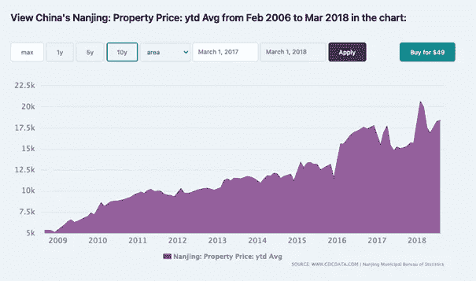

# 打开你的跨文化金钱思维

> 原文：<https://medium.datadriveninvestor.com/unlock-your-intercultural-money-mindset-350be943df9c?source=collection_archive---------30----------------------->

*吴雅思的客座博文*

认识一下吴雅思，她是超级聪明和精力充沛的创始人和创造者，是[快速生活](https://www.fasttrack.life/)的幕后人物，也是[快速播客](https://www.fasttrack.life/episodes)的主持人。她喜欢结识新朋友，进行引人入胜的对话。她的节目旨在帮助你获得在学校里学不到的最有见地的建议和忠告。她涵盖的主题从创业，个人理财，职业发展，等等，帮助你在快车道上启动你的生活！

Yasi | Fast Track Life

在今天的客座博文中，吴雅思写到了跨文化差异以及它们如何影响我们的金钱心态。在她的职业生涯中，她在 8 个国家生活和工作过！我们希望读者可以通过比较和结合不同心态的力量来学习——打开你的跨文化金钱心态！

发言是你的了，吴雅思！

在过去的几年里，我在不同的国家生活过。虽然文化差异是显而易见的，而且许多人都意识到了这一点，但金钱思维方式却没有被经常提及！

看到欧洲人对待金钱的方式与亚洲人不同，对我来说很有趣。虽然我只能分享我个人的观察和经历，但可能会引发一些自我反思，如果你的一些金钱观是从父母或社会遗传而来的话。理解为什么会有这些差异是值得的。

# 商店星期天关门

我记得当我第一次到达欧洲时，在法国，我不习惯所有的商店在下午 5 点或 6 点后关门。星期天几乎所有的商店都关门了。当我回到中国或新加坡时，我仍然可以去商店买些食物。我确信这对许多人来说也是一种文化冲击。

当时，许多来自亚洲国家的人都有一个问题:当他们可以赚更多的钱时，为什么要关闭商店？

如果你是来自欧洲国家的读者，你自然会理解为什么人们星期天不工作。这是一个休息日，花时间放松，在家或与家人在一起。

然而，据我观察，亚洲人有“好色精神”。他们努力工作，他们想为他们的家庭和自己创造更好的生活，他们愿意投入工作来实现这一目标。我认识的许多年轻人都有副业。他们调查如何购买房地产，如何在事业上取得进展，如何从投资中赚钱，如何在网上销售各种东西。

# 首先保存

中国文化中有一种“一般的金钱思维模式”:储蓄！

有句老话:未雨绸缪！

在你需要很多钱用于医疗费用，或用于退休，或用于孩子的教育之前，尽可能多地储蓄。也许有一天你会需要钱来应付紧急情况。几乎没有任何依靠社会系统的想法，无论是支付医疗费用还是退休。

例如，瑞士的养老金制度根据我的文章设计得相当好，查看我的文章[简单解释瑞士的养老基金](https://www.fasttrack.life/blog/simple-explanation-of-the-pension-fund-in-switzerland)。在新加坡，由于利率较高，人们可以很容易地[在他们的养老基金](https://www.fasttrack.life/blog/how-to-optimize-and-have-sgd-1-million-in-cpf)中积累超过 100-200 万新加坡元。

这就是为什么人们倾向于专注于储蓄以实现自力更生。我想是因为亚洲国家独立的历史较短，所以这些体系需要时间来进一步发展和完善。与独立了数百年的欧洲国家不同，他们有时间建立社会保障和养老金体系。

另一方面，如果一个国家有一个伟大的制度，公民全心全意地信任它。大多数人没有理由担心他们的退休、医疗费用和教育费用。这些是每个人的基本需求。因此，“未雨绸缪”的理由更少了。

高收入国家不一定有高储蓄率。一个年收入 10 万美元，花费 9 万美元的人的储蓄率只有 10%。而一个年收入 2 万美元、支出 1 万美元的人，储蓄率为 50%。同样的 1 万美元，可以产生完全不同的影响。

中国是世界上储蓄率最高的国家之一，新加坡也是如此。尽管《国际货币基金组织工作文件:中国的高储蓄:驱动因素、前景和政策》报告中的图表是 2017 年的，但它表明亚洲国家的储蓄率高于世界平均水平。

# 投资和房地产的作用

瑞士一直以其银行业而闻名。因此，银行部门有很多专业人士。他们拥有管理资金的教育和专业经验(我认为是这样)。如果你和 10 个瑞士人交谈，至少一半以上的人会对税收和投资有所了解。在瑞士，人们需要自己申报年度税收。令我印象深刻的是，政府希望每个公民都能及时报税。在新加坡，这通常是由公司完成的，你只需要进入门户网站，点击一个按钮。当然，你也可以雇人在瑞士帮你报税，但大多数都是自己做。对我来说，人们需要自己纳税的普遍预期是不寻常的。

我也认识许多投资贵金属、公司股票等的瑞士人。也许不是每个人都这样做，但以我的经验来看，这并不少见。

另一方面，中国的银行业或金融业仍在快速发展、繁荣和变化。因此，50 多岁或 60 多岁的人没有太多机会投资，尤其是那些生活在农村地区的人。因此，储蓄是他们所知道的保存他们的钱的唯一选择。

有趣的是，年轻一代甚至那些四五十岁的人已经开始投资基金和股票。最受欢迎的选择之一是自然房地产。房地产的作用被认为是一种基本需求，然后是一种投资。人们认为，当拥有房地产时，他们感到安全和稳定。在中国，拥有自己的屋顶是每个人的第一要务。夫妻结婚，首先需要自己的房产来组建家庭，而不是租房的房产。在瑞士，人们喜欢租房。

在瑞士，大约 30%的人拥有自己的房子，其余 70%的人租房住。租赁市场相当可靠，你受到合同保护，有时公寓业主是养老基金。所以你想住多久就住多久。中国和新加坡都不是这样。大多数租房的人都是从私人业主那里租的。因此，总会有一些不可预测的变化，例如，业主想出售或翻新公寓或突然要求更高的租金。

你可以想象，在中国，为购买第一套房产攒钱是很多人的头等大事。无论是基本需求还是投资，它都被证明是最好的投资。

让我给你举一个中国房地产有多“贵”的例子。南京是中国的一个城市，我没有选择北京、上海或深圳，因为那里的房地产价格非常高。我把南京作为公寓相对于平均收入有多贵的代表。

房价从 2006 年略高于 CNY 每平方米 5000 英镑(772 美元)到 2018 年 CNY 每平方米 18000 英镑(2780 美元)左右。仅在 11 年间就增长了两倍多。

我没有找到 2018 年的数据，即使是 2020 年，平均月薪也是 [CNY4623](http://salarycalculator.sinaapp.com/report/%E5%8D%97%E4%BA%AC/) 。它的意思是，如果你不花什么钱，你可以买得起 1 平方米。首付从 20%到 60%不等，取决于当地的规定和你的个人情况。为了攒钱买一套 80 平米的公寓，首付 20%，一个中等收入的人需要攒 5.2 年的钱，而不用花一分钱的收入！如果你需要存 40%，那么你已经存了 13 年了。

然而，房价可能会继续上涨，也许会再涨两倍？那怎么可能买得起自己的公寓呢？答案是来自父母储蓄或/和副业的经济支持。

当你有了孩子，你自然也会开始为他们存钱，这样当他们打算买房时，你就可以帮他们解决问题了。这就是 21 世纪初中国的情况。父母赡养子女，子女赡养子女。

许多设法购买多处房产的人都获得了惊人的利润，你可以看到市场增长了多少。

换句话说，在西方昂贵的位置:在瑞士，买一套公寓容易 5 倍。有了稳定的租房市场和体系，人们就不需要买公寓了。他们不需要更多的钱来支付首付，因此他们不需要兼职来创造更多的收入。生活舒服轻松多了。

# 家庭和金钱

在中国文化中，家庭之间互相借钱是很舒服的。可能是你姑姑向你妈妈借钱，或者你爷爷的哥哥向你爸爸借钱，等等。人们向亲戚借钱以备急用，以后再还，这是相当普遍的。最常见的例子是，当一对年轻夫妇即将结婚，他们需要一万多 CNY 作为首付，他们可以向亲戚借钱，以后再还。我认为这在欧洲不常见，至少在瑞士不常见。

# 向双方学习

有太多根深蒂固的社会原因影响着人们的行为。我对这个话题研究得越多，就越觉得把两种文化放在一起比较是不合理的。他们没有可比性，只是不同。

在我最近与 Marco Matti 的快速跟踪播客中，我们谈到了工作文化差异和社交媒体的作用，Marco Matti 以前在中国生活过，非常了解中国文化。我真的很喜欢他用开放的心态看待一切。

我认为我们每个人都可以从其他文化、心态中学习，选择最适合自己的。

Yasi | Fast Track Life

*非常感谢你分享你的见解，吴雅思！*

请查看[吴雅思和我的播客片段](https://www.financial-imagineer.com/fast-track-podcast/)，我们也欢迎你[加入我们每周的 Youtube 直播环节](https://www.youtube.com/channel/UCBsP7Wru_gVXXSAuAgtt8dQ)谈论金钱和生活。与吴雅思一起，我们也在努力学习[金钱课程，快速跟踪你的金钱生活，点击链接了解更多！](https://www.fasttrack.life/moneycourse)

请随意分享你自己关于跨文化心态和观点的经验！

敬请关注，稍后再聊，

马特(男子名ˌ等于 Matthew)

*原载于 2021 年 1 月 14 日*[*【https://www.financial-imagineer.com】*](https://www.financial-imagineer.com/intercultural-money-mindset/)*。*