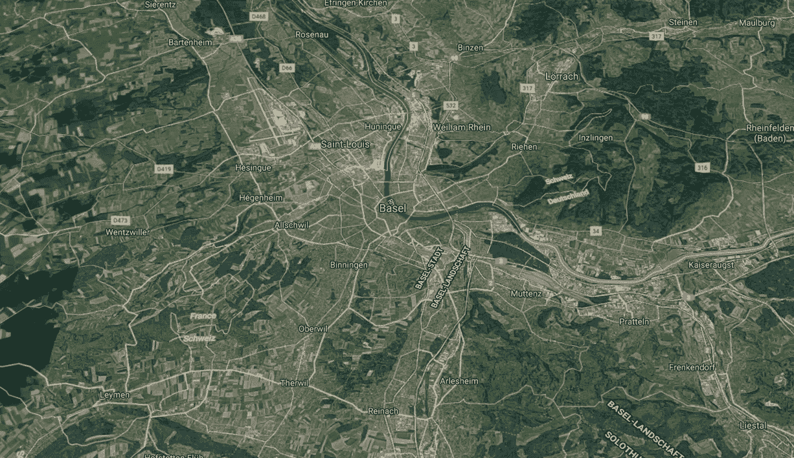
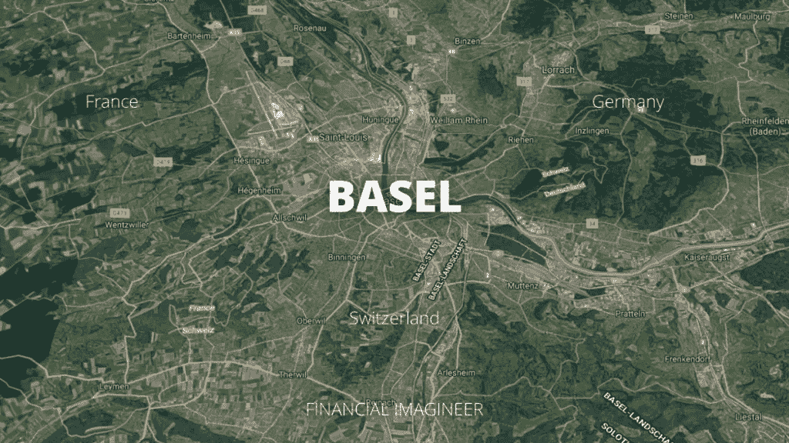
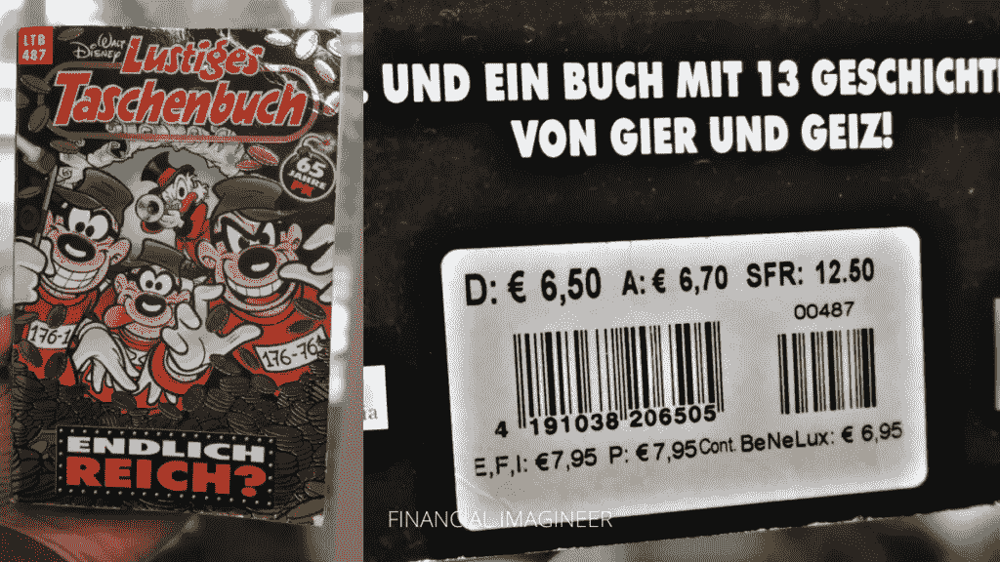

# 解开地理套利——金融幻想工程师

> 原文：<https://medium.datadriveninvestor.com/unlocking-geographic-arbitrage-financial-imagineer-b2ca79372131?source=collection_archive---------17----------------------->

如果你以前去过旅游，你肯定会注意到同样的东西在不同的地方价格会有很大的不同。这甚至可能发生在同一个国家内。

这是为什么呢？

[收入]收入潜力、税收、房租，一切都在变化，取决于你在哪里。都是供求关系。一些差异也可能与货币、经济实力、竞争或不同的征税方法有关。

> ***带走 1:***
> 
> ***东西在不同的地方有不同的价格。***

把钱花在该花的地方！

如果方法正确，地理套利可以释放巨大的潜力。

这是一个强大的工具，可以缩短你(提前)退休的时间，即使没有超长期的计划，它也可以立即将你的购买力提升到新的高度，提高你的生活质量，让你的钱花得更值。

简单的地理套利始于在高收入地区赚钱，同时在低生活成本地区消费。其中更复杂的版本将详细说明从哪里采购什么，并在所有财务方面优化以获得最佳结果。

> *带走 2:*
> 
> *同样的工作，根据工作地点的不同，工资水平会有很大的不同。*

从正确的位置赚钱！

你在旅行或位置独立性方面越灵活，你就越能利用双方的优势，你真正利用地理套利的潜力就越大。

地理套利被高度低估的第三个领域是:税收。

在欧洲，税收水平甚至因村而异！想象一下，如果你增加潜在的税务所在地和法规的范围，各种税法会有多么大的不同…

跨国公司已经将他们在这场游戏中的“玩法”提高到了极致。对于“自然人”来说，你应该花些时间来探索在收入、财产、资产、遗产、退休福利税方面的差异——你可能会对可能发生的事情感到惊讶。

> ***拿走 3:***
> 
> ***了解如何解锁税务代码，并相应地优化您的情况。***

地理套利——或简称“地理套利”——是一种识别价格、收益和税收差异的概念，同时找到利用它们的方法。

# 欧洲中心的地理套利

在你现在所处的地方，地理套利或许是可能的。以瑞士巴塞尔为例。我的家人住在这里。从我们家出发，开车 10 分钟就可以到达德国或法国:我们可以在三分钟内去购物。)不同的国家—只需不到半天的时间！

由于我们一直生活在新加坡、瑞士和台湾之间，并在法国和德国跨境购物，我们的孩子从很小的时候就意识到，要想“物有所值”，真正取决于“在哪里买什么”。

比较价格水平最常见的例子是巨无霸指数。

 [## 自然语言处理的五种金融应用|数据驱动的投资者

### 过去的五年对于自然语言处理领域来说是革命性的。我们从荣耀的 ctrl-f…

www.datadriveninvestor.com](https://www.datadriveninvestor.com/2020/09/17/five-financial-applications-of-natural-language-processing/) 

# 巨无霸指数

比较全球购买力最著名的方法是所谓的巨无霸指数。因为无论你是在美洲、欧洲、亚洲还是非洲订购，巨无霸都必须是一样的——这是在全球范围内能买到相同质量的极少数商品之一。

当然，一个巨无霸的价格可能会有很大的不同，这取决于你在哪里买。同样，这与许多因素有关，主要是:购买力、工资水平、租赁成本、所需质量水平的原料的可用性和价格。

点击[这里](https://www.economist.com/news/2020/07/15/the-big-mac-index)进入经济学人关于巨无霸指数的互动页面。

在巴塞尔地区，一个巨无霸在德国或法国的价格约为 4.79€(或 5.60 美元)，而同样的产品在瑞士的价格是 6.50 瑞士法郎(或 7.05 美元)——这是一个高达 25%的差价！

我儿子是漫画迷，喜欢看迪士尼漫画。德国版“Lustiges Taschenbuch”在德国的售价为€6.50 欧元，在澳大利亚为€6.70 欧元，而在瑞士为 12.50 瑞士法郎——考虑到汇率，最后的价格高出约 78%。78%!

因为我儿子用自己的钱买这些书，所以他经常坚持多花 10 分钟去德国，这样他的购买力可以提高 78%。还不错！

# 活地理套利

我们喜欢参观我们边境附近的餐馆、药店等。一些人也旅行去看牙医、理发和修理汽车。反过来，我们的德国和法国朋友来瑞士加油。许多人也喜欢在瑞士工作，因为那里的工资水平更高。

像我这样的经济学家对这三个国家的地区非常感兴趣。

近年来，由于网购习惯的增加，德国人甚至开始了一项奇妙的业务——它的名字被翻译成“送货地址服务中心”(原名:拉斯堡)。如果你和他们签约，你会得到一个“德国送货地址”,只需 1 分钟，你就可以用它在德国以更低的价格进行网上购物。一旦你的包裹到达，你会收到一封电子邮件通知，你有几天时间去取。这项服务的小成本是完全值得的。

互联网允许你从全球市场购买商品。你只需要了解任何潜在的运输成本或税收影响，这取决于你将货物运送到哪里。

数字游民生活在地理套利中，因为只要他们仍然以某种方式连接到互联网，他们就可以在任何地方轻松工作和生活。在像巴厘岛或泰国这样的地方，你的美元的购买力将会大大提高——有时你的钱会多花 5 到 7 倍，这取决于你用它做什么。

你现在可以住在任何地方，在任何地方出售你的商品和服务。

这是释放地理套利的真正潜力。

# 在线工具

地理套利最大的好处是什么？

你可以从舒适的家中开始比较不同的选择和场景。

看看这个神奇的在线工具来计划地理套利。

发现一个充满冒险的世界:[地球在等待](https://www.theearthawaits.com/)！

在这个网站上，您可以创建定制的生活方式，与朋友和家人比较和分享城市，等等！创作者希望帮助你环游世界，更好地生活，提前退休，进行惊人的冒险。

另一个很棒的工具是[瑞银价格和收益工具](https://www.ubs.com/microsites/prices-earnings/en/intro/):

该银行研究了全球 77 个城市的 128 种商品和服务以及 15 种职业的收入。超过 75，000 个数据点被收集并包含在他们的计算中。这项研究的结果是所谓的“价格和收入报告”，这是一项全球城市生活成本比较，对价格、收入、购买力和工作时间进行了单独调查。

基于这些因素中的一个来研究数据，你可以发现一个人为了购买最新的 iPhone，一条面包，或者，是的，巨无霸本身，必须工作多少小时。

# 结论

对于任何踏上财务独立或过上富裕生活之旅的人来说，地理套利是更快实现目标的最有力工具之一。

请不要着急，探索您可以选择的方案。

相信我，这是一个不可估量的生活黑客！

如果你觉得今天的帖子很有帮助，请考虑与你的朋友分享，不要忘记通过电子邮件订阅我的博客，[喜欢我的脸书页面](https://www.facebook.com/financialimagineer)或[在 Twitter 上关注我](https://twitter.com/FI_imagineer)。

快乐生活黑客！

马特(男子名ˌ等于 Matthew)

*原载于 2020 年 10 月 2 日 http://www.financial-imagineer.com**的* [*。*](https://www.financial-imagineer.com/2020/10/02/geographic-arbitrage/)

## 访问专家视图— [订阅 DDI 英特尔](https://datadriveninvestor.com/ddi-intel)