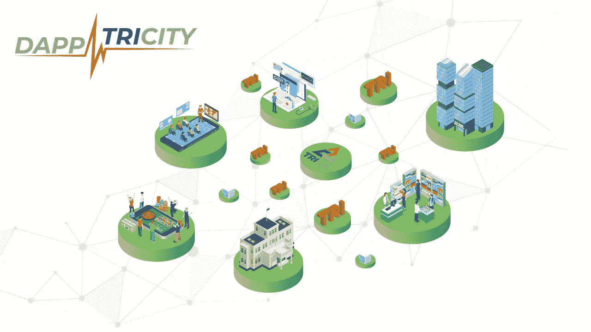
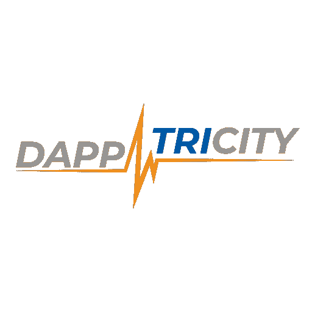

# 利用 DeCo 释放区块链的真正价值

> 原文：<https://medium.datadriveninvestor.com/unlocking-the-true-value-in-blockchain-with-deco-28a8fb7bd0b3?source=collection_archive---------15----------------------->

## 分散生态系统完全指南(DEFG)

Decentralized Ecosystems for everyone

## DeCo 是什么？(分散的生态系统)

想象一下这样一个世界:我们有更多的人为医学治疗做出贡献，有更多的合格医生、医护人员、设计师、科学家和各行各业拥有技能的专业人士。在我们目前的体系下，人们无法获得贷款来上学、创业或自由、轻松地为社会做贡献。他们在当前社会中面临着持续不断和不可战胜的问题，精英进一步壮大，而最需要帮助的人却深受其害。

有了 DeCo，所有这些人都可以获得他们需要和应得的基础，打开获得在线生活所必需的系统的平等机会。这包括所有银行业务，包括:

> 访问资产的安全存储
> 
> 在线购买和销售的能力(金融交易)
> 
> 接受贷款

> DeCo 可以为我们当前的系统提供急需的价值

 [## 区块链投票和美国选举|数据驱动的投资者

### 在不到 70 天的时间里，这个世界上最古老的民主国家将以前所未有的方式面临最大的摊牌…

www.datadriveninvestor.com](https://www.datadriveninvestor.com/2020/08/26/blockchain-voting-and-the-american-elections/) 

我们需要智能合同，DeFi 和 DeCo，用于可持续生态系统的不同部分。DeCo 的目标是在一个已经非常不稳定的市场中提供增长和可持续发展的价值，鼓励按需开发 Dapps(去中心化应用)和服务，而不是快速收益和短生命周期的令牌。

> 基于区块链的大众社区建设
> 
> 数百万条供应链
> 
> 无人掌权
> 
> 产品竞争
> 
> 消灭垄断

这就是 DeCo 的重要性所在，也是真正的去中心化所在。

去中心化的生活和生态系统有可能为任何拥有或只能使用智能手机的人打开巨大的限制，根据收集的数据，全球智能手机数量为 50 亿。通过简单地拥有一个设备来接收许多数字公民认为理所当然的日常访问，数百万人将能够满足我们对社会创新的不断增长的需求，创建新的安全框架和其他必要的工具，为世界各地许多生活贫困的人创建一个较低水平的入口点是实现这一点所必需的。

> 当世界能够共同前进时，我们都会受益。创新增加，贫困减少，全球范围内的问题都有了解决方案。

## 这是谁介绍的？

A World of DeCo — DappTricity Logo

[daptricity](https://dapptricity.com/)正与数字公民一起进行这一冒险，以创建所需的基础设施和释放区块链真正价值的目标。区块链不仅仅是一个输赢的地方，它可以有这么多。DeCo 提供了一种全新的方法，在日常生活中真正造福和服务于人们。

为辛勤工作的人们和开发者在世界各地创建第一个小型社区和 dapp 生态系统，该系统主要是分散的，最初帮助批准使用安全的 dapp。DappTricity 将试图降低所有在线服务的准入要求，不超过持有一部智能手机。该平台旨在成为生态系统内部去中心化的门户，使用第三方完全去中心化的应用程序。

最初，新兴市场是 DeCo 可以立即提供帮助的地方，它为非洲做出了贡献，成为帮助年轻人茁壮成长的基础，并使对持续和可持续服务的需求成为现实。DappTricity 认为，利用区块链的透明性、安全性和安全功能，以及 DeFi、智能合同和 DeCo，是区块链应用需要发展的答案。

毫无疑问，还会有更多。

更多信息，你可以访问他们的网站[这里。](https://www.dapptricity.com/)

> 区块链可以这么多，用 DeCo 解锁

## 获得专家观点— [订阅 DDI 英特尔](https://datadriveninvestor.com/ddi-intel)