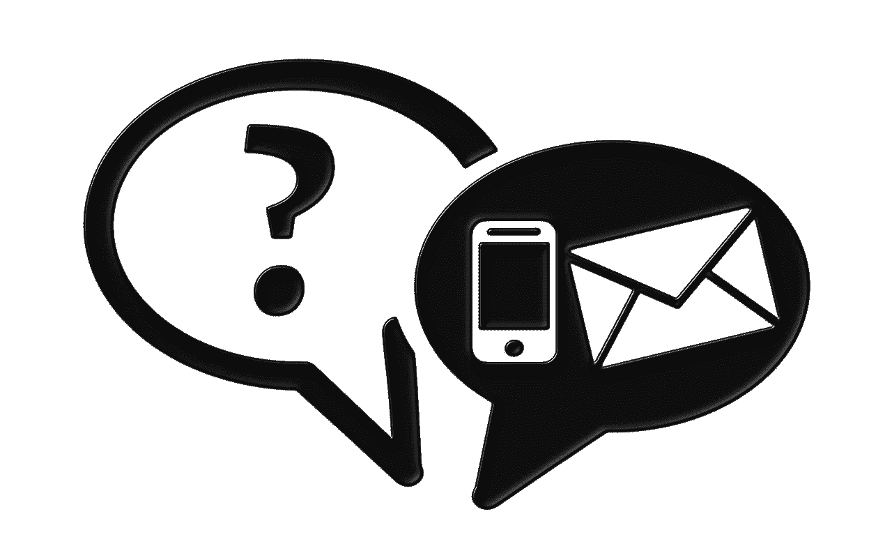

# 不受欢迎的观点:不要试图通过电子邮件合作

> 原文：<https://medium.datadriveninvestor.com/unpopular-opinion-dont-try-to-collaborate-over-email-cc328b3d82e1?source=collection_archive---------11----------------------->

我们有电子邮件、视频会议工具、短信、群发信息工具、更全面的协作工具，还有可信赖的电话。个人而言，我们可能更喜欢一个比一个更舒服，我们可能更喜欢这些工具给我们的保护和匿名。但是似乎有一个普遍的误解:选择交流工具并不是关于我们对什么感到舒服。这不是小事，尤其是现在越来越多的人远程工作。

我听到很多人说，除了他们选择的一个通信工具，他们不会为任何事情烦恼。不管有没有价值，像这样的绝大多数声明都是在为电子邮件辩护，并冒着冒犯一些人的风险，这些人来自更成熟的专业人士，他们几十年来几乎只使用电子邮件。大约 30 年前，当我在研究生院时，我第一次收到了电子邮件——当时，他们只允许那些证明有必要拥有一个用于研究目的的研究生使用学生电子邮件，不知何故，我能够提出一个令人信服的论点。

快进 30 年到今天。有很多文章解释了为什么电子邮件对普通人不再有效，我们可能都有一些可以联系的经历。我确信，即使是那些不想使用其他任何东西的人也有过这些经历，只是他们在否认中把它们挡在了脑海之外。你曾在群发邮件中，人们插话，邮件开始左飞右飞，最终导致误解、争论和对抗。你可能认为*你*对此感到舒服，你可能认为这与电子邮件无关。但就我所见，几乎总是如此。

那么为什么电子邮件并不总是有效的呢？首先，它只是增加了我们收到的电子邮件数量。我们今天已经收到太多电子邮件了。我现在每天只收到 100 多封电子邮件，我敢肯定这还不算多。如果你像我一样年纪大，你应该记得就在几十年前，物理垃圾邮件是每个人生存的祸根。今天，它只是以电子形式出现。我想我在某个地方看到，大量的电子邮件抵消了任何节能收益。电子邮件变得不如物理邮件环保。想象一下。容易和自由不等于好。

第二，电子邮件可能会丢失。谁从未丢失过电子邮件？我会等的。此外，如今垃圾邮件和垃圾邮件算法越来越强大，你通常无法控制自己想要什么被标记为垃圾邮件。我被多次要求通过电子邮件讨论一些事情，但收件人从来没有收到过，因为它被放入了垃圾文件夹。我不仅不相信通过电子邮件进行讨论，而且这实际上给我带来了更多的工作，因为现在我不得不跟踪何时我没有收到预期的回复，然后多次重新发送同一封电子邮件。一直以来，我都在试图让接受者接受一些我认为不应该做的事情。

第三，也是最重要的一点，电子邮件从来没有被设计用来做人们经常试图用它做的事情。电子邮件不是，也从来没有被设计成一个协作工具。这不是讨论的好媒介。虽然即使是最活跃的消息传递工具也可以非常异步地使用，但电子邮件在设计上就是异步的。电子邮件有停滞期，即邮件之间的时间间隔。故意的。这意味着你不能通过电子邮件进行对话。如果你认为它们是对话，那一定是你经常在每几句话后有不确定的死气沉沉的交流。

如果你在一段时间内持续监控电子邮件，期待着下一封邮件的到来，这样你就可以立即回复，这将是很奇怪的。对消息工具的期望是不同的。当对方在打字时，你看到了那些波浪状的点，你的信息大多是一句话。您可以与消息工具进行交互，尽管您不一定要这样做。

使用电子邮件作为协作工具比使用为协作而设计的工具更容易引起误解。电子邮件处理参与者之间的互动交流非常糟糕——这不仅是一个误解的机会，而且电子邮件没有被限制在预定的顺序。就在几天前，我参加了一个电子邮件讨论，讨论的对象是一群除了电子邮件之外不会被任何事情困扰的人。哦，人性。人们开始被第十四封邮件弄糊涂了，所以我打算推荐一个现场讨论。然后，当我点击回复第 14 封邮件时，第 15 封邮件进来了，一切都乱套了。

我最近看到一个帖子，如果你想给人留下深刻印象，你应该在两分钟内回复电子邮件。它说五分钟的反应太慢了。像这样的建议快把我逼疯了——它们让沟通永远无效。电子邮件要求至少有所考虑，以减少误解的可能性，在两分钟内，你不能“听”原始发件人，也不能有任何想法。如果这是你正在做的，电子邮件是错误的工具。你会花更多的时间来理顺事情。更糟糕的是，当别人认为你的交流缺乏真实想法时，祝你好运。

电子邮件是绝对不好的吗？我们是否应该转向消息传递？绝对不行。电子邮件更适合更正式或更深思熟虑的交流。有些情况下，发短信是无效的，甚至是不合适的。我的一位同事最近评论说，他的一些承包商希望包括正式合同在内的所有通信都只用短信发送。短信不是为正式交流而设计的。这些工具中的每一个都是为了做好某些事情而设计的，通常以牺牲某些其他事情为代价。

具有讽刺意味的是，我听到太多的数据和技术专业人士辩护说，电子邮件是他们无论如何都会接受的唯一解决方案。那些从事解决问题的人应该理解使用设计上不太合适的解决方案的影响。不幸的是，我们这些数据专业人士太擅长宣扬“照我说的做，不要照我做的做”的论调了。底线是，你对沟通工具的选择不应该基于你的个人偏好，而是基于什么使你成为一个更有效的沟通者。为什么你不想成为一个有效的沟通者呢？