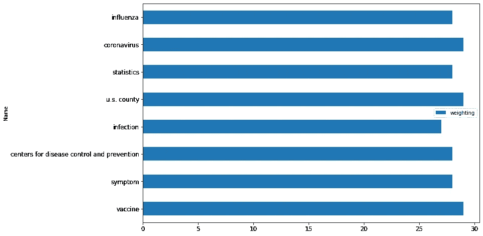

# 无人监管的群体智慧轮

> 原文：<https://medium.datadriveninvestor.com/unsupervised-crowd-wisdom-wheels-eed07f0d2030?source=collection_archive---------17----------------------->

> Investopedia 定义:群体智慧是指在解决问题、决策、创新和预测方面，一大群人集体比单个专家更聪明。

如果群体在很多情况下更聪明，我们如何系统地利用这种智慧？鉴于当前围绕新冠肺炎的全球形势，人群是一个被回避的词。人类将会反击和恢复，但是未来会是什么样子呢？人群、社交距离、锁定、共享等的场所是什么？群体智慧会怎么样？有办法捕捉到吗？

好消息是，它确实存在，并且已经通过社交平台延续了下来。想象一个 YouTube 推荐引擎。它的存在是由于群众的投入。类似的推荐和搜索系统使搜索引擎、商业网站等激增。这些系统由人工智能驱动，并一直在学习人群偏好。这能用来激发群体智慧吗？

 [## 人工智能和监督资本主义|数据驱动的投资者

### 大科技，总是现在:人工智能推动的大科技，已经使购物，搜索，在你的…

www.datadriveninvestor.com](https://www.datadriveninvestor.com/2020/03/04/on-artificial-intelligence-and-surveillance-capitalism/) 

目前的想法是在你的系统中使用人工智能来学习模式，这里我们把这个概念颠倒过来。我们假设另一个系统是智能的(有人工智能),并在算法上与它一起游戏，以获得群体智慧。

我们举个例子。人们围绕同一个概念进行数十亿次搜索，并使用多个查询。让我们来看几个热门话题，并体验一下这种方法。

深度学习……一个大的人工智能范例……很明显是趋势，正如下面的基本搜索查询所示。

相比之下，记住平板电脑…它们不是潮流。

回到深度学习……所有相关的查询和它们彼此之间的排名都是以编程的方式连接到一个网络中的。你得到的是下面的“群众智慧轮”。

这些都是围绕这个话题被搜索了几十亿次的查询。在中心是核心查询，在外围是较新的和较低频率的查询。

基本上，网络关键节点的流量可以被计算出来(那些连接到很多+在概念之间有多个短路径的节点)并被聚集以发现人们正在搜索的顶级区域。这个博客被简化为前 5 名。

深度学习是关于科学、预测、神经元、图形处理单元和群体智慧的数据。深度学习受大脑神经元启发，使用 GPU，需要大量数据。它的主要功能是预测。人肉搜索的足迹提供了答案。

整个事情是以一种“无人监管”的方式产生的。没有标签，没有训练…只是算法和其他 AI 系统一起玩。

新冠肺炎:观众对我们面临的危机有什么看法？曲线的形状表明了危机的严重程度。

这一轮有关于病毒和许多主要受影响国家的方面…中国，美国，意大利等

主要领域是围绕病毒本身，症状和感染。流感与此有关。人们需要疫苗。美国目前步履蹒跚。目前，世界正在关注一些关键组织，如约翰·霍普斯金疾病控制和预防中心(见《在轮子里》)等。今天，疾病传播的统计数据是雷达的中心。

有没有应该在中心而不是在中心的话题？有没有需要移到外围的话题？外围有新的趋势话题吗？该工具可用于引导对话。

随着人们与技术和人工智能系统的互动越来越多，一种新的学习范式将会出现，类似于上文所述。人们可以被理解，模式可以被破译，即使在“禁闭”状态下也可以在没有“接触”的情况下建立联系。

多亏了别人的人工智能，才能获得群体智慧。无人监管。