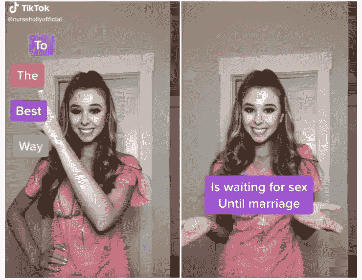

# 揭开抖音的阴暗面

> 原文：<https://medium.datadriveninvestor.com/unveiling-the-dark-side-of-tiktok-935dae2788bb?source=collection_archive---------0----------------------->

## 网络安全专家警告应用程序用户，对基于中国的全球轰动病毒的日益增长的安全担忧。

[PHOTO](http://Holly faced a backlash for her controversial view on STD prevention)

ikTok 是一个社交媒体应用程序，是一家在中国注册的公司。这股热潮兴起于疫情，并将世界推向了新一轮旋风。应用程序用户可以分享他们自己的视频，一些常见的功能是唇同步，舞蹈和喜剧小品。过滤器、音乐和动画都是应用程序的一部分，像大多数社交媒体应用程序一样，你也可以关注你最喜欢的影响者、喜欢并留下评论。然而，新视频应用的迅速崛起也引发了全球审查和诉讼，尤其是在美国和印度。

抖音的公司字节跳动是中国最有价值的科技初创企业。然而，抖音的恶名及其在中国的注册，引起了美国和其他国家的不满。——***但是是什么让抖音如此危险？***

## 未经授权的数据外包给中国

ikTok 暗示从用户那里收集信息是一种安全风险。今年一月，一项集体诉讼[在加州提起，指控抖音及其公司字节跳动非法收集数据并未经授权向中国传输数据。来自帕洛阿尔托的大学生 Misty Hong 提起诉讼，指控该公司侵犯数据收集和隐私权。洪的](https://www.cnbc.com/2020/01/09/tiktok-security-flaw-found-that-allowed-hackers-to-access-accounts.html#:~:text=Popular%20video%20sharing%20app%20TikTok,as%20a%20private%20email%20address.)[诉讼](https://www.thedailybeast.com/california-class-action-lawsuit-accuses-tiktok-of-illegally-harvesting-data-and-sending-it-to-china)对在上发布视频的过程提出异议，她指出，在录制视频和发布视频之间，有一个初始阶段，在用户不知情的情况下，保留视频并将其传输到的服务器，然后视频才能发布到平台上。

美国国会议员警告国家情报代理主任约瑟夫·马奎尔(Joseph Maguire)说，如果用户将数据分享给中国政府，抖音会给国家安全带来危险。

洪的案子即将开庭，她的律师和没有及时回复《每日野兽》的任何置评请求。

In India, however, a retaliatory measure launched by the state in response to the bloody border escalation happened last month that has claimed the lives of 20 Indian soldiers, by the virtue of [section 69A of the Information Technology Act, 2000](https://indiankanoon.org/doc/10190353/) and the [Blocking Rules, 2009](https://cis-india.org/internet-governance/resources/information-technology-procedure-and-safeguards-for-blocking-for-access-of-information-by-public-rules-2009). The report was confirmed by the Press Information Bureau that TikTok transmitted user's data to servers situated overseas and these apps are engaged in activities that are unfavorable to user privacy and the sovereignty of India. However, TikTok CEO denies all [allegations](https://timesofindia.indiatimes.com/business/india-business/did-not-violate-data-privacy-protocols-says-tiktok-ceo/articleshow/76740547.cms#:~:text=NEW%20DELHI%3A%20As%20the%20government,its%20popular%20apps%20TikTok%20and), cites “user privacy is protected.”

## **Political Censorship** And Interference

In the age of Communist China’s massive expansionism, TikTok is China’s large-scale censoring enterprise. In 2019, [The Washington Post cites](https://www.washingtonpost.com/technology/2019/09/15/tiktoks-beijing-roots-fuel-censorship-suspicion-it-builds-huge-us-audience/), “TikTok remains captive to the ruling regime’s ideas of appropriate content and censorship, and they point to the way the nation’s Communist Party has used it as a propaganda vessel for young audiences that might otherwise not seek out state-media news.”

> It was also reported that TikTok reportedly censors materials deemed politically sensitive against the Chinese Communist Party, including content related to the recent Hong Kong protests, as well as references to Tiananmen Square, Tibetan and Taiwanese independence, South China Sea dispute, and the treatment of Uighurs.

This issue was raised after a [high profile case filed by Feroza Aziz](https://www.abc.net.au/news/2019-11-29/tiktok-apologises-teen-aziz-feroza-muslim-uyghurs-video/11750934), a 17-year old from New Jersey where TikTok banned her account after her post criticizing the Chinese government’s treatment of the Uighur ethnic minority. In TikTok’s defense, the viral video was removed due to “human moderation error.” and has issued an apology later on.

今年早些时候，美国参议员乔希·霍利(Josh Hawley)提出了一项法案，禁止联邦雇员在美国政府和附属公司发布的设备上使用视频应用程序抖音，以应对中国发起的所谓间谍活动。

在即将到来的 2020 年美国总统选举中，[抖音已经成为一股政治力量](https://www.nytimes.com/2020/02/27/style/tiktok-politics-bernie-trump.html)，大多数青少年都在利用这个平台为他们的赌注竞选，但[美国参议员敦促情报界](https://www.cbsnews.com/news/senators-say-tiktok-should-be-investigated-by-u-s-intelligence-for-potential-national-security-risks/)密切关注抖音，因为它对选举构成了明显的威胁。

## 容易被贩卖的儿童

ikTok 在全球疫情的蓬勃发展尤其是因为青少年。无商业童年运动和隐私监督机构数字民主中心称，流行的[抖音](https://ciso.economictimes.indiatimes.com/tag/tiktok)视频应用违反了用户隐私法，并将儿童置于危险之中。

2019 年，[抖音的公司字节跳动因非法收集 13 岁以下儿童的个人信息，违反了联邦儿童在线隐私保护法，向美国美国联邦贸易委员会支付了 570 万美元的罚款](https://www.washingtonpost.com/technology/2019/02/27/us-government-fined-app-now-known-tiktok-million-illegally-collecting-childrens-data/)。后来，该公司修改了其应用程序，为年轻用户提供了受限模式。

然而，尽管该应用程序的新功能受到限制，[隐私监督组织还是很担心](https://ciso.economictimes.indiatimes.com/e/securitysense/sophos)，因为孩子们很容易在没有父母同意的情况下访问该应用程序，有些人使用虚假的出生日期来绕过成人版本的访问。

抖音在给《印度时报》的一份声明中回应道:“抖音一直非常重视隐私，并致力于确保这款应用对用户来说是一个安全且有趣的社区。”

## 数据采集

网络漏洞可以让攻击者操纵内容和提取个人数据。抖音固有的从用户那里收集大量信息的做法是一个安全风险。

7 月 1 日， [Forbes](https://www.forbes.com/sites/zakdoffman/2020/07/01/anonymous-targets-tiktok-delete-this-chinese-spyware-now/#39f432235ccf) 报道称，全球最大的黑客组织[Anonymous op regions](https://medium.com/u/70421c1b9e6d?source=post_page-----935dae2788bb--------------------------------)警告公众，并揭露视频应用 app 是中国政府的间谍软件。对抖音的审查反映在社交媒体上，这发生在 iOS 14 测试版推出后，一条泄露的信息声称该应用程序正在复制其用户的剪贴板。

据该组织称，[抖音从其用户那里收集以下信息](https://medium.com/@OPLegions/tiktok-is-a-spyware-deleted-ff55f0ca8c09):

> 电话硬件(包括 CPU 类型、课程数量、硬件 id、屏幕尺寸、DPI、内存使用、磁盘空间等。)
> 
> 设备上安装和删除的所有应用程序。
> 
> 网络相关信息(IP、本地 IP、路由器 MAC、您的 MAC、WiFi 接入点名称)
> 
> 设备软件状态(根/越狱)
> 
> 定位服务
> 
> 设备上用于转码媒体的本地代理服务器

然而，对于这一指控，抖音及其公司字节跳动保持沉默，至今没有发表任何声明。收集用户数据可能会对个人和国家安全产生潜在影响，这可能会让政策制定者有理由考虑对抖音采取更广泛的行动。