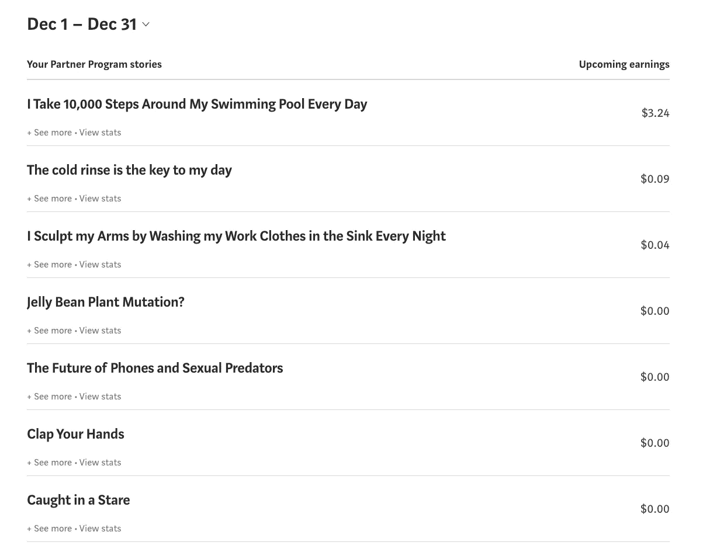

# 更新#1:写作的第一个月赚 5 美元

> 原文：<https://medium.datadriveninvestor.com/update-1-make-5-my-first-month-of-writing-c47af93353e2?source=collection_archive---------30----------------------->

photo by Dan Stout

*阅读本系列第一篇* [*就在这里*](https://boxyourbuddy.medium.com/start-small-make-5-your-first-month-of-writing-24a3173c3730) *。*

好吧，看来我选了一个愚蠢的时间来制定这个目标。我的意思是在这个时候它是完全可以达到的。我只需要在 1 月 14 日之前赚 5 美元，这就是我的立场:

总共是 3.37 美元。我也有了三个追随者，现在有 81 个。那些最初的 78 名追随者来自很久以前，我不确定他们是否还在，所以我觉得我好像是从零开始。

我遇到的问题是，许多出版物现在不接受投稿，因为是假期。咄。他们中的大多数将在 1 月 1 日重新开始。在这种情况下，我还假设当他们开始查看提交的内容时，会有相当多的备份。

不过没关系。我只是继续写我脑海中出现的东西，然后自己出版这些故事。我会把这当成练习，一旦新年到来，我的页面上会有更多的故事，将来会有更多的故事展示给编辑们。

我也通过留下评论、掌声和关注和我有同样爱好的人来和其他作家交流。我注意到，有时当我关注某人时，他们会进入我的页面并阅读我的文章。有些人甚至会跟着回来。

令人惊讶的是，我甚至没有写任何东西就做到了。我今后肯定会继续这样做。光是这一点就一定会让其他人关注我的故事，让我离自己的目标更近一点。

我还能做什么？必须有更多。

哦，对了，我还采取了大胆的措施，在 Medium 上开始了我自己的出版物[素食生活](https://medium.com/vegan-living)。这是一个我非常关心的话题，所以我知道我会尽我最大的努力继续下去。

我在这里也为自己设定了一个目标。再说一遍，这是一个小问题。我的希望是在 1 月 20 日，也就是我开始出版的一个月后，得到 7 个订阅者，并找到至少一个其他作者投稿。

我不知道会发生什么，但我必须尝试。我的目标是获得可观的订阅量，这样我就可以写关于纯素食主义的文章，并把它们发表在刊物上。

我决定这样做，因为我知道对某些人来说，素食这个词有点像四个字母的单词。这不是媒体上最受欢迎的话题。事实上，最受欢迎的素食刊物[温柔地](https://medium.com/tenderlymag)在 12 月份只发布了 7 篇文章，在 11 月份发布了 5 篇。

我个人认为这还不够好，因为素食主义比以往任何时候都更受欢迎。也许他们已经知道素食主义者的文章是没有用的。我不知道，但我肯定会在某个时候找到答案。我只希望我有他们的 34K 用户。

抱歉，我有点跑题了。这每天都在发生。

我的第一个月只剩下 1.63 美元。我明白了。

更多更新随后。