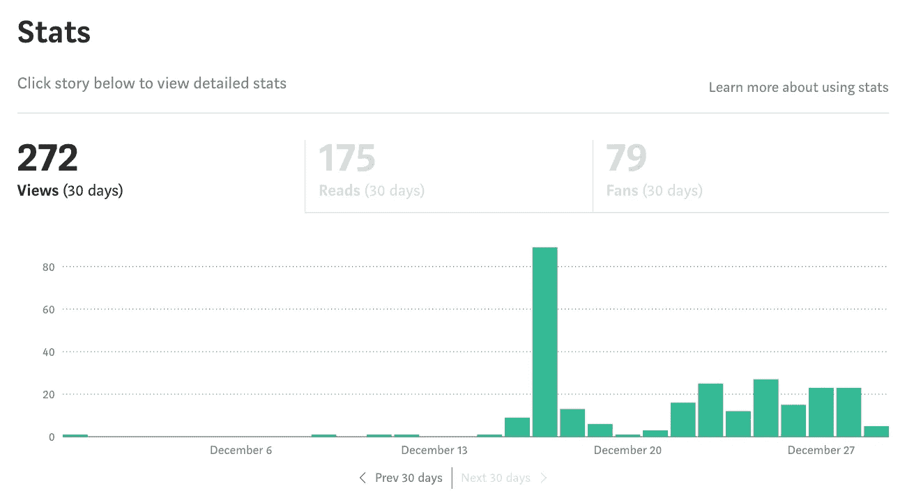
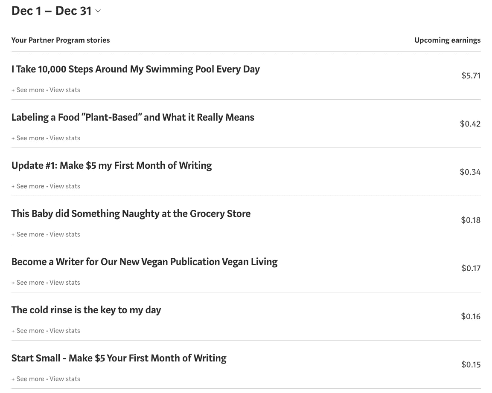
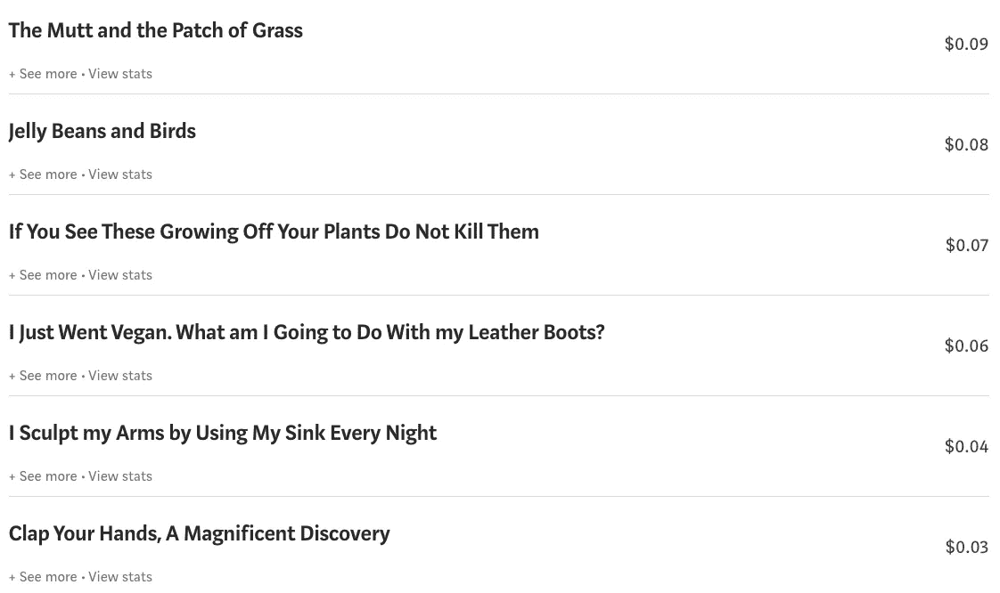

# 更新#2:写作的第一个月赚 5 美元

> 原文：<https://medium.datadriveninvestor.com/update-2-make-5-my-first-month-of-writing-bec431891447?source=collection_archive---------23----------------------->

Photo by [Sharon McCutcheon](https://unsplash.com/@sharonmccutcheon?utm_source=unsplash&utm_medium=referral&utm_content=creditCopyText)

这是我给自己的第三篇关于这个挑战的文章。如果你还没有读完前两部你可能想读读 [*原著*](https://boxyourbuddy.medium.com/start-small-make-5-your-first-month-of-writing-24a3173c3730) *和* [*第一更新*](https://boxyourbuddy.medium.com/update-1-make-5-my-first-month-of-writing-c47af93353e2) *。*

我们开始吧。

这几天我最大的外卖就是这个。如果我喜欢我读过的故事，我会给它一些掌声，或者留下回应。作者会经常回来，在我的一篇文章上还我人情。如此简单。

我不会对着一堆乱七八糟的文章鼓掌。我为我喜欢的人鼓掌。这样的话，如果那个人真的回来还我人情，我知道那是因为我感兴趣的事情。希望这意味着他们和我有相似的想法，并且会喜欢阅读我写的东西。它也可能毫无意义。

我不确定这到底是怎么发生的，但是《数据驱动投资者》杂志的一位经理在我写的一篇文章上留了一个便条。上面说他把我添加为作家，我现在可以在那里投稿了，事实上，你现在可能正在那个出版物上读这篇文章。

我很困惑，因为我不写投资，但我去了酒吧，看到了那里讨论的许多话题。所以，仅仅通过写点东西我就被注意到了。有趣的是它是如何工作的。

这是 12 月 29 日我站的地方。

如你所见，我的第一篇文章仍然是最成功的。我想这和标题有关。这是收益。

这总共是 7.5 美元！我已经达到了我的目标。我实际上在几天前就达到了，但我想每周更新这个故事，而不仅仅是在随机的时间。我知道这笔钱一点也不令人印象深刻，但它是值得的。

我也增加了我的追随者数量。现在是 185。我开始关注更多和我有共同兴趣的人。例如，我是一个自然爱好者，所以我在媒体主页上搜索“自然”。

我点击“人员”选项卡，浏览那里人员的简历。我寻找有相同兴趣的人并追随他们。我想有时候他们会出于礼貌跟回来，或者浏览我的故事，给他们一些掌声。我要了。可能给我赚了几个便士。

我不知道这些成员最终是否会成为我作品的真正追随者。我没想到他们会跟着我回来。我跟踪他们是因为我并不总是想读媒体想让我读的东西，比如我跟踪的主题中三年前写的流行故事或最受欢迎的故事。

我最喜欢在“你的网络新闻”区找到故事。今天的新故事是由我感兴趣的人写的。这正是我想做的。你做你的。

当有人跟踪我时，我会习惯性地访问他们的页面，阅读他们的一个让我感兴趣的故事，然后参与其中，给予一堆掌声或回应，作为直接的感谢。希望他们只是赚了几个便士。

我也需要更新你关于我开始纯素食生活的出版物。令人惊讶的是，我在那里有四个追随者，但还没有发现对提交故事的作家有任何兴趣。尽管如此，我仍然可以在一月的第三周实现七个追随者和一个作家的目标。

我有充足的时间。

达到 5 美元的目标感觉很好，但我知道我可以做得更好。我的挑战已经进行了两周，我仍然想继续写下去，所以我会的。

一周后见。

 [## 去公关还是不去公关？初创公司的 5 个关键问题|数据驱动的投资者

### 在 2015 年发表了一篇发人深省的观点文章，将围绕创业公司的新闻周期比作 12 小时的时钟…

www.datadriveninvestor.com](https://www.datadriveninvestor.com/2020/12/21/to-pr-or-not-to-pr-5-key-questions-for-startups/) 

**进入专家视图—** [**订阅 DDI 英特尔**](https://datadriveninvestor.com/ddi-intel)