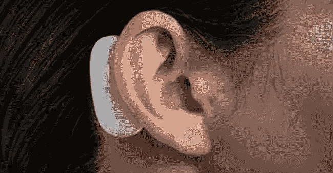

# 马斯克的 Neuralink 芯片更新

> 原文：<https://medium.datadriveninvestor.com/update-on-musks-neural-link-chip-b8dcf46b0724?source=collection_archive---------14----------------------->

到目前为止，你可能听说过埃隆·马斯克的 [Neuralink](https://www.neuralink.com/) 芯片，一种将融合人类和计算机能力的植入物。就在最近，这位技术亿万富翁透露了关于他迄今为止最雄心勃勃的项目之一的进一步信息。马斯克认为，这种芯片能够将听觉范围扩展到远远超过正常人的频率和振幅。然而，他没有提供任何关于这种设备是否可以帮助听力受损者的想法。显然，神秘的大脑刺激芯片将能够恢复脊髓完全切断的人的运动，帮助帕金森病患者，并通过调节激素水平来缓解抑郁症。

# 它是如何工作的

最终，马斯克公司的目标是将大脑与计算机能力融合在一起。使用一种类似缝纫机的设备，将线缝到植入的大脑芯片上，并将它连接到一根 USB-C 电缆上。这将使全带宽数据流向大脑。医疗程序包括移除一小部分头骨，然后插入直径一英寸的芯片。

在 Joe Rogan 的播客中，Musk 淡化了该程序的风险，声称身体排斥该设备的风险非常低。“人们植入心脏监测器和癫痫发作的东西，人造臀部和膝盖，诸如此类的东西，”他说，并指出“众所周知是什么导致了排斥反应。”

马斯克还表示，他的产品仍有待测试，但应该会在一年内投入使用。到目前为止，马斯克已经通过一系列推文分享了 Neuralink 芯片威力的片段，但他计划在 8 月 28 日进行公开展示，以提供有关该技术特性和功能的更多信息。

# 去过那里，做过那件事…算是吧

使用设备来解释和刺激大脑活动的概念并不新鲜；它们自 2012 年以来一直存在，当时科学家创造了一种允许瘫痪病人控制他们的机械臂的机器人。

埃隆·马斯克的想法有很大不同，他担心大脑植入是一个非常激烈的步骤，具有风险，可能不会有效，甚至可能不可能。一位技术专家坚持认为，不可能将知识上传到其他地方，然后再上传回大脑，他说这可能会成为伟大的科幻小说，但实际上这只是废话。

马斯克一直警告说，人工智能(AI)将在未来超越人类，似乎认为解决方案在于将人变成机器人，以实现某种共生。马斯克声称，有一天 Neuralink 将有助于人类意识超越人工智能，科学家对此存在分歧。