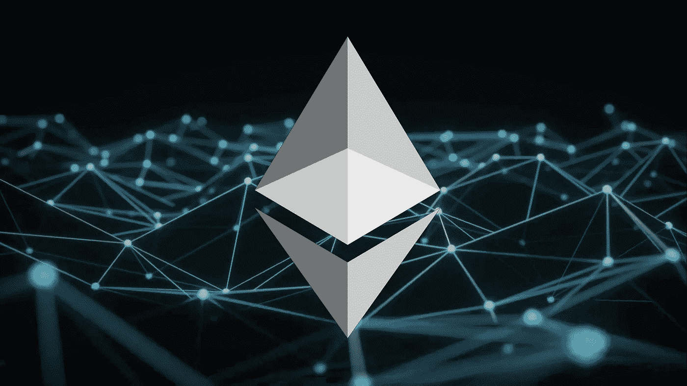
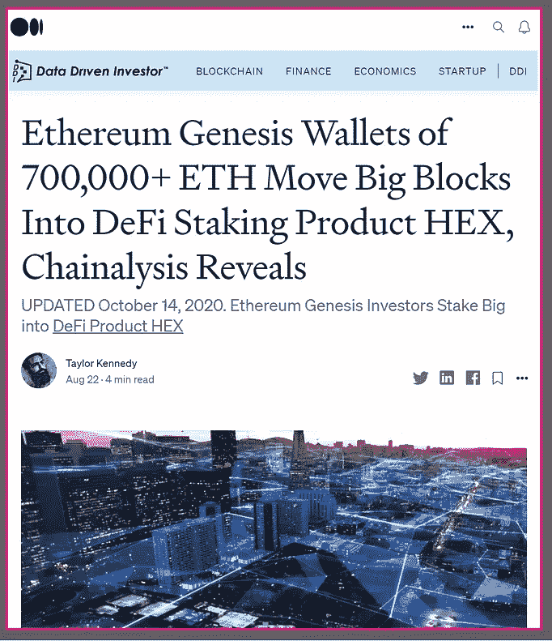
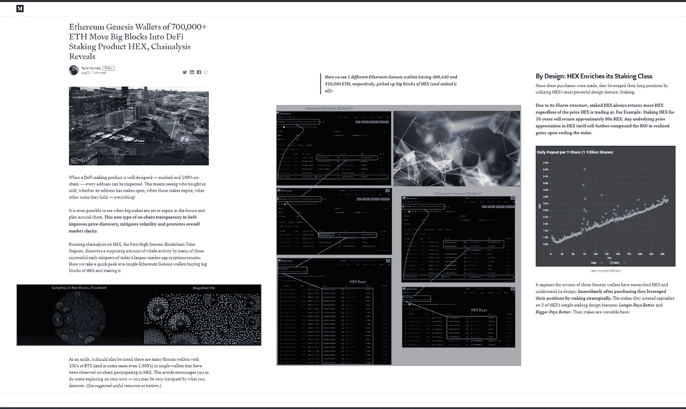
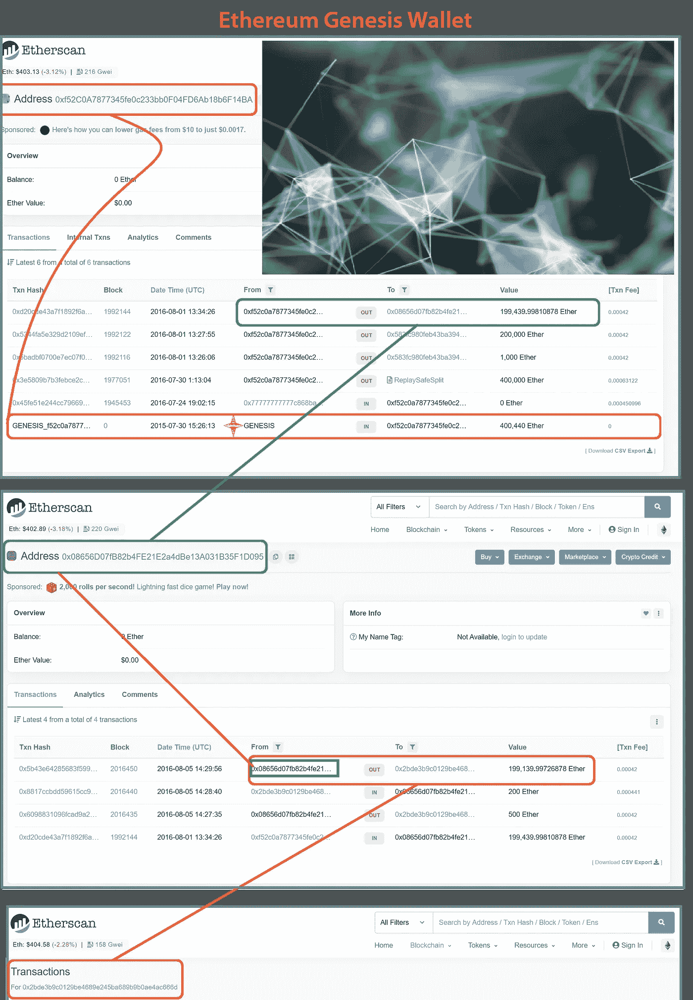
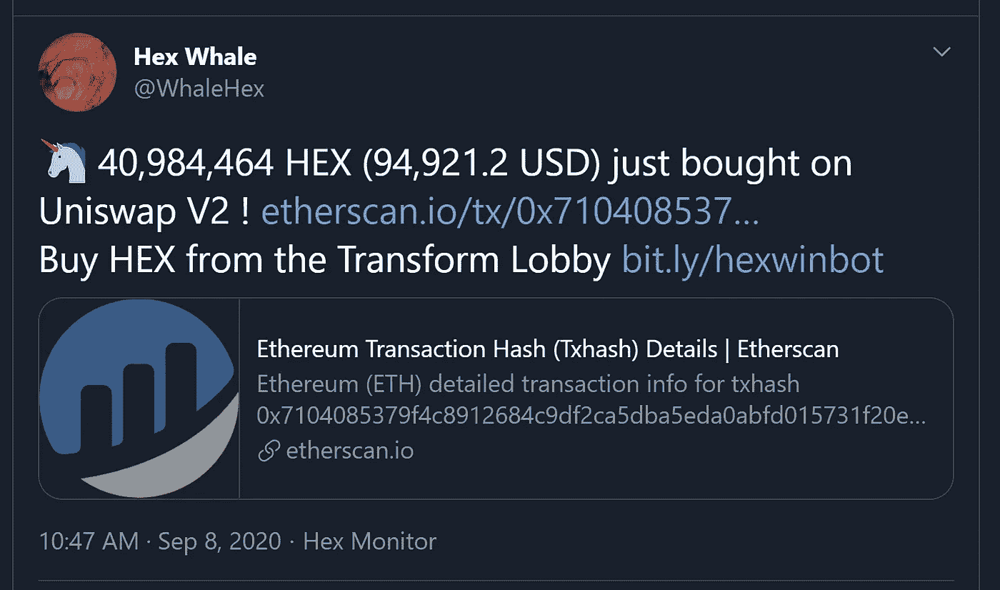
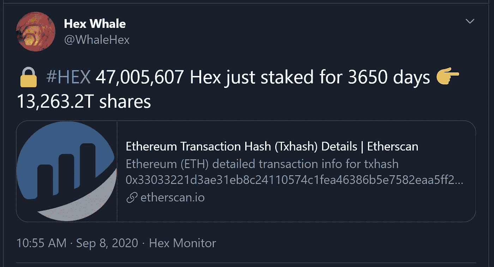
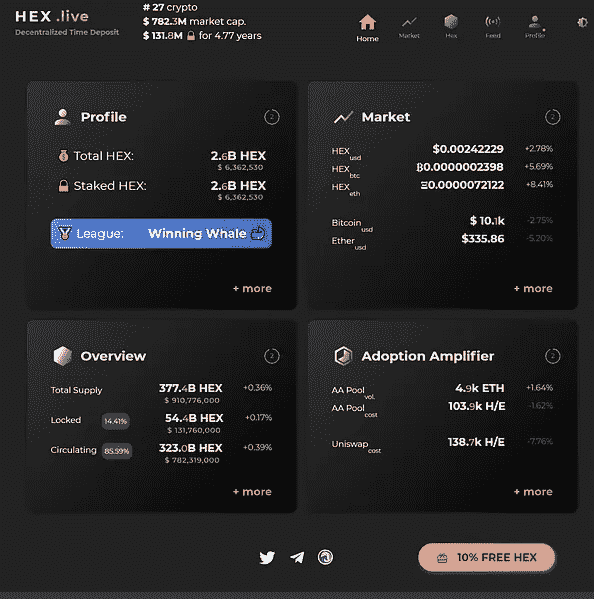
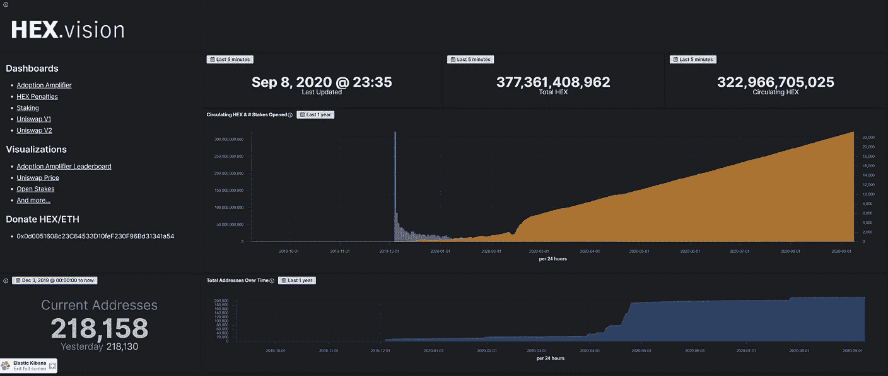
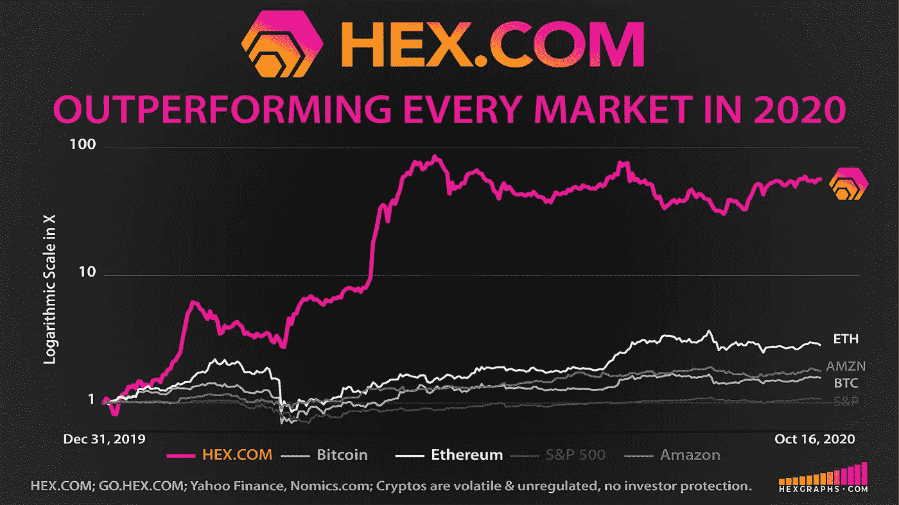

# 更新:他们回来了。Chainalysis 透露，400，000+ ETH 的以太坊创世纪钱包正在购买更多的 HEX (& Staking It)

> 原文：<https://medium.datadriveninvestor.com/update-theyre-back-60a31f3ed385?source=collection_archive---------1----------------------->

## 以太坊创世纪投资者的股份大进 [DeFi Product，HEX](http://www.hex.com)

如果你看到了原来的 chainalysis 文章，这个更新是特别为你准备的。如果你错过了，一定要去看一看。 [**点击此处查看全文**](https://medium.com/@tldrtaylor/ethereum-genesis-wallets-of-700-000-eth-move-big-blocks-into-defi-staking-product-hex-39107d2c9cc0?source=friends_link&sk=9d94d7dac1513414c3d01e6ae51ec4fd) **。**

Original Article

**这些以太坊创世纪钱包中较大的一个——准确地说是 400，440 ETH——又回来了:在撰写本文时，今天购买了价值超过 110，000 美元的 HEX。**

**今天的购买是在价值 19，678 ETH 的 HEX** **之外，这个相同的 Genesis 钱包已经购买并下注。**

[https://twitter.com/WhaleHex](https://twitter.com/WhaleHex)

## 这个钱包，再次像以前一样，通过利用 HEX 最强大的设计功能:赌注，立即利用他们的多头头寸。

## 在[HEX.COM](http://www.hex.com)了解更多有关 HEX 股票和赌注的非凡游戏理论

# 另一个有趣的观察:

原始文章使用了一个例子——由于 HEX 的独特和极其聪明的 S *hares* 设计——下注 HEX 10 年将返回大约 80 倍的 HEX；HEX 本身的任何潜在价格增值将进一步增加股权完成后实现收益的投资回报率。

**有趣的是，今天我们看到创世鲸正是按照那个例子所说的那样做的**，在 3650 天的时间里，也就是 10 年里，赌上了他们的全部购买(甚至更多)。

[https://twitter.com/WhaleHex](https://twitter.com/WhaleHex)

这些并不是 HEX 涉及的最大的钱包，这篇文章鼓励你自己去探索，因为大多数大的参与在这里根本不会被评论。事实上，对于那些对一些简单的挖掘感兴趣的人来说，你会发现近 30 亿美元的比特币(BTC)，在撰写本文时，正好有 247，088 个 BTC 参与了 HEX——所有这些都可以在链上验证。这也很容易进一步探索和看到的东西，如他们正在做什么与该妖术；他们用木桩支撑了多久；他们是否购买了更多产品；多少；诸如此类。

HEX 非常有意地让一切都变得显而易见:谁买了或卖了，一个地址是否有赌注，这些赌注何时到期，他们持有的其他硬币——一切。甚至有可能看到未来大额股份何时到期，并围绕它们制定计划。社区创建的网站如 HEX.live 和 HEX.vision(如下)非常有用:

[HEX.live](http://www.hex.live) and [HEX.vision](http://www.hex.vision) (above).

# 十六进制有 100%的正常运行时间，没有关闭开关

> “如果 HEX.COM 离线，理查德心脏死亡，妖术继续工作。许多项目声称是去中心化的，但实际上依赖于管理员不改变代码。十六进制代码不能更改。~HEX.com

# 赌注十六进制&看它倍增

[打桩工。App](https://staker.app/invite/PQn8) 允许您安全可靠地在链上积累 100%的财富，并实时观察其增长:

# 相关文章

# 有用的链接

1.  http://etherscan.io/
2.  【https://hex.live/ 
3.  [https://hex.vision/](https://hex.vision/)
4.  [https://hex.com/](https://hex.com/)
5.  [DeFi 2020 年最佳表现资产:旨在做一件事(而且做得天衣无缝)](https://medium.com/@tldrtaylor/defis-2020-top-performing-asset-designed-to-do-1-thing-and-it-s-doing-it-flawlessly-407d21c6a51d?source=friends_link&sk=17d5ce11956217cc82d9de370fa1e986)
6.  [DeFi 的精英以 2,000 TPS 的价格领先< $0.01/Tx、隐私、100%正常运行时间和审计](https://medium.com/@tldrtaylor/defis-cream-of-the-crop-blazes-ahead-with-2-000-tps-at-0-01-tx-privacy-100-uptime-audits-e3a0708b498a?source=friends_link&sk=85ab262c22f38942a755fc7fea188fc3)