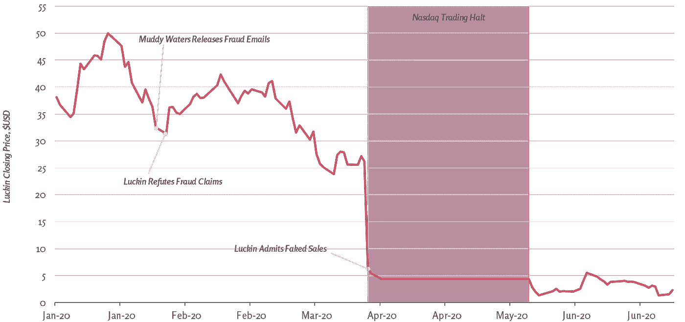

# 加大对中国企业的投资:美国政策制定者带来压力

> 原文：<https://medium.datadriveninvestor.com/upping-the-ante-for-chinese-companies-us-policymakers-bring-the-heat-1b704d0a82e5?source=collection_archive---------31----------------------->

Image via: [Adobe Stock](https://stock.adobe.com/)

# 摘要

两家引人注目的中国公司的会计欺诈动摇了全球投资者的信心，同时促使美国政策制定者和交易所推动对在美国上市的海外公司实施更严格的会计要求。中国监管机构是否会遵守仍有待观察。

***想呆在对一切都了如指掌的中国？订阅我们的时事通讯让真知灼见直接送达您的收件箱:【www.thechinaguys.com】*******。****

*………*

*尽管中国企业的会计欺诈并不罕见，但过去一年的两起重大案件尤其令市场不安。Luckin Coffee 和 Joyy Inc .的欺诈活动抹去了数十亿美元的市值，并导致美国呼吁中国公司提高会计透明度。*

*过去，嘉汉林业、、中国高速频道和卫龙石油等公司的欺诈行为已经搅乱了国际市场。这些欺诈案件中有许多是由小型卖空对冲基金揭露的，如 Kynikos Associates、Citron Research，更重要的是 Muddy Waters Research。作为 Luckin Coffee 和 Joyy Inc .欺诈案的举报者，Muddy Waters 在 2011 年揭露嘉汉林业的违规会计行为后首次声名鹊起。后来，当他们正确地指控中国忠旺(一家铝生产商)秘密将铝运往海外并储存在墨西哥沙漠以伪造收入数据时，他们的记录得到了巩固。鉴于他们过去在识别秘密交易方面的成功，许多投资者在将最近的两起案件提请媒体注意时，注意到了他们的警告。*

# *市场上没有快乐也没有运气*

*与过去的会计欺诈案件相比，Luckin 和 Joyy 事件对市场产生了更深刻和更广泛的影响。Luckin Coffee 被视为中国的星巴克，并迅速超过了总部位于西雅图的咖啡巨头在中国的扩张。Muddy Waters 发布了一家中国对冲基金的谴责信息，导致 Luckin 随后承认，他们 2019 年的增长数据是通过一项复杂的计划捏造的，以提高收入，此后公司的命运迅速恶化。2020 年 11 月，浑水公司还发表了一份关于 Joyy Inc .的报告，当时 Joyy Inc .正在向百度出售其直播部门。*

*这两起欺诈事件将对在美上市的中国公司施加更大压力，并可能阻碍其他公司上市，除非它们通过彻底而昂贵的审计和合规检查。纽约证交所和纳斯达克等美国交易所，以及原本可以进入美国资本市场的中国企业，都将感受到上市速度放缓的影响。*

*这些发现发生在一个对在美国上市的中国公司来说尤其糟糕的时期，因为国会已经在审议一项法案，该法案将要求交易所将不符合特定会计准则的中国公司摘牌。在这些欺诈案件被揭露几天后，该法案就轻松通过了。*

# *运气不好*

*2020 年 4 月，Luckin Coffee 的股票暴跌 75%，此前该公司宣布其报告的销售额中有很大一部分是捏造的。在此之前，Luckin 一直是中国发展最快的公司之一，也是美国大型投资者的宠儿。认罪产生了直接后果，促使其首席执行官珍妮·钱(Jenny Qian)被解职，进行了大规模的内部审查，美国证券交易委员会(SEC)进行了调查，纳斯达克于 2020 年 6 月 29 日将其股票摘牌。*

*Luckin 成立于 2017 年年中，其崛起令人目不暇接。在 2017 年底开设第一家门店后，Luckin 在接下来的一年内又开设了 500 多家门店。很快，该公司就超越了星巴克，成为了本土的成功故事。*

*在 2019 年 5 月上市后， [Luckin 筹集了 6.51 亿美元](https://medium.com/@smartkarma/in-hot-coffee-where-the-luckin-coffee-ipo-went-wrong-smartkarma-6abdeec3d6d5)，这笔资金专用于推进该公司到 2021 年底在中国开设超过 10，000 家门店的目标。在报道了 [558%的年同比销售增长](https://www.reuters.com/article/idUSSeekingAlpha430773920191119)后，Luckin 的股票在短短两个月内翻了一番。像 Lone Pine Capital、Point72 Asset Management 和 Louis Dreyfus 这样的知名美国机构投资者在 Luckin 持有大量投资，当时这些投资获得了丰厚的回报。*

## *2020 年:Luckin 股票倒霉的一年*

**

**Sources:* [*Yahoo*](https://finance.yahoo.com/quote/LKNCY/)*,* [*The China Guys*](http://thechinaguys.com/)*

*2020 年 1 月 31 日，当一封匿名电子邮件——后来被认为是中国对冲基金雪湖资本(Snow Lake Capital)——被发送给包括 Muddy Waters 在内的多个卖空者时，纸牌屋开始动摇。这份报告遭到了许多投资者的质疑，在过去几起中国公司欺诈事件被曝光后，这些投资者已经仔细审查了他们的中国头寸。事实上，Luckin 的股票在报告出来后几乎没有下跌，一旦该公司在 2 月 3 日否认了这些指控，股价在接下来的几周内继续上涨了 30%以上。Luckin 的审计师安永华明 LLP 将审查该公司 2019 年的收益结果，当时在 4 月 2 日，Luckin 透露，其 2019 年[报告的 7.32 亿美元](https://investor.luckincoffee.com/financial-information/quarterly-results)收入中有 3.1 亿美元是捏造的。*

*Luckin 的破产主要是由于规模较小的对冲基金，如 Snow Lake Capital 和 Muddy Waters。虽然安永华明在他们的后续调查中确实发现了欺诈行为，但一月份的一份早期报告未能发现同期的欺诈活动。此外，进行 Luckin 首次公开募股的大型投资银行瑞士瑞信银行在 Luckin 上市前进行了必要的尽职调查，但也未能发现任何欺诈行为，甚至在 Luckin 被吹的几个月前发布了一份报告，驳斥欺诈指控。紧随其后，另外五家知名券商[维持了对 Luckin 的“买入”建议。](https://www.wsj.com/articles/coffees-for-closers-how-a-short-sellers-warning-helped-take-down-luckin-coffee-11593423002)*

*2020 年 12 月 16 日，Luckin Coffee [宣布](https://investor.luckincoffee.com/news-releases/news-release-details/luckin-coffee-reaches-settlement-us-securities-and-exchange)已与美国证券交易委员会达成 1.8 亿美元罚款的和解。Luckin 现任首席执行官郭金义[声称](https://investor.luckincoffee.com/news-releases/news-release-details/luckin-coffee-reaches-settlement-us-securities-and-exchange)此次和解体现了 Luckin 的合作和致力于改善。*

# *百度没有快乐*

*相比之下，Joyy Inc .是直播行业在纳斯达克上市的领导者，声称全球用户超过 3 . 9 亿。[中国的直播产业](https://thechinaguys.com/chinas-live-streaming-e-commerce-reaches-new-heights/)规模接近 660 亿美元，由于新冠肺炎疫情，预计到今年年底将翻一番。在最近的收益报告中，JOYY [宣布](https://ir.yy.com/index.php/news-releases/news-release-details/joyy-reports-third-quarter-2020-unaudited-financial-results)中国互联网巨头百度将以 36 亿美元的全现金交易收购他们的直播业务 YY Live。*

*此次收购旨在支撑苦苦挣扎的流媒体平台的失误，同时也使百度的收入多元化，不仅限于搜索业务。百度的收入增长在过去一年有所下降，尤其是其内容流媒体部门爱奇艺。印度政府最近对 200 多个中国应用的禁令，加上对手字节跳动的激烈竞争，也侵蚀了百度的收入。百度联合创始人兼首席执行官李彦宏[宣布](https://ir.baidu.com/news-releases/news-release-details/baidu-acquire-joyys-live-streaming-business-china)“这笔交易将使百度成为领先的流媒体直播平台”，表明了此次收购对互联网巨头的重要性。*

## *Joyy Inc .的股票因 Muddy Waters 的索赔而暴跌*

**

**Sources:* [*Yahoo*](https://finance.yahoo.com/quote/YY/)***,*** [*The China Guys*](http://thechinaguys.com/)*

*仅仅两天后，11 月 18 日，浑水公司发表了一份[报告](https://www.muddywatersresearch.com/research/yy/1/)，指控 YY Live 进行了大规模欺诈活动，声称 YY Live 活动被误报高达 90%，几乎所有用户都是 YY Live 自己运营的计算机生成的机器人。卖空者在发现大多数机器人的移动设备 id(imei)链接回 YY 服务器，以及武汉的大量 imei "[显示的 IP 地址](https://d.muddywatersresearch.com/content/uploads/2020/11/MW_YY_11182020.pdf)在封锁期间莫名其妙地从一个城市跳到另一个城市后，得出了这一结论允许用户向内容创作者贡献的小费系统也被更恰当地描述为小费回收系统，创作者一次又一次地向自己赠送金钱以提高他们的统计数据。*

*该报告发布当天，Joyy 的股票暴跌了 26%。虽然百度和 Joyy 没有立即做出回应，但 Joyy 发布了一份[声明](https://www.bloomberg.com/news/articles/2020-11-18/joyy-shares-plunge-after-research-firm-says-it-s-a-fraud)谴责该报告，称“浑水的报告充满了对直播行业的无知……该报告包含大量逻辑不清、数据混乱和草率概括的错误。”无论如何，由于夸大的收入、增长和用户数据，一项集体诉讼[因证券欺诈而被提起](https://www.wsj.com/articles/joyy-update-01607787939?tesla=y)。*

# *2020:对中国企业影响深远的一年*

*在 2020 年揭露中国公司多起欺诈事件后，对所有在美国上市的中国公司都有广泛的影响。2020 年 5 月，美国参议院通过了一项法案，将未能满足萨班斯·奥克斯利法案规定的中国公司除名。该法案于 2020 年在安然(Enron)和世通(Worldcom)等多起高度可见的公司会计欺诈案件后通过，要求上市公司会计监督委员会(PCAOB)审查美国上市公司的所有审计。2020 年 12 月 2 日，众议院通过了同样的法案，目前正在等待特朗普总统签署。该法案[规定](https://www.wsj.com/articles/congress-sets-stage-for-exiling-chinese-stocks-from-u-s-over-audit-dispute-11606946071)在美国上市的中国公司必须允许 PCAOB 或任何 PCAOB 批准的海外机构检查他们的审计。目前在美国上市的中国公司在退市前将有三年时间来满足新要求的审计检查。*

*中国和香港有 250 多家公司在美国交易所上市，市值超过 2 万亿美元。当中国的 IPO 市场面临质疑时，正如蚂蚁金服的 IPO 失败所表明的那样，该法案增加了中国公司在不符合美国会计准则的资本市场上筹集资金的赌注。像阿里巴巴、JD.com 和网易这样的大公司已经开始在港交所两地上市，作为对潜在的美国退市的防范。*

*虽然该法案旨在维持美国上市股票的标准化报告要求，但大规模退市事件的影响也将对美国公司和投资者产生不利影响。纽交所和纳斯达克都从中国公司那里收取巨额上市费，并从交易中国股票的投资者身上赚钱。此外，由于流动性下降，任何退市都将导致投资这些股票的任何美国投资者遭受巨大的股东价值损失。公司和个人分散投资组合的能力也将明显受限，其中的机会成本将很明显，因为截至 2020 年 11 月中旬，上海证券交易所的表现比纽约证券交易所高出 11% 。*

*然而，萨班斯-奥克斯利法案也将中国企业置于一个困难的境地，这是由它们所处的政治经济的本质决定的。在许多情况下，中国政府引用国家安全保密法来阻止 PCAOB 全面审查审计报告，[让许多中国公司进退两难](https://thechinaguys.com/right-place-right-time-hong-kong-markets-benefit-from-us-china-tensions/)。如果他们遵守美国法规，他们将违反中国法律，但如果他们不遵守，他们将违反美国法律。*

*正如 Luckin 和 Joyy 的案例研究所示，快速增长的新兴公司犯下的欺诈行为有能力扰乱全球市场，甚至推动政策。尽管此类事件可能会在短期内吓到投资者，但美国市场对中国企业日益增长的需求过于强劲，不容忽视。虽然美国决策者已经开始采取措施解决在美上市公司的标准化报告要求问题，下一步将是[与中国监管机构](https://thechinaguys.com/tws-nov-30-2020/)合作，为中国公司确定一条前进的道路，以负责任地维持中国公司和美国交易所之间的共生关系。*

**原载于 2020 年 12 月 23 日 https://thechinaguys.com**[*。*](https://thechinaguys.com/us-policy-ups-ante-for-us-listed-chinese-companies/)**