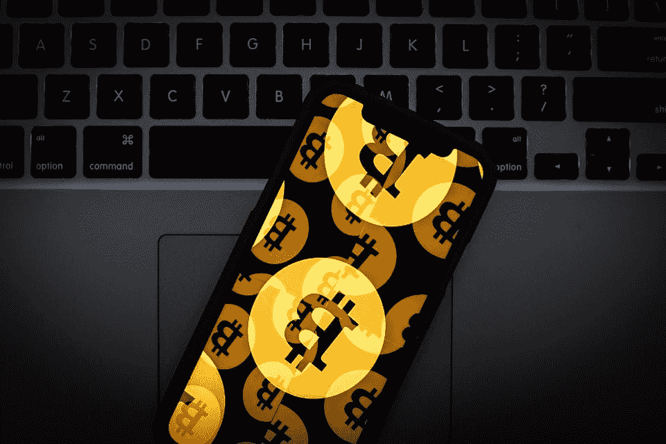

# 美国消费者需要一个移动银行桥梁来鼓励比特币支付。BlockFi 筹集了 3000 万美元来建造一个。

> 原文：<https://medium.datadriveninvestor.com/us-consumers-need-a-mobile-banking-bridge-to-encourage-bitcoin-payments-2641ec7a969d?source=collection_archive---------17----------------------->

Getty Images

比特币作为支付手段，是有限的。人们不能把它当作现金使用。但如果美国消费者可以大规模使用比特币作为现金会怎样？去优步还是去杂货店？BlockFi 认为，拥有信用贷款和奖励系统的移动银行服务将成为圣杯。他们获得了 3000 万美元的 B 轮投资来建造它。

BlockFi 在今天的新闻稿中说:“它已经在由梵拉风险投资公司牵头的 B 轮融资中筹集了 3000 万美元。其他参与投资者包括摩根克里克数字、PJC、阿库纳资本、CMT 数字、雅芳风险投资公司、城堡岛风险投资公司、紫色拱门风险投资公司、凯内蒂克资本、文克莱沃斯资本、阿灵顿 XRP 资本和总部位于香港的哈什基资本

 [## 5 行业转型区块链应用|数据驱动投资者

### 除非你一直生活在岩石下，否则我相信你现在已经听说过区块链了。而区块链…

www.datadriveninvestor.com](https://www.datadriveninvestor.com/2019/02/13/5-real-world-blockchain-applications/) 

BlockFi 是一家加密贷款公司，但他们预计比特币的增长依赖于美国消费者投资和使用加密进行日常购物。

Flori Marquez 是 BlockFi 的联合创始人和运营副总裁，总部位于纽约市。她告诉我，美国市场的增长是鼓励加密货币成为可接受的支付手段的最佳方式。

“我们如何才能让从未投资过 crypto 的人轻松尝试它作为替代方案？”她说。为了实现这一目标，马奎兹预计在 2020 年推出一项移动服务，将银行账户与他们的贷款服务联系起来。

虽然这并不罕见，但比特币基地或 Coinmama 等其他服务也提供信用卡购买和银行账户链接，美国市场在普遍使用这些服务方面进展缓慢。

马尔克斯的愿景是提供信用卡服务、基于利息的资产回报和奖励系统，作为对加密货币的投资，以激励消费者。

关于加密的监管规则是一个移动的目标，可能会改变。像 BlockFi 这样的民营企业，是不会等的。如果他们能够创造一种服务，在数字代币和现金之间提供一种常用的桥梁，遵守美国当前的合规性和监管规则，他们的服务可以帮助推动需求。

BlockFi 的增长在很大程度上是由机构投资推动的。他们管理着 6.5 亿美元的资产。

马尔克斯解释说，他们对主流投资者的关注是他们未来继续增长的重点。“对大多数人来说，加密货币是一种投机小说。对这些资产的采用受到普通消费者理解如何使用它们的能力的限制，”Marquez 女士说。“我们已经证明，我们可以围绕加密货币构建金融产品，这些产品的外观和感觉可以像你手机上已经有的应用程序，我们已经做好了推动主流采用的准备。”

*最初发表于*[*【https://www.forbes.com】*](https://www.forbes.com/sites/robertanzalone/2020/02/13/us-consumers-need-a-mobile-banking-bridge-to-encourage-bitcoin-payments-blockfi-raised-30-million-to-build-one/)*。*