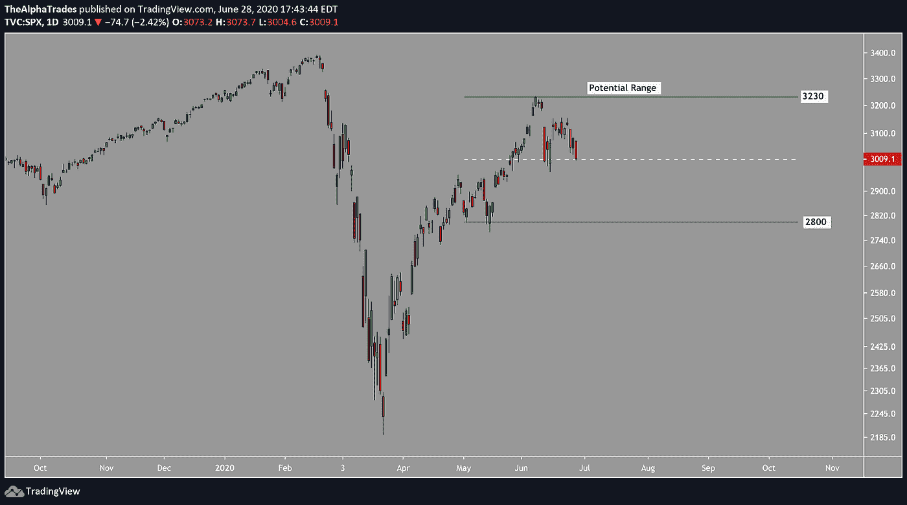
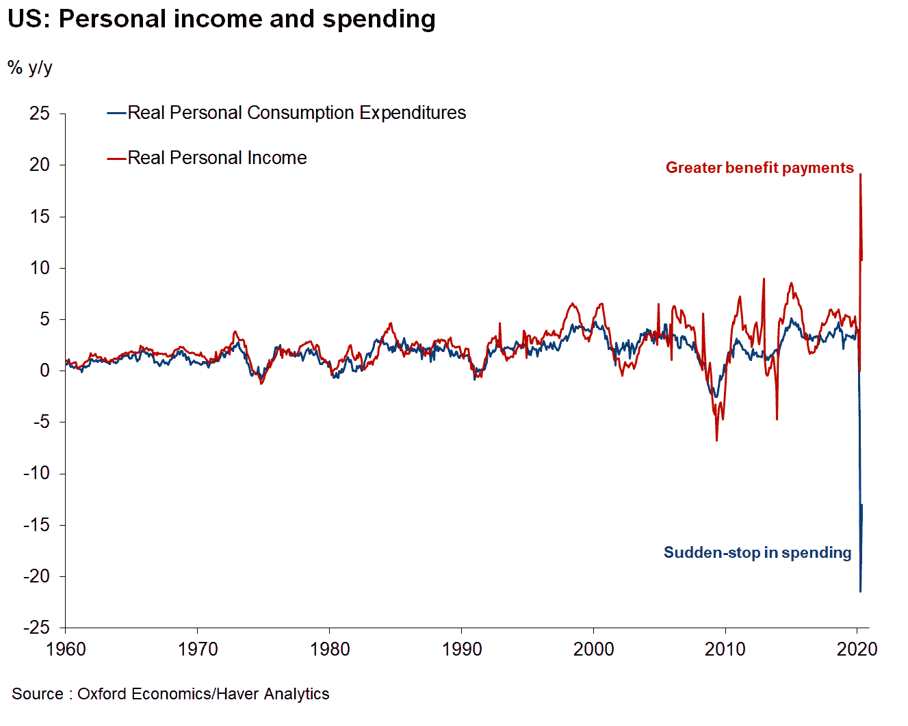

# 美国股市每周更新|阿尔法交易

> 原文：<https://medium.datadriveninvestor.com/us-stock-market-weekly-update-alpha-trades-5214dbe5b2ea?source=collection_archive---------11----------------------->

Image by [nile](https://pixabay.com/users/nile-598962/?utm_source=link-attribution&utm_medium=referral&utm_campaign=image&utm_content=620397) from [Pixabay](https://pixabay.com/?utm_source=link-attribution&utm_medium=referral&utm_campaign=image&utm_content=620397)

**三个外卖:**

1.  在刚刚过去的这个周末，市场严重超买。随着[重新燃起对新冠肺炎病毒的恐惧](https://www.google.com/url?q=https://www.nytimes.com/2020/06/24/world/coronavirus-updates.html&sa=D&ust=1593447698259000&usg=AFQjCNEM2C_DQerLIm-q1SvWbRuyWkw0hg)以及[联储稍微放松油门](https://www.google.com/url?q=https://www.rollcall.com/2020/06/26/states-need-money-the-fed-has-it-politics-may-be-an-obstacle/&sa=D&ust=1593447698258000&usg=AFQjCNFjQz15SsIPH0h2AgMCO94E4cOcmA)，可能会有一些获利回吐。我们又要进入波涛汹涌的水域了。如果本周标普指数跌至 2900 点以下，不要感到惊讶。

# 冠状病毒第二波压力市场保持区间。

本周 S&P 下跌 3%，但苹果(AAPL)等股票继续创出新高。DocuSign(DOCU)和 Spotify(SPOT)等其他公司本周也上涨了 10%以上，其中许多高增长公司继续逆整个市场的趋势而动。与此同时，整体市场不仅受到航空公司和救助部门的拖累，还受到一些工业和房地产公司的拖累。随着新冠肺炎第二波浪潮对经济造成损害，我们可能会看到价格行为回归，类似于 3 月下旬美国国内股票的表现。动视(Activision)等游戏公司可能会再次跑赢大盘。我们认为，在第二波浪潮的经济影响得到更好的理解之前，未来几周大盘将在 S&P 2800 美元和 S&P 3230 美元之间波动。

 [## 利用股市相关性的最佳方式|数据驱动的投资者

### 当阿尔弗雷德·温斯洛·琼斯开创了世界上第一个“对冲”基金(后来“d”被去掉了)时，他让其他投资者大吃一惊…

www.datadriveninvestor.com](https://www.datadriveninvestor.com/2020/02/02/the-best-way-to-use-stock-market-correlations/) 

如果市场突破了这个区间，这将意味着科技、价值板块和高增长股票都将在这个过程中发挥作用。这种后果的不确定性与最初导致它的原因一样多。上述板块的获利回吐可能非常巨大，因为它们相对于市场其他板块的涨幅如此之大。一旦大规模获利回吐开始，这将加剧整个市场的抛售，在几周内下跌多达 10%。

# 科技行业仍是一个异数，但美国大选将抛出一个比冠状病毒第二波更难预测的曲线球

现在市场上有令人难以置信的流动性。在接下来的一周左右，我们可能会看到市场快速回调 10%。因此，我基本上保持中立，主要兴趣在科技领域，因为这是明显的离群点。

特朗普已经给了美国企业很多免费的钱，所以随着我们越来越接近大选，看起来拜登可能会领先，市场将如何反应？

我认为选举结果导致出售的可能性很高。在民主党掌权的情况下，第一个命令将是削减国防开支，这对国防股票不利。真正的机会将是专门从事人工智能和 5G 的软件领域中的中盘高增长科技股。

sp500 range; Source: Alpha Trades

# 后电晕时代，商业地产领域将会大不相同

曼哈顿写字楼的租金下跌了约 26%,而在家办公的实验对许多曾经花钱购买办公空间的公司来说前景光明。

这种趋势在 COVID 之前已经发展了几年，随着在家工作技术的不断改进，这种已经加速的趋势应该会继续下去。显然，COVID 加速了这种变化。

# 消费者习惯[正在改变](https://www.vendingmarketwatch.com/healthy-convenience/news/21141842/85-of-americans-have-altered-their-eating-or-food-prep-habits-due-to-covid19)，他们不再去办公室了。

消费者在很大程度上仍然感到恐惧。消费者支出仍比 2 月份水平低 11%，服装、医疗保健、娱乐、食品服务、住宿和汽车类支出大幅下降。与此同时，微软宣布他们将[关闭零售店](https://news.microsoft.com/2020/06/26/microsoft-store-announces-new-approach-to-retail/)，这是对房地产公司的又一次沉重打击。

# [脸书面临“仇恨言论”的负面影响](https://www.nytimes.com/2020/06/26/business/media/Facebook-advertising-boycott.html)

只要价格在 200 美元以上，脸书就可以买。他们的广告价值太高了。即使有公司退出，我也怀疑他们会永远退出。脸书旗下的 Instagram 的市场份额可能会受到抖音的威胁。就像脸书一样，抖音也是一家大型数据挖掘公司。根据他们如何处理这些数据，失败者可能会超过市场领导者。

# [三星正在潜入 5g 空间](https://news.samsung.com/us/samsung-telus-5g-provider-canadian-operator/)，触及从无人机到人工智能的一切。

无论谁赢得 5G 市场主导地位的战争，他们都必须首先通过 TSM，这是一家管理良好的公司，没有太多竞争。Skyworks (SWKS)是我关注的另一个名字，他们建造手机信号塔。

美光是一家我非常看好的公司。首席执行官对 5G 进行了广泛的评论。这家公司的股票可能会在未来一两年内爆炸式增长，因为它是少数几家 5G 相关半导体公司中没有达到历史高点的公司之一。

## **外贸外卖:**

S&P500 (SPX):短期看跌，短期目标 2965-2935

脸书(FB):短期看跌，做空目标 200 美元至 205 美元
:提示:如果 200 美元至 205 美元作为支撑位，买入机会

美光(MU):收益相关，长期目标为 52 美元至 54.5 美元

# 和我们一起聊聊市场

*我们正在寻找客人，所以如果你想顺便来聊聊市场和经济，我们邀请你参加* [*加入不和*](https://bit.ly/AlphaTradesDiscord) *并给任何一位管理员发送消息。如果我们有一个爆炸在一起，我们也会在我们的分销渠道的特点你。*

# 想免费试用 Advantage 两天吗？

[订阅 Discord 服务器](https://bit.ly/2KJ1oor)学习技术分析以及如何投资获利。询问 2 天的高级会员试用！

# 放弃

Alpha Trades，LLC 提供的信息不用于制定任何财务决策，也不是购买、持有和/或销售特定产品、数字资产或 ICO 的请求或建议。

访问我们的完整服务条款:[https://bit.ly/3faVeeV](https://bit.ly/3faVeeV)

**访问专家视图—** [**订阅 DDI 英特尔**](https://datadriveninvestor.com/ddi-intel)