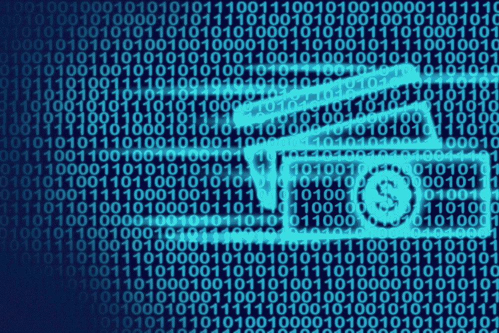
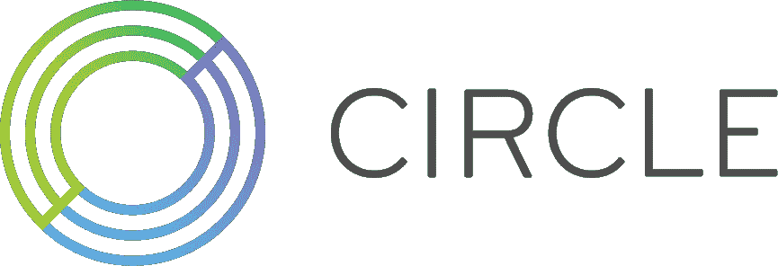

# 美元硬币:又名“数字美元”

> 原文：<https://medium.datadriveninvestor.com/usd-coin-aka-the-digital-dollar-74a9fe84f412?source=collection_archive---------34----------------------->

There’s been rumblings that the FED is looking to replace the dollar with a digital counterpart. In this article let’s talk about a stablecoin called the “USD Coin”.

加密货币引领着去中心化世界的潮流。它们以不受通胀影响、安全、不幸的是极不稳定而闻名。但是，随着 stablecoins 的引入，有一些方法可以缓解这个问题。

Investopedia 对稳定货币的定义是，它们是一种新的加密货币，试图提供价格稳定，并由储备资产支持。Stablecoins 获得了牵引力，因为它们试图提供两个世界的最佳选择——加密货币支付的即时处理和安全性或隐私，以及法定货币的无波动稳定估值。Tether 是 2015 年发布的最具影响力和争议性的 stablecoins 之一，目前市值为 214.1 亿美元。它还面临一项诉讼，指控他们有欺骗性、反竞争和操纵市场的行为。

排在第二位的是市值为 35.9 亿美元的美元硬币(USDC)。USDC 于 2018 年 5 月由 Circle 首次发布，并于 2018 年 9 月推出。它也由比特币基地管理。USDC 是菲亚特支持的稳定货币。它可以在交易所交易，也可以从发行人处赎回。它的价值与美元挂钩，这种挂钩是通过受监管的金融机构实现的，这些机构是用来支持稳定的货币的储蓄机构。简单地说，这意味着你可以**一直用 1 美元硬币兑换 1.00 美元**。最近，福布斯报道说，Visa 正在将其 6000 万商户的国际支付网络与美元硬币(USDC)连接起来。Circle 正在为整个区块链生态系统快速增值！

 [## 出土加密宝石蓄势待发|数据驱动的投资者

### 你并不总是有第二次早期发现的机会。无论是股票，加密货币，还是收藏…

www.datadriveninvestor.com](https://www.datadriveninvestor.com/2020/12/17/unearthed-crypto-gem-poised-for-resurgence/) 

# **ERC20** 代币

USDC 可作为以太坊 ERC-20。ERC20 令牌用于以太坊区块链上所有智能合约的令牌实施，并提供了所有基于以太坊的令牌必须遵守的规则列表。现在以太坊区块链的所有玩家都可以开始使用 USDC 了。目前，这种硬币正在各种市场上使用，如 Crypto Kitties，作为一种稳定的硬币，允许用户使用信用卡和借记卡系统购买物品。随着信用卡和借记卡支付的流动，以及金融机构可以对 USDC 进行编程的许多方式，未来将是真正值得期待的。事实上，目前只有 10%的余额由现金支持的部分准备金制度可能会被推翻，因为 USDC 是 100%由现金支持的。

## 访问专家视图— [订阅 DDI 英特尔](https://datadriveninvestor.com/ddi-intel)