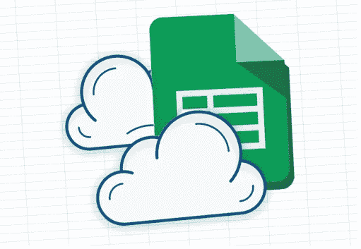
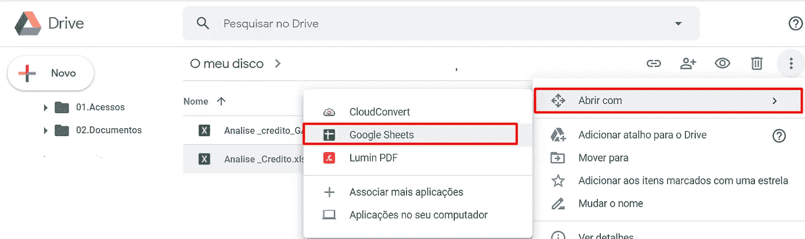
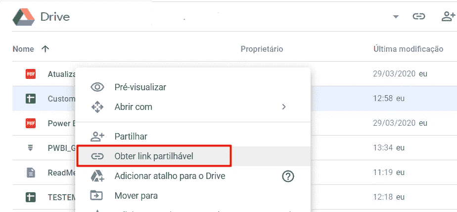
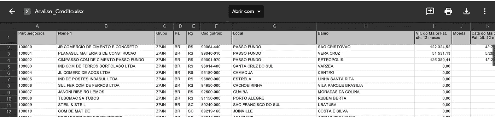
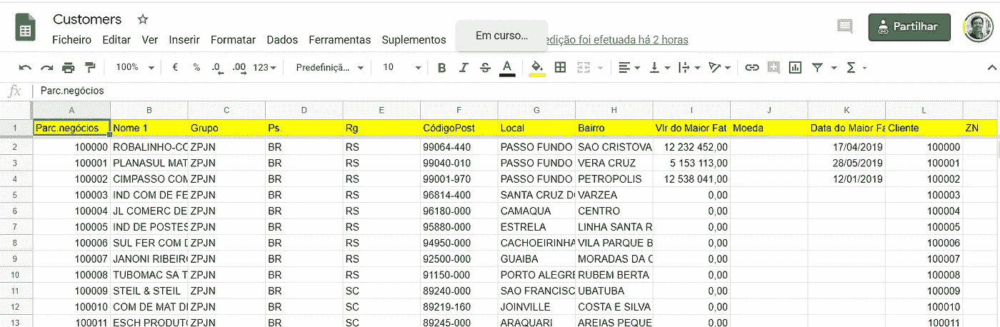
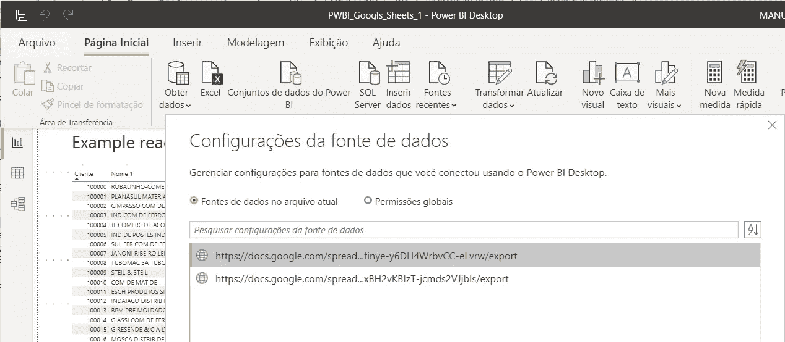
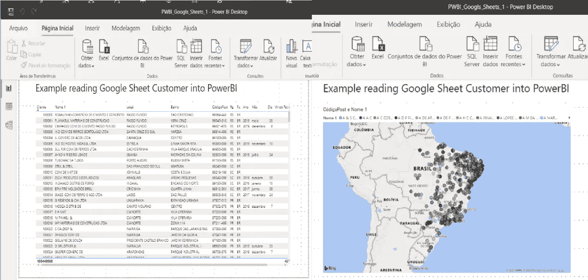

# 使用 Google Sheet 并继续！

> 原文：<https://medium.datadriveninvestor.com/use-google-sheet-and-go-on-3603f2999592?source=collection_archive---------21----------------------->

[https://business.tutsplus.com/](https://business.tutsplus.com/)

在这些在家工作的日子里，信息变得更加重要。需要共享的任何类型的信息，通常存储在现场服务器的文件夹中。在这种情况下，需要共享包含预算信息的 excel 文件，这些文件应该由 PowerBI 平台读取。

我本来不想用 VPN(虚拟专用网)，为了不受防火墙内部访问和权限的限制，但是我也不应该暴露信息。这些信息必须保密。远程连接文件的一个想法是把它放在谷歌的云驱动器中。

这一决定引发了两个问题:

1-PowerBI 没有与 Google Sheet 的本地连接。

2-保存在驱动器中的 Excel (xlsx)连接有连接错误。

除了这个讨论之外，它与 PowerBI 中的许多平台都有联系，很难相信它与 Google Sheet 没有联系。市场问题或缺乏商业能力要知道今天谷歌应用在市场上是平等的战斗。

通过研究这个问题，我找到了这个连接的解决方法。这个解决方案的 3 个步骤:
1-首先，最好将你的 excel 表格转换成谷歌表格。这是自动使用谷歌转换。

2-通过获取可共享链接来共享您的 Google 表单。

3-将您的 PowerBI 连接链接定义为 Web，并使用在步骤 2 中获得的 URL 链接。

这里我们有一个提示，与 URL 的关系。你需要把电子表格的网址改成以下格式:[https://docs . Google . com/spreadsheets/d/[id](https://docs.google.com/spreadsheets/d/[id)= spread sheet]/export？
format = xlsx&id =[电子表格 id]

## **一个例子:**

您的共享网址是:https://docs . Google . com/spreadsheets/d/5 aeqardzhebrptez _ y0 gbx BH 2 vkb izt-jcm ds 2 vjjbis/edit？usp =分享。

看 ID 只有' 5 aeqardzhebrptez _ y0 gbxbh 2 vkb izt-jcm ds 2 vjjbis '

 [## 人工智能和监督资本主义|数据驱动的投资者

### 大科技，总是现在:人工智能推动的大科技，已经使购物，搜索，在你的…

www.datadriveninvestor.com](https://www.datadriveninvestor.com/2020/03/04/on-artificial-intelligence-and-surveillance-capitalism/) 

修改后，网址将会是:

https://docs . Google . com/spreadsheets/d/58-0 C4 anm 0 I 0 npydd 8 vkzfinye-y 6 DH 4 wrb VCC-eLvrw/export？format = xlsx & id = 58-0 C4 anm 0 I 0 npydd 8 vkzfinye-y 6 DH 4 wrb VCC-eLvrw

所以，把这个 URL 放到 PowerBI 的 Web 连接上。

## 我们去测试一下:

1-首先将我的原始 excel 文件加载到驱动器上:

2-在 Google Sheet 上转换 excel

3-获取要共享的链接，并将其放在配置数据源上，键入 Web。

现在，我们可以在 PowerBI 上查看我们的数据:

我测试了 Drive Google Sheet 中一些客户记录的修改。在 PowerBI 上，我按下刷新按钮，更新立即开始。

## 结论

多平台的使用和对其基本技能的了解可以在创纪录的时间内成为决策的有力支持。在上面的案例中，需要一个巧妙的解决方案来解决一个基本而紧迫的问题，这导致了来自竞争公司的两种产品的互补使用。这种用法很好地解决了提出的问题。

## 参考资料:

 [## 连接到 Power BI 桌面中的数据- Power BI

### 借助 Power BI Desktop，您可以轻松连接到不断扩展的数据世界。如果您没有 Power BI 台式机…

docs.microsoft.com](https://docs.microsoft.com/en-us/power-bi/desktop-connect-to-data)  [## Power BI 的数据源- Power BI

### 数据是 Power BI 的核心。假设你在探索数据。您可以通过创建图表和仪表板来做到这一点…

docs.microsoft.com](https://docs.microsoft.com/en-us/power-bi/service-get-data)  [## 如何共享 Google Sheets 文件

### Google Sheets 是 Google 的免费在线电子表格应用程序。如果您已经熟悉 Microsoft Excel，您将…

www.lifewire.com](https://www.lifewire.com/sharing-options-for-google-spreadsheets-3124090)  [## 如何开始和经营一个企业

### 所有的工作和压力对任何人都没有好处，但是当你…

business.tutsplus.com](https://business.tutsplus.com/)