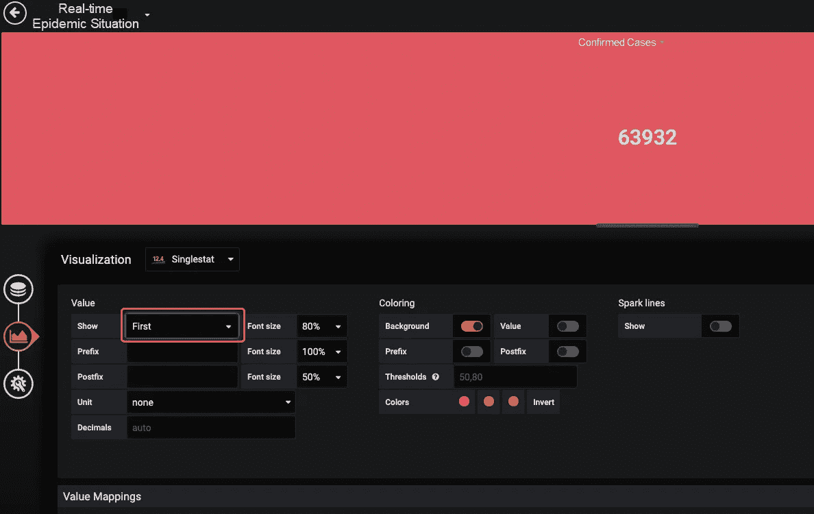
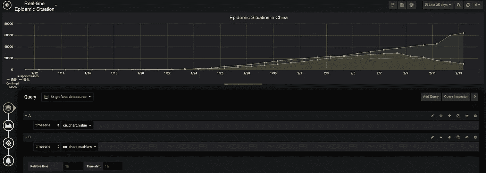
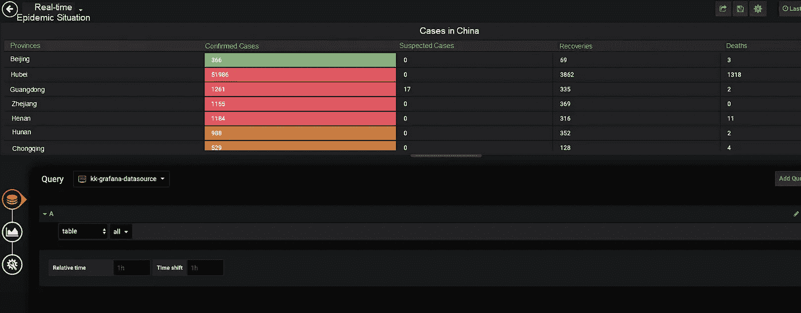
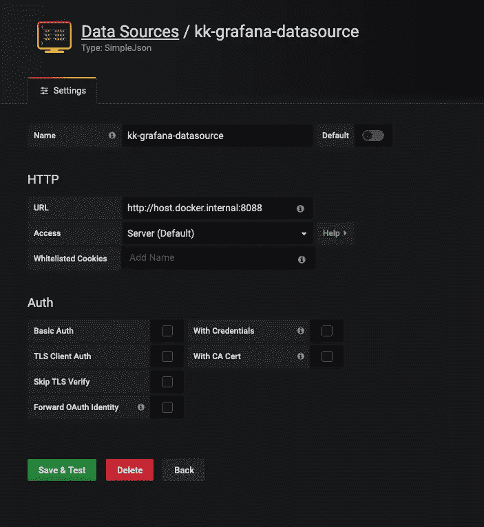
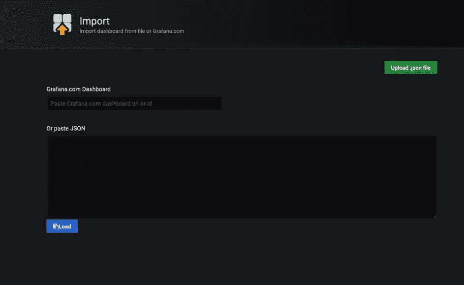

# 使用 Grafana 展示流行病数据

> 原文：<https://medium.datadriveninvestor.com/use-grafana-to-present-epidemic-data-b6d952df13f6?source=collection_archive---------6----------------------->


*通过* [*反新冠肺炎中小企业支持计划*](https://www.alibabacloud.com/campaign/anti-covid-19-sme-enablement-program?spm=a2c41.14458540.0.0) *，在爆发中支持您企业的增长和数字化转型。为所有新的中小企业客户提供 300 美元的优惠券，为付费客户提供 500 美元的优惠券。*

*由郭旭东从* [*MVP 团队*](https://community.alibabacloud.com/users/5243763871661099?spm=a2c41.14458540.0.0) *。*

面对冠状病毒爆发的严重危险，中国采取了严格的预防措施。自 1 月以来，关于疫情的实时数据一直通过不同渠道不断提供，如微信社交媒体账户，支付宝实时疫情跟踪，以及新浪新闻平台的实时疫情消息。中国所有这些不同的社交媒体平台都能够显示实时的疫情动态，让人们能够迅速了解随着时间的推移而演变和变化的情况。

然而，所有这些数据推送和呈现服务都向每个人提供了相同的信息。换句话说，用户无法个性化这些服务来显示他们最感兴趣的数据。因此，有必要创建一个仪表板来动态显示疫情数据。

[](https://www.datadriveninvestor.com/2020/03/29/microsoft-having-an-edge-over-chrome/) [## 数据驱动的投资者|微软比 Chrome 有“优势”

### 简史我从来不是浏览器的粉丝，确切地说，我只是一个浏览器的粉丝，Chrome。这是我的…

www.datadriveninvestor.com](https://www.datadriveninvestor.com/2020/03/29/microsoft-having-an-edge-over-chrome/) 

当考虑仪表板时，我们很自然地首先想到了 [Grafana](https://grafana.com/?spm=a2c41.14458540.0.0) ，这是一款 2014 年发布的多平台开源分析和交互式可视化软件。当连接到支持的数据源时，Grafana 仪表板显示基于 web 的图表，并可以发送警报。用户可以通过使用插件来扩展 Grafana 的功能。这允许交互式查询和复杂监控仪表板的显示。

# 项目准备

为了阐明我们的目标，我们需要定制一个仪表板来显示疫情状态。由于我目前在上海，我想显示全国和上海的确诊病例、疑似病例、康复和死亡人数。同时想展示病例曲线观察疫情发展趋势，展示上海各省各区的情况。

Grafana 只是一个展示数据的工具，所以你需要先获取数据源。目前，没有可用的流行病数据源可以直接与 Grafana 集成。所以，要让它发生，你需要做到以下几点:

*   在你的笔记本电脑或 Kubernetes 集群上准备一个 Grafana 程序。我们建议您使用 Docker 容器来运行 Grafana。
*   安装 SimpleJson 插件，它可以将 Json 格式的数据转换为 Grafana 的数据源。

# 开发数据源

这里，我们使用 [Python 瓶](https://bottlepy.org/docs/dev/?spm=a2c41.14458540.0.0)开发一个数据源。你也可以选择[烧瓶](https://flask.palletsprojects.com/en/1.1.x/?spm=a2c41.14458540.0.0)，这是具有同等能力的替代品。我们决定使用 Bottle 的原因是它已经被用于开发以前的 Grafana 数据源。调试配置甚至用于构建 Docker 映像的`Dockerfile`和用于部署 Kubernetes 的`deploy.yaml`文件也是可用的，随时可以使用。使用 Python 开发 Grafana 数据源是非常容易的。您只需要确保数据符合`SimpleJson`的格式要求。你可以阅读 [Oz Nahum Tiram 的](http://oz123.github.io/about.html?spm=a2c41.14458540.0.0)博客文章，标题为[用 Grafana 和 Python 可视化几乎任何东西，学习如何使用 Python](http://oz123.github.io/writings/2019-06-16-Visualize-almost-anything-with-Grafana-and-Python/index.html?spm=a2c41.14458540.0.0) 为 Grafana 开发数据源。

在数据源自定义过程中，可以使用以下两种类型的数据。

# `Timeseries`类型数据

为了呈现中国特别是上海的实时流行趋势，我们可以显示确诊病例、疑似病例、康复和死亡的数量，以及该数据与以前数据相比的变化。此外，我们可以绘制曲线来比较确诊和疑似病例之间以及康复和死亡之间的差异。

对于确诊病例，我们只需要将全国确诊病例数，`gntotal`和当前时间戳结合起来，返回数据。其他指标可以用同样的方式处理。

```
@app.post('/query')
def query():
    print(request.json)
    body = []
    all_data = getDataSync()
    time_stamp = int(round(time.time() * 1000))
    for target in request.json['targets']:
    name = target['target']
    if name == 'gntotal':
        body.append({'target': 'gntotal', 'datapoints': [[all_data['gntotal'], time_stamp]]})
    body = dumps(body)
    return HTTPResponse(body=body, headers={'Content-Type': 'application/json'})
```

# `Table`类型数据

我们可以使用一个表格，显示中国每个省份的确诊病例、疑似病例、康复和死亡人数，另一个表格显示上海每个地区的相同数据。

我们可以从数据中提取姓名、确诊病例、疑似病例、恢复情况、死亡情况`append`到`rows`。

```
@app.post('/query')
def query():
    print(request.json)
    body = []
    all_data = getDataSync()
    sh_data = getShDataSync()
    if request.json['targets'][0]['type'] == 'table':
        rows = []
        for data in all_data['list']:
            row = [data['name'], data['value'], data['susNum'], data['cureNum'], data['deathNum']]
            rows.append(row)
        sh_rows = []
        for data in sh_data['city']:
            row = [data['name'], data['conNum'], data['susNum'], data['cureNum'], data['deathNum']]
            sh_rows.append(row)
        bodies = {'all': [{
            "columns": [
                {"text": "省份", "type": "name"},
                {"text": "确诊", " type": "conNum"},
                {"text": "疑似", " type": "susNum"},
                {"text": "治愈", "type": "cureNum"},
                {"text": "死亡", "type": "deathNum"}
            ],
            "rows": rows,
            "type": "table"
        }],
            'sh': [{
                "columns": [
                    {"text": "省份", "type": "name"},
                    {"text": "确诊", " type": "value"},
                    {"text": "疑似", " type": "susNum"},
                    {"text": "治愈", "type": "cureNum"},
                    {"text": "死亡", "type": "deathNum"}
                ],
                "rows": sh_rows,
                "type": "table"
            }]} series = request.json['targets'][0]['target']
        body = dumps(bodies[series])
  return HTTPResponse(body=body, headers={'Content-Type': 'application/json'})
```

# 选择面板类型

通常，四个面板用于数据显示。

*   `Singlestat`用于显示箱号。
*   `Graph`用于显示对比曲线。
*   `Table`用来展示表格。
*   `Text`用于文本标题。

# 配置数据源

现在，是时候配置数据源了。

# 案例编号面板

这里只有一个值，可以选择`First`。



# 案例编号图表

这些图表比较了确诊和疑似病例的数量以及康复和死亡的数量。



# 数据表



# 结果

总体结果可以接受，用作公司的疫情仪表板。在这里，我们公司使用的是一款屏幕相对较小的小米电视，因此为了更好地演示，字体和显示面板都进行了放大。


# 建造它

将代码打包成 Docker 映像后，您可以在任何环境或 Kubernetes 集群中运行代码。图片已经上传到 Docker Hub，你可以从那里直接下载使用。

```
# Dockerfile
FROM python:3.7.3-alpine3.9LABEL maintainer="sunnydog0826@gmail.com"COPY . /appRUN echo "https://mirrors.aliyun.com/alpine/v3.9/main/" > /etc/apk/repositories \
    && apk update \
    && apk add --no-cache gcc g++ python3-dev python-dev linux-headers libffi-dev openssl-dev make \
    && pip3 install -r /app/requestments.txt -i http://mirrors.aliyun.com/pypi/simple --trusted-host mirrors.aliyun.comWORKDIR /appENTRYPOINT ["uwsgi","--ini","uwsgi.ini"]
```

# 运行它

*   拉图像。

```
docker pull guoxudongdocker/feiyan-datasource
```

*   运行图像。

```
docker run -d --name datasource -p 8088:3000 guoxudongdocker/feiyan-datasource
```

*   添加数据源。

选择一个`SimpleJson`数据源，点击添加，输入数据源地址。



*   导入仪表板。

点击`Upload.json`文件，选择`wuhan2020-grafana/dashboard.json`。



*   (可选)使用 Kubernetes 进行部署。

```
kubectl apply -f deploy.yaml
```

# 摘要

当我在 2 月中旬写这篇文章时，中国确诊病例的数量仍在快速增加，但幸运的是，疑似病例数量的增长率已经开始下降。我们可以看到，确诊病例的增长率在稳步上升，痊愈的人数也在增加。与其他地区相比，尽管许多人已经重返工作岗位，但上海的病例数量并没有大幅增加。作为其中的一部分，住宅小区采取的严格控制措施开始显现效果。目前，上海仍然只有一例死亡，也是中国第一个有记录的复苏。总的来说，只要注意预防，在家休养，就一定能战胜疫情，度过这段困难时期。

用于导入仪表板的`JSON`文件和用于部署 Kubernetes 的`YMAL`文件可以在 GitHub 上找到。项目地址在这里:[https://github.com/sunny0826/wuhan2020-grafana](https://github.com/sunny0826/wuhan2020-grafana?spm=a2c41.14458540.0.0)。

在继续与全球爆发的疾病进行斗争的同时，阿里云将发挥自己的作用，并尽其所能帮助其他人与冠状病毒进行斗争。在 [*了解我们如何支持您的业务连续性 https://www . Alibaba cloud . com/campaign/fight-coronavirus-新冠肺炎*](https://www.alibabacloud.com/campaign/fight-coronavirus-covid-19?spm=a2c41.14458540.0.0)

# 原始来源:

[](https://www.alibabacloud.com/blog/596163?spm=a2c41.14458540.0.0) [## 使用 Grafana 展示流行病数据

### 阿里巴巴云 2020 年 4 月 26 日 88 在爆发中支持企业的增长和数字化转型…

www.alibabacloud.com](https://www.alibabacloud.com/blog/596163?spm=a2c41.14458540.0.0)