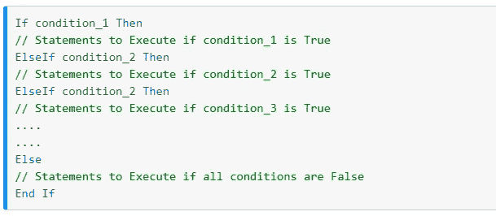
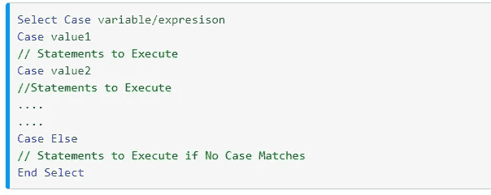

# 使用 If Over Select-Case 语句

> 原文：<https://medium.datadriveninvestor.com/use-if-over-select-case-statement-d13bd47c463e?source=collection_archive---------20----------------------->

Photo by [Kelly Sikkema](https://unsplash.com/@kellysikkema?utm_source=medium&utm_medium=referral) on [Unsplash](https://unsplash.com?utm_source=medium&utm_medium=referral)

## VB 编程

## 你用 If 语句多还是用 Select-Case？

正如在数学中有各种方法来解决一个问题一样，在编程中也有不同的方法来编写程序。每个程序员都有独特的思维方式，因此他们的方法可能不同。

根据我的知识和经验，我相信`If statement`比`Case statement`更有效率。

在我解释为什么在这个案例中使用它之前，我们应该知道这两个语句的语法。

# 语法:

## 如果:

Visual basic If: [Visual Credits](https://www.tutlane.com/tutorial/visual-basic/vb-if-else-if-statement)

正如你所看到的，写完`if`之后，程序员可以写他选择的任何条件和命令集。每个条件之后，写`Then` 是必须的。

 [## 干净的代码在软件开发中至关重要——这就是为什么|数据驱动投资者

### 干净的代码是“容易理解和容易改变的”，它是关于对细节的关注。但是开发人员为什么要担心…

www.datadriveninvestor.com](https://www.datadriveninvestor.com/2020/05/27/clean-code-is-crucial-in-software-development-heres-why/) 

如果第一个条件没有满足，我们可以使用`ElseIf`添加更多的条件，如果没有一个条件没有满足，那么可以使用`Else`添加代码的默认部分。

## 案例:

Visual Basic Select-Case: [Visual Credits](https://www.tutlane.com/tutorial/visual-basic/vb-select-case-statement)

使用`select-case`语句时有一个微小的区别。

最初，我们必须选择案例所依赖的变量或表达式。当变量的值与特定情况下的值匹配时，则满足该情况。case 下的命令集运行。程序员可以设置默认部分在`Case Else`部分下运行。

## 为什么 If 语句更高效？

上面，我们已经讨论了 Visual Basic 中两个语句的语法。网。

1.  `If`语句比`Select-Case`语句更容易使用。
2.  任何条件都可以写入，一个以上的变量也可以用在条件`If`语句中，而在`Select-Case`中，我们考虑一个变量，它的值贯穿每种情况。
3.  `If`语句对多项选择使用多条语句，而`select-case`对多项选择使用单个表达式。
4.  `Select-case`仅测试字符或整数数据类型，而`If`语句评估整数、字符、双精度或布尔数据类型。

因此，我认为应该使用 If 而不是 Select-case 语句。

**访问专家视图—** [**订阅 DDI 英特尔**](https://datadriveninvestor.com/ddi-intel)