# 使用 Python 评估股票投资

> 原文：<https://medium.datadriveninvestor.com/use-python-to-evaluate-a-stock-investment-7ef09effd426?source=collection_archive---------2----------------------->

## 不要自己翻遍财务报表，让 Python 为你检查一家伟大公司的所有标准

Photo by [Lee Campbell](https://unsplash.com/@leecampbell?utm_source=medium&utm_medium=referral) on [Unsplash](https://unsplash.com?utm_source=medium&utm_medium=referral)

在我以前的文章中，我写了关于使用 Python 自动评估股票价值的文章，其理论基础在 T2 如何计算股票内在价值中给出。

通过数字和在电子表格中键入财务数据来分析你想投资的公司，以确定这是否是一项伟大投资的日子已经一去不复返了。这篇文章详细阐述了在我们做出投资决策之前，我们如何**进一步使用 Python** 来检查**是否符合一家伟大公司的所有标准**。这些标准将在整篇文章中以刻度给出。当然，评估一家公司(如前几篇文章所解释的)是我们将要采取的步骤之一。我们将使用**亚马逊股票**进行案例研究。请随意先通读之前的文章:

 [## 使用 Python 对股票进行自动估值

### 苹果股票是否被高估？只需输入 Ticker，让 Python 自动决定！

medium.com](https://medium.com/datadriveninvestor/use-python-to-value-a-stock-automatically-3b520422ab6)  [## 如何计算股票的内在价值(AAPL 案例研究)

### 获取公司数据和计算股票内在价值的逐步指南，包括网络应用程序

medium.com](https://medium.com/datadriveninvestor/how-to-calculate-intrinsic-value-of-a-stock-aapl-case-study-935fb062004b) 

**免责声明:** *我不是理财顾问，本文不代表任何形式的理财建议。使用这些计算方法进行的任何投资都会带来风险，所以在这样做之前，一定要记得做好尽职调查和研究。*

# 导入包以提取和显示数据

首先，我们从[**Finviz**](https://finviz.com/quote.ashx?t=aapl)(requests and beautiful soup 4)导入解析 html 数据所需的包，从 [**财务建模准备 API**](https://financialmodelingprep.com/developer/docs/) (json)导入 JSON 数据。我们还使用 [**Matplotlib**](https://matplotlib.org/) 为后面的数据可视化做一些绘图。

# 输入 API 密钥和报价器

输入**Financial modeling Prep API 键**和您感兴趣的股票的股票代码(在本例中，Amazon 股票为“AMZN”)。如果你想测试的话，API 键“demo”只对“AAPL”有效。

对于像“AMZN”这样的其他 tickers，你需要在[https://financialmodelingprep.com/developer](https://financialmodelingprep.com/developer)注册一个账户，以免费获得一个 API 密钥(前 250 个请求，之后你可以注册另一个账户)。转到仪表板获取您的 API 密钥。

# 通过解析来自财务建模准备的 JSON 数据获得财务报表

**财务建模准备 API** 为我们提供了来自不同公司的**财务报表数据**，我们可以直接将这些数据导入 Python，而无需手动处理。我们通过前面创建的 *get_jsonparsed_data(url)* 函数使用 json 库解析数据。我们输入到函数中的 *url* 由一个 *base_url* 和参数组成，例如*“损益表”*和 *api 键*。点击[此链接](https://financialmodelingprep.com/api/v3/cash-flow-statement/AAPL?period=quarter&limit=400&apikey=2b6cef897a71d11434d94adf8c91c258)查看 API 为 AAPL 返回的数据(以及相应的 url)作为示例。

# 损益表(年度)

首先，我们获得亚马逊的年度损益表数据，并将其解析为 Pandas 数据框架。该报表由**收入(销售额)**、**净收入(收益)**和**利润率**等数据组成。

请注意，在下面的输出中，最新日期为*2019–12–31*，其中仅包含 2019 年的数据。这显然不是现有的最新数据。为了说明公司在**最近 12 个月的可用数据**中的表现，我们必须使用**过去 12 个月(TTM)** 的数据。

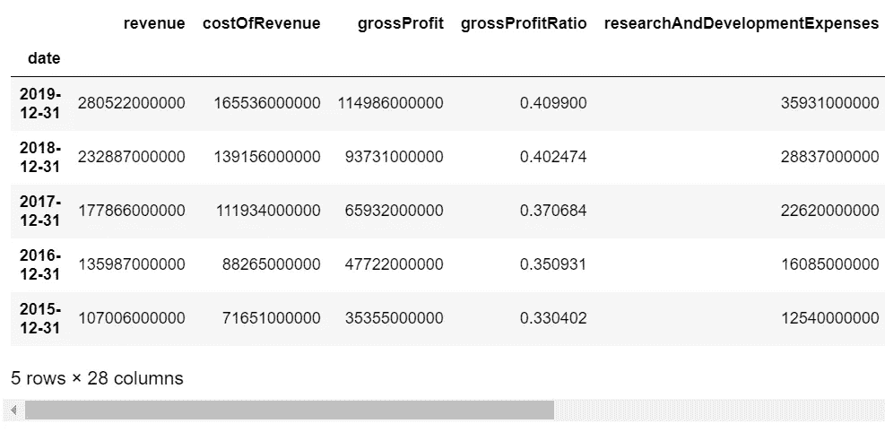

# 损益表(最近 4 个季度)

为了获得**过去 12 个月(TTM)** 的数据，我们需要获得**最近 4 个季度的数据，然后在本步骤中对**的数据进行汇总。我们所需要的只是将参数 **'period=quarter'** 添加到我们给*get _ jsonparsed _ data(URL)*函数的前面的 *url* 中。

截至本文撰写时，可用的最新数据是 2020–09–30 的 ***数据，对应于 2020*** 的 **Q3，如下图所示。**

# 损益表(年度+ TTM)

让我们**汇总最近 4 个季度的数据**，将该行重命名为**‘TTM’(连续 12 个月)**，并将其附加到年度利润表中以**合并年度和 TTM 的数据**。这与[上一篇文章](https://medium.com/datadriveninvestor/use-python-to-value-a-stock-automatically-3b520422ab6)中所做的完全一样。

现在我们有了一行 TTM 数据。整洁！

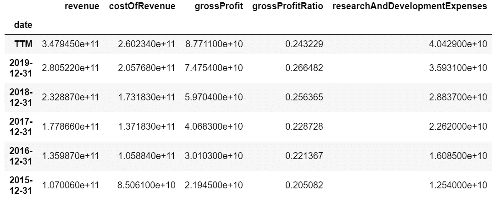

为了检查您是否确实解析了数据并正确计算了 TTM 行，一个好的做法是**将亚马逊的数据与来自** [**晨星网站**](https://www.morningstar.com/stocks/xnas/amzn/financials) 的数据进行比较(记住它是以十亿为单位的)。在这里，我们看到 2017 年的收入数据与上表相对应。

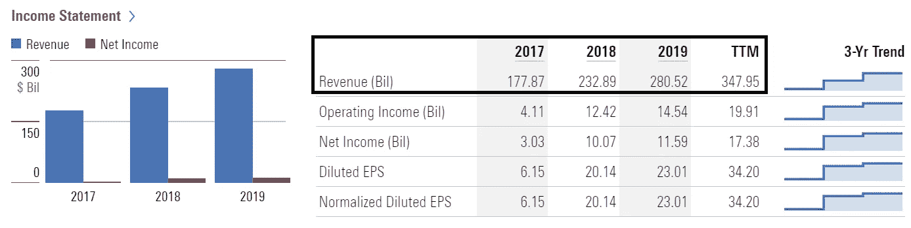

Financial Data of Amazon From [Morningstar Website](https://www.morningstar.com/stocks/xnas/amzn/financials)

接下来，我们对**现金流量表**和**资产负债表**重复上述步骤。

# 现金流量表(年度+ TTM)

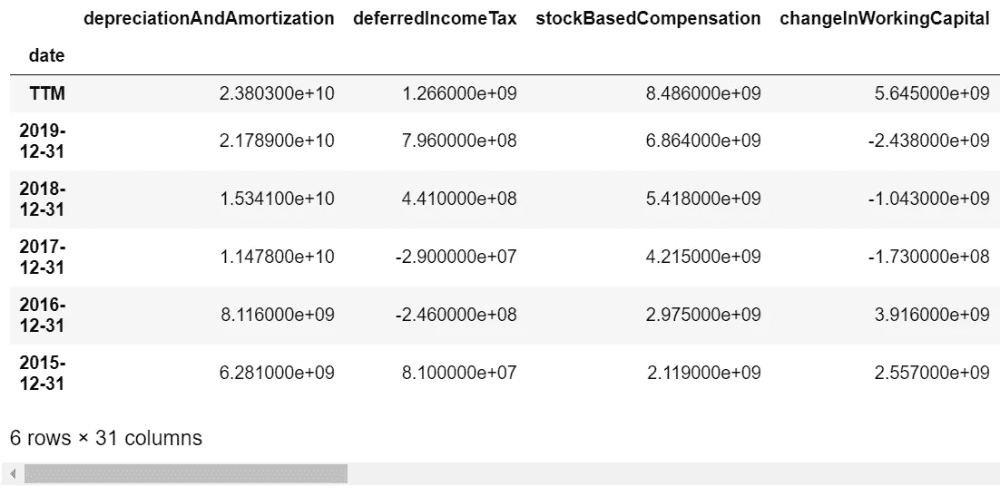

# 资产负债表(年度+ TTM)

请注意，资产负债表数据的 TTM 仅代表最近一个季度的数据。这是因为资产负债表显示了在*【不像现金流量表那样在一段时间内汇总】的**公司财务健康状况**(其拥有的所有资产和负债)的快照。我只是将它命名为“TTM ”,以便在后面的步骤中更容易将所有财务报表的数据框架结合起来进行分析。*

**

# *为了方便起见，将所有语句合并在一起*

*让我们将所有的财务报表数据合并到一个***all _ statements*data frame**中，以便于后面的步骤。我们将很快做一些策划！*

# *亚马逊符合成为一家伟大、可投资公司的所有标准吗？*

> *我们现在准备开始检查亚马逊公司是否符合作为一家值得投资的伟大公司的所有标准！在文章的下一部分，每个标准都用一个勾号来表示。*

*请注意，这些是我个人遵循的标准。请随意修改下面的代码来检查您自己的标准！我们还没有准备好分析上面收集的数据！*

# *收入、现金流和净收入持续增长*

## *收入、经营现金流、净收入*

*一家基本面强劲的公司应该会看到一个良好的跟踪记录，多年来**收入、【经营现金流】和【净收入】的**总体增长趋势**(几次下降是可以的)。毕竟，一家公司只是一台赚钱机器，**会在多年内产生未来的现金流**(详见[上一篇文章](https://medium.com/datadriveninvestor/how-to-calculate-intrinsic-value-of-a-stock-aapl-case-study-935fb062004b))。***

*拥有持续增长的自由现金流也使**未来现金流更可预测**，因此[上一篇文章](https://medium.com/datadriveninvestor/use-python-to-value-a-stock-automatically-3b520422ab6)中描述的贴现现金流模型适用于对公司进行估值。我喜欢仍在增长的可预测公司，因为投资它们相对安全，回报也不错。让我们现在把它们画出来。*

*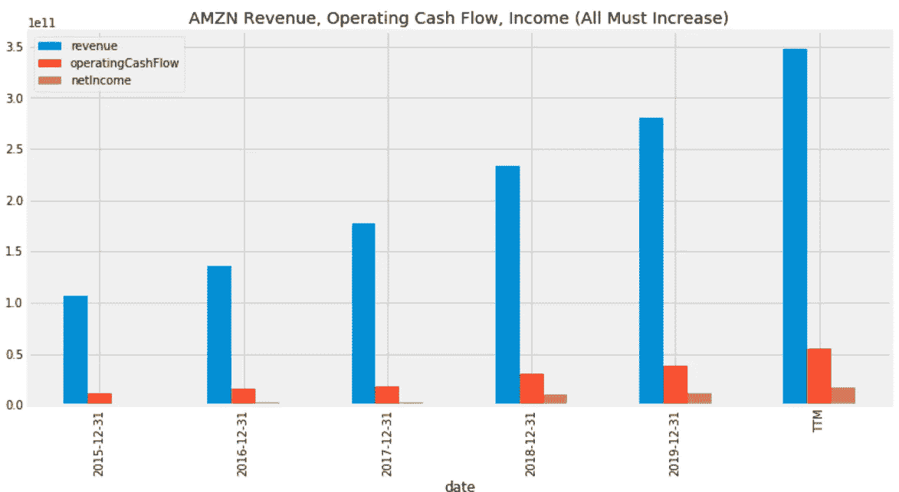*

*毫无疑问，收入、经营现金流、净收入都在持续增长，如上图所示。厉害！我们都知道，在这个 COVID 疫情期间，**亚马逊的收益继续增长**，尤其是由于其电子商务平台的高需求。这反映在上面的 TTM 价值观中。*

*在这种情况下，上述规模过大是因为收入过高，可能很难看到经营现金流和净收入。为了清晰起见，让我们绘制没有收入的相同图表。*

*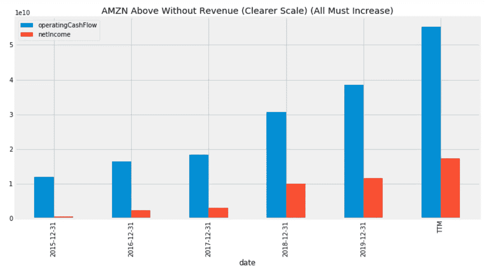*

## *自由现金流*

*有些人可能更喜欢看**自由现金流**而不是经营现金流，因为前者考虑了由于 [**资本支出**](https://www.investopedia.com/terms/c/capitalexpenditure.asp) (从经营现金流中减去)导致的**现金流出。因此，自由现金流是公司可用于偿还债权人或向投资者支付股息和利息的现金流，它更能代表公司的健康状况。***

*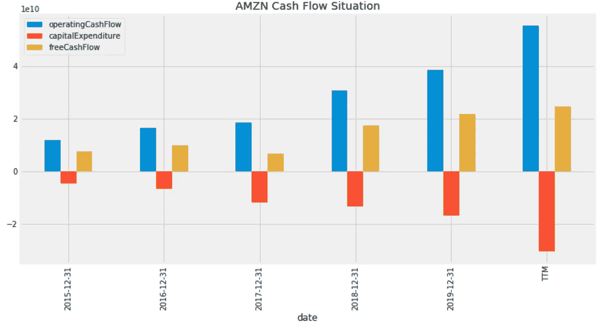*

*从上面我们可以看到，尽管**每年在资本支出**上越来越多，但**自由现金流仍然持续增长**。*

*资本支出的增加也是一件好事，因为这通常意味着公司正在进行新的项目或实物资产投资，以扩大经营和增长。*

**注:一个***的高增长公司(如 Crowdstrike)可以有* ***的负现金流和收入*** *(虽然收入应该增长很快)。增加现金流量在这种情况下简单地意味着现金流量* ***越来越少，负*** *。然而，评估公司价值的贴现现金流模型在这种情况下并不适用，我们将在后面看到。***

** [## 如何用 Python |数据驱动投资者构建 Twitter 抓取应用

### 每秒发出约 6000 条推文，每天发布 5 亿条推文，普通人甚至不能…

www.datadriveninvestor.com](https://www.datadriveninvestor.com/2020/12/01/how-to-build-a-twitter-scraping-app-with-python/) 

# 持续的高股本回报率

> [**【ROE】**](https://www.investopedia.com/terms/r/returnonequity.asp)是对财务业绩的一种衡量，计算方法是**除以** [**股东权益**](https://www.investopedia.com/terms/s/shareholdersequity.asp)****。因为股东权益等于公司的资产减去债务，所以净资产收益率被认为是净资产收益率。—来自 Investopedia****

**我们想要一家高回报的公司。对我来说，一家净资产收益率至少为 10% (0.1)的公司就足够稳健了。**

**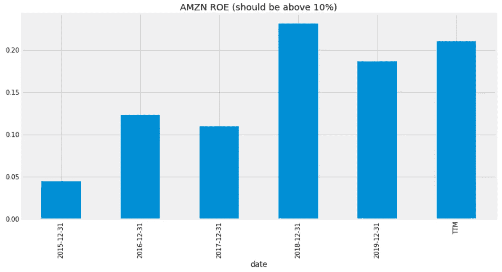**

**AMZN 每年都有超过 10%的高净资产收益率(除了不久前的 2015 年)，这是一个非常令人印象深刻的记录。**

# **竞争优势**

**当然，我们不希望投资一家公司，只看到它的市场份额被竞争对手抢走。事实上，我们希望一家公司在运营和占领市场份额的能力方面，比竞争对手拥有**显著优势**。**

> **注:这一标准不像其他标准那样明确或定量，其他标准很容易用图表显示或用数字量化。我选择了亚马逊来突出这个案例。**

## **毛利润率和净利润率**

> ****毛利率**是一家公司的**收入(即销售额)减去商品销售成本**后剩下的百分比。**
> 
> ****净利润率**是公司收入占公司**净收入(即收益)**的百分比。除了销售商品的成本之外，还要从收入中减去经营和其他费用以及利息和税项费用，从而得到净收益。**

****高而稳定的利润率** **通常**意味着一家公司拥有定价权，能够**自由提高其商品和服务的价格**(不增加成本和费用)而不会损失太多需求(或市场份额)，因为**没有太多“足够值得”的竞争对手**。这意味着该公司比竞争对手有竞争优势。(想想耐克，人们愿意为它的既定品牌支付更高的价格。这给了耐克定价权。)**

**这也意味着它能够**比其竞争对手更有效地(以更低的成本)**生产商品，因为某些生产流程使它比竞争对手更有优势，这再次指向了**高度竞争优势**。**

***注意，对于***这样的成长型公司来说，要进行投资，就应该有一个* ***的大幅增长******的历年利润率(如果还在亏损的话，负利润率会大幅减少)随着它的增长，因为有*[*对于 ***老牌大盘股*** *像亚马逊，一个* ***一致的利润率就足够好*** *。**](https://www.investopedia.com/terms/e/economiesofscale.asp)*****

## ****毛利率****

****在这里，我们使用(收入-收入成本)/收入(参见下面代码中的公式)来绘制毛利率。****

****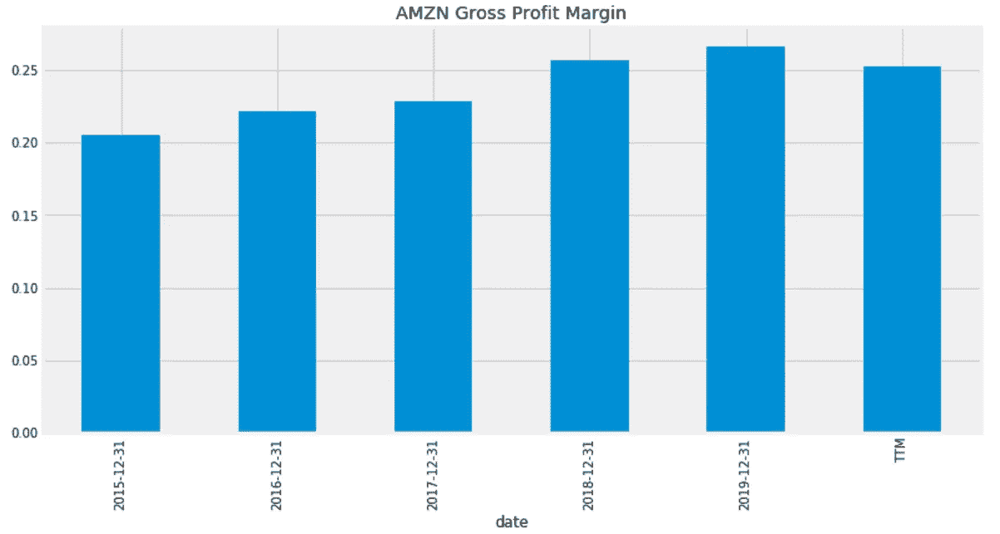****

****毛利率从 2015 年开始增长，到最近 3 年相对稳定的数值。蛮好的，现在来看看净利润率。****

## ****纯利润率****

****我们再次计算并绘制它。****

********

****在这里，我们不仅看到一致的，但不断增加的净利润率，其次是多年来。2015 年的利润率非常低，因为亚马逊正在通过**价格竞争**来**占领市场份额。从那以后，它在电子商务行业获得了巨大的市场份额，并正在向云计算(亚马逊网络服务)等其他增长领域转移。******

****但是，请注意，利润率**仍然较低，约为 5%** 。这是因为**零售(网上)的净利润率已经很低**(根据[今年](http://pages.stern.nyu.edu/~adamodar/New_Home_Page/datafile/margin.html)大约 4.57%)。此外，亚马逊的**竞争优势**是它拥有*最低的送货成本*(想想亚马逊的 Prime、免费送货以及对其送货车辆和网络的巨额投资)*提供最便宜的价格*，这就是消费者喜欢它的原因！尽管如此，亚马逊的利润率高于平均水平。不仅如此，在我看来，事实上没有什么可以阻止亚马逊像过去一样提高 Prime 订阅费来增加利润，因为它已经占据了大部分市场份额。****

****提示:**将利润率与行业平均水平(从下面的链接获得)**进行比较，看看它是否有更高的利润率，这总是好的。你可以在任何你喜欢的公司尝试这样做。****

**** [## 营业利润和净利润率

### 税前股票前薪酬运营利润

pages.stern.nyu.edu](http://pages.stern.nyu.edu/~adamodar/New_Home_Page/datafile/margin.html) 

## 其他考虑

衡量竞争优势的其他考虑因素(Python 无法量化)包括品牌垄断和网络效应(T21)。每当你想到电子商务的时候，你首先想到的是哪家公司？机会是，对许多人来说，它将是亚马逊(品牌垄断)，人们去亚马逊购买几乎任何东西。此外，由于亚马逊上有如此多的买家，这将吸引更多的卖家，从而吸引更多的买家，如此循环往复。随着越来越多的人使用亚马逊，它变得越来越有价值。这就产生了网络效应，自动导致越来越多的人气。

# 巨大的财务健康

## 流动比率

> 流动比率为**流动资产/流动负债**。流动**资产**是可以在一年内转化为现金**的资产**，而流动**负债**是需要在一年内偿还的债务。因此，这个比率衡量一个公司支付短期债务的能力。

流动比率高于 1 意味着公司在短期内有足够的资产来偿还债务(而且不太可能破产)。

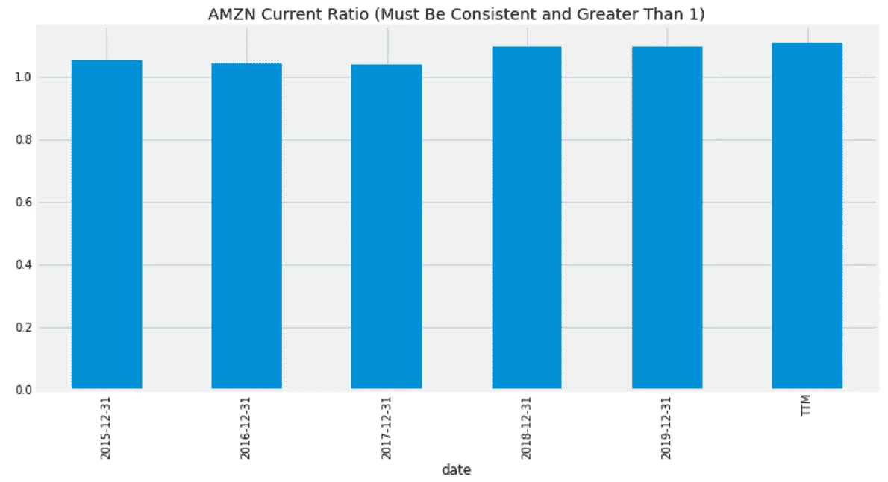

事实上，亚马逊的流动比率多年来一直保持在 1 比 1 以上。太好了！

## 偿债比率

亚马逊的运营现金流中有多少用于支付利息支出？这是由债务偿还率给出的。这个比率也衡量**一家公司为其贷款成本融资的能力**，低于 20%的比率相对安全。

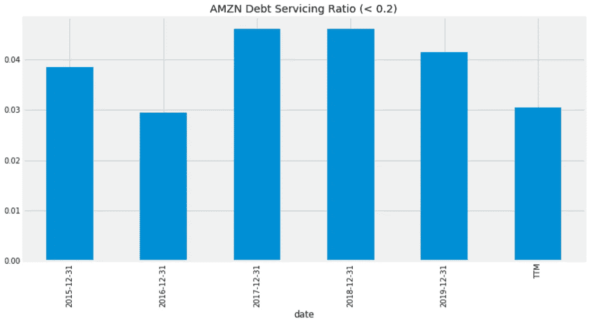

亚马逊的债务偿还率**目前仅略高于 3%** ，不错！因此，它的债务非常保守，能够轻松地为贷款成本融资。依我看，投资是安全的。

# 合理的股票价格(低于内在价值)

现在让我们将亚马逊的**股价**与使用贴现现金流模型计算的**内在价值**进行比较，当然使用 Python！由于我在下面的上一篇文章 中已经经历了完成这个 [**的完整步骤，所以**这里我就不再详细阐述**了，因为它是完全相同的方法。阅读它，了解这是如何工作的。**](https://medium.com/datadriveninvestor/use-python-to-value-a-stock-automatically-3b520422ab6)

 [## 使用 Python 对股票进行自动估值

### 苹果股票是否被高估？只需输入 Ticker，让 Python 自动决定！

medium.com](https://medium.com/datadriveninvestor/use-python-to-value-a-stock-automatically-3b520422ab6) 

## Finviz 摘录:价格、未来 5 年每股收益、贝塔系数、已发行股票数量

从 Finviz 中提取(使用 requests.get)和解析(使用 beautifulsoup)数据，需要这些数据(除了我们从金融建模准备中获得的一些数据)来计算内在价值。

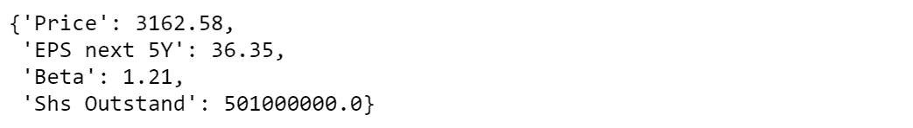

## 根据 Beta 估计贴现率

贝塔系数越高，波动性和风险就越高，因此我们对未来现金流的折现就越高，以保持保守。

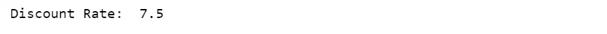

## 打印计算内在价值所需的所有数据:自由现金流、总债务、现金和短期投资

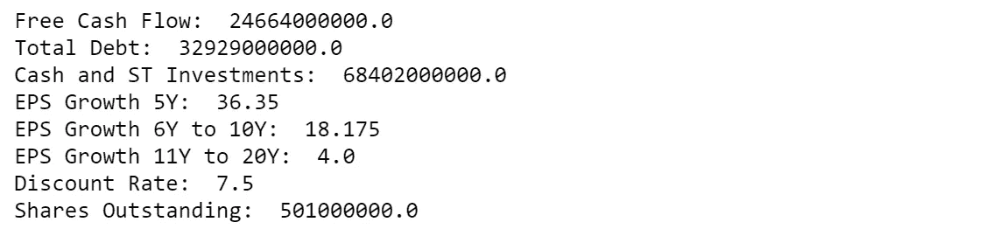

# 计算内在价值

首先，使用当前自由现金流和 EPS 增长率预测第 1 年到第 20 年的现金流。然后用贴现率贴现现金流。接下来，考虑现金+短期投资，减去总债务。然后除以发行在外的股票总数，得到内在价值。

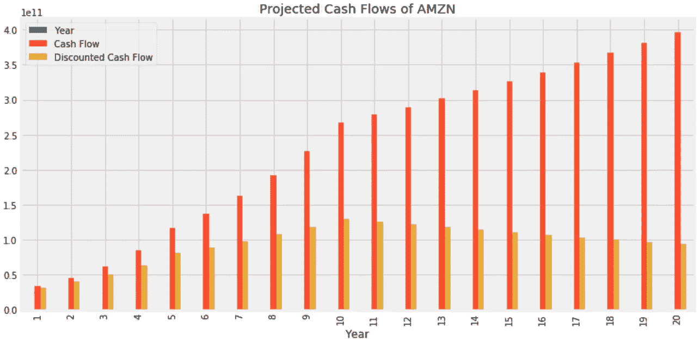

3163 美元的股价似乎很高，对吗？这是一个常见的误解。

我们可以看到，该模型给出的亚马逊股票的内在价值为 **$3857** ，而当前价格仅为 **$3163** (比内在价值低 18%左右！).因此，在我看来，亚马逊股票**仍然便宜**。贴现现金流模型也应该对亚马逊股票很有效，因为它的现金流是一致的和可预测的，尽管这个模型有它的局限性，我在本文[的最后一部分](https://medium.com/datadriveninvestor/how-to-calculate-intrinsic-value-of-a-stock-aapl-case-study-935fb062004b)写了这一点。

此外，亚马逊很容易**满足上述所有标准**，成为一家稳定增长的**好公司，具有竞争优势，投资**相对安全。当然，投资股票有其风险，所以如果你退休或在几年内需要一大笔现金，你可能不想完全投资亚马逊。同样，如果你很年轻，有很大的成长空间，你可能会选择为一家处于初始成长阶段的小公司承担更高的风险，因此成长迅速(成长股)，可能比亚马逊有更多的上升空间。

在本文中，我们使用 Python 从多个来源获取数据，然后使用它们来确定一家公司是否满足可投资的各种标准。这比你自己填写财务报表并把它们输入到电子表格中花费的时间要少得多。只需在上面给出的代码中更改股票代码，就可以对您想要的任何其他公司执行相同的分析！

我希望这篇文章是有用的。如果你喜欢这篇文章，也可以看看我下面的其他文章！

 [## 基于 Python 的金融新闻股票情感分析

### 使用 Python 从 FinViz 网站的财经新闻标题中提取股票情绪

towardsdatascience.com](https://towardsdatascience.com/sentiment-analysis-of-stocks-from-financial-news-using-python-82ebdcefb638)  [## 使用 Python 获得股票的最新财务比率(市盈率、市净率等)

### 大多数 API 给出过时的年度/季度财务比率。下面是一个从 FinViz 获取实时数据的指南。

towardsdatascience.com](https://towardsdatascience.com/get-up-to-date-financial-ratios-p-e-p-b-and-more-of-stocks-using-python-4b53dd82908f)  [## 如何计算股票的内在价值(AAPL 案例研究)

### 获取公司数据和计算股票内在价值的逐步指南，包括网络应用程序

medium.com](https://medium.com/datadriveninvestor/how-to-calculate-intrinsic-value-of-a-stock-aapl-case-study-935fb062004b)  [## 使用 Python 对股票进行自动估值

### 苹果股票是否被高估？只需输入 Ticker，让 Python 自动决定！

medium.com](https://medium.com/datadriveninvestor/use-python-to-value-a-stock-automatically-3b520422ab6)  [## 使用 Python 来展示一只被高估的股票是如何被低估的

### 你应该避免在盈利后购买有缺口的股票，因为它们“太贵”了吗？(PYPL 案例研究)

medium.com](https://medium.com/datadriveninvestor/use-python-to-show-how-an-overvalued-stock-can-become-undervalued-72bc9d3d35a7) 

## 获得专家观点— [订阅 DDI 英特尔](https://datadriveninvestor.com/ddi-intel)******