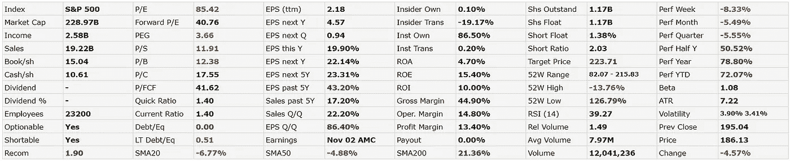

# 使用 Python 来展示一只被高估的股票是如何被低估的

> 原文：<https://medium.datadriveninvestor.com/use-python-to-show-how-an-overvalued-stock-can-become-undervalued-72bc9d3d35a7?source=collection_archive---------6----------------------->

## 你应该避免在盈利后购买有缺口的股票，因为它们“太贵”了吗？

在过去的几个月里，科技股不断上涨，一次又一次达到历史高点，尤其是在收益发布后的 T2。这些股票真的像媒体描述的那样**昂贵和高估吗？让我们通过使用 Python 量化来透视事物。**

PayPal Price Chart from TradingView.com showing the Gap Up during Earnings Release in May

在我以前的文章中，我写了关于[使用 Python 自动评估股票价值](https://medium.com/datadriveninvestor/use-python-to-value-a-stock-automatically-3b520422ab6)，其理论基础在[如何计算股票内在价值](https://medium.com/datadriveninvestor/how-to-calculate-intrinsic-value-of-a-stock-aapl-case-study-935fb062004b)中给出。在这篇文章中，我将使用 Python 中的**相同步骤，并在之前和之后添加**到**价值 PayPal 股票** ***和*其 2020 年 Q2**收益发布。这显示了**内在价值**是如何变化的，以及它与股票价格的对比。

这里将简要描述每个步骤，因为它已经在[上一篇文章](https://medium.com/datadriveninvestor/use-python-to-value-a-stock-automatically-3b520422ab6)中详细描述过了。请随意浏览之前撰写的以下文章，了解一些背景信息。

 [## 使用 Python 对股票进行自动估值

### 苹果股票是否被高估？只需输入 Ticker，让 Python 自动决定！

medium.com](https://medium.com/datadriveninvestor/use-python-to-value-a-stock-automatically-3b520422ab6)  [## 如何计算股票的内在价值(AAPL 案例研究)

### 获取公司数据和计算股票内在价值的逐步指南，包括网络应用程序

medium.com](https://medium.com/datadriveninvestor/how-to-calculate-intrinsic-value-of-a-stock-aapl-case-study-935fb062004b) 

**免责声明:** *我不是理财顾问，本文也不代表任何形式的理财建议。使用这些计算方法进行的任何投资都会带来风险，所以在这样做之前，一定要记得做好尽职调查和研究。*

# 第一步。导入软件包并注册财务建模准备 API

## 导入包以提取和绘制相关数据

我们之前已经这样做了，并在[上一篇文章](https://medium.com/datadriveninvestor/use-python-to-value-a-stock-automatically-3b520422ab6)中做了更详细的解释。这里我们导入解析来自[**fin viz**](https://finviz.com/quote.ashx?t=aapl)(requests and beautiful soup 4)的 html 数据和来自[**Financial modeling Prep API**](https://financialmodelingprep.com/developer/docs/)(JSON)的 JSON 数据所需的包。我们也导入 Matplotlib 来做一些绘图。在最后一行中，我们还为财务建模准备 API 定义了 *base_url* ，对于我们提出的任何数据请求(例如 PYPL 的现金流量表)，我们将其添加到 *base_url* 之后以提出请求。

## 输入财务建模准备 API 密钥和报价器

输入**金融建模准备 API 键**和您感兴趣的股票的股票代码(本例中 PayPal 股票为“PYPL”)。

下面的 **API 键“demo”**是一个 demo 键，仅用于获取**“AAPL”**的数据。对于其他 tickers，您需要在[https://financialmodelingprep.com/developer](https://financialmodelingprep.com/developer)注册一个账户，以免费获得 API 密钥(前 250 个请求，之后您可以注册另一个账户)。

# 第二步。从财务建模准备 API 获取过去和最近的现金流+资产负债表

**财务建模准备 API** 让我们以 JSON 的形式从不同的公司获取**财务报表数据**。这里，我们使用我们在开始时定义的 *get_jsonparsed_data* 函数将数据解析成 Pandas 数据帧。

## 现金流量表(年度)

下面的代码可以让我们得到截至 2019 年底的年度现金流量表数据(因为我们还没有到 2020 年底)。

2019 年的数据不包括**最近一个季度的可用数据**(截至本文撰写时为 **Q2 2020** )。因此，我们需要通过汇总最近 4 个季度的数据来获得**过去 12 个月(TTM)** 的数据。

## 最近季度现金流量表(最近 4 个季度)

让我们看看最近 4 个季度的数据，从 2019 年第三季度**到 2020 年 Q2**。

## 最近的现金流量表(年度+ TTM)

现在我们**汇总最近 4 个季度的数据，**将该行重命名为“TTM”，并将其附加到年度现金流量表数据框架中。

现在我们有了 TTM 街。

## 前一季度现金流量表(前 4 个季度，不包括最近一个季度)

让我们得到前 4 个季度的数据，从 Q2 2019 年到 Q1 2020 年**(不包括 Q2 2020 年的数据)**，我们最终将**将这些数据相加得到 TTM 值**。在 Q2 结果出来之前，需要这些数据来计算内在价值。的。下面代码中的 iloc[1:5]选择季度现金流量表数据帧的**第 2 到第 5 行**，以排除第一行中最近的季度。

## 以前的现金流量表(年度+ TTM)

现在我们**汇总上面 4 个季度的数据，**像前面的过程一样将该行重命名为“TTM ”,以获得一个表格，其中包含最近一个季度之前的最后 4 个季度的 TTM 数据。

从这里开始，我们将只使用上面的**最近的现金流量表(年度+ TTM)** 和**以前的现金流量表(年度+ TTM)** 。

## 检查现金流的稳定性

让我们画出贝宝的现金流，看看它们是否**稳定增长，是否可以预测**。如果不是这样，那么我们就必须在使用贴现现金流模型来评估股票价值时三思而行，就像我们后来使用的那样。

很高兴看到自由现金流总体上在增长(有几次下降，这很好)。

 [## 10 月份投资的最佳股票|数据驱动型投资者

### 根据最近的回报，这些股票在 10 月份及以后会有不错的表现。随着市场看到一点…

www.datadriveninvestor.com](https://www.datadriveninvestor.com/2020/10/19/the-best-stocks-to-invest-in-october/) 

## 资产负债表(季度)

这里我们得到的是季度资产负债表，而不是年度资产负债表。这是因为资产负债表显示的是公司在某一特定时刻的资产和负债的快照，而不是销售额等数量，销售额必须在一段时间内(如一年)进行汇总。因此，我们需要的**最新数据**是 **2020 年 6 月 30 日(Q2 2020 年)**的数据，而对于**过去的数据**在 Q2 2020 年之前，我们只需要 **2020 年 3 月 31 日(Q1 2020 年)**的数据，这里不需要汇总和处理数据帧！

## 过去和最近的自由现金流、总债务、现金和短期投资

如[上一篇文章](https://medium.com/datadriveninvestor/use-python-to-value-a-stock-automatically-3b520422ab6)所述，我们需要*过去和最近* **的自由现金流、债务总额以及现金和短期投资**分别用于我们过去*和现在*内在价值的计算。让我们通过索引前面获得的现金流量表和资产负债表数据框的适当行来提取这些数据。请记住，这些是 TTM 的现金流。

# 第三步。从 Finviz 中提取和解析数据

## 价格、未来 5 年每股收益、贝塔系数、已发行股票数量

首先，让我们从 Finviz 获得**价格、下一个 5 年的每股收益、贝塔系数和已发行股票数量**来进行计算。这些值是从 [Finviz 网站](https://finviz.com/quote.ashx?t=pypl)的 html 表中获得的。我不会进一步解释，因为它已经在[上一篇文章](https://medium.com/datadriveninvestor/use-python-to-value-a-stock-automatically-3b520422ab6)中解释过了。

Table for PayPal Data in Finviz Website

## 根据 Beta 估计贴现率

然后，我们根据股票的贝塔系数，估算出用于现金流贴现模型的贴现率。

## 打印数据

除了之前打印的**自由现金流、总债务、现金和短期投资**之外，我们现在将打印出刚刚从 Finviz 获得的数据，我们将在我们的内在价值中使用这些数据。

# 第四步。计算以前和最近的内在价值

现在让我们计算一下**之前的内在价值**(在 Q2 收益公布之前)和**最近(当前)的内在价值**(在 Q2 收益公布之后)。这些是之前所述的[所需的步骤。](https://medium.com/datadriveninvestor/use-python-to-value-a-stock-automatically-3b520422ab6)

1.  使用最近的自由现金流预测第 1 年到第 20 年的现金流
2.  然后计算现金+短期投资，减去总债务
3.  除以发行在外的股票总数

# 结果

在上述代码的结果中，我们显示了每年的贴现现金流以及图表和各自的内在价值。

Q2 2020 年财报出来之前的**先前内在价值** e 是**162 美元**，而财报出来之后的**当前内在价值**是**206 美元**。

Q2 2020 年的收益于 2020 年 7 月 29 日**公布**。因此，我们很想知道**当天价格是如何变化的。**

PayPal Price Chart from TradingView.com Showing Daily Candles and the Gap Up in Price on 29 July

让我们总结一下我们所知道的。

*   7 月 29 日**的股价:184.60 美元**(上面的蓝线)
*   当时以前的内在价值: **$162**
*   **7 月 30 日财报后股价:198.66 美元**(上面黑线)(it **跳空**！)
*   更新收益后的当前内在价值: **$206**

## 你是否应该避免在盈利后购买有缺口的股票，因为它“太贵”了？

PayPal 的股票**最初被高估**至 182.60 美元(相比内在价值为 162 美元)。然而，随着 Q2 2020 **(意外收益)**在收益公告期间发布的新信息，价格**上涨**至 198.66 美元，但**该股反而被低估**(相比于 206 美元的新的更高内在价值)！

> 一只被高估的股票(PYPL)的价格在盈利后上涨，但却被低估了。

直觉上，人们可能会认为，在收益发布后股价上涨，购买股票将会*为时已晚，因为它会变得过于昂贵、超买或高估。情况未必如此。**其实*反*可能是真的。***

*随着新信息的出现，市场可以简单地对股票的新估值进行定价。然而，像 2020 年 7 月 30 日 PayPal 的情况一样,**股票的全部估值可能仍未实现。因此，在 PayPal 股票跳空后以 198.66 美元的价格买入(是的，即使是在该价格对应的当日高点)，也不是愚蠢的。***

*看上面的图表，可以认为最终 PayPal 的价格下降了，你可以以更低的价格进入。虽然这是事实，但整个市场正在经历越来越大的波动，包括 9 月份的抛售。PayPal 只是跟随市场走势(没人能预测)**而没有改变其基本面**。*

**

*PayPal Price Chart from TradingView.com showing the Gap Up during Earnings Release in May*

*此外，当 **Q1 2020 年收益**发布时，PayPal 的股票也出现了跳空，如上图所示。请注意，价格**从未回落到**低于缺口前的水平。因此，如果你想等到价格下跌后再购买，你就永远没有机会了。*

**请注意，收益前 162 美元的内在价值可能被高估了，因为 Finviz 估计的 5 年增长率(每股 5 年)在收益前可能会更低，因此我们提取了一个更高的价值来计算它。这只能表明，在盈利前的股价(182.60 美元)比我们想象的更被高估，但在更新盈利后，它仍然可能被低估，进一步加强了上述观点！**

*这也表明，仅仅因为某些科技股的价格在最近几个月上涨了几次达到历史高点，这并不意味着股票被高估或昂贵，只要这也反映在新的基本面数据(现金流等)中。).当然，这也不意味着科技股存在泡沫！*

*诚然，股票可能在某个时候被高估*，但当基本面在收益发布日得到更新时，它们可能会被低估并变得有吸引力，甚至在价格上涨***。我将留给读者一个练习，对其他股票进行类似的分析来说明这一点！*****

**我希望这篇文章是有用的。如果你喜欢这篇文章，也可以看看我下面的其他文章！**

** [## 如何计算股票的内在价值(AAPL 案例研究)

### 获取公司数据和计算股票内在价值的逐步指南，包括网络应用程序

medium.com](https://medium.com/datadriveninvestor/how-to-calculate-intrinsic-value-of-a-stock-aapl-case-study-935fb062004b)  [## 使用 Python 对股票进行自动估值

### 苹果股票是否被高估？只需输入 Ticker，让 Python 自动决定！

medium.com](https://medium.com/datadriveninvestor/use-python-to-value-a-stock-automatically-3b520422ab6)  [## 使用 Python 评估股票投资

### 避免自己翻遍财务报表，让 Python 对照一家伟大公司的所有标准来检查…

medium.com](https://medium.com/datadriveninvestor/use-python-to-evaluate-a-stock-investment-7ef09effd426)  [## 基于 Python 的金融新闻股票情感分析

### 使用 Python 从 FinViz 网站的财经新闻标题中提取股票情绪

towardsdatascience.com](https://towardsdatascience.com/sentiment-analysis-of-stocks-from-financial-news-using-python-82ebdcefb638)  [## 使用 Python 获得股票的最新财务比率(市盈率、市净率等)

### 大多数 API 给出过时的年度/季度财务比率。下面是一个从 FinViz 获取实时数据的指南。

towardsdatascience.co](https://towardsdatascience.com/get-up-to-date-financial-ratios-p-e-p-b-and-more-of-stocks-using-python-4b53dd82908f) 

## 访问专家视图— [订阅 DDI 英特尔](https://datadriveninvestor.com/ddi-intel)**