# 使用 Python 对股票进行自动估值

> 原文：<https://medium.datadriveninvestor.com/use-python-to-value-a-stock-automatically-3b520422ab6?source=collection_archive---------0----------------------->

## 苹果股票是否被高估？只需输入 Ticker，让 Python 自动决定！

Photo by [Adam Nowakowski](https://unsplash.com/@adamaszczos?utm_source=medium&utm_medium=referral) on [Unsplash](https://unsplash.com?utm_source=medium&utm_medium=referral)

在[之前的一篇文章](https://medium.com/datadriveninvestor/how-to-calculate-intrinsic-value-of-a-stock-aapl-case-study-935fb062004b)中，我描述了如何*手动*从网上获取数据并计算苹果股票的内在价值，以及详细解释了贴现现金流模型**。**

** [## 如何计算股票的内在价值(AAPL 案例研究)

### 获取公司数据和计算股票内在价值的逐步指南，包括网络应用程序

medium.com](https://medium.com/datadriveninvestor/how-to-calculate-intrinsic-value-of-a-stock-aapl-case-study-935fb062004b) 

本文使用了与**相同的模型**，除了所有事情(从多个来源提取数据，执行计算)现在都是用 Python 自动完成的**。我将*而不是*解释模型**背后的**基本原理，或者**在这里做出某些估计**，因为它们已经在[上一篇文章](https://medium.com/datadriveninvestor/how-to-calculate-intrinsic-value-of-a-stock-aapl-case-study-935fb062004b)中解释过了。*如需进一步阐述，请参考。***

我还稍微改变了步骤的顺序，因为在进行估计和执行计算之前，首先以编程方式获取所需的所有相关数据是有意义的。

**免责声明:** *我不是理财顾问，这篇文章也不代表任何形式的理财建议。使用这些计算方法进行的任何投资都会带来风险，所以在这样做之前，一定要记得做好尽职调查和研究。*

# 第一步。导入软件包并注册财务建模准备 API

## 导入包以提取和显示数据

首先，我们从 [**Finviz**](https://finviz.com/quote.ashx?t=aapl) 和 [**金融建模准备 API**](https://financialmodelingprep.com/developer/docs/) 导入解析数据所需的包。来自 Finviz 的数据是在一个 **html 表**中，而来自金融建模准备 API 的数据是在 **JSON** 格式中，两者我们都需要包来**解析**。

计算股票的内在价值需要这些数据。我们还使用 **Matplotlib** 为以后的数据可视化做一些绘图。

在上面的最后一行中，给出了财务建模准备 API 的 base_url，对于我们提出的任何数据请求(例如 AAPL 的现金流量表)，我们以查询的形式将它添加到 base_url 之后(稍后将详细介绍)。

## 输入财务建模准备 API 密钥和报价器

输入**Financial modeling Prep API 键**和您感兴趣的股票的股票代码(在本例中，苹果股票的代码为“AAPL”)。

下面的 **API 键【演示】**是一个演示键，只对**【AAPL】**获取数据有效。对于其他 tickers，你需要在[https://financialmodelingprep.com/developer](https://financialmodelingprep.com/developer)注册一个账户，以免费获得 API 密钥(对于前 250 个请求，然而当你的免费请求用完时，你实际上可以注册另一个账户)。

注册后，请转到仪表板获取您的 API 密钥。

# 第二步。从财务建模准备 API 获取财务报表

**财务建模准备 API** 为我们提供了从不同公司获取**财务报表数据**所需的一切，而无需手动浏览。返回的数据是以 **JSON** (下面的例子)的形式，我们可以使用 [**json Python 包**](https://docs.python.org/3/library/json.html) 对其进行解析。点击[此链接](https://financialmodelingprep.com/api/v3/cash-flow-statement/AAPL?period=quarter&limit=400&apikey=2b6cef897a71d11434d94adf8c91c258)自行查看。

[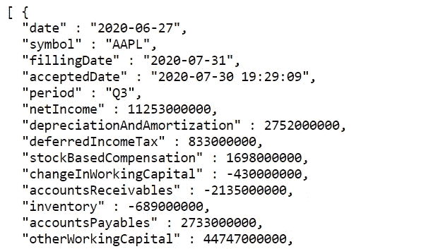](https://financialmodelingprep.com/api/v3/cash-flow-statement/AAPL?period=quarter&limit=400&apikey=2b6cef897a71d11434d94adf8c91c258)

Part of Cash Flow Statement of a Company Obtained from Financial Modelling Prep API

## 季度现金流量表(最近 4 个季度)

为什么我们在看季度现金流量表而不是年度现金流量表？

在[上一篇文章](https://medium.com/datadriveninvestor/how-to-calculate-intrinsic-value-of-a-stock-aapl-case-study-935fb062004b)中，我们使用**后十二个月(TTM)** 期间的自由现金流来预测未来现金流。不幸的是，根据 Financial Modelling Prep 的年度现金流量表数据，没有 TTM 数据，最近的数据是去年(2019 年)的现金流。因此，公司最近的现金流(特别是 2020 年前两个季度)没有计入。

因此，对于 TTM 的数据，我们需要自己**合计最近 4 个季度的现金流**。在下面的代码中，我们将**'现金流量表/'** 添加到财务建模准备 API 的 base_url，以及 **'ticker'** 和参数 **'period=quarter'** 和 **'apikey=demo'** 。有关如何查询数据的更多详细信息，请参考[文档](https://financialmodelingprep.com/developer/docs/#Company-Financial-Statements)。

我们将 json 数据解析到一个 DataFrame 中，并获得最近的 4 行(因此代码中有 iloc[:4])。检查下面结果的日期，看它们是否确实是最近几个季度。自由现金流是下面数据框中的一列(虽然在截图中没有显示)。

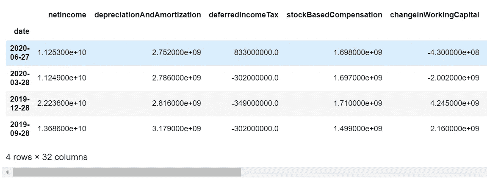

Cash Flow Statement (most recent 4 quarters only)

## 年度现金流量表

我们重复上述步骤，但**省略了“期间=季度”**以获得年度现金流量表数据。这一步**是可选的**，因为我们不需要任何东西来计算内在价值。我们获得这些数据是为了以后**绘制出**历年的现金流**来检查现金流是否稳定且在增长**。

验证下面的输出，以查看这些日期确实是年度数据。

## 现金流量表(年度+ TTM)

现在我们**汇总最近四个季度**的数据，将该行重命名为‘TTM’并将其附加到年度现金流量表中，以**合并**年度数据和 TTM 数据。

请注意，在结果中，我们现在有一个包含 TTM 数据的行。

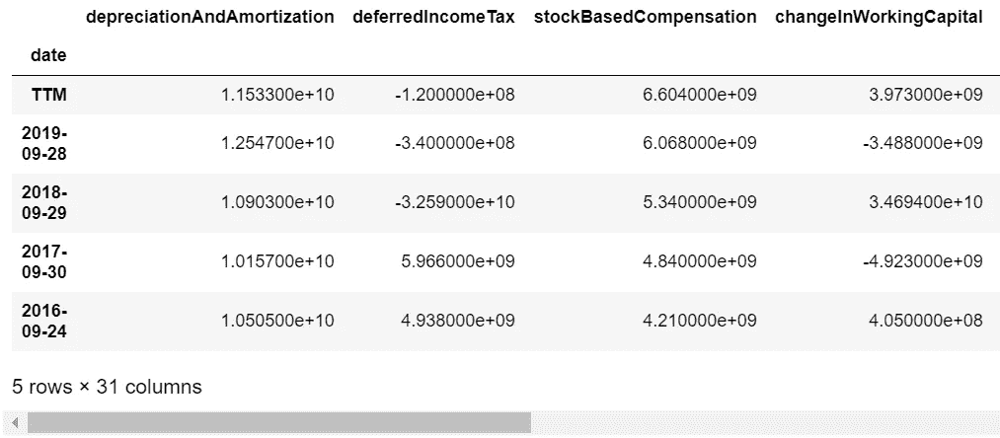

## 检查自由现金流的稳定性

让我们从上面的数据框架中画出**过去 15 年**的自由现金流(因此代码中有 iloc[-15:])。

现金流相当稳定，而且还在增长，因此是可以预测的。请注意，一些异常是正常的。一个有趣的事实是， **TTM 自由现金流高于去年** (2019)的年度自由现金流。这是因为尽管有疫情的帮助，苹果公司还是设法在上一季度增加了收入。很可靠的公司，是吧？

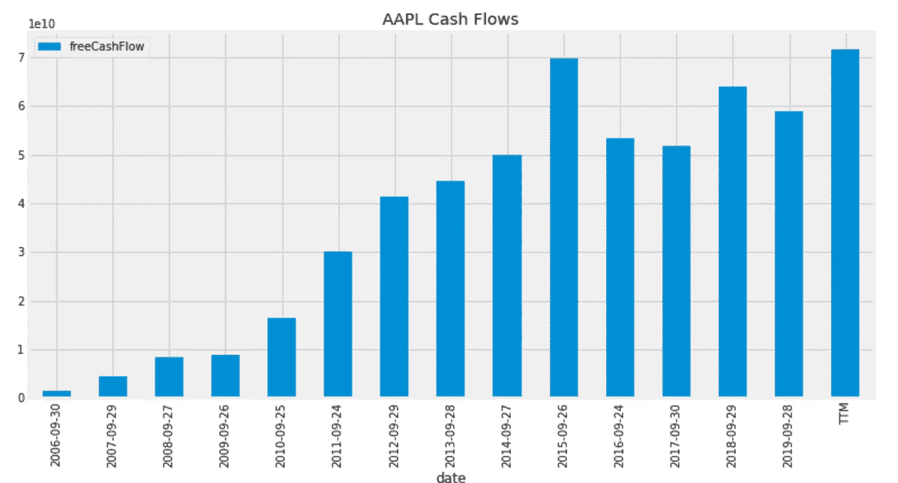

还要注意的是，如果你的公司有**不稳定且不规则的**自由现金流，贴现现金流模型可能**而不是**是对其内在价值的一个很好的估计。

 [## 用 Python |数据驱动投资者进行股票价格时间序列预测简介

### 在这个简单的教程中，我们将看看如何将时间序列模型应用于股票价格。更具体地说，一个…

www.datadriveninvestor.com](https://www.datadriveninvestor.com/2020/07/07/introduction-to-time-series-forecasting-of-stock-prices-with-python/) 

## 资产负债表(季度)

资产负债表显示了公司在某个*时刻*的财务健康状况(所有资产和负债)的**快照(不像现金流量表那样在一段时间内汇总)。要获得一家公司的相关数据来计算内在价值，我们只需要最近一个季度**的**资产负债表。**

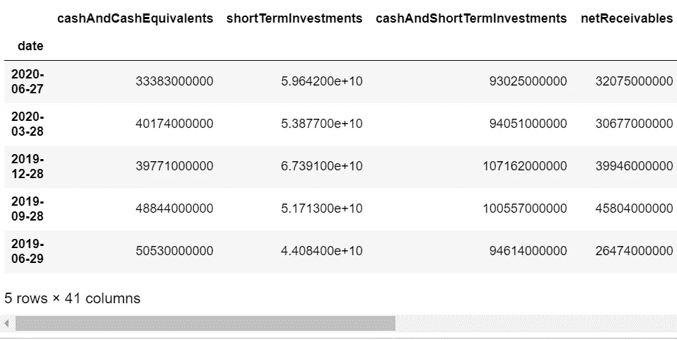

We only need the top row (most recent quarter data)

## 自由现金流、总债务、现金和短期投资

让我们从之前创建的**现金流量表**的 **TTM** 行中提取**自由现金流**。我们还从**资产负债表**的顶行(最近一个季度)获得**总债务和现金及短期投资**。让我们也把它们打印出来检查一下。

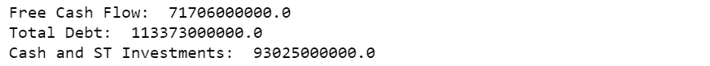

# 第三步。从 Finviz 中提取和解析数据

接下来，你需要从 [**Finviz**](https://finviz.com/quote.ashx?t=aapl) 获取更多的数据。Finviz 在其网站上以一个 **html 表格**展示了所有的公司数据，如下所示。

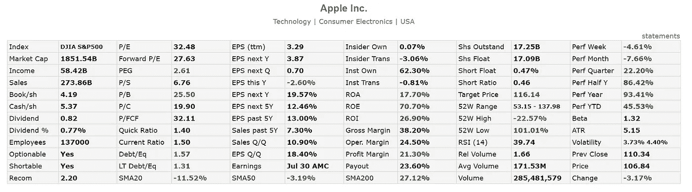

因此，我们需要使用 Python 中的 [**requests.get**](https://requests.readthedocs.io/en/master/user/quickstart/) 方法和[**Beautiful Soup**](https://pypi.org/project/beautifulsoup4/)包来解析我们需要的任何数据。

## 价格、未来 5 年每股收益、贝塔系数、已发行股票数量

下面的代码显示了我如何从 Finviz 获取**‘Price’**(当前股价)、**‘EPS next 5Y’**(未来 5 年每股收益的预计增长)、**‘Beta’**(稍后将详细介绍)和**‘Shs Outstand’**(已发行股票数量)，并将它们存储到 Python 字典中，以便我以后可以提取这些数据。

Python 字典中的结果如下所示。

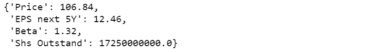

要了解更多关于如何从 Finviz 中提取数据的细节，请随意阅读下面我的文章。

 [## 使用 Python 获得股票的最新财务比率(市盈率、市净率等)

### 大多数 API 给出过时的年度/季度财务比率。下面是一个从 FinViz 获取实时数据的指南。

towardsdatascience.com](https://towardsdatascience.com/get-up-to-date-financial-ratios-p-e-p-b-and-more-of-stocks-using-python-4b53dd82908f) 

## 根据 Beta 估计贴现率

同样，在解释贴现现金流模型的前一篇文章中，我详细写了β是什么以及它如何显示股票的**风险水平。如果你需要更多的细节，请随时回到[的文章](https://medium.com/datadriveninvestor/how-to-calculate-intrinsic-value-of-a-stock-aapl-case-study-935fb062004b)。我还写道，对于 T4 贝塔系数**更高的股票，我们要求风险溢价(即承担更高风险的更高回报)，因此贴现率**更高**。我写了下面的代码来估计基于股票 Beta 的折扣率。

所以我们得到了 8%的贴现率**，因为贝塔系数是 1.32。**

**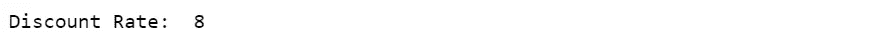**

# **打印计算内在价值所需的所有数据**

**为了清楚起见，让我们打印出目前为止从金融建模准备 API 和 Finviz 获得的所有数据。**

****我们获得的所有数据**如下所示，如果您将此与我之前的文章**和**手动抓取苹果**的数据进行比较，您会发现它们是相同的。*(除了总债务略有差异，这可能是由于雅虎金融和金融建模准备的资产负债表中构成总债务的定义略有不同，这很好，我们将看到它不会对计算的内在价值产生太大影响。)*****

****在我之前的文章中，我也阐述了我是如何决定第 6 到 10 年和第 11 到 20 年的增长率的。这里也是如此。这里我们假设苹果未来 20 年还能生存，这是相当合理的。****

****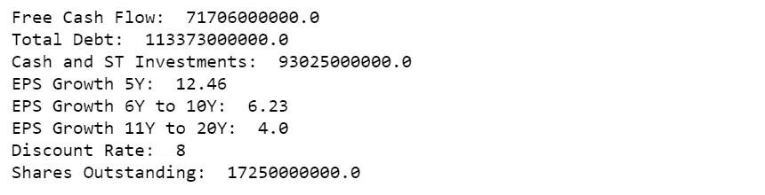****

# ****第四步。预测未来现金流并计算内在价值！****

****我们现在准备计算苹果股票的内在价值！我在下面写了一个**函数**来完成所有这些！****

****代码的第一部分(循环的**)**使用‘EPS Next 5Y’增长率预测公司未来 5 年的自由现金流**。在接下来的两年中，我们有 6 到 10 年和 11 到 20 年的循环。我们只需要**将之前的现金流乘以每一年的(1 +增长率)**并循环。******

**对于每一年的预计现金流，我们也**除以(1 +贴现率)**得到该年的贴现现金流。我们将所有预计的现金流存储到 Python 列表中，用于总结和绘制，以便以后可视化。**

**然后，我们将现金流量贴现列表中的所有贴现现金流加起来**。总和()法，**加上现金和短期投资**和短期投资**减去总负债**。****

**最后，我们**用**除以**发行在外的股票总数**，我们就完成了！**

**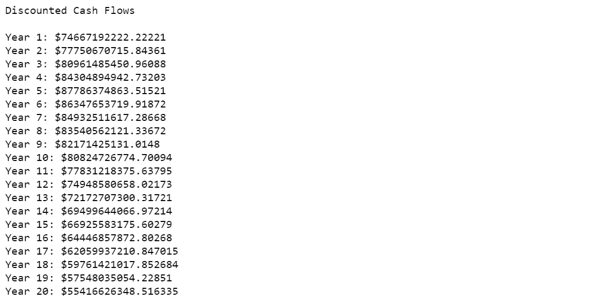**

**让我们看看未来 20 年的预计现金流和贴现现金流的曲线图。当**预计现金流一直在增长**时， ***贴现*预计现金流**在第 5 年后开始**下降**。这是因为当**增长率随着时间降低**时，**贴现率不会**并最终变得高于增长率。因此，即使苹果永远存在，贴现现金流最终会变成 0，内在价值也不是无限的。**

****

# **打印内在价值、当前股价、安全边际**

**下面的代码输出**内在价值**、**当前股价**和 [**安全边际**](https://www.investopedia.com/terms/m/marginofsafety.asp) 。安全边际显示当前股价比其内在价格低多少%(越高，我们投资的股票越安全)。**

**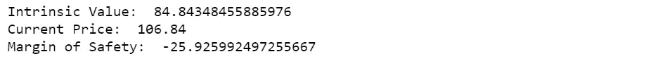**

**这里我们获得了一个内在价值，类似于我们在[上一篇文章](https://medium.com/datadriveninvestor/how-to-calculate-intrinsic-value-of-a-stock-aapl-case-study-935fb062004b)中计算的。我们也看到内在价值低于苹果现在的价格。一个 ***负的*安全边际**在下面苹果的例子中是指股价比内在价值 高出一定的百分比)。再次，请随意阅读我的[前一篇文章](https://medium.com/datadriveninvestor/how-to-calculate-intrinsic-value-of-a-stock-aapl-case-study-935fb062004b)的最后一部分，了解我对此的看法。**

**在本文中，我们使用 Python 从多个来源提取数据，然后使用它们来执行计算，以找到股票的内在价值。只需更改股票代码，就可以对任何其他公司进行同样的计算！**

**我希望这篇文章是有用的。如果您喜欢这篇文章，请随意查看下面的应用示例。**

** [## 使用 Python 来展示一只被高估的股票是如何被低估的

### 你应该避免在盈利后购买有缺口的股票，因为它们“太贵”了吗？(PYPL 案例研究)

medium.com](https://medium.com/datadriveninvestor/use-python-to-show-how-an-overvalued-stock-can-become-undervalued-72bc9d3d35a7) 

请随意查看我下面的其他文章！

 [## 基于 Python 的金融新闻股票情感分析

### 使用 Python 从 FinViz 网站的财经新闻标题中提取股票情绪

towardsdatascience.com](https://towardsdatascience.com/sentiment-analysis-of-stocks-from-financial-news-using-python-82ebdcefb638)  [## 使用 Python 获得股票的最新财务比率(市盈率、市净率等)

### 大多数 API 给出过时的年度/季度财务比率。下面是一个从 FinViz 获取实时数据的指南。

towardsdatascience.com](https://towardsdatascience.com/get-up-to-date-financial-ratios-p-e-p-b-and-more-of-stocks-using-python-4b53dd82908f)  [## 免费培训和部署一个 NLP 新闻分类器 Web 应用程序到云

### 训练 NLP 模型、将其嵌入 Python Flask Web 应用程序并将其部署到云上的分步指南

medium.datadriveninvestor.com](/train-and-deploy-an-nlp-news-classifier-web-app-to-the-cloud-for-free-82655b6b32f4)  [## 如何计算股票的内在价值(AAPL 案例研究)

### 获取公司数据和计算股票内在价值的逐步指南，包括网络应用程序

medium.com](https://medium.com/datadriveninvestor/how-to-calculate-intrinsic-value-of-a-stock-aapl-case-study-935fb062004b) 

## 访问专家视图— [订阅 DDI 英特尔](https://datadriveninvestor.com/ddi-intel)****