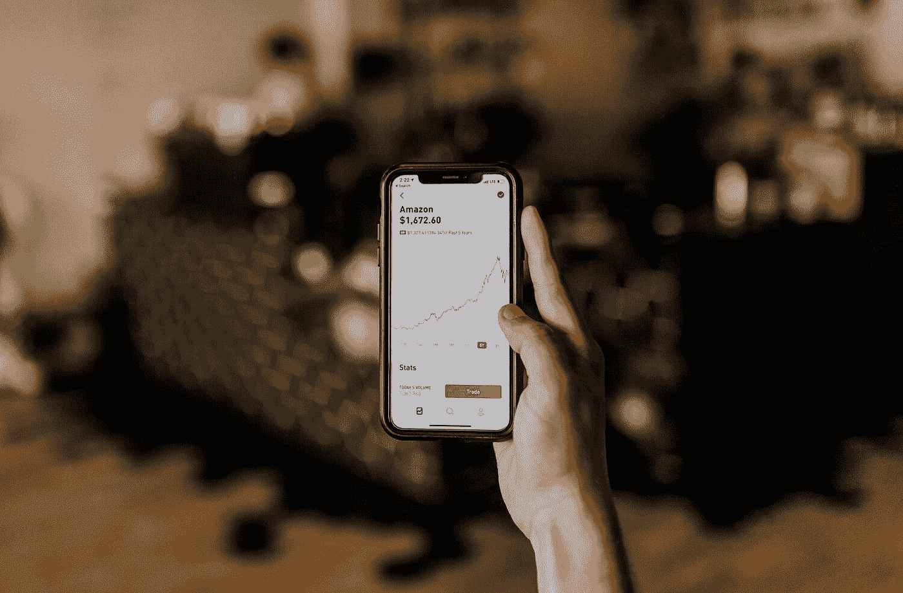
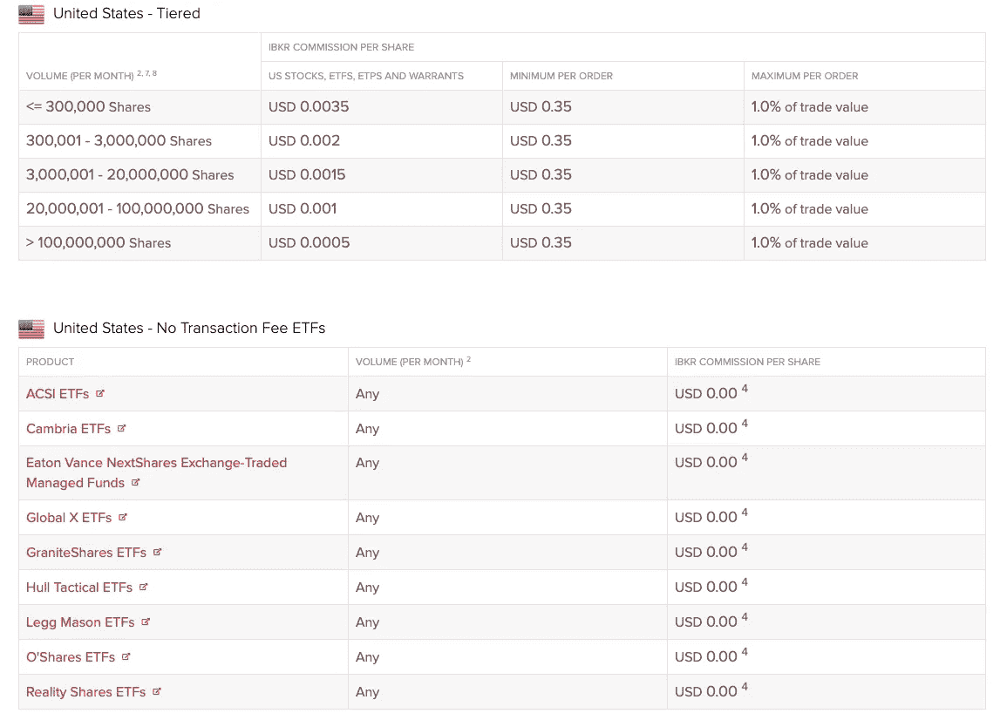
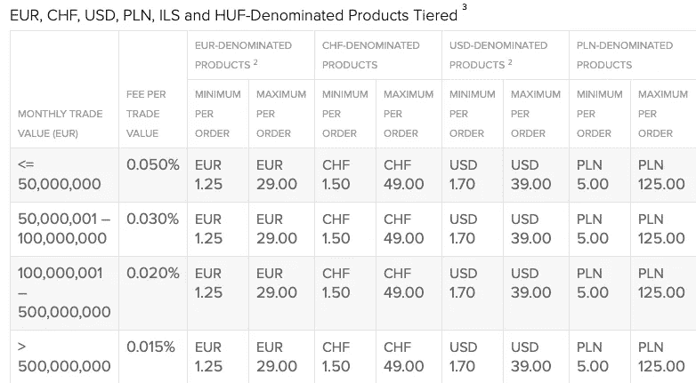
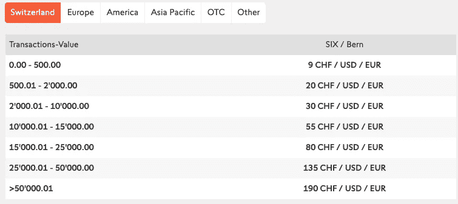
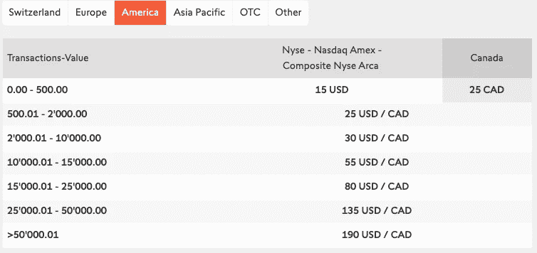
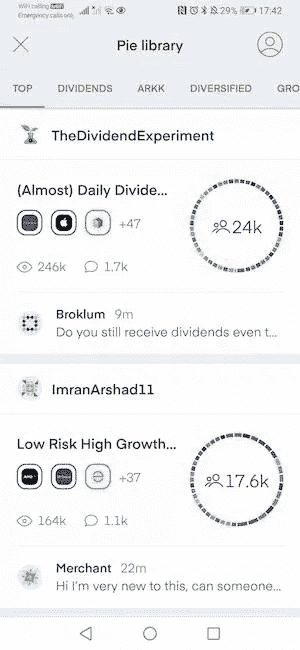

# 使用这两个移动交易应用程序让自己走上财富积累的轨道

> 原文：<https://medium.datadriveninvestor.com/use-these-2-mobile-trading-apps-to-get-yourself-on-wealth-building-track-76b377225390?source=collection_archive---------12----------------------->

## 收费低，使用方便，可供选择的投资产品广泛。

当我开始投资时，对我来说最大的挑战是决定哪个经纪账户是最好的。市场上有许多选择，但在你自己的国家很少有人知道，因此，尽管有许多方面的缺点，大多数人还是选择了知名的公司。如果你像我一样，花时间进行研究和比较，你可以通过经纪账户将自己置于正确的轨道上，以避免高额费用，并有广泛的投资选择。我与你分享我每天使用的两个交易应用。我并不是每天都交易，但把它们放在我的智能手机上很好，每当我想知道我的投资进展如何时，我都会得到通知。其中一个具有强大的自动投资功能，使您的投资进入自动驾驶模式，让您以最少的麻烦建立长期财富。

## [1。互动经纪人](https://ibkr.com/referral/yasi474)

## 产品选择

交互式经纪人覆盖 33 个国家的 135 个市场，提供 23 种货币的投资产品。无论是从产品的范围还是全球市场的覆盖面来看，互动经纪人为其用户提供了极大的多样化。与一些经纪公司不同，你可能会被限制在一定范围内的产品，如果投资没有在包括经纪服务在内的交易所上市，你就不能购买它们。有了互动经纪人，我还没有遇到这个问题。

## 低费用

除了选择之外，我选择他们的另一个主要原因是费用。价格结构有两种类型:固定价格和固定价格。你可以根据你的交易量和产品来决定你想要哪一个。比如买美国 ETF，不需要支付任何交易费用。如果不是 ETF，那么你每笔订单支付 0.35 美元，或者最多支付你交易价值的 1%。

source: [https://www.interactivebrokers.co.uk/en/index.php?f=39753&p=stocks2](https://www.interactivebrokers.co.uk/en/index.php?f=39753&p=stocks2)

如果您购买欧元、瑞郎、美元、波兰兹罗提、ILS 和 HUF 计价的分级产品，当交易价值低于 5000 万时，费用仅为交易价值的 0.05%，上限为 49 瑞郎，对于以瑞郎为主的产品，最低为 1.5 瑞郎。类似的费用也适用于其他在欧洲上市的产品。

source: [https://www.interactivebrokers.co.uk/en/index.php?f=39753&p=stocks2](https://www.interactivebrokers.co.uk/en/index.php?f=39753&p=stocks2)

简单来说，如果你用[美元成本平均法](https://www.fasttrack.life/blog/how-can-dollar-cost-averaging-help-you-build-wealth-in-volatile-money-market)每月投资 1000 美元购买一只美国 ETF。如 VTI 或 VOO，你需要支付 0.35 美元的交易费。如果你每月投资 1000 瑞郎购买一只 CHF ETF，比如 CHSPI 或 CHDVD，你要支付 1.5 瑞郎的交易费。如果你的投资组合中有 3 只交易所交易基金，你每月投资一次，你每月的交易费用将只有几美元，或者如果你有 3 只美国交易所交易基金，则仅为 1.05 美元。但是，如果您的帐户价值低于 100，000 美元，您的最低月费将为 10 美元。这意味着，如果你发生了 1.05 美元或 8 美元的交易费，你的每月账户维护费仍将是 10 美元。但这在前三个月并不适用，因为互动经纪商会给你时间来习惯他们的产品。如果您的帐户中有超过 100，000 美元的金额，最低维护费将不再适用于您。

另一方面，你知道其他经纪服务收费多少吗？瑞士最知名的经纪公司叫 Swissquote。如果你购买瑞士产品，最低费用是每笔交易 9 瑞士法郎。如果您每月投资 1000 瑞士法郎购买一种产品，那么每笔交易就要花费 20 瑞士法郎。

source: [https://en.swissquote.com/online-trading/pricing](https://en.swissquote.com/online-trading/pricing)

现在，如果你的投资组合中还有两只美国 ETF，你需要支付更多。每只美国 ETF 投资 1000 美元，你每笔交易支付 25 美元，总共 50 美元。在一个月内，如果你只做 3 笔交易，你已经支付了大约 70 美元的交易费！

这大约是你总投资价值的 2.3%。

source: [https://en.swissquote.com/online-trading/pricing](https://en.swissquote.com/online-trading/pricing)

除了交易费之外，你还可以在交互式经纪人上直接兑换外币，这样可以获得更好的汇率。这就像购买另一种投资产品，你用你原来的货币购买外汇对。

## 透明度

当您使用应用程序进行交易时，或者在网站上，您可以根据自己的选择生成报告。你会看到你在选择的时期内支付了多少费用，你收到了多少股息，你支付了多少税款和账户余额，等等。它可以像你希望的那样全面。我特别喜欢的是，它会自动考虑你的纳税居住地，然后将税收协定应用于你的股息。所以你不必担心当你的税务居住地与投资产品的注册国家有协议时，你会支付更多的预扣税。更多信息可以阅读: [<瑞士/美国税收协定简单解释及其对您投资的影响>](https://www.fasttrack.life/blog/uswisstaxtreaty) 。

如果你在银行投资，你将不能直接从手机上查看你的投资。我以前和一家公司有过一些投资，我必须登录他们的门户网站，输入我的个人信息，然后我才能看到结果。我对他们从我的余额中扣除的费用有很多疑问。有太多的麻烦。我更喜欢能够轻松管理自己且成本最低的解决方案。

## 便利

如上所述，你可以下载互动经纪人应用程序，在那里你可以随时交易和查看你的账户。当然也可以下载交易终端，但是对于新手来说看起来真的很吓人。作为一个非专业交易者，我觉得这太难了。我现在只用 app。但是你可以在线登录客户端页面，它就像一个普通的网站，你可以在那里更改设置，生成报告，等等。互动经纪人不用下载交易员工作站。

如果你担心当你的经纪人破产时会发生什么，那么推荐你选择一个好的。你可以在可怜的瑞士网站上阅读这篇文章。

## [2。交易 212](https://bit.ly/3q5YD3U)

[Trading 212](http://www.trading212.com/invite/FMXbdHfC) 是一家在交易员和个人投资者中广受欢迎的英国公司。它的零费用和移动友好性吸引了像我这样的智能手机重度用户。我喜欢通过一个应用程序可以做任何事情。我甚至可以一边刷牙一边买一些股票！

## 免费

Trading212 使用交互式经纪人作为后端，为用户提供一个简单的用户界面来交易和管理他们的投资组合。他们为用户吸收费用，因为他们的收入模式是基于保证金交易者。如果你是我这样的普通投资者，那么你只需要开一个 [Trading 212 Invest](http://www.trading212.com/invite/FMXbdHfC) 账户，而不是 Trading212 CFD 账户。

## 汽车投资

这是我最喜欢的交易 212 的功能。你可以手动购买交互式经纪人的股票，但你可以用 Trading212 自动购买。有数百种投资可供选择，您可以选择您想要的投资组合，使用平均成本法进行投资。您可以将您的投资组合(或应用程序中称为 Pie)与您的信用卡关联，设定的金额将按照您设定的频率自动从您的卡中扣除，并自动购买投资产品。你不用担心外汇，什么时候买，下订单，等等。你只需要:

1.  **建立一个馅饼。**你甚至可以在馅饼库中复制别人的馅饼，看看预计的增长是多少。这是你的作品集。你想要多少馅饼都可以。在这个饼图中，你可能有几个投资产品，你可以给每个产品分配一个百分比，这样这个饼图的总价值就是 100%。你可以随时调整分配。在下一轮自动投资中，系统将根据您的新分配进行购买。
2.  **设定投资金额和频率。**当系统为你购买时，你可以选择你想投资多少。例如，您可以将每个星期三设置为饼图中的 est $100，或者每天、每月或从星期一到星期五的某一天。
3.  **再平衡。**一段时间后，你的资产价值可能会因市场波动而改变。但你不必手动计算你应该卖出或买入多少。你可以点击再平衡，系统会自动在你的投资组合中卖出和买入，这样你的配置就保持你想要的。多方便啊？

Trading212 Pie Library

这个自动投资功能真的帮助我使用平均成本来跟踪我的投资。所以我不会在市场高位时阻止买入，也不会继续等待，失去买入窗口。它消除了人类的情绪，为我自动化了投资过程。

## 社区

如果你去馅饼库，你会看到人们的评论。也可以把自己的馅饼分享到图书馆，和别人交流心得。当你在 trading212 上找不到产品时，你可以在线提交申请。如果这些请求有足够多的赞，团队会很快添加它们。Sames 进行功能改进，添加新功能，等等。是为用户打造的交易 app。

而现在通过 [**这个链接**](http://www.trading212.com/invite/FMXbdHfC) 用 Trading212 开户，可以免费获得 100 美元的份额。我之前以 95 美元的价格获得了一份免费的迪士尼股票，但却愚蠢地以 85 美元的价格卖出，这是可能的最低价。现在，看看迪士尼的股价在哪里！

让我知道你得到了哪家公司的股票。

# 结论

在开券商账户之前，请做一些调查，比较一下什么最适合你。所以，当你发现这家经纪公司不适合你时，你不需要卖掉你的投资，转投另一家。当你进行账户转移时，你必须卖出你的股票，这真的很糟糕，因为你可能会因为你卖出和你再次买入之间的市场波动而损失一些钱。在你的国家可能有更好的选择，请在这方面做一些研究。

这两个应用程序是我自己做了大量研究后选择的，到目前为止，我已经使用它们将近一年了，并且仍然对此感到高兴。我将继续长期投资。

**与** [**互动券商**](https://ibkr.com/referral/yasi474) **签约获得免费股份。**

**在此注册，存款后即可免费获得**[**trading 212**](http://www.trading212.com/invite/FMXbdHfC)**的份额。**

*原载于 2021 年 1 月 16 日*[*https://www . fast track . life*](https://www.fasttrack.life/blog/tradingapps)T22。