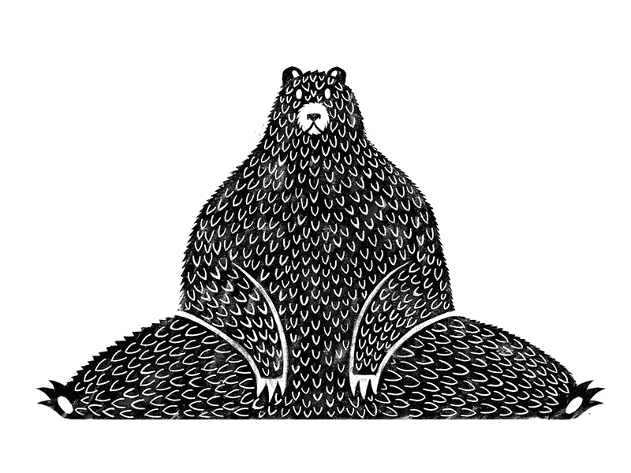

# 用这个简单的原则来提高效率，战胜恐惧。

> 原文：<https://medium.datadriveninvestor.com/use-this-one-simple-principle-to-be-more-productive-and-own-any-fear-34668f0e3dee?source=collection_archive---------20----------------------->

恐惧可能是我们生活中进步的最大阻碍。这是一种危险的毒药，它会改变我们对自己和能力的信念，如果不加以控制，它会溃烂并深深扎根于我们的操作系统中。

恐惧之所以如此强大，是因为它被最强大的东西——我们自己——强化了。我们允许它孵化和成长，给它怀疑，并编造为什么我们不能的故事。我们可以做我们下定决心要做的任何事情(我确实相信这个陈词滥调)，因此同样的道理，如果我们下定决心相信我们不能或不应该做某事，同样的力量在阻止我们。

然而，像任何事情一样，它有一个时间和地点。如果恐惧更多的是一种有意识的担忧，而不是一种令人衰弱的信念，那么它可能是健康的。我们*应该*警惕某些事情。正是意识、理解和理性恐惧的正确结合让我们和其他物种获得了成功。

那只被蛇吓得不敢离开洞穴寻找食物的大棕熊现在已经死了。完全不在乎蛇的熊大概也死了。但是知道它们存在，但仍然去打猎的熊活了下来。

 [## 跑步摆脱疯狂:锻炼如何提高你的生产力|数据驱动的投资者

### 没有比锻炼更好的方式来开始一天的工作了。我试着一周至少做四天，在…

www.datadriveninvestor.com](https://www.datadriveninvestor.com/2018/10/23/running-to-get-rid-of-the-crazy-how-working-out-increases-your-productivity/) 

那么，我们怎么能帮助困在洞穴里的饥饿的熊呢？事情是这样的，我们不能否认熊受到了惊吓，充满了恐惧。恐惧是真实的，不可否认的——我们有什么资格告诉熊他不应该害怕——他害怕了。言语毫无价值，你不能告诉熊不要害怕。熊需要知道恐惧并不像它想象的那样有根据，它比蛇的幻觉更强大。

如果我们能帮助熊，我们会鼓励他采取走出洞穴的小行动。这将有助于向熊表明，他比他目前虚弱的恐惧更强大，他陷入的瘫痪故事并不总是真实的。如果可以的话，你会帮助那只又饿又害怕的熊吗？

如果你的答案是肯定的，那么你应该每天都为自己做同样的事情，因为虽然这种恐惧不会导致死亡，但它肯定会阻碍你发挥出全部潜力。

# 采取行动，做点什么，现在。

这与“不要告诉我，给我看”这句谚语有关。在生活中，带着恐惧，我们需要负责向我们自己展示这一点，并消除限制信念。出于这个原因，**做点什么，采取行动**，这就是我们如何面对恐惧，如何成长。行动是我们向自己证明我们比恐惧更好的方式，也是我们努力成为最好的、不可动摇的自己的方式。

让我们暂停一下，看看为什么行动是如此有用的杠杆。想一想最近你采取行动的时候，比如说，你坐下来开始读那本你多年来一直想读的书，或者开始一个几个月前向你推荐的在线课程。

我敢打赌，当你采取行动“**做某事**”时，你会受到某事或某人的启发。换句话说，你被激励去做某事。丝毫不妨碍在这种情况下采取行动(这是我们花大部分时间采取行动的地方)，但为了我在这里的论点，这是一种完成事情的逃避。这就像说当你感到高兴和兴奋时，我希望你微笑并对某人友好——这很简单。如果我反过来说，当你情绪低落的时候，我希望你微笑着告诉下一个你见到的人他们很棒，会怎么样？

虽然这与你此刻的感觉是违反直觉的，但从科学的角度来说，当然，当你微笑并对某人友善时，你大脑中的神经化学反应会改变你的感觉。话虽如此:

# 行动不仅仅是动机的结果，也是动机的原因。

本质上，当我们经历情感激励时，我们会感到有动力，当我们感到有动力时，我们会采取与我们的动力一致的令人满意的行动。假设我看了一部关于肉类行业的纪录片——这在情感层面上影响了我，我感到有动力停止食用某些肉类产品。

在这种情况下采取行动是很好的——对我们来说，棘手的是，我们生活中最需要的改变和行动往往是由恐惧(或其他负面情绪)激发的，恐惧让我们不想采取行动。

正如[马克·曼森](https://markmanson.net/)所说，

> “过去的创伤、负面期望以及内疚、羞愧和恐惧的感觉经常会促使我们采取必要的行动来克服这些创伤、负面期望和负面情绪。”

用一个伟大的例子，也来自马克曼森:如果有人想修复他们与母亲的关系，这种情况下的情绪(伤害，怨恨，回避)完全违背了修复它的必要行动(对抗，诚实，沟通)。

想一想你希望对某人说过的话或你希望说了但没有说的话，因为你害怕可能会发生的事情。

你没有做这件事之后有什么遗憾吗？

我这样做的次数已经多得数不清了，虽然我通常认为后悔不是我们应该让自己经历的一种情绪，但很多时候我后悔没有说出应该说的话或采取行动——比如告诉别人我的感受。

# 我们告诉自己“为什么不”去做的故事通常不会发生。

因此，我们应该始终采取行动。果汁可能值得压榨——如果不值得，我们仍然可以为我们压榨的果汁而自豪。

拖延症经常被忽视，因为它只是懒惰，但是我认为拖延症的潜在原因是一种恐惧。我举一个个人的例子。我有时会拖延打销售电话或处理待办事项清单上更困难的任务，而这些任务实际上会让事情进展得更快。我喜欢先给自己冲杯咖啡，做一些积压的设计任务，装满我的水瓶，然后先检查我的电子邮件，我的推特，回复一个 WhatsApp，再检查一次我的待办事项列表并整理它，我必须避免做某事的时间恶习的列表是无穷无尽的。

但是为什么，为什么我会拖延？

如果不是因为我对手头的目标无动于衷，那么就有一种恐惧的因素阻止我一头扎进去——给一个陌生人打销售电话是很可怕的(至少对我来说)。如果我被拒绝了，他们说不，如果他们不喜欢我的产品怎么办？咖啡安全多了！

然而，正如你所看到的，咖啡除了让我感到焦虑之外，对我没有任何帮助。然而，一旦我拿起电话和某人说话，我就感觉很有力量，很有效率，好像我完成了什么事情。我做到了——简单的拨号行为证明了我没有什么可担心的。一种无端的恐惧证明我错了，我再次拿起电话——我们走吧！

这里需要注意的是，做一次并不会让我变得无所畏惧或成为销售机器。像任何恐惧一样，完全征服它需要时间和毅力。我们需要不断采取行动，最终，恐惧会被遗忘，我们可以继续粉碎下一个恐惧。

# 行动是一个极其强化的循环。

我们的行动会带来进一步的情绪反应和灵感，进而推动我们继续采取更多行动。做一些事情来推动这个循环，整个事情最好的部分是，我们不需要任何外部的东西来开始这场授权和自我强化的战争，以对抗恐惧和平庸。

引用耐克的一句话，“做就是了”。引用巴拉克·奥巴马的话，“是的，我们可以”。引用姜懿翔·川普的话——开个玩笑。

# 行动不仅是恐惧的解药，也是快乐的关键原则。

当我们情绪低落的时候，从沙发上站起来，然后做点什么感觉很好！当我们去健身房，拿起一本书，或者去见朋友时，我们总是感觉更好，更强壮，而不是证明更深地陷入沙发或让那些负面情绪把我们吸进去是正确的。做一些对你的目标有贡献的事情或者你关心的事情会让你感觉有效率，至少对我来说，有效率的感觉和我的精神状态密切相关。

前几天，在 Tom Bilyeu 的影响理论播客的一集里，他的一位嘉宾提到了这样一个想法，即一切(任何问题或障碍)都可以解决，如果真的不能解决，那么我们就没有必要担心，因为这是我们无法控制的不可改变的事实。这真的引起了我的共鸣，因为这是一个如此强大的想法。

我强烈主张我们可以学习任何东西，我喜欢这个想法，这个简单但强大的词“做”是我们需要找出答案的唯一答案。

# “做点什么”是我们生活和进步的备忘单。

每当我们有疑问，或感到停滞不前，采取行动(大小无关)会提升我们。

# 行动是我们消除恐惧的解毒剂，也是我们自我强化动机的杠杆点。

我们也不需要采取大规模的行动，这些较小的行动结合在一起就能带来我们想要(和需要)的改变。不要因为任何负面的故事阻碍了你，甚至没有开始做某事，从而背叛了自己，最终陷入“应该”、“应该”和“必须”中。

现在，想一件你一直想做的事情，但是由于恐惧的变化你一直在逃避。把这个写下来。然后，在它下面写下数字“1 ”,并记下你能采取的最小的、最可行的小步骤。现在，做那件事。

# 当有疑问时，总是要做些什么。

Don’t be this bear.

我在自己的博客[上分享我所有的文章。](https://theunlearnt.com/)

你也可以[在 Twitter](https://twitter.com/jarydhermann) 上关注我的日常想法和学习。